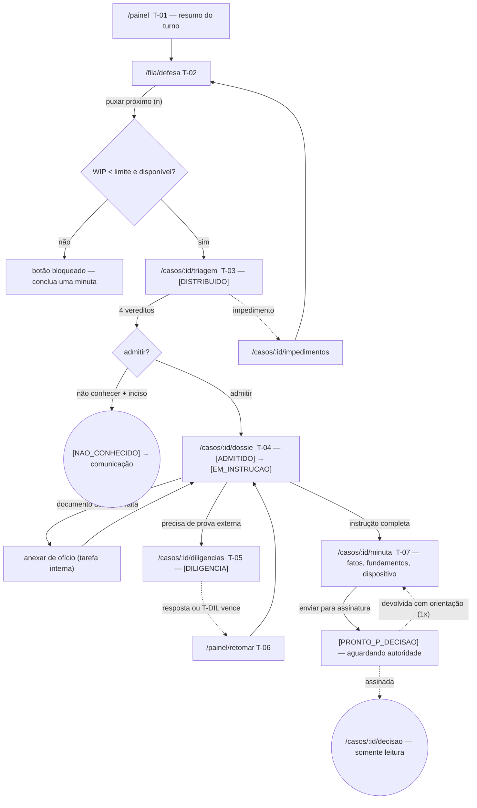
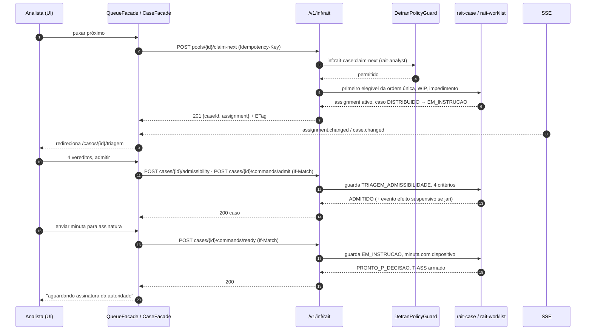

# JW-01 — Analista / revisor da defesa prévia (`rait-analyst`)

Origem: `JRN-RAIT-001`, `UC-RAIT-002`, `UC-RAIT-003`, `UC-RAIT-026`, `UC-RAIT-028`. Telas T-01, T-02,
T-03, T-04, T-05, T-06, T-07 (lado minuta). Estados do caso: `WF-RAIT-001`.

## Passos

| #   | Rota                      | Ação do usuário                                                            | Comando (`inf:rait-*`)                         | Efeito                                                           | Erros relevantes                                                                |
| --- | ------------------------- | -------------------------------------------------------------------------- | ---------------------------------------------- | ---------------------------------------------------------------- | ------------------------------------------------------------------------------- |
| 1   | `/painel`                 | vê o resumo do turno (vencendo, diligências, parados)                      | `GET` resumo; SSE                              | cartões atualizados                                              | —                                                                               |
| 2   | `/fila/defesa`            | "puxar próximo" (`n`)                                                      | `rait-case:claim-next`                         | `[ADMITIDO] → [DISTRIBUIDO] → [EM_INSTRUCAO]`; redireciona       | `QUEUE_EMPTY`, `ASSIGNMENT_WIP_LIMIT`, `MEMBER_NOT_AVAILABLE`, `MEMBER_IMPEDED` |
| 3   | `/casos/:id/triagem`      | registra 4 vereditos (tempestividade calculada)                            | `rait-case:triage`                             | checklist salvo                                                  | `TRIAGE_TIMELINESS_READONLY`, `PROCURATION_UNVERIFIED`                          |
| 4   | `/casos/:id/triagem`      | "admitir" ou "não conhecer" (com inciso)                                   | `rait-case:admit` \| `rait-case:reject`        | `[ADMITIDO]` (efeito suspensivo se recurso) \| `[NAO_CONHECIDO]` | `TRIAGE_INCOMPLETE`, `NON_ADMISSION_REASON_REQUIRED`                            |
| 5   | `/casos/:id/dossie`       | instrui; "anexar de ofício" documento do órgão                             | `POST documents` (origem `oficio`)             | dossiê completo                                                  | `CASE_OFFICIAL_DOCUMENT_REQUIRED`, `DOCUMENT_HASH_MISMATCH`                     |
| 6   | `/casos/:id/diligencias`  | abre diligência (15 du), prorroga 1x, responde                             | `rait-case:open-inquiry` / `extend` / `answer` | `[DILIGENCIA]`; some da mesa; volta por T-06                     | `INQUIRY_ADDRESSEE_FORBIDDEN`, `INQUIRY_EXTENSION_LIMIT`                        |
| 7   | `/painel/retomar`         | retoma caso respondido ou vencido (`T-DIL`)                                | —                                              | `[EM_INSTRUCAO]` \| `[PRONTO_P_DECISAO]` (julga no estado)       | —                                                                               |
| 8   | `/casos/:id/minuta`       | redige fatos, fundamentos, dispositivo; versiona; "enviar para assinatura" | `rait-case:submit-draft`                       | `[PRONTO_P_DECISAO]`; "aguardando assinatura"                    | `DRAFT_INCOMPLETE`, `CASE_STATE_INVALID`                                        |
| 9   | `/casos/:id/decisao`      | recebe devolução com orientação (1x) ou lê a decisão assinada              | —                                              | volta ao passo 8 ou encerra                                      | —                                                                               |
| 10  | `/casos/:id/impedimentos` | declara impedimento a qualquer momento                                     | `rait-impediment:declare`                      | caso devolvido à fila com motivo                                 | `MEMBER_IMPEDED` (já registrado)                                                |

## Fluxo de telas

<!-- svg: ARCH-RAIT-WEB-j01-analista-telas -->

[Renderizado: ARCH-RAIT-WEB-j01-analista-telas.svg](../diagrams/ARCH-RAIT-WEB-j01-analista-telas.svg)

## Sequência do caminho principal (puxar → admitir → minuta)

<!-- svg: ARCH-RAIT-WEB-j01-analista-sequencia -->

[Renderizado: ARCH-RAIT-WEB-j01-analista-sequencia.svg](../diagrams/ARCH-RAIT-WEB-j01-analista-sequencia.svg)
