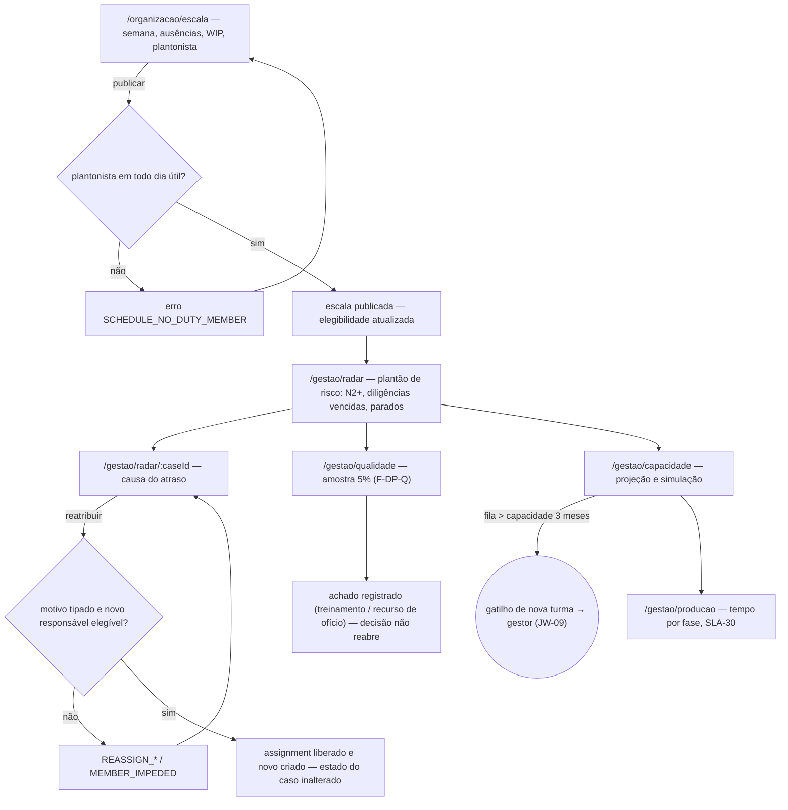
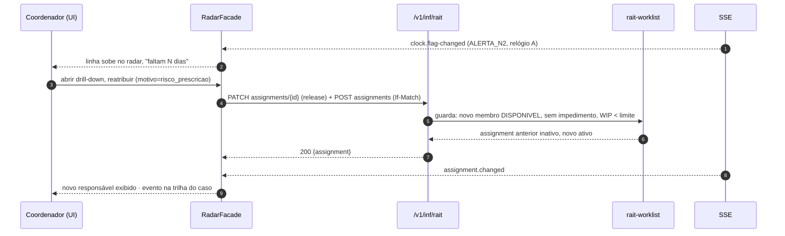

# JW-02 — Coordenador e subcoordenador da defesa prévia (`rait-coordinator`)

Origem: `WF-RAIT-004` §3-§4, `UC-RAIT-011`, `UC-RAIT-013`, `UC-RAIT-025`, `UC-RAIT-038`. Telas T-01,
T-02 (visão do pool), T-14/T-15 (leitura), escala, qualidade, capacidade.

## Passos

| #   | Rota                               | Ação                                                                             | Comando                        | Efeito                                                 | Erros                                                                   |
| --- | ---------------------------------- | -------------------------------------------------------------------------------- | ------------------------------ | ------------------------------------------------------ | ----------------------------------------------------------------------- |
| 1   | `/organizacao/escala`              | monta a escala semanal: dias/turnos, ausências, meta, `WIP`; designa plantonista | `rait-schedule:publish`        | membros `DISPONIVEL`/`EM_PLANTAO`/`AUSENTE_PROGRAMADO` | `SCHEDULE_NO_DUTY_MEMBER`, `SCHEDULE_PERIOD_LOCKED`                     |
| 2   | `/organizacao/pools`               | ajusta estratégia (`pull`) e limites do pool `defesa_previa`                     | `PATCH pools/{id}`             | parâmetros do pool                                     | `POOL_STRATEGY_INVALID`, `POOL_INSTANCE_DUPLICATE`                      |
| 3   | `/gestao/radar` (plantão de risco) | recebe `ALERTA_N2`+ do pool, diligências vencidas, parados                       | `rait-clock:acknowledge-alert` | alerta reconhecido                                     | `CLOCK_ALERT_ROLE_MISMATCH`                                             |
| 4   | `/gestao/radar/:caseId`            | reatribui com motivo tipado (afastamento, rebalanceamento, risco)                | `rait-assignment:reassign`     | novo responsável; nunca ao impedido                    | `REASSIGN_REASON_REQUIRED`, `REASSIGN_TO_SAME_MEMBER`, `MEMBER_IMPEDED` |
| 5   | `/gestao/qualidade`                | revisa amostra de 5% das decisões assinadas; registra achado                     | `rait-quality-sample:review`   | achado registrado; não reabre decisão (C.22)           | —                                                                       |
| 6   | `/gestao/capacidade`               | projeta fila × capacidade; simula; publica plano; pede reforço                   | `rait-capacity-plan:publish`   | plano do período; gatilho de turma ao gestor           | —                                                                       |
| 7   | `/gestao/producao`                 | acompanha tempo por fase e aderência ao SLA local                                | `GET` indicadores              | —                                                      | —                                                                       |

## Fluxo de telas

<!-- svg: ARCH-RAIT-WEB-j02-coordenador-telas -->

[Renderizado: ARCH-RAIT-WEB-j02-coordenador-telas.svg](../diagrams/ARCH-RAIT-WEB-j02-coordenador-telas.svg)

## Sequência: reatribuição por risco

<!-- svg: ARCH-RAIT-WEB-j02-coordenador-sequencia -->

[Renderizado: ARCH-RAIT-WEB-j02-coordenador-sequencia.svg](../diagrams/ARCH-RAIT-WEB-j02-coordenador-sequencia.svg)
