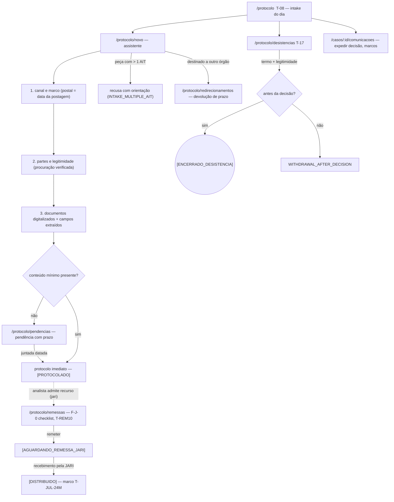
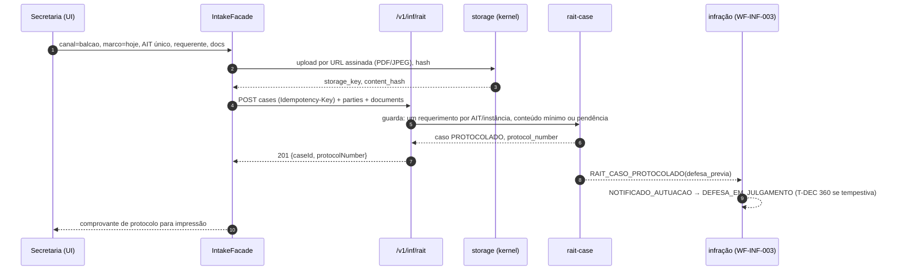

# JW-03 — Secretaria: protocolo e intake multicanal (`rait-secretary`)

Origem: `JRN-RAIT-003`, `UC-RAIT-001`, `UC-RAIT-012`, `UC-RAIT-017`, `UC-RAIT-027`, `UC-RAIT-028`.
Telas T-08, T-17; rotas `/protocolo/*`.

## Passos

| #   | Rota                           | Ação                                                                                           | Comando                                         | Efeito                                                          | Erros                                                                                                                             |
| --- | ------------------------------ | ---------------------------------------------------------------------------------------------- | ----------------------------------------------- | --------------------------------------------------------------- | --------------------------------------------------------------------------------------------------------------------------------- |
| 1   | `/protocolo`                   | lista do intake do dia (balcão 8h-14h, postal, portal)                                         | `GET cases?state=PROTOCOLADO`                   | —                                                               | —                                                                                                                                 |
| 2   | `/protocolo/novo`              | assistente: canal e marco → partes e legitimidade → documentos digitalizados → conteúdo mínimo | `rait-case:protocol`                            | `[PROTOCOLADO]`, protocolo exibido no ato                       | `INTAKE_MULTIPLE_AIT`, `INTAKE_DUPLICATE_INSTANCE`, `INTAKE_CHANNEL_MARK_MISSING`, `DOCUMENT_INVALID`, `PARTY_LEGITIMACY_INVALID` |
| 3   | `/protocolo/pendencias`        | abre pendência de conteúdo com prazo; registra juntadas datadas                                | `rait-case:resolve-pending-content`             | pendência fechada sem consumir prazo                            | `PENDING_CONTENT_EXPIRED`                                                                                                         |
| 4   | `/protocolo/redirecionamentos` | peça de outro órgão: redireciona com devolução de prazo                                        | `rait-case:redirect`                            | caso encerrado por redirecionamento; ofício gerado              | `REDIRECT_SAME_BODY`                                                                                                              |
| 5   | `/protocolo/remessas`          | F-J-0: checklist de ofício; remeter; registrar recebimento pela JARI                           | `rait-case:remit-jari` / `receive-judging-body` | `[AGUARDANDO_REMESSA_JARI] → [DISTRIBUIDO]`; marco `T-JUL-24M`  | `REMIT_NOT_ADMITTED`, `REMIT_CHECKLIST_INCOMPLETE`, `RECEIPT_ALREADY_REGISTERED`                                                  |
| 6   | `/protocolo/desistencias`      | termo assinado, legitimidade; homologa                                                         | `rait-case:withdraw`                            | `[ENCERRADO_DESISTENCIA]`; diligências encerradas; sai da pauta | `WITHDRAWAL_AFTER_DECISION`, `WITHDRAWAL_LEGITIMACY`                                                                              |
| 7   | `/casos/:id/comunicacoes`      | expede decisão pelo canal de ciência; registra marcos                                          | `POST communications`                           | `[COMUNICADO]`; marcos por canal                                | `UPSTREAM_SNE_UNAVAILABLE`                                                                                                        |

## Fluxo de telas

<!-- svg: ARCH-RAIT-WEB-j03-secretaria-protocolo-telas -->

[Renderizado: ARCH-RAIT-WEB-j03-secretaria-protocolo-telas.svg](../diagrams/ARCH-RAIT-WEB-j03-secretaria-protocolo-telas.svg)

## Sequência: intake físico até o protocolo

<!-- svg: ARCH-RAIT-WEB-j03-secretaria-protocolo-sequencia -->

[Renderizado: ARCH-RAIT-WEB-j03-secretaria-protocolo-sequencia.svg](../diagrams/ARCH-RAIT-WEB-j03-secretaria-protocolo-sequencia.svg)
