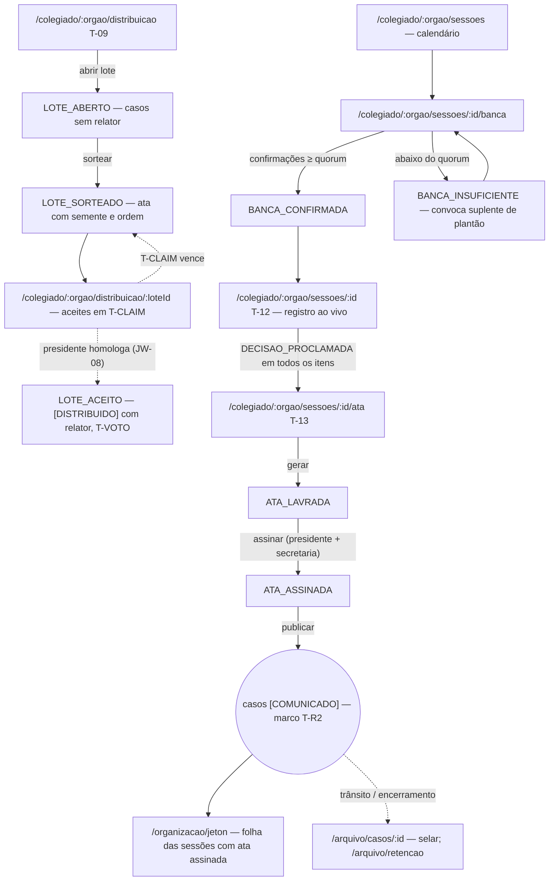
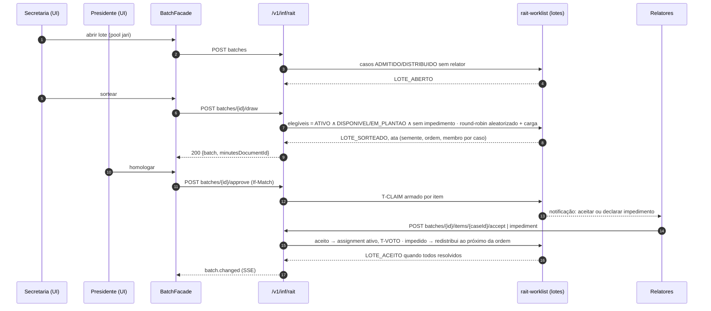

# JW-04 — Secretaria do colegiado: sorteio, banca, ata, jeton e arquivo (`rait-secretary`)

Origem: `UC-RAIT-014`, `UC-RAIT-015`, `UC-RAIT-018`, `UC-RAIT-020`, `UC-RAIT-024`, `UC-RAIT-036`.
Telas T-09, T-12 (registro), T-13; rotas `/colegiado/:orgao/*`, `/organizacao/jeton`, `/arquivo/*`.

## Passos

| #   | Rota                                      | Ação                                                                    | Comando                                      | Efeito                                             | Erros                                                              |
| --- | ----------------------------------------- | ----------------------------------------------------------------------- | -------------------------------------------- | -------------------------------------------------- | ------------------------------------------------------------------ |
| 1   | `/colegiado/:orgao/distribuicao`          | abre lote (semanal/extraordinário) com casos sem relator                | `rait-batch:open`                            | `LOTE_ABERTO`                                      | `BATCH_STATE_INVALID`                                              |
| 2   | idem                                      | roda o sorteio (round-robin aleatorizado + carga)                       | `rait-batch:draw`                            | `LOTE_SORTEADO`; ata gerada com semente            | `BATCH_NO_ELIGIBLE_MEMBERS`                                        |
| 3   | `/colegiado/:orgao/distribuicao/:loteId`  | acompanha aceites e impedimentos até `T-CLAIM`; presidente homologa     | (`rait-batch:approve` pelo chair)            | `LOTE_ACEITO`; casos `[DISTRIBUIDO]` com relator   | `BATCH_SEED_TAMPERED`, `BATCH_CLAIM_EXPIRED`                       |
| 4   | `/colegiado/:orgao/sessoes/:id/banca`     | confirma presenças; convoca suplente de plantão                         | `POST attendance`                            | `BANCA_CONFIRMADA` \| `BANCA_INSUFICIENTE`         | `BENCH_INSUFFICIENT`                                               |
| 5   | `/colegiado/:orgao/sessoes/:id`           | registra ao vivo (presenças, leitura, votos, vista) junto ao presidente | `POST attendance`, `votes` (do chair)        | ata alimentada                                     | `SESSION_STATE_INVALID`                                            |
| 6   | `/colegiado/:orgao/sessoes/:id/ata`       | gera, colhe assinaturas (presidente + secretaria), publica              | `rait-minutes:generate` / `sign` / `publish` | `ATA_ASSINADA`; casos `[COMUNICADO]`; marco `T-R2` | `MINUTES_NOT_READY`, `MINUTES_SIGNERS_MISSING`, `SIGNATURE_FAILED` |
| 7   | `/protocolo/remessas` (CETRAN)            | secretaria executiva registra recebimento e devolve decisão             | `rait-case:receive-judging-body`             | marco `T-JUL-24M` da 2ª instância                  | `RECEIPT_ALREADY_REGISTERED`                                       |
| 8   | `/organizacao/jeton`                      | apura sessões com ata assinada; gera folha                              | `rait-jeton:generate`                        | folha para aprovação do presidente                 | `JETON_MINUTES_UNSIGNED`, `PARAMETER_SOURCE_PENDING`               |
| 9   | `/arquivo/retencao`, `/arquivo/casos/:id` | sela dossiê final; aplica retenção/anonimização                         | `rait-archive:seal` / `apply-retention`      | dossiê selado com hash; terceiros suprimidos       | `ARCHIVE_NOT_CLOSED`, `RETENTION_NOT_DUE`                          |

## Fluxo de telas

<!-- svg: ARCH-RAIT-WEB-j04-secretaria-colegiado-telas -->

[Renderizado: ARCH-RAIT-WEB-j04-secretaria-colegiado-telas.svg](../diagrams/ARCH-RAIT-WEB-j04-secretaria-colegiado-telas.svg)

## Sequência: sorteio em lote e homologação

<!-- svg: ARCH-RAIT-WEB-j04-secretaria-colegiado-sequencia -->

[Renderizado: ARCH-RAIT-WEB-j04-secretaria-colegiado-sequencia.svg](../diagrams/ARCH-RAIT-WEB-j04-secretaria-colegiado-sequencia.svg)
