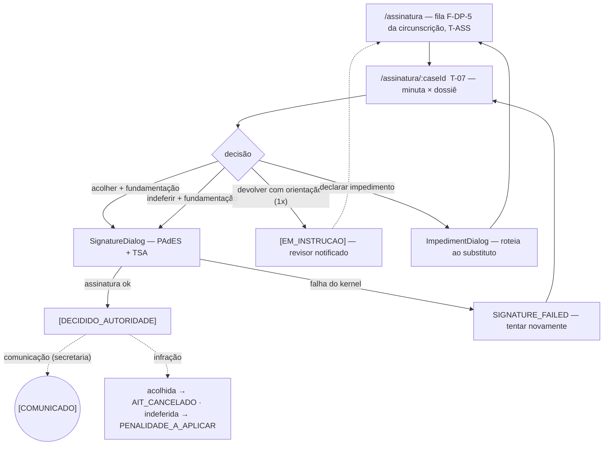
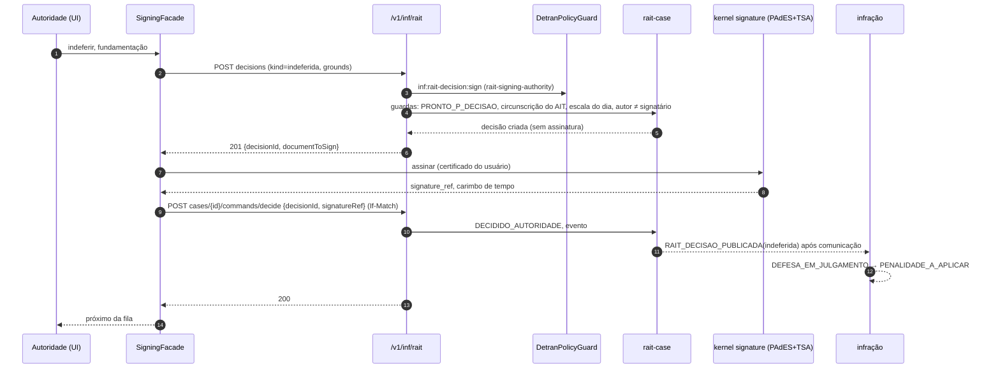

# JW-05 — Autoridade de trânsito signatária (`rait-signing-authority`)

Origem: `UC-RAIT-016`, `RN-RAIT-143`, `WF-RAIT-004` §3 (escala de assinatura). Telas T-07 (lado
decisão); rotas `/assinatura`, `/assinatura/:caseId`.

## Passos

| #   | Rota                  | Ação                                                             | Comando                                   | Efeito                                                                                   | Erros                                                                                                                        |
| --- | --------------------- | ---------------------------------------------------------------- | ----------------------------------------- | ---------------------------------------------------------------------------------------- | ---------------------------------------------------------------------------------------------------------------------------- |
| 1   | `/assinatura`         | fila F-DP-5 da circunscrição, ordem única, `T-ASS` por linha     | `GET cases?state=PRONTO_P_DECISAO&unit=…` | —                                                                                        | `FORBIDDEN_CASE_SCOPE`                                                                                                       |
| 2   | `/assinatura/:caseId` | lê minuta e dossiê lado a lado                                   | `GET` caso, minuta, documentos            | —                                                                                        | —                                                                                                                            |
| 3a  | idem                  | "acolher" / "indeferir" com fundamentação → assinatura PAdES+TSA | `rait-decision:sign`                      | `[DECIDIDO_AUTORIDADE]`; comunicação; infração `AIT_CANCELADO` \| `PENALIDADE_A_APLICAR` | `DECISION_JURISDICTION`, `DECISION_NOT_ON_DUTY`, `DECISION_GROUNDS_REQUIRED`, `DRAFT_AUTHOR_CANNOT_SIGN`, `SIGNATURE_FAILED` |
| 3b  | idem                  | "devolver com orientação" (uma vez)                              | `rait-decision:return-draft`              | `[EM_INSTRUCAO]`; revisor notificado                                                     | `DRAFT_RETURN_LIMIT`                                                                                                         |
| 3c  | idem                  | "declarar impedimento"                                           | `rait-impediment:declare`                 | caso roteado ao substituto de plantão                                                    | —                                                                                                                            |
| 4   | `/gestao/incidentes`  | declara decadência de ofício quando `T-DEC` vence (com o gestor) | `rait-extinction:declare`                 | infração `EXTINTO_DECADENCIA`; incidente                                                 | `EXTINCTION_CEILING_NOT_REACHED`                                                                                             |

## Fluxo de telas

<!-- svg: ARCH-RAIT-WEB-j05-autoridade-signataria-telas -->

[Renderizado: ARCH-RAIT-WEB-j05-autoridade-signataria-telas.svg](../diagrams/ARCH-RAIT-WEB-j05-autoridade-signataria-telas.svg)

## Sequência: decidir e assinar

<!-- svg: ARCH-RAIT-WEB-j05-autoridade-signataria-sequencia -->

[Renderizado: ARCH-RAIT-WEB-j05-autoridade-signataria-sequencia.svg](../diagrams/ARCH-RAIT-WEB-j05-autoridade-signataria-sequencia.svg)
