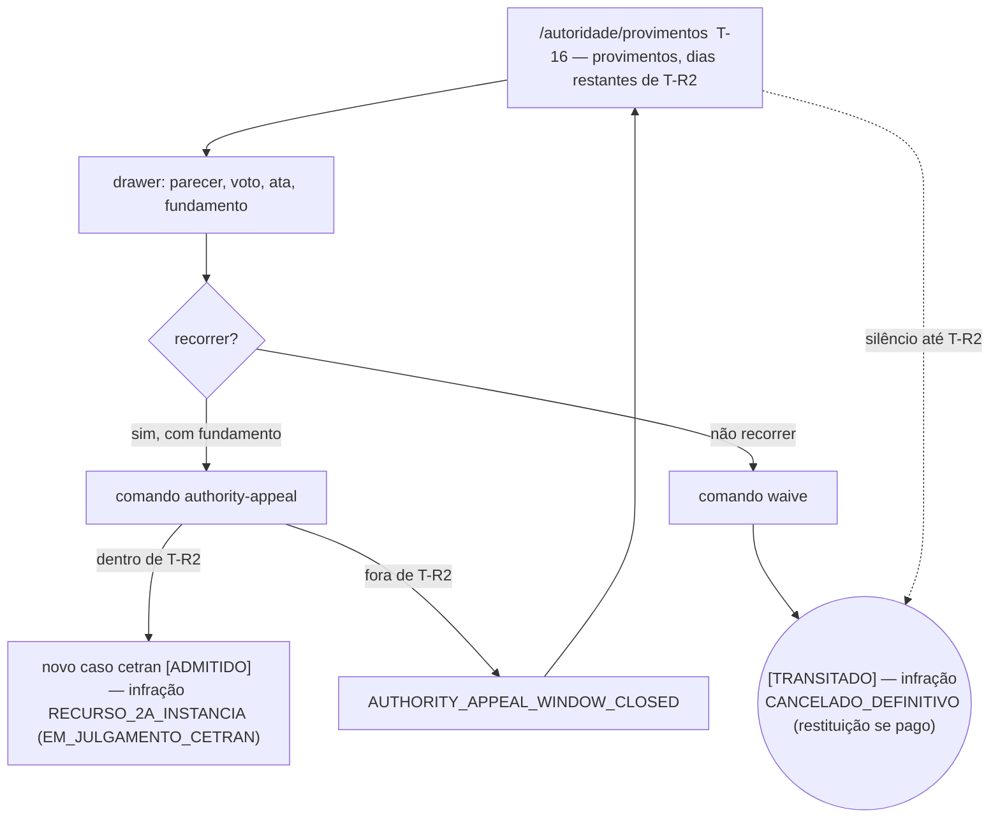
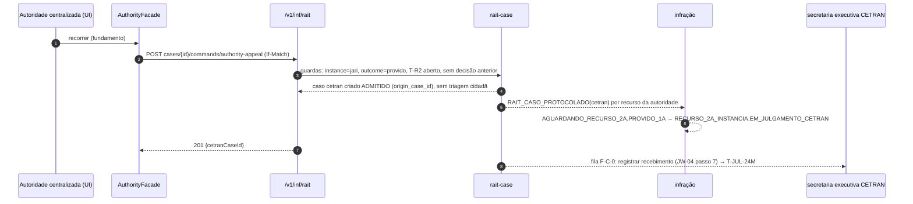

# JW-06 — Autoridade centralizada do recurso vinculado (`rait-central-authority`)

Origem: `UC-RAIT-008`, `RN-RAIT-130`, `WF-INF-003` #23-#24, decisão OD-001 (pendente). Tela T-16;
rota `/autoridade/provimentos`.

## Passos

| #   | Rota                      | Ação                                                          | Comando                                                    | Efeito                                                                       | Erros                                                                                                 |
| --- | ------------------------- | ------------------------------------------------------------- | ---------------------------------------------------------- | ---------------------------------------------------------------------------- | ----------------------------------------------------------------------------------------------------- |
| 1   | `/autoridade/provimentos` | lista provimentos da JARI a avaliar, dias restantes de `T-R2` | `GET cases?instance=jari&outcome=provido&state=COMUNICADO` | —                                                                            | —                                                                                                     |
| 2   | idem (drawer do caso)     | lê parecer, voto e ata; fundamento                            | `GET` decisão, ata                                         | —                                                                            | —                                                                                                     |
| 3a  | idem                      | "recorrer ao CETRAN" com fundamento                           | `rait-appeal:authority-decide`                             | novo caso `cetran` nasce `[ADMITIDO]`; infração `RECURSO_2A_INSTANCIA`       | `AUTHORITY_APPEAL_WINDOW_CLOSED`, `AUTHORITY_APPEAL_NOT_PROVIDED`, `AUTHORITY_APPEAL_ALREADY_DECIDED` |
| 3b  | idem                      | "não recorrer" (declaração)                                   | `rait-appeal:waive`                                        | caso `[TRANSITADO]`; infração `CANCELADO_DEFINITIVO` (+ restituição se pago) | idem                                                                                                  |
| 3c  | —                         | silêncio até `T-R2`                                           | timer                                                      | igual a 3b, automático                                                       | —                                                                                                     |

## Fluxo de telas

<!-- svg: ARCH-RAIT-WEB-j06-autoridade-centralizada-telas -->

[Renderizado: ARCH-RAIT-WEB-j06-autoridade-centralizada-telas.svg](../diagrams/ARCH-RAIT-WEB-j06-autoridade-centralizada-telas.svg)

## Sequência: recorrer ao CETRAN

<!-- svg: ARCH-RAIT-WEB-j06-autoridade-centralizada-sequencia -->

[Renderizado: ARCH-RAIT-WEB-j06-autoridade-centralizada-sequencia.svg](../diagrams/ARCH-RAIT-WEB-j06-autoridade-centralizada-sequencia.svg)
