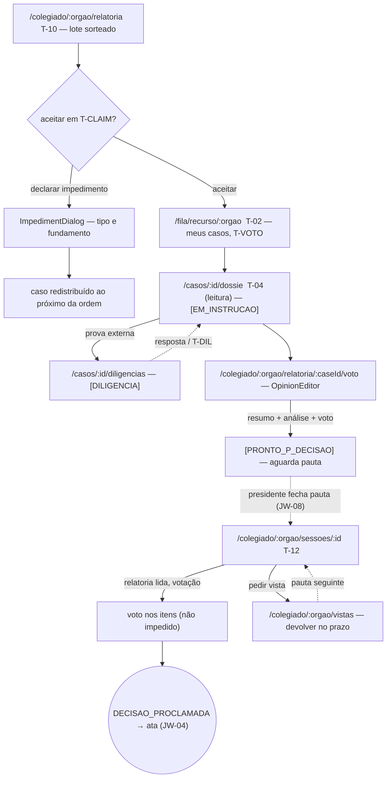
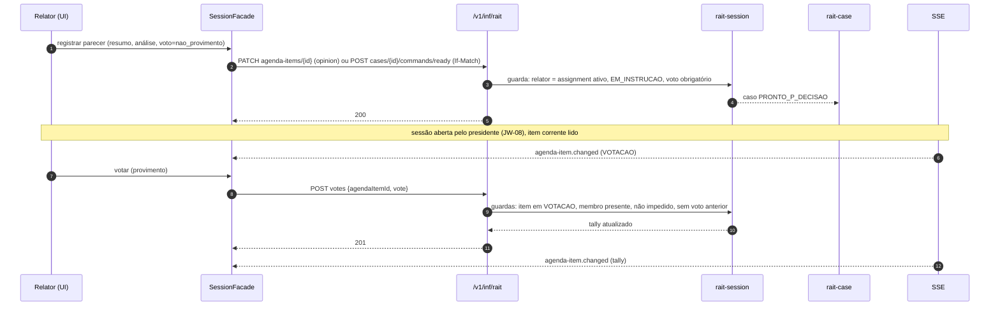

# JW-07 — Membro / conselheiro relator (`rait-rapporteur`)

Origem: `JRN-RAIT-002`, `UC-RAIT-004`, `UC-RAIT-006`, `UC-RAIT-019`, `UC-RAIT-026`. Telas T-01, T-02,
T-10, T-12; rotas `/fila/recurso/:orgao`, `/colegiado/:orgao/relatoria*`, `/colegiado/:orgao/sessoes/:id`.

## Passos

| #   | Rota                                       | Ação                                                            | Comando                              | Efeito                                          | Erros                                                                                     |
| --- | ------------------------------------------ | --------------------------------------------------------------- | ------------------------------------ | ----------------------------------------------- | ----------------------------------------------------------------------------------------- |
| 1   | `/colegiado/:orgao/relatoria`              | lote sorteado: "aceitar" ou "declarar impedimento" em `T-CLAIM` | `rait-batch:accept` / `impede`       | `[EM_INSTRUCAO]` com `T-VOTO` \| redistribuição | `BATCH_CLAIM_EXPIRED`, `MEMBER_IMPEDED`                                                   |
| 2   | `/fila/recurso/:orgao`                     | meus casos distribuídos, `T-VOTO` por caso                      | `GET assignments?member=me`          | —                                               | —                                                                                         |
| 3   | `/casos/:id/dossie` (leitura)              | lê dossiê; abre diligência se necessário                        | `rait-case:open-inquiry`             | `[DILIGENCIA]`                                  | `INQUIRY_ADDRESSEE_FORBIDDEN`                                                             |
| 4   | `/colegiado/:orgao/relatoria/:caseId/voto` | `OpinionEditor`: resumo, análise, voto conclusivo               | `rait-opinion:register`              | `[PRONTO_P_DECISAO]`                            | `DRAFT_INCOMPLETE` (parecer), `DECISION_GROUNDS_REQUIRED`                                 |
| 5   | `/colegiado/:orgao/sessoes/:id`            | na sessão: relatoria lida; vota nos demais itens; pede vista    | `rait-session:vote` / `view-request` | tally; item reprogramado                        | `VOTE_MEMBER_IMPEDED`, `VOTE_ITEM_NOT_OPEN`, `VOTE_DUPLICATE`, `VIEW_REQUEST_NOT_ALLOWED` |
| 6   | `/colegiado/:orgao/vistas`                 | devolve item com vista dentro do prazo                          | `PATCH agenda-items/{id}`            | item volta à pauta seguinte                     | `VIEW_DEADLINE_EXCEEDED`                                                                  |

## Fluxo de telas

<!-- svg: ARCH-RAIT-WEB-j07-relator-telas -->

[Renderizado: ARCH-RAIT-WEB-j07-relator-telas.svg](../diagrams/ARCH-RAIT-WEB-j07-relator-telas.svg)

## Sequência: registrar parecer e votar em sessão

<!-- svg: ARCH-RAIT-WEB-j07-relator-sequencia -->

[Renderizado: ARCH-RAIT-WEB-j07-relator-sequencia.svg](../diagrams/ARCH-RAIT-WEB-j07-relator-sequencia.svg)
