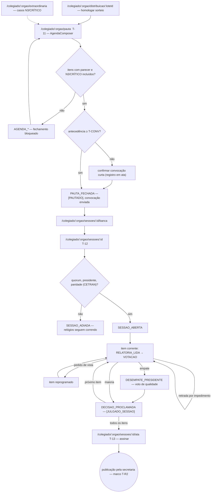
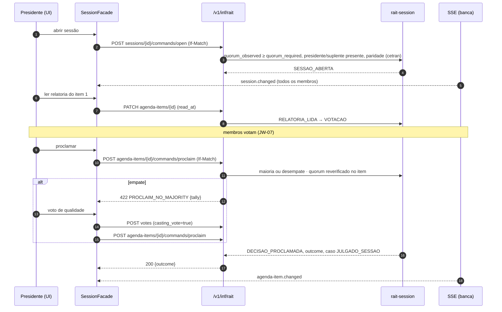

# JW-08 — Presidente da JARI-AM / CETRAN-AM (`rait-chair`)

Origem: `JRN-RAIT-002`, `UC-RAIT-005`, `UC-RAIT-006`, `UC-RAIT-014` (homologação), `UC-RAIT-015`,
`UC-RAIT-019`, `UC-RAIT-021`, `UC-RAIT-036` (aprovação). Telas T-09, T-11, T-12, T-13.

## Passos

| #   | Rota                                     | Ação                                                                                       | Comando                                         | Efeito                                          | Erros                                                                                                    |
| --- | ---------------------------------------- | ------------------------------------------------------------------------------------------ | ----------------------------------------------- | ----------------------------------------------- | -------------------------------------------------------------------------------------------------------- |
| 1   | `/colegiado/:orgao/distribuicao/:loteId` | homologa o sorteio; exclusões manuais motivadas                                            | `rait-batch:approve`                            | `T-CLAIM` armado                                | `BATCH_SEED_TAMPERED`, `BATCH_STATE_INVALID`                                                             |
| 2   | `/colegiado/:orgao/pauta`                | `AgendaComposer`: arrasta itens com parecer; N3/CRÍTICO obrigatórios; fecha                | `rait-agenda:close`                             | `[PAUTADO]`; sessão `PAUTA_FECHADA`; convocação | `AGENDA_ITEM_WITHOUT_OPINION`, `AGENDA_CRITICAL_MISSING`, `AGENDA_SHORT_NOTICE`, `AGENDA_ITEM_DUPLICATE` |
| 3   | `/colegiado/:orgao/sessoes/:id/banca`    | verifica banca; convoca suplentes                                                          | (secretaria executa)                            | `BANCA_CONFIRMADA`                              | `BENCH_INSUFFICIENT`                                                                                     |
| 4   | `/colegiado/:orgao/sessoes/:id`          | abre a sessão (quorum, presidente, paridade no CETRAN)                                     | `rait-session:open` \| `adjourn`                | `SESSAO_ABERTA` \| `SESSAO_ADIADA`              | `SESSION_QUORUM_MISSING`, `SESSION_STATE_INVALID`                                                        |
| 5   | idem                                     | item a item: relatoria lida → votação → (vista) → empate → voto de qualidade → proclamação | `rait-session:vote`, `casting-vote`, `proclaim` | `DECISAO_PROCLAMADA`; caso `[JULGADO_SESSAO]`   | `CASTING_VOTE_NOT_TIED`, `PROCLAIM_NO_MAJORITY`, `VOTE_MEMBER_IMPEDED`                                   |
| 6   | `/colegiado/:orgao/sessoes/:id/ata`      | assina a ata                                                                               | `rait-minutes:sign`                             | `ATA_ASSINADA` → publicação pela secretaria     | `SIGNATURE_FAILED`                                                                                       |
| 7   | `/colegiado/:orgao/extraordinaria`       | convoca extraordinária por casos críticos                                                  | `rait-session:convene-extraordinary`            | sessão criada com `extraordinary=true`          | `EXTRAORDINARY_NO_CRITICAL`, `SESSION_PAID_CAP_REACHED`                                                  |
| 8   | `/organizacao/jeton`                     | aprova a folha                                                                             | `rait-jeton:approve`                            | folha aprovada                                  | `JETON_ALREADY_APPROVED`                                                                                 |

## Fluxo de telas

<!-- svg: ARCH-RAIT-WEB-j08-presidente-telas -->

[Renderizado: ARCH-RAIT-WEB-j08-presidente-telas.svg](../diagrams/ARCH-RAIT-WEB-j08-presidente-telas.svg)

## Sequência: abrir sessão, votar item, proclamar

<!-- svg: ARCH-RAIT-WEB-j08-presidente-sequencia -->

[Renderizado: ARCH-RAIT-WEB-j08-presidente-sequencia.svg](../diagrams/ARCH-RAIT-WEB-j08-presidente-sequencia.svg)
