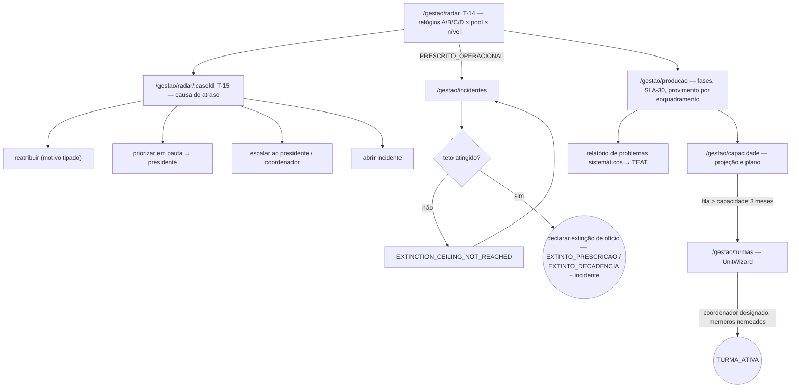
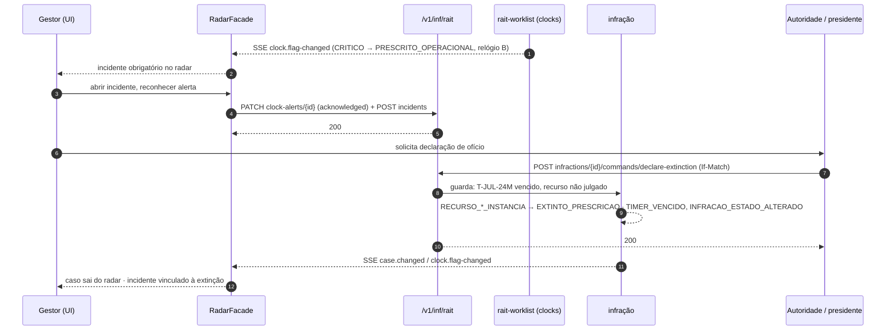

# JW-09 — Gestor RAIT (`rait-manager`)

Origem: `JRN-RAIT-004`, `UC-RAIT-010`, `UC-RAIT-011`, `UC-RAIT-023`, `UC-RAIT-038`, `UC-RAIT-039`,
`UC-RAIT-040`. Telas T-14, T-15; rotas `/gestao/*`, `/integracoes/*` (leitura).

## Passos

| #   | Rota                       | Ação                                                                                            | Comando                                                                          | Efeito                                                        | Erros                                                        |
| --- | -------------------------- | ----------------------------------------------------------------------------------------------- | -------------------------------------------------------------------------------- | ------------------------------------------------------------- | ------------------------------------------------------------ |
| 1   | `/gestao/radar`            | segmenta por relógio (A/B/C/D), pool, nível; dias restantes por linha                           | `GET clocks?flag>=ALERTA_N1`; SSE                                                | —                                                             | —                                                            |
| 2   | `/gestao/radar/:caseId`    | causa do atraso; reatribuir, priorizar em pauta, escalar ao presidente, abrir incidente         | `rait-assignment:reassign`, `rait-incident:open`, `rait-clock:acknowledge-alert` | ação registrada no caso                                       | `REASSIGN_*`, `CLOCK_ALERT_ALREADY_ACKNOWLEDGED`             |
| 3   | `/gestao/incidentes`       | `PRESCRITO_OPERACIONAL`: declara extinção de ofício com a autoridade/presidente; abre incidente | `rait-extinction:declare`                                                        | infração `EXTINTO_PRESCRICAO`/`EXTINTO_DECADENCIA`; incidente | `EXTINCTION_CEILING_NOT_REACHED`, `EXTINCTION_DECISION_LATE` |
| 4   | `/gestao/producao`         | tempo por fase, SLA local, taxa de provimento por enquadramento; relatório ao TEAT              | `GET` indicadores; `rait-export:create` (via auditor)                            | relatório de problemas sistemáticos                           | —                                                            |
| 5   | `/gestao/capacidade`       | projeção, plano, pedido de reforço                                                              | `rait-capacity-plan:publish`                                                     | plano                                                         | —                                                            |
| 6   | `/gestao/turmas`           | constitui nova turma/JARI; designa coordenador; ativa                                           | `rait-unit:constitute` / `activate`                                              | `TURMA_EM_CONSTITUICAO` → `TURMA_ATIVA`                       | `UNIT_TRIGGER_NOT_MET`, `UNIT_COORDINATOR_REQUIRED`          |
| 7   | `/integracoes/*` (leitura) | acompanha filas e divergências                                                                  | `GET`                                                                            | —                                                             | —                                                            |

## Fluxo de telas

<!-- svg: ARCH-RAIT-WEB-j09-gestor-telas -->

[Renderizado: ARCH-RAIT-WEB-j09-gestor-telas.svg](../diagrams/ARCH-RAIT-WEB-j09-gestor-telas.svg)

## Sequência: radar → drill-down → declarar extinção

<!-- svg: ARCH-RAIT-WEB-j09-gestor-sequencia -->

[Renderizado: ARCH-RAIT-WEB-j09-gestor-sequencia.svg](../diagrams/ARCH-RAIT-WEB-j09-gestor-sequencia.svg)
