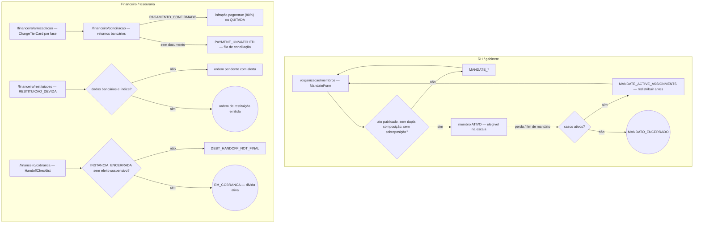
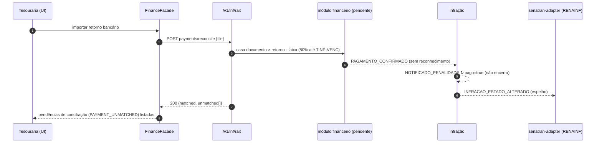

# JW-10 — RH / gabinete (`rait-hr`) e financeiro / tesouraria (`rait-finance`)

Origem: `UC-RAIT-032`…`UC-RAIT-037`, `RN-RAIT-127`…`RN-RAIT-129`. Rotas `/organizacao/membros`,
`/organizacao/jeton` (apoio), `/financeiro/*`. Os módulos financeiro e de mandatos dependem de
entidades pendentes (build pack WP-A/WP-B); as rotas existem e exibem "indisponível nesta versão".

## RH — mandatos

| #   | Rota                   | Ação                                                                      | Comando               | Efeito                                    | Erros                                                          |
| --- | ---------------------- | ------------------------------------------------------------------------- | --------------------- | ----------------------------------------- | -------------------------------------------------------------- |
| 1   | `/organizacao/membros` | cadastra nomeação (ato publicado, representação, titular/suplente, datas) | `rait-member:mandate` | membro `ATIVO` no pool do órgão           | `MANDATE_ACT_REQUIRED`, `MANDATE_DUAL_BODY`, `MANDATE_OVERLAP` |
| 2   | idem                   | registra posse, recondução, perda de mandato                              | `rait-member:mandate` | `MANDATO_ENCERRADO`; casos redistribuídos | `MANDATE_ACTIVE_ASSIGNMENTS`                                   |
| 3   | `/organizacao/jeton`   | apoia a apuração da folha (secretaria gera, presidente aprova)            | leitura               | —                                         | `PARAMETER_SOURCE_PENDING`                                     |

## Financeiro

| #   | Rota                       | Ação                                                                             | Comando                  | Efeito                                                  | Erros                                                                |
| --- | -------------------------- | -------------------------------------------------------------------------------- | ------------------------ | ------------------------------------------------------- | -------------------------------------------------------------------- |
| 4   | `/financeiro/arrecadacao`  | emite/atualiza documento por fase (80% até `T-NP-VENC`, 60% SNE, integral+juros) | `rait-collection:issue`  | documento vinculado ao estado da infração               | `COLLECTION_PHASE_INVALID`, `COLLECTION_DISCOUNT_SNE_ONLY`           |
| 5   | `/financeiro/conciliacao`  | concilia retornos bancários com documentos                                       | `rait-payment:reconcile` | `PAGAMENTO_CONFIRMADO` → infração `pago=true`/`QUITADA` | `PAYMENT_UNMATCHED`                                                  |
| 6   | `/financeiro/restituicoes` | ordem de restituição corrigida após `RESTITUICAO_DEVIDA`                         | `rait-refund:order`      | ordem emitida; pendente se sem dados bancários          | `REFUND_NOT_DUE`, `REFUND_BANK_DATA_MISSING`, `REFUND_INDEX_PENDING` |
| 7   | `/financeiro/cobranca`     | handoff à cobrança/dívida ativa (Fazenda)                                        | `rait-debt:handoff`      | infração `EM_COBRANCA`                                  | `DEBT_HANDOFF_NOT_FINAL`                                             |

## Fluxo de telas

<!-- svg: ARCH-RAIT-WEB-j10-rh-financeiro-telas -->

[Renderizado: ARCH-RAIT-WEB-j10-rh-financeiro-telas.svg](../diagrams/ARCH-RAIT-WEB-j10-rh-financeiro-telas.svg)

## Sequência: conciliação de pagamento até a infração

<!-- svg: ARCH-RAIT-WEB-j10-rh-financeiro-sequencia -->

[Renderizado: ARCH-RAIT-WEB-j10-rh-financeiro-sequencia.svg](../diagrams/ARCH-RAIT-WEB-j10-rh-financeiro-sequencia.svg)
