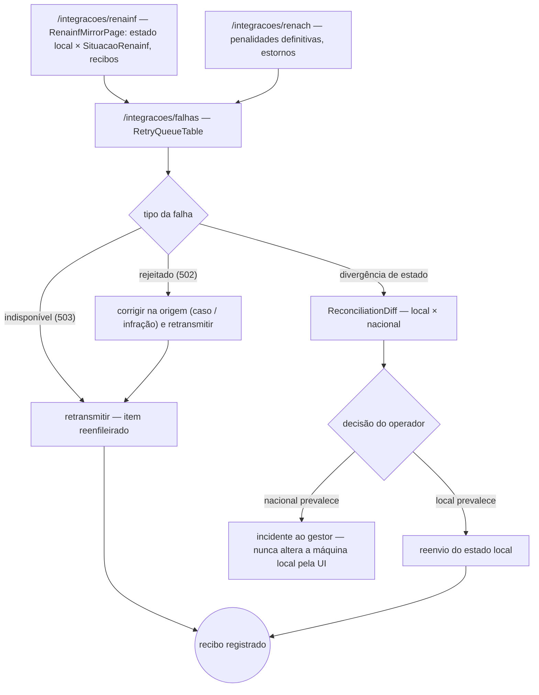
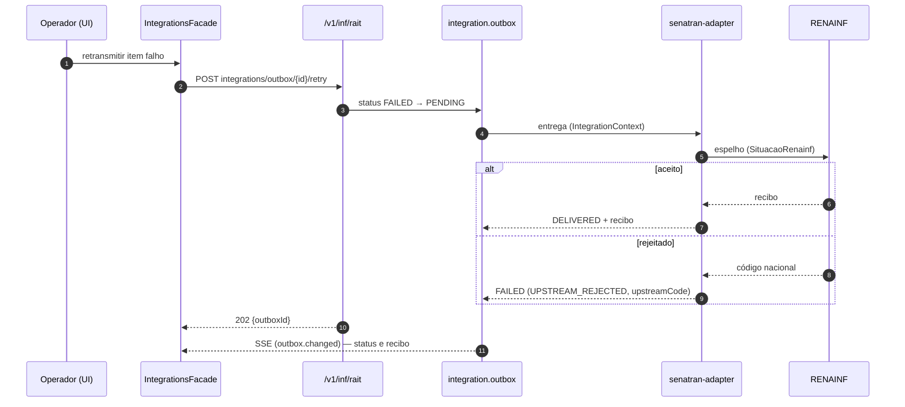

# JW-11 — Operador de integração (`integration-operator`)

Origem: `UC-RAIT-029`, `UC-RAIT-030`, `UC-RAIT-031`, `WF-INF-003` §8, ADR-0003. Rotas
`/integracoes/*`. O browser nunca fala com RENAINF/RENACH/SNE: tudo passa pelo senatran-adapter e
pela outbox do kernel (`integration.outbox`).

## Passos

| #   | Rota                   | Ação                                                                 | Comando                      | Efeito                                   | Erros                                                             |
| --- | ---------------------- | -------------------------------------------------------------------- | ---------------------------- | ---------------------------------------- | ----------------------------------------------------------------- |
| 1   | `/integracoes/renainf` | espelhamento por infração: estado local × `SituacaoRenainf`, recibos | `GET outbox?system=renainf`  | —                                        | —                                                                 |
| 2   | `/integracoes/renach`  | penalidades definitivas enviadas, estornos                           | `GET outbox?system=renach`   | —                                        | —                                                                 |
| 3   | `/integracoes/falhas`  | retransmite item falho                                               | `rait-integration:retry`     | item reenfileirado; recibo               | `RETRY_NOT_FAILED`, `UPSTREAM_REJECTED`, `UPSTREAM_*_UNAVAILABLE` |
| 4   | idem                   | concilia divergência (local × nacional) com decisão registrada       | `rait-integration:reconcile` | divergência fechada; evento de auditoria | `RECONCILIATION_DIVERGENCE` (exige decisão)                       |

## Fluxo de telas

<!-- svg: ARCH-RAIT-WEB-j11-operador-integracao-telas -->

[Renderizado: ARCH-RAIT-WEB-j11-operador-integracao-telas.svg](../diagrams/ARCH-RAIT-WEB-j11-operador-integracao-telas.svg)

## Sequência: retransmissão e conciliação

<!-- svg: ARCH-RAIT-WEB-j11-operador-integracao-sequencia -->

[Renderizado: ARCH-RAIT-WEB-j11-operador-integracao-sequencia.svg](../diagrams/ARCH-RAIT-WEB-j11-operador-integracao-sequencia.svg)
