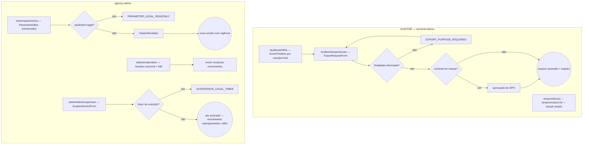
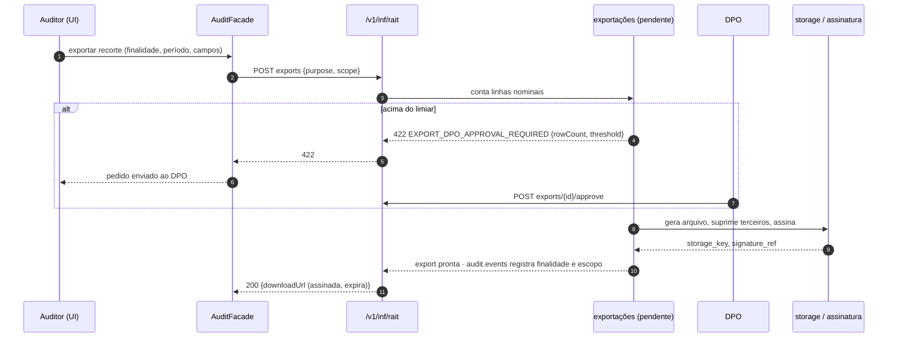

# JW-12 — Auditor (`AUDITOR`) e administrador do órgão (`agency-admin`)

Origem: `UC-RAIT-022`, `UC-RAIT-042`, `UC-RAIT-043`, `RN-RAIT-133`…`RN-RAIT-137`. Rotas
`/auditoria/*`, `/arquivo/*` (leitura), `/admin/*`.

## Auditor — somente leitura

| #   | Rota                                   | Ação                                                         | Comando                   | Efeito                                   | Erros                                                     |
| --- | -------------------------------------- | ------------------------------------------------------------ | ------------------------- | ---------------------------------------- | --------------------------------------------------------- |
| 1   | `/auditoria/trilha`                    | trilha por caso ou período (`EventTimeline`, `audit.events`) | `GET events`, `GET audit` | —                                        | `AUDIT_RANGE_TOO_WIDE`                                    |
| 2   | `/auditoria/exportacoes`               | exportação com finalidade; nominal em massa exige DPO        | `rait-export:create`      | arquivo assinado; registro da exportação | `EXPORT_PURPOSE_REQUIRED`, `EXPORT_DPO_APPROVAL_REQUIRED` |
| 3   | `/arquivo/busca`, `/arquivo/casos/:id` | consulta dossiê selado (terceiros suprimidos)                | `GET`                     | —                                        | —                                                         |

## Administrador do órgão

| #   | Rota                    | Ação                                                                                                                   | Comando                      | Efeito                               | Erros                                                                                   |
| --- | ----------------------- | ---------------------------------------------------------------------------------------------------------------------- | ---------------------------- | ------------------------------------ | --------------------------------------------------------------------------------------- |
| 4   | `/admin/parametros`     | edita parâmetros operacionais versionados (WIP, lotes, escada, T-VOTO…); prazos legais somente leitura; simula impacto | `rait-parameter:update`      | nova versão com vigência             | `PARAMETER_LEGAL_READONLY`, `PARAMETER_EFFECTIVE_DATE_PAST`, `PARAMETER_SOURCE_PENDING` |
| 5   | `/admin/calendario`     | feriados nacional + AM                                                                                                 | `PUT calendar`               | vencimentos recalculados pelo motor  | `CALENDAR_OVERLAP`                                                                      |
| 6   | `/admin/atos/suspensao` | ato de força maior: casos, período, fundamento, prova (assinado pela autoridade/presidente)                            | `rait-suspension-act:create` | vencimentos reprogramados com trilha | `SUSPENSION_LEGAL_TIMER`, `SUSPENSION_EVIDENCE_REQUIRED`                                |
| 7   | `/organizacao/pools`    | pools e estratégias                                                                                                    | `PATCH pools`                | —                                    | `POOL_*`                                                                                |

## Fluxo de telas

<!-- svg: ARCH-RAIT-WEB-j12-auditor-admin-telas -->

[Renderizado: ARCH-RAIT-WEB-j12-auditor-admin-telas.svg](../diagrams/ARCH-RAIT-WEB-j12-auditor-admin-telas.svg)

## Sequência: exportação com controle LGPD

<!-- svg: ARCH-RAIT-WEB-j12-auditor-admin-sequencia -->

[Renderizado: ARCH-RAIT-WEB-j12-auditor-admin-sequencia.svg](../diagrams/ARCH-RAIT-WEB-j12-auditor-admin-sequencia.svg)
