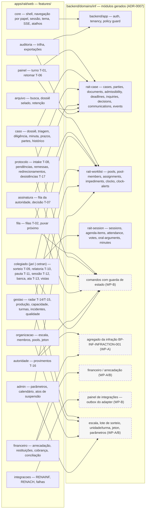
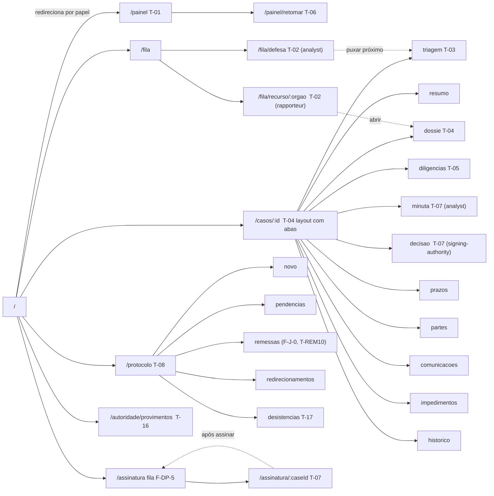
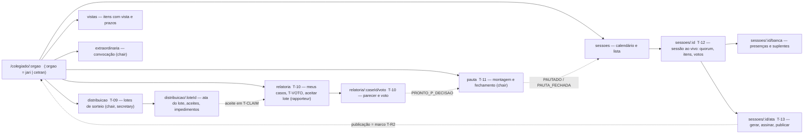
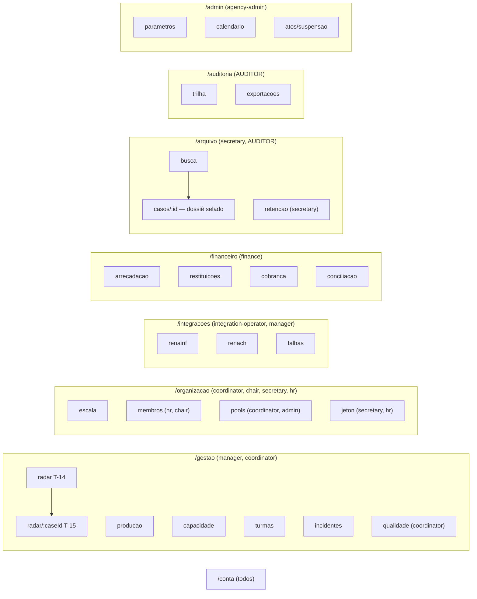
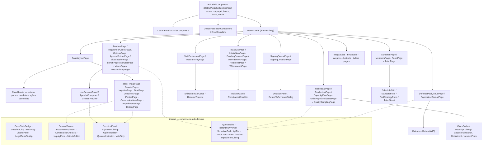
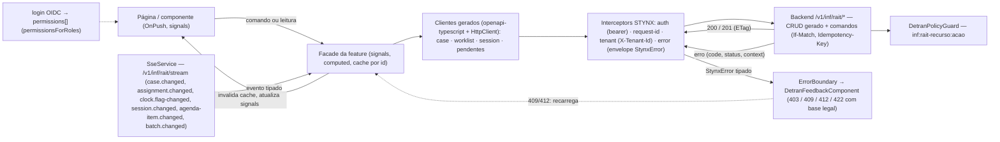
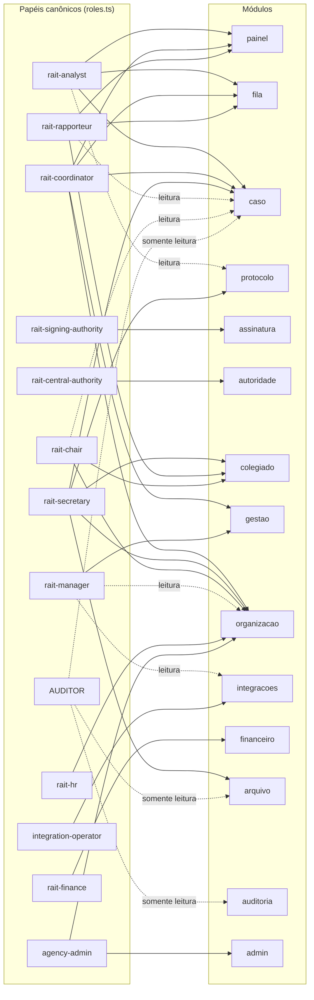

# Diagramas auxiliares da estrutura do frontend

Companheiro visual de `rait-web-frontend.md`. Cada diagrama é gerado a partir do bloco Mermaid
deste arquivo (Mermaid 11.4.1, tema neutro) e salvo em `./diagrams/ARCH-RAIT-WEB-*.svg`; ao
alterar um bloco, regenerar o SVG correspondente. A fonte de verdade da estrutura continua sendo a
especificação; aqui só se desenha o que ela define.

## D1 — Módulos do frontend, módulos do backend e fontes de verdade

Cada módulo lazy de `src/app/features/` conversa com um ou mais módulos gerados do backend
(`backend/domains/inf/rait-*`) ou com um módulo ainda pendente (tracejado).

<!-- svg: ARCH-RAIT-WEB-d1-modulos -->

[Renderizado: ARCH-RAIT-WEB-d1-modulos.svg](./diagrams/ARCH-RAIT-WEB-d1-modulos.svg)

## D2 — Rotas de operação (painel, fila, caso, protocolo, assinatura, autoridade)

<!-- svg: ARCH-RAIT-WEB-d2-rotas-operacao -->

[Renderizado: ARCH-RAIT-WEB-d2-rotas-operacao.svg](./diagrams/ARCH-RAIT-WEB-d2-rotas-operacao.svg)

## D3 — Rotas do colegiado (parametrizadas por órgão)

<!-- svg: ARCH-RAIT-WEB-d3-rotas-colegiado -->

[Renderizado: ARCH-RAIT-WEB-d3-rotas-colegiado.svg](./diagrams/ARCH-RAIT-WEB-d3-rotas-colegiado.svg)

## D4 — Rotas de gestão, organização, integrações, financeiro, arquivo, auditoria e admin

<!-- svg: ARCH-RAIT-WEB-d4-rotas-gestao -->

[Renderizado: ARCH-RAIT-WEB-d4-rotas-gestao.svg](./diagrams/ARCH-RAIT-WEB-d4-rotas-gestao.svg)

## D5 — Hierarquia de componentes

Do shell às páginas e aos componentes compartilhados de domínio. Setas cheias = composição
(pai contém filho); tracejadas = uso de componente compartilhado.

<!-- svg: ARCH-RAIT-WEB-d5-componentes -->

[Renderizado: ARCH-RAIT-WEB-d5-componentes.svg](./diagrams/ARCH-RAIT-WEB-d5-componentes.svg)

## D6 — Fluxo de dados: componente → facade → cliente → API, SSE e concorrência

<!-- svg: ARCH-RAIT-WEB-d6-fluxo-dados -->

[Renderizado: ARCH-RAIT-WEB-d6-fluxo-dados.svg](./diagrams/ARCH-RAIT-WEB-d6-fluxo-dados.svg)

## D7 — Papéis e visibilidade de módulos

<!-- svg: ARCH-RAIT-WEB-d7-papeis-modulos -->

[Renderizado: ARCH-RAIT-WEB-d7-papeis-modulos.svg](./diagrams/ARCH-RAIT-WEB-d7-papeis-modulos.svg)
