# Estrutura de navegação web do TEAT

Papel: Architect (transcrição).

A matriz web é a autoridade para as 56 telas de produto e suas 163 transições. As quatro rotas operacionais são do contrato da aplicação e não têm ficha de produto.

```mermaid
flowchart LR
  subgraph entry[entry]
    login["UX-WEB-001 · Login Web<br/>/ux/web/login"]
    dashboard_home["UX-WEB-002 · Dashboard inicial<br/>/ux/web/dashboard-home"]
  end
  subgraph operations[operations]
    ops_dashboard["UX-WEB-003 · Dashboard operacional<br/>/ux/web/ops-dashboard"]
    ops_map["UX-WEB-004 · Mapa de agentes/equipes<br/>/ux/web/ops-map"]
    operations_list["UX-WEB-005 · Lista de operações<br/>/ux/web/operations-list"]
    operation_detail["UX-WEB-006 · Detalhe da operação<br/>/ux/web/operation-detail"]
    active_shifts["UX-WEB-007 · Turnos ativos<br/>/ux/web/active-shifts"]
    operation_messages["UX-WEB-008 · Mensagens operacionais<br/>/ux/web/operation-messages"]
  end
  subgraph ait[ait]
    ait_inbox["UX-WEB-020 · Fila de AIT recebidos<br/>/ux/web/ait-inbox"]
    ait_validation["UX-WEB-021 · Fila de validação<br/>/ux/web/ait-validation"]
    ait_sanitization_queue["UX-WEB-022 · AIT pendentes de saneamento<br/>/ux/web/ait-sanitization-queue"]
    ait_rejected["UX-WEB-023 · AIT rejeitados<br/>/ux/web/ait-rejected"]
    ait_detail["UX-WEB-024 · Detalhe do AIT<br/>/ux/web/ait-detail"]
    ait_sanitize["UX-WEB-025 · Saneamento de AIT<br/>/ux/web/ait-sanitize"]
    ait_reject["UX-WEB-026 · Rejeição de AIT<br/>/ux/web/ait-reject"]
    ait_integration["UX-WEB-027 · Integração RENAINF/estadual<br/>/ux/web/ait-integration"]
    ait_mirror["UX-WEB-028 · Espelho do AIT<br/>/ux/web/ait-mirror"]
  end
  subgraph measures[measures]
    measures_list["UX-WEB-040 · Lista de medidas<br/>/ux/web/measures-list"]
    measure_detail["UX-WEB-041 · Detalhe de medida<br/>/ux/web/measure-detail"]
    removals["UX-WEB-042 · Remoções<br/>/ux/web/removals"]
    release["UX-WEB-043 · Liberação<br/>/ux/web/release"]
  end
  subgraph alcohol[alcohol]
    alcohol_procedures["UX-WEB-050 · Procedimentos de alcoolemia<br/>/ux/web/alcohol-procedures"]
    breathalyzers["UX-WEB-051 · Etilômetros<br/>/ux/web/breathalyzers"]
  end
  subgraph crashes[crashes]
    crashes_list["UX-WEB-060 · Lista de sinistros<br/>/ux/web/crashes-list"]
    crash_detail["UX-WEB-061 · Detalhe de sinistro<br/>/ux/web/crash-detail"]
    crash_complement["UX-WEB-062 · Complementação de sinistro<br/>/ux/web/crash-complement"]
    renaest_integration["UX-WEB-063 · Integração RENAEST<br/>/ux/web/renaest-integration"]
  end
  subgraph evidence[evidence]
    evidence_search["UX-WEB-070 · Consulta de evidências<br/>/ux/web/evidence-search"]
    evidence_viewer["UX-WEB-071 · Visualizador de evidência<br/>/ux/web/evidence-viewer"]
    custody_chain["UX-WEB-072 · Cadeia de custódia<br/>/ux/web/custody-chain"]
    probative_package["UX-WEB-073 · Pacote probatório<br/>/ux/web/probative-package"]
  end
  subgraph audit[audit]
    audit_events["UX-WEB-080 · Eventos de auditoria<br/>/ux/web/audit-events"]
    ait_timeline["UX-WEB-081 · Timeline do AIT<br/>/ux/web/ait-timeline"]
    agent_timeline["UX-WEB-082 · Timeline do agente<br/>/ux/web/agent-timeline"]
    external_queries_audit["UX-WEB-083 · Consultas externas<br/>/ux/web/external-queries-audit"]
    anomalies["UX-WEB-084 · Anomalias<br/>/ux/web/anomalies"]
  end
  subgraph bi[bi]
    bi_enforcement["UX-WEB-090 · BI fiscalização<br/>/ux/web/bi-enforcement"]
    bi_crashes["UX-WEB-091 · BI sinistros<br/>/ux/web/bi-crashes"]
    bi_quality["UX-WEB-092 · BI qualidade<br/>/ux/web/bi-quality"]
    bi_integrations["UX-WEB-093 · BI integração<br/>/ux/web/bi-integrations"]
  end
  subgraph admin[admin]
    admin_orgs["UX-WEB-100 · Órgãos<br/>/ux/web/admin-orgs"]
    admin_units["UX-WEB-101 · Unidades<br/>/ux/web/admin-units"]
    admin_users_agents["UX-WEB-102 · Usuários/agentes<br/>/ux/web/admin-users-agents"]
    admin_profiles["UX-WEB-103 · Perfis/permissões<br/>/ux/web/admin-profiles"]
    admin_devices["UX-WEB-104 · Dispositivos<br/>/ux/web/admin-devices"]
    admin_competencies["UX-WEB-105 · Convênios e competências<br/>/ux/web/admin-competencies"]
  end
  subgraph normative[normative]
    norm_catalogs["UX-WEB-110 · Catálogos normativos<br/>/ux/web/norm-catalogs"]
    norm_violations["UX-WEB-111 · Enquadramentos<br/>/ux/web/norm-violations"]
    norm_rules["UX-WEB-112 · Regras de validação<br/>/ux/web/norm-rules"]
    norm_templates["UX-WEB-113 · Templates<br/>/ux/web/norm-templates"]
    norm_mobile_packages["UX-WEB-114 · Pacotes mobile<br/>/ux/web/norm-mobile-packages"]
  end
  subgraph technical[technical]
    tech_integrations["UX-WEB-120 · Integrações<br/>/ux/web/tech-integrations"]
    tech_queues["UX-WEB-121 · Filas<br/>/ux/web/tech-queues"]
    tech_certificates["UX-WEB-122 · Certificados<br/>/ux/web/tech-certificates"]
    tech_jobs["UX-WEB-123 · Jobs<br/>/ux/web/tech-jobs"]
    tech_health["UX-WEB-124 · Saúde do sistema<br/>/ux/web/tech-health"]
  end
  denied["/acesso-negado · operacional"]
  account["/conta · operacional"]
  error["/erro · operacional"]
  wildcard["** · operacional"]
  login --> dashboard_home
  dashboard_home --> ops_dashboard
  dashboard_home --> ait_inbox
  dashboard_home --> bi_enforcement
  ops_dashboard --> ops_map
  ops_dashboard --> active_shifts
  ops_dashboard --> operation_messages
  ops_map --> active_shifts
  ops_map --> operation_detail
  ops_map --> agent_timeline
  operations_list --> operation_detail
  operations_list --> ops_dashboard
  operations_list --> operation_messages
  operation_detail --> active_shifts
  operation_detail --> operation_messages
  operation_detail --> bi_enforcement
  active_shifts --> agent_timeline
  active_shifts --> ops_map
  active_shifts --> operation_messages
  operation_messages --> operation_detail
  operation_messages --> active_shifts
  ait_inbox --> ait_detail
  ait_inbox --> ait_validation
  ait_inbox --> ait_integration
  ait_validation --> ait_sanitize
  ait_validation --> ait_detail
  ait_validation --> ait_rejected
  ait_sanitization_queue --> ait_sanitize
  ait_sanitization_queue --> ait_detail
  ait_rejected --> ait_reject
  ait_rejected --> ait_detail
  ait_rejected --> audit_events
  ait_detail --> evidence_viewer
  ait_detail --> ait_timeline
  ait_detail --> ait_sanitize
  ait_sanitize --> ait_detail
  ait_sanitize --> ait_validation
  ait_sanitize --> audit_events
  ait_reject --> ait_rejected
  ait_reject --> ait_detail
  ait_reject --> audit_events
  ait_integration --> tech_queues
  ait_integration --> tech_integrations
  ait_integration --> bi_integrations
  ait_mirror --> ait_detail
  ait_mirror --> probative_package
  measures_list --> measure_detail
  measures_list --> removals
  measures_list --> release
  measure_detail --> evidence_viewer
  measure_detail --> removals
  measure_detail --> release
  removals --> measure_detail
  removals --> release
  removals --> admin_competencies
  release --> measure_detail
  release --> measures_list
  release --> audit_events
  alcohol_procedures --> breathalyzers
  alcohol_procedures --> evidence_viewer
  alcohol_procedures --> bi_quality
  breathalyzers --> alcohol_procedures
  breathalyzers --> norm_rules
  breathalyzers --> audit_events
  crashes_list --> crash_detail
  crashes_list --> crash_complement
  crashes_list --> renaest_integration
  crash_detail --> crash_complement
  crash_detail --> evidence_viewer
  crash_detail --> ait_inbox
  crash_complement --> crash_detail
  crash_complement --> renaest_integration
  crash_complement --> audit_events
  renaest_integration --> tech_queues
  renaest_integration --> tech_integrations
  renaest_integration --> bi_integrations
  evidence_search --> evidence_viewer
  evidence_search --> custody_chain
  evidence_search --> probative_package
  evidence_viewer --> custody_chain
  evidence_viewer --> probative_package
  evidence_viewer --> audit_events
  custody_chain --> probative_package
  custody_chain --> audit_events
  custody_chain --> evidence_viewer
  probative_package --> audit_events
  probative_package --> ait_timeline
  probative_package --> evidence_search
  audit_events --> ait_timeline
  audit_events --> agent_timeline
  audit_events --> anomalies
  ait_timeline --> ait_detail
  ait_timeline --> external_queries_audit
  ait_timeline --> probative_package
  agent_timeline --> active_shifts
  agent_timeline --> audit_events
  agent_timeline --> anomalies
  external_queries_audit --> audit_events
  external_queries_audit --> ait_timeline
  external_queries_audit --> tech_integrations
  anomalies --> agent_timeline
  anomalies --> audit_events
  anomalies --> bi_quality
  bi_enforcement --> ait_inbox
  bi_enforcement --> ops_dashboard
  bi_enforcement --> bi_quality
  bi_crashes --> crashes_list
  bi_crashes --> crash_detail
  bi_crashes --> bi_quality
  bi_quality --> ait_validation
  bi_quality --> ait_rejected
  bi_quality --> audit_events
  bi_integrations --> tech_queues
  bi_integrations --> tech_integrations
  bi_integrations --> ait_integration
  admin_orgs --> admin_units
  admin_orgs --> admin_competencies
  admin_orgs --> audit_events
  admin_units --> admin_users_agents
  admin_units --> admin_orgs
  admin_units --> admin_competencies
  admin_users_agents --> admin_profiles
  admin_users_agents --> admin_devices
  admin_users_agents --> agent_timeline
  admin_profiles --> admin_users_agents
  admin_profiles --> audit_events
  admin_profiles --> admin_orgs
  admin_devices --> tech_health
  admin_devices --> admin_users_agents
  admin_devices --> audit_events
  admin_competencies --> norm_rules
  admin_competencies --> admin_orgs
  admin_competencies --> operations_list
  norm_catalogs --> norm_violations
  norm_catalogs --> norm_mobile_packages
  norm_catalogs --> audit_events
  norm_violations --> norm_rules
  norm_violations --> norm_catalogs
  norm_violations --> ait_validation
  norm_rules --> norm_templates
  norm_rules --> norm_mobile_packages
  norm_rules --> ait_validation
  norm_templates --> norm_mobile_packages
  norm_templates --> ait_mirror
  norm_templates --> measure_detail
  norm_mobile_packages --> tech_queues
  norm_mobile_packages --> tech_health
  norm_mobile_packages --> audit_events
  tech_integrations --> tech_queues
  tech_integrations --> tech_certificates
  tech_integrations --> bi_integrations
  tech_queues --> tech_jobs
  tech_queues --> ait_integration
  tech_queues --> renaest_integration
  tech_certificates --> tech_integrations
  tech_certificates --> tech_health
  tech_certificates --> audit_events
  tech_jobs --> tech_health
  tech_jobs --> tech_queues
  tech_jobs --> audit_events
  tech_health --> tech_queues
  tech_health --> tech_integrations
  tech_health --> bi_integrations
```

## Cobertura

- Telas de produto representadas: 56/56.
- Rotas operacionais sem ficha: `/acesso-negado`, `/conta`, `/erro` e `**`.
- Sinistros: `crashes-list`, `crash-detail`, `crash-complement`, `renaest-integration` e `bi-crashes` são pontos BOAT; o diagrama não transfere seu domínio ao TEAT.
- As transições são as 163 da matriz; o diagrama preserva seus nós e relações de rota.
