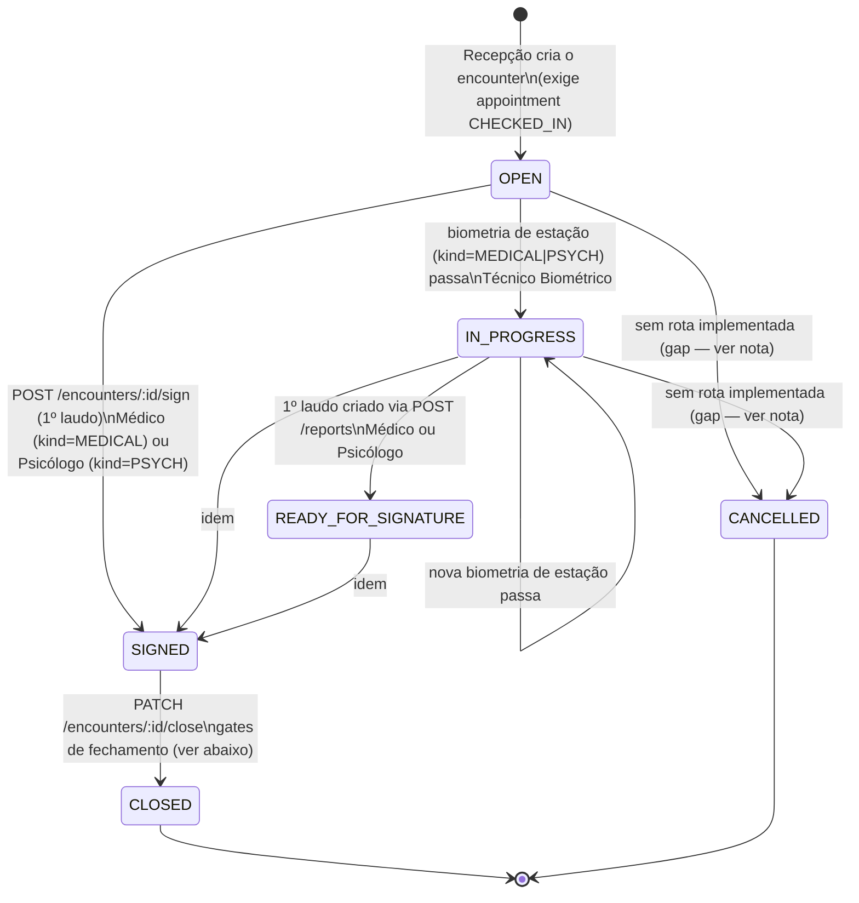

## Revisão BPO (2026-08-25) — confirm-extend

Rodada CRAWLER (`_intake/research-dossier.md`) capturou base legal explícita para os
"(fonte pendente)" da tabela de prazos abaixo. A rodada LEGAL paralela ([RN-PEC-102],
[RN-PEC-108]) **corrigiu dois pontos que o dossiê havia recomendado incorretamente** — registrado
aqui para que nenhuma versão anterior deste arquivo (ou qualquer consumidor que a tenha lido antes
desta revisão) propague o erro:

1. A validade do exame médico **não é** "5 anos, 3 para maiores de 65" (Res. 789/2020 art. 4º) —
   esse texto está **superado** por lei posterior (CTB art. 147 §2º, redação da Lei 14.071/2020),
   que fixa três faixas etárias (10/5/3 anos). Ver linha corrigida na tabela abaixo e [RN-PEC-102].
2. A ordem "Avaliação Psicológica antes de Exame de Aptidão Física e Mental" (Res. 789/2020 art.
   2º §1º) **não é um bloqueio técnico** entre os dois exames clínicos — é a sequência do processo
   administrativo mais amplo (que inclui curso e provas de direção), sem cominação de nulidade.
   [RN-PEC-108] resolve o item que a versão anterior deste workflow registrava como "decisão de
   modelagem pendente": **nada a alterar quanto à ordem** — o modelo de `encounter` com os dois
   exames em paralelo está confirmado como compatível, agora com fundamentação explícita.

## Estados

`OPEN, IN_PROGRESS, READY_FOR_SIGNATURE, SIGNED, CLOSED, CANCELLED` —
`pec.encounter_status` [pec:database/ddl/02-pec.sql].

Um encounter cobre **até dois exames** (um médico + um psicológico) e **até dois laudos**
(um por tipo) — não é 1 encounter : 1 exame. Ver [APP-PEC] §"O modelo do encontro clínico".

## Transições e gatilhos

| De                                       | Para                | Gatilho                                                                                           | Ator                                                                                                   | Condição/guarda                                                                                                                                                                                                                                                                                                                                                    |
| ---------------------------------------- | ------------------- | ------------------------------------------------------------------------------------------------- | ------------------------------------------------------------------------------------------------------ | ------------------------------------------------------------------------------------------------------------------------------------------------------------------------------------------------------------------------------------------------------------------------------------------------------------------------------------------------------------------ |
| _(criação)_                              | OPEN                | `POST /encounters`                                                                                | Recepção                                                                                               | appointment vinculado deve estar `CHECKED_IN` (ou é resolvido automaticamente a partir do agendamento mais recente do paciente); sem isso: `400 Biometric check-in is required before opening encounter`                                                                                                                                                           |
| OPEN/IN_PROGRESS                         | IN_PROGRESS         | `POST /encounters/:id/checkin` com biometria de estação `kind=MEDICAL` ou `PSYCH` e `passed=true` | Técnico Biométrico                                                                                     | biometria reprovada não avança o status                                                                                                                                                                                                                                                                                                                            |
| IN_PROGRESS                              | READY_FOR_SIGNATURE | criação de laudo via `POST /reports` (sem passar por `/sign`)                                     | Médico / Psicólogo                                                                                     | só ocorre se o status estava exatamente `IN_PROGRESS`; é um estado transitório observável só nesse caminho                                                                                                                                                                                                                                                         |
| OPEN / IN_PROGRESS / READY_FOR_SIGNATURE | SIGNED              | `POST /encounters/:id/sign`                                                                       | Médico (`kind=MEDICAL`) / Psicólogo (`kind=PSYCH`) — RBAC por tipo de exame                            | gera e assina o laudo (PAdES+TSA) e força o status para `SIGNED` **incondicionalmente**, mesmo que o outro laudo (médico ou psicológico) ainda não exista                                                                                                                                                                                                          |
| SIGNED / CLOSED / CANCELLED              | —                   | `POST /encounters/:id/sign` chamado de novo                                                       | —                                                                                                      | rejeitado: `400 Cannot sign encounter in status 'SIGNED'` etc.                                                                                                                                                                                                                                                                                                     |
| SIGNED                                   | CLOSED              | `PATCH /encounters/:id/close`                                                                     | qualquer ator autorizado a fechar (RBAC "Encerrar episódio" — Médico/Psicólogo/Gestor conforme matriz) | todos os gates de `assertClosureReady()` — ver abaixo                                                                                                                                                                                                                                                                                                              |
| —                                        | CANCELLED           | —                                                                                                 | —                                                                                                      | **gap implementado**: o valor existe no enum e é checado como estado terminal em toda guarda, mas nenhuma rota/serviço em `domain/` escreve `status='CANCELLED'` em `pec.encounters` — contraste com `pec.appointments` e `pec.biometric_exceptions`, que têm caminho de cancelamento real. Reportar como debt de implementação, não modelar transições fictícias. |

### Nuance de negócio: "primeiro a assinar fecha a porta"

`SIGNABLE_STATUSES` exclui explicitamente `SIGNED`
[pec:domain/encounters-clinical-encounter/api/src/encounters/encounters.service.spec.ts].
Como `sign()` força o status para `SIGNED` após **qualquer um** dos dois laudos (médico OU
psicológico, o que for assinado primeiro), o segundo profissional a chamar
`/encounters/:id/sign` de forma independente é **rejeitado** — a menos que o segundo laudo
seja emitido via `POST /reports` diretamente (que não mexe no status uma vez além de
`IN_PROGRESS`). Isso é um comportamento observado no código, não uma intenção documentada
explicitamente; times consumindo este workflow devem orquestrar os dois laudos (ex.: emitir
ambos via `/reports` e usar `/sign` apenas como o disparo final), ou tratar isso como um
bug a corrigir. Ver `_intake/proposals.md`.

### Gate de encerramento (`assertClosureReady`, `PATCH /encounters/:id/close`)

Todas as condições abaixo devem valer simultaneamente (lidas de `pec.v_episode_summary`);
qualquer violação retorna `400` listando os itens faltantes:

1. Exame médico realizado (`exams_medical.performed_at` não nulo) **e** exame psicológico
   realizado.
2. Laudo médico assinado **e** laudo psicológico assinado (`pec.reports.storage_uri`
   presente para os dois `kind`).
3. Nenhum `pec.process_blocks` ativo (ex.: pré-condição toxicológica não cumprida — ver
   [RN-PEC-007]; inconsistência de dados aberta).
4. Nenhum `pec.junta_cases` pendente (status ≠ `DECIDED`) — ver [WF-PEC-002].
5. Se `medical_result = 'CONDICIONADO'`, ao menos uma `pec.encounter_restrictions` aplicada
   (código de restrição na CNH).
6. Zero linhas `PENDING`/`ERROR` em `integration.renach_outbox` para o encounter — **a
   transmissão ao RENACH precisa já ter sido enviada e confirmada (ACKed)**; `close()` apenas
   verifica, não dispara, a publicação.

Efeito: `status='CLOSED'`, `closed_at = now()`.

## Prazos e timers (base legal por prazo)

| Timer                                                         | Prazo                                                                                                                                                                                                 | Gatilho                                                      | Consequência                                                                                                                            | Base                                                                                                                                                                                                                       |
| ------------------------------------------------------------- | ----------------------------------------------------------------------------------------------------------------------------------------------------------------------------------------------------- | ------------------------------------------------------------ | --------------------------------------------------------------------------------------------------------------------------------------- | -------------------------------------------------------------------------------------------------------------------------------------------------------------------------------------------------------------------------- |
| Janela de transmissão RENACH                                  | ≤ 15 min                                                                                                                                                                                              | evento enfileirado (`integration.renach_outbox`)             | reprocessamento automático agendado (`next_attempt_at`)                                                                                 | pec:docs/framework/pec/flows/transmissoes-ack.md — SLA operacional, sem base legal                                                                                                                                         |
| Publicação RENACH (p95)                                       | ≤ 10 s                                                                                                                                                                                                | evento despachado                                            | SLA de observabilidade, sem consequência normativa descrita                                                                             | pec:CONTEXT.md — SLA operacional, sem base legal                                                                                                                                                                           |
| Correção de inconsistência                                    | 2 dias úteis                                                                                                                                                                                          | `pec.inconsistencies` aberta (webhook à contratada)          | após o prazo, bloqueio permanece até correção — sem prazo de escalonamento automático descrito                                          | pec:docs/framework/pec/flows/diagrams/inconsistencias.mmd — SLA operacional, sem base legal                                                                                                                                |
| **Validade do exame médico**                                  | **10 anos** (<50 anos) / **5 anos** (50 a <70 anos) / **3 anos** (≥70 anos), por faixa etária na data do exame; redutível a critério do perito, motivado (indícios de deficiência/doença progressiva) | emissão do exame de aptidão física e mental                  | exame vencido reabre a exigência (nova cobrança de agendamento) — timer de reabertura não modelado hoje em nenhum estado deste workflow | CTB art. 147 §§2º/4º (redação Lei 14.071/2020) [REF-CTB-147-148-habilitacao], via [RN-PEC-102] — **substitui** o texto "5 anos/3 para >65" da Res. CONTRAN 789/2020 art. 4º, que está superado e não deve ser implementado |
| **Disponibilização do resultado psicológico**                 | 2 dias úteis                                                                                                                                                                                          | conclusão da avaliação psicológica pelo psicólogo            | atraso não tem consequência numérica descrita na norma — item a verificar com LEGAL (mera irregularidade vs. sanção)                    | Res. CONTRAN 927/2022 art. 9º §3º [REF-CONTRAN-927-2022]                                                                                                                                                                   |
| **Pré-condição toxicológica (C/D/E) — validade do resultado** | 90 dias, contados da coleta da amostra                                                                                                                                                                | resultado toxicológico emitido pelo laboratório credenciado  | fora da janela, o resultado deixa de valer como pré-condição — processo permanece bloqueado até nova coleta                             | Res. CONTRAN 923/2022 art. 10 §1º [REF-CONTRAN-923-1009-toxicologico] — ver [WF-PEC-005] para o desenho completo do gate e do exame periódico pós-CNH                                                                      |
| Processo de habilitação ativo no RENACH                       | 12 meses, contados do requerimento                                                                                                                                                                    | abertura do processo (`POST /integrations/renach/processes`) | processo inativo expira no RENACH — sem timer de expiração modelado em `pec.encounters`/`renach_process_key` hoje                       | Res. CONTRAN 789/2020 art. 2º §3º [REF-CONTRAN-789-2020] — **decisão de modelagem pendente**: confirmar se o PEC precisa observar/alertar sobre essa expiração ou se é responsabilidade exclusiva do RENACH                |

**Nuance importante (evitar confusão de prazo).** A "validade do resultado toxicológico" (90
dias) é a validade de um resultado **já emitido** — não um prazo para _obter_ o exame. O PEC não
controla o prazo de obtenção (o laboratório é externo, ver [WF-PEC-005]); controla apenas se o
resultado disponível ainda está dentro da janela de validade no momento em que é usado como
pré-condição.

## Decisões de modelagem pendentes

- (fonte pendente) Confirmar com o time PEC se `CANCELLED` é um estado a implementar ou a
  remover do modelo — hoje é enum morto.
- (fonte pendente) Confirmar a intenção do fluxo "primeiro a assinar força SIGNED" — parece
  inconsistente com o RBAC que dá a Médico e Psicólogo assinaturas independentes.
- ~~Ordem Avaliação Psicológica → Exame de Aptidão Física e Mental~~ — **RESOLVIDO por
  [RN-PEC-108]**: não é bloqueio técnico; o modelo paralelo atual está confirmado como correto.
- **Expiração do processo em 12 meses** (CTB/Res. 789/2020 art. 2º §3º, confirmado como timer
  real por [RN-PEC-108]) — gap confirmado, ainda sem comportamento definido: decisão do Owner
  sobre se o PEC deve observar/alertar ativamente sobre processo RENACH inativo há mais de 12
  meses, ou se isso é responsabilidade exclusiva do sistema nacional. Candidato direto a nova
  linha de comportamento (não apenas de dado) neste workflow.
- Ver [RN-PEC-006] para o detalhamento normativo do gate de encerramento; ver [RN-PEC-105] e
  [RN-PEC-106] para a correção completa da nomenclatura de resultado — **`medical_result=
'CONDICIONADO'` não corresponde a nenhum rótulo legal**. [RN-PEC-105] já fixa a correção:
  `CONDICIONADO` ≡ "apto com restrições", **somente na trilha médica** (a trilha psicológica não
  tem esse rótulo — três valores apenas: apto/inapto temporário/inapto); "PENDENTE" (Portaria
  DETRAN-AM 005/2021) é estado de processo, não resultado, e não deve ser gravado em
  `medical_result`. Correção do enum é matéria de [RN-PEC-105]/[RN-PEC-006], fora da fronteira de
  escrita deste workflow, mas o impacto na orquestração do encounter é direto: um mapeamento
  errado de resultado pode disparar (ou deixar de disparar) o gate de restrição de CNH do item 5
  do gate de encerramento.
- [RN-PEC-106] acrescenta um efeito não modelado neste workflow: resultado inapto (temporário ou
  não) exige **comunicação imediata** do perito aos setores médico/psicológico do DETRAN-AM para
  bloqueio do cadastro nacional — evento distinto da fila genérica de [RN-PEC-008], com
  destinatário e urgência próprios. Não incorporado como estado nesta revisão; sinalizado como
  extensão futura deste workflow.

## Decisões

- **2026-08-25** — BPO (rodada CRAWLER→BPO, `_intake/research-dossier.md`): incorporados prazos
  com base legal explícita (disponibilização do resultado psicológico, validade do resultado
  toxicológico) e um timer de expiração de processo (12 meses, gap confirmado). Reconciliado com
  a rodada LEGAL paralela ([RN-PEC-102], [RN-PEC-108]): corrigida a validade do exame médico para
  as faixas etárias 10/5/3 anos do CTB (a proposta original do dossiê, 5/3 anos, estava errada e
  foi descartada); a questão de ordem entre os dois exames clínicos foi resolvida (sem bloqueio).
  Nenhuma transição de estado foi alterada.
