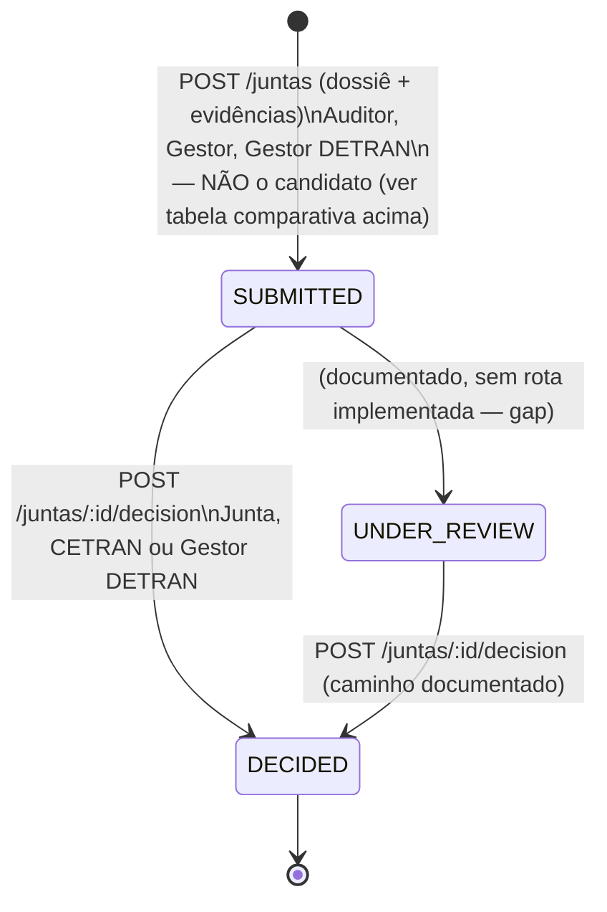

## Revisão BPO (2026-08-25) — restructuring, não apenas confirmação

A rodada CRAWLER (`_intake/research-dossier.md`) localizou, pela primeira vez, base legal federal
explícita para composição e prazos da junta médica/psicológica (Res. CONTRAN 927/2022 arts.
12-15, [REF-CONTRAN-927-2022]) — o "regimento/composição formal" que a versão anterior deste
workflow registrava como lacuna de fonte total. Essa norma **não descreve o mesmo processo** que
o módulo `juntas-medical-board` do PEC implementa hoje: ela descreve um direito do **candidato**
de requerer reavaliação em três instâncias possíveis (Junta de 1ª instância → recurso ao CETRAN →
Junta Especial de Saúde), com prazos e composição próprios; o PEC implementa uma fila
`SUBMITTED→UNDER_REVIEW→DECIDED` alimentada por **encaminhamento administrativo interno**
(Auditor/Gestor/Gestor DETRAN), sem campo para requerimento do candidato, sem membros
identificados e sem qualquer registro da terceira instância. Esta revisão modela os dois processos
lado a lado, explicitamente, e não funde um no outro sem decisão do Owner/LEGAL — ver
"Pergunta estrutural não resolvida" abaixo.

**Reconciliação com a rodada LEGAL paralela (mesma data).** [RN-PEC-110]/[RN-PEC-111]/
[RN-PEC-112] formalizam, de forma independente e mais precisa, exatamente a mesma cadeia de três
instâncias modelada abaixo — inclusive propondo a mesma escada de alertas 50/75/90% que este
workflow já traz. Duas divergências do BPO em relação ao texto anterior deste workflow foram
**corrigidas** por essas regras e estão incorporadas nesta revisão: (1) a "pergunta estrutural"
não é mais inteiramente aberta — [RN-PEC-110] toma posição de que o legitimado da 2ª instância é
o candidato, e trata a fila `SUBMITTED` do PEC como tendo um "legitimado errado" (divergência
confirmada, não mera hipótese); (2) a natureza do descumprimento dos prazos (prescricional vs.
irregularidade) está parcialmente resolvida por [RN-PEC-112] — ver "Escada de escalonamento"
abaixo.

## Dois processos, uma divergência confirmada (não mais apenas uma pergunta em aberto)

|             | Trilha legal (Res. 927/2022 arts. 12-15)                                                          | Trilha implementada no PEC                                                                                      |
| ----------- | ------------------------------------------------------------------------------------------------- | --------------------------------------------------------------------------------------------------------------- |
| Quem inicia | Candidato/condutor, requerendo ao órgão executivo de trânsito                                     | Auditor, Gestor (Clínica) ou Gestor DETRAN — nunca o candidato                                                  |
| Motivo      | Discordância do resultado do exame (qualquer resultado, "independentemente do resultado")         | Dúvida/divergência clínica identificada internamente (texto livre, sem taxonomia)                               |
| Instâncias  | Três: Junta (1ª) → CETRAN/CONTRANDIFE (recurso) → Junta Especial de Saúde (julgamento do recurso) | Uma fila linear (`SUBMITTED→UNDER_REVIEW→DECIDED`), com "CETRAN" como reatribuição de assinatura na mesma linha |
| Composição  | 3 profissionais (Junta); mínimo 3, com 2 especialistas (Junta Especial de Saúde)                  | Papel RBAC monolítico `JUNTA`, um único `decided_by` (UUID), sem contagem de membros                            |
| Prazos      | 30d / 15du / 30d / 30d / 20du (ver tabela)                                                        | Nenhum prazo modelado                                                                                           |

**Decisão estrutural aprovada em 2026-08-31.** [RN-PEC-110] item de verificação nº 1 toma posição explícita: _"o requerente é o
cidadão"_ — a norma não admite a leitura de que o requerimento do art. 12 seja substituível por
um encaminhamento administrativo interno. Isso não significa necessariamente que a fila
`SUBMITTED→DECIDED` do PEC deva ser descartada: [RN-PEC-110] propõe que **"o ato administrativo
interno pode continuar existindo como canal de entrada (protocolo), mas o requerente é o
cidadão"** — ou seja, a fila pode sobreviver como _mecanismo de registro_, mas o **legitimado**
que hoje aparece no `POST /juntas` (Auditor/Gestor/Gestor DETRAN) está normativamente incorreto e
é corrigido no alvo para refletir o candidato como parte solicitante, com o marco de "ciência do
candidato" como termo inicial do prazo de 30 dias (ver "Escada de escalonamento" abaixo). **O que
permanece genuinamente em aberto** (não resolvido por LEGAL, ver [RN-PEC-110] §Controvérsia): a
Junta de 2ª instância **refaz o exame** (novo `encounter`, com nova biometria de presença) ou
apenas **revisa o dossiê/laudo já produzido** (parecer documental)? A norma usa "reavaliação do
resultado", compatível com as duas leituras — decisão de produto que este workflow não resolve
(referência cruzada a uma futura regra de biometria de reavaliação, ainda não escrita — forward
reference `[RN-PEC-130]`).

## Estados — trilha legal (Res. 927/2022 arts. 12-15)

Aplica-se tanto à revisão do exame médico (Junta Médica) quanto da avaliação psicológica (Junta
Psicológica) — mesma máquina, `tipo_junta` ∈ {`medica`, `psicologica`} como parâmetro, espelhando
o padrão já usado em [WF-RAIT-003] para `orgao_julgador` ∈ {`jari`,`cetran`}.

```mermaid
stateDiagram-v2
    [*] --> REQUERIMENTO_APRESENTADO : candidato requer instauração de Junta\nno prazo de 30 dias do conhecimento do resultado\n(art.12)

    REQUERIMENTO_APRESENTADO --> JUNTA_DESIGNADA : órgão executivo de trânsito designa\na Junta (3 profissionais) — art.14 §1º,\n15 dias úteis do recebimento do requerimento

    JUNTA_DESIGNADA --> JUNTA_DECIDIU : Junta profere resultado —\nart.14 §3º, 30 dias da designação

    JUNTA_DECIDIU --> [*] : resultado favorável ao candidato\n(reverte inaptidão) — fim da trilha

    JUNTA_DECIDIU --> RECURSO_CETRAN_APRESENTADO : inaptidão permanente mantida —\ncandidato recorre ao CETRAN/CONTRANDIFE\nno prazo de 30 dias do conhecimento (art.13)

    RECURSO_CETRAN_APRESENTADO --> DOCUMENTOS_REMETIDOS_CETRAN : órgão remete documentos ao CETRAN —\nart.14 §2º, 20 dias úteis do recebimento do recurso

    DOCUMENTOS_REMETIDOS_CETRAN --> JUNTA_ESPECIAL_DESIGNADA : CETRAN/CONTRANDIFE designa\nJunta Especial de Saúde (art.15) —\nmín. 3 profissionais, 2 especialistas;\nsem prazo numérico de designação localizado

    JUNTA_ESPECIAL_DESIGNADA --> JUNTA_ESPECIAL_DECIDIU : Junta Especial de Saúde julga o recurso —\nsem prazo numérico próprio localizado\n(distinto do prazo de 30d da Junta de 1ª instância)

    JUNTA_ESPECIAL_DECIDIU --> [*] : decisão final — não há, na norma capturada,\ninstância recursal adicional
```

### Transições e gatilhos — trilha legal

| Transição                                                  | Ator                                          | Base legal               | Nota                                                                                                                                                         |
| ---------------------------------------------------------- | --------------------------------------------- | ------------------------ | ------------------------------------------------------------------------------------------------------------------------------------------------------------ |
| `[*] → REQUERIMENTO_APRESENTADO`                           | Candidato/condutor                            | art. 12, _caput_         | requerimento cabe "independentemente do resultado" — não é exclusivo de resultado desfavorável                                                               |
| `REQUERIMENTO_APRESENTADO → JUNTA_DESIGNADA`               | Órgão executivo de trânsito (DETRAN-AM)       | art. 14 §1º              | designa Junta Médica (3 médicos peritos/especialistas) ou Junta Psicológica (3 psicólogos peritos/especialistas), art. 12 §§1º-2º                            |
| `JUNTA_DESIGNADA → JUNTA_DECIDIU`                          | Junta (3 profissionais)                       | art. 14 §3º              | decisão fundamentada; sem regra de quorum/desempate localizada — **(fonte pendente)**, mesma classe de gap já registrada para JARI/CETRAN em [WF-RAIT-003]   |
| `JUNTA_DECIDIU → RECURSO_CETRAN_APRESENTADO`               | Candidato/condutor                            | art. 13                  | só cabe recurso se a Junta **manteve** a inaptidão permanente — resultado favorável encerra a trilha sem recurso                                             |
| `RECURSO_CETRAN_APRESENTADO → DOCUMENTOS_REMETIDOS_CETRAN` | Órgão executivo de trânsito                   | art. 14 §2º              | remessa de documentos, não a decisão em si                                                                                                                   |
| `DOCUMENTOS_REMETIDOS_CETRAN → JUNTA_ESPECIAL_DESIGNADA`   | CETRAN/CONTRANDIFE                            | art. 15                  | **terceira instância** — colegiado técnico distinto do plenário administrativo do CETRAN; sem prazo numérico de designação localizado — **(fonte pendente)** |
| `JUNTA_ESPECIAL_DESIGNADA → JUNTA_ESPECIAL_DECIDIU`        | Junta Especial de Saúde (≥3, 2 especialistas) | art. 15, parágrafo único | sem prazo numérico próprio localizado — **(fonte pendente)**; o alvo deixa o prazo unset e não herda por analogia                                            |

## Estados — trilha implementada no PEC (mantida como estava, com anotações)

`SUBMITTED, UNDER_REVIEW, DECIDED` — `pec.junta_status` [pec:database/ddl/02-pec.sql].

**Gap de implementação (mantido desta revisão anterior):** o serviço só expõe dois atos
mutadores — `POST /juntas` (cria em `SUBMITTED`) e `POST /juntas/:id/decision` (força `DECIDED`)
[pec:domain/juntas-medical-board/api/src/juntas/juntas.service.ts]. Não existe nenhuma
rota/método que grave `UNDER_REVIEW` — o valor está no enum e no DTO de filtro, mas é
inalcançável no fluxo atual.

**`UNDER_REVIEW` deixa de ser enum sem sentido, por [RN-PEC-110]/[RN-PEC-112].** Lido junto com a
trilha legal, `UNDER_REVIEW` corresponde exatamente ao intervalo entre `JUNTA_DESIGNADA` e
`JUNTA_DECIDIU` (o prazo T-JM-DECIDE de 30 dias, que corre da designação — não do requerimento).
Deixa de ser um gap de "estado morto sem razão de existir" e passa a ser um gap de "rota faltante
para um estado com significado normativo próprio" — mudança de severidade a considerar ao
priorizar o backlog de implementação.

| De                       | Para         | Gatilho                                                                                          | Ator                           | Condição/guarda                                                                                                    |
| ------------------------ | ------------ | ------------------------------------------------------------------------------------------------ | ------------------------------ | ------------------------------------------------------------------------------------------------------------------ |
| _(criação)_              | SUBMITTED    | `POST /juntas` — `encounterId` + `reason` (texto livre, até 240 caracteres) + `payload` opcional | Auditor, Gestor, Gestor DETRAN | não há taxonomia fixa de motivo; não há criação automática por regra de sistema                                    |
| SUBMITTED                | UNDER_REVIEW | não implementado                                                                                 | —                              | ver nota de gap acima                                                                                              |
| SUBMITTED / UNDER_REVIEW | DECIDED      | `POST /juntas/:id/decision` — `decision` + `escalateToCetran?`                                   | Junta, CETRAN, Gestor DETRAN   | assina o parecer (PAdES); `escalateToCetran=true` atribui a assinatura a `signerName='CETRAN'` em vez de `'JUNTA'` |

## Decisões (`pec.junta_decision`)

`APROVADA`, `NEGADA`, `SOLICITAR_COMPLEMENTO` [pec:database/ddl/02-pec.sql]. Nenhum dos três
rótulos corresponde diretamente aos resultados legais do art. 8º/9º da Res. 927/2022 (apto / apto
com restrições / inapto temporário / inapto) — a decisão da junta é sobre o **caso julgado**
(mantém, reverte ou pede mais dados), não uma reemissão direta do rótulo de aptidão; mapeamento
entre as duas taxonomias não está documentado — **(fonte pendente)**, candidato a validação
jurídica junto com o item de nomenclatura já sinalizado em [RN-PEC-006].

## Escalonamento a CETRAN — como implementado hoje

Não é um sub-workflow com estados próprios: é uma **flag booleana na mesma linha de decisão**
(`pec.junta_decisions.escalated_to_cetran`), não um novo caso/entidade
[pec:database/ddl/02-pec.sql]. Quando `true`, o parecer é atribuído ao papel `CETRAN` em vez de
`JUNTA`, e a flag é publicada no evento RENACH (`escalatedToCetran`).

**Divergência confirmada frente à trilha legal.** A Res. 927/2022 art. 15 não trata "CETRAN" como
o decisor técnico do recurso — o CETRAN **designa** um colegiado distinto, a Junta Especial de
Saúde, composto por médicos/psicólogos especialistas, para julgar o mérito. O PEC hoje trata
`CETRAN` como se fosse ele próprio o segundo parecer técnico (reforço de assinatura na mesma
linha), sem qualquer registro da Junta Especial de Saúde como entidade. Isso não é
necessariamente incorreto na prática administrativa real (o CETRAN pode delegar a decisão técnica
e apenas formalizar/assinar), mas **não é isso que a norma descreve** — é uma divergência de
modelagem confirmada, não apenas uma lacuna de fonte. [RN-PEC-110] item de verificação nº 2
confirma de forma independente a mesma leitura ("do ponto de vista normativo, a 3ª instância não
existe no sistema"). **Item de validação jurídica prioritária** antes de promover este workflow a
`reviewed`.

## Composição da junta

**Trilha legal (agora com base federal explícita, Res. 927/2022 arts. 12 §§1º-2º e 15, parágrafo
único — formalizada em [RN-PEC-111]):**

| Instância                                                    | Composição                                                                               | Base                     |
| ------------------------------------------------------------ | ---------------------------------------------------------------------------------------- | ------------------------ |
| Junta Médica (1ª instância)                                  | 3 médicos peritos examinadores de trânsito ou especialistas em medicina de tráfego       | art. 12 §1º              |
| Junta Psicológica (1ª instância)                             | 3 psicólogos peritos examinadores de trânsito ou especialistas em psicologia de trânsito | art. 12 §2º              |
| Junta Especial de Saúde — médica (recurso/2ª instância)      | mínimo 3 médicos, sendo 2 especialistas em Medicina de Tráfego                           | art. 15, parágrafo único |
| Junta Especial de Saúde — psicológica (recurso/2ª instância) | mínimo 3 psicólogos, sendo 2 especialistas em psicologia do trânsito                     | art. 15, parágrafo único |

**Trilha implementada no PEC:** continua sem composição modelada — papel RBAC monolítico
`JUNTA`, sem sub-papéis, sem contagem de membros, sem especialidade; a assinatura do parecer é
atribuída literalmente à string `'JUNTA'`, não a indivíduos identificados além de um único
`decided_by` (UUID). O gap deixa de ser "regimento não localizado" (era a redação da versão
anterior deste workflow) e passa a ser **puramente de implementação**: a composição normativa
existe, é federal e é explícita — o PEC apenas não a implementou. Ver [UC-PEC-010] (nova) para o
desenho proposto de designação de membros.

## Escada de escalonamento — prazos legais como timers operacionais

Segue o padrão já calibrado em [WF-RAIT-002] §4 (escada de alertas de prescrição): cada prazo
legal ganha marcos de alerta em % do prazo consumido, para que o backlog operacional seja visível
antes do vencimento, não apenas depois. Proposta do BPO — convergente com a recomendação
independente de [RN-PEC-112] item de verificação nº 4 (mesma calibração 50/75/90%, mesma
referência à rodada RAIT) — mas ainda não confirmada em steering. Ver `_intake/bpo-notes.md`.

| Timer        | Prazo legal                                                | Marcos de alerta propostos (50% / 75% / 90% / 100%)                 | Base                                                                                   |
| ------------ | ---------------------------------------------------------- | ------------------------------------------------------------------- | -------------------------------------------------------------------------------------- |
| T-JM-REQ     | 30 dias corridos (candidato requerer instauração de Junta) | 15 / 22 / 27 / 30 dias desde o conhecimento do resultado            | art. 12                                                                                |
| T-JM-DESIG   | 15 dias úteis (órgão designar a Junta)                     | 7 / 11 / 13 / 15 dias úteis desde o recebimento do requerimento     | art. 14 §1º                                                                            |
| T-JM-DECIDE  | 30 dias corridos (Junta proferir resultado)                | 15 / 22 / 27 / 30 dias desde a designação                           | art. 14 §3º                                                                            |
| T-JM-RECURSO | 30 dias corridos (candidato recorrer ao CETRAN)            | 15 / 22 / 27 / 30 dias desde o conhecimento do resultado da revisão | art. 13                                                                                |
| T-JM-REMESSA | 20 dias úteis (remessa de documentos ao CETRAN)            | 10 / 15 / 18 / 20 dias úteis desde o recebimento do recurso         | art. 14 §2º                                                                            |
| T-JES-DESIG  | sem prazo numérico localizado                              | —                                                                   | art. 15 — **(fonte pendente)**                                                         |
| T-JES-DECIDE | sem prazo numérico localizado                              | —                                                                   | art. 15 — **(fonte pendente)**; candidato a herdar 30d por analogia (decisão pendente) |

**Natureza do prazo — parcialmente resolvida por [RN-PEC-112].** Diferente do art. 289-A do CTB
(que a rodada RAIT confirmou como prescrição automática e declarável de ofício,
`_meta/steering.md` C.15), a natureza aqui **depende de quem tem o ônus do prazo** — distinção
que [RN-PEC-112] introduz e que este workflow adota:

- **Prazos do administrado** (T-JM-REQ, 30 dias para requerer; T-JM-RECURSO, 30 dias para
  recorrer ao CETRAN) são **preclusivos**: vencido o prazo, extingue-se o direito do candidato de
  provocar aquela instância. Aqui a automação de estado (ex.: fechar a janela de requerimento após
  30 dias) **é** apoiada em base normativa.
- **Prazos do órgão** (T-JM-DESIG, T-JM-DECIDE, T-JM-REMESSA) são **SLA legais sem sanção
  expressa** — a norma não comina consequência ao atraso do órgão em designar, decidir ou remeter.
  Isso não os torna irrelevantes: seguem sendo prazo legal, mas o descumprimento não gera efeito
  automático sobre o caso (não "declara" nada de ofício) — apenas expõe o órgão a
  questionamento/responsabilização administrativa. **Não modelar uma transição "prazo do órgão
  esgotado → resultado definitivo"** — apenas os marcos de alerta abaixo, como acompanhamento
  operacional.
- **Risco de exposição confirmado, não apenas teórico** ([RN-PEC-112] §Controvérsia, item c): o
  bloqueio do cadastro nacional ([RN-PEC-106], sob leitura conservadora) permanece ativo durante
  toda a revisão — um atraso do órgão nos prazos sem sanção recai integralmente sobre o candidato
  impedido de dirigir enquanto aguarda. É argumento adicional para tratar os marcos de alerta dos
  prazos do órgão como prioridade operacional real, não apenas decorativa.
- **Ainda em aberto**: prazo de designação e de decisão da Junta Especial de Saúde (art. 15) não
  têm número localizado — nem [RN-PEC-112] resolve isso; permanece **(fonte pendente)**.

## Atores por transição

| Transição                                                 | Ator                                                         |
| --------------------------------------------------------- | ------------------------------------------------------------ |
| Requerer instauração de Junta (trilha legal)              | Candidato/condutor                                           |
| Designar Junta / Junta Especial de Saúde (trilha legal)   | Órgão executivo de trânsito (DETRAN-AM) / CETRAN-CONTRANDIFE |
| Decidir — Junta ou Junta Especial de Saúde (trilha legal) | Membros designados (3 ou mais, conforme composição acima)    |
| Recorrer ao CETRAN (trilha legal)                         | Candidato/condutor                                           |
| Submeter caso (trilha implementada)                       | Auditor, Gestor (Clínica), Gestor DETRAN                     |
| Decidir — parecer/decisão final (trilha implementada)     | Junta, CETRAN, Gestor DETRAN                                 |
| Consultar/ler dossiê                                      | Auditor, Gestor, Gestor DETRAN, Supervisor                   |

## Prazos e timers (base legal por prazo) — resumo

Ver "Escada de escalonamento" acima para o detalhamento com marcos de alerta. Resumo dos cinco
prazos numéricos confirmados por Res. CONTRAN 927/2022 arts. 12-14: 30 dias (requerer junta), 15
dias úteis (designar junta), 30 dias (junta decidir), 30 dias (recorrer ao CETRAN), 20 dias úteis
(remessa de documentos ao CETRAN). Dois prazos permanecem **(fonte pendente)**: designação e
decisão da Junta Especial de Saúde (art. 15).

## Decisões de modelagem e fontes ainda pendentes

- **Correção de legitimado aprovada** — o alvo registra separadamente o candidato requerente e o
  operador autenticado que protocola o ato.
- **A Junta de 2ª instância refaz o exame ou só revisa o dossiê?** — não resolvido nem por
  [RN-PEC-110] nem por esta revisão; tem efeito direto sobre se o caso de junta abre um novo
  `encounter` (com nova biometria) ou permanece só documental.
- **Junta Especial de Saúde aprovada para o alvo** — colegiado técnico distinto, designado pelo
  CETRAN, com membros, especialidades e decisão próprios.
- (fonte pendente) Prazo de designação e de decisão da Junta Especial de Saúde (art. 15) — não
  localizado nem por [RN-PEC-112]; o alvo deixa esses prazos explicitamente ausentes até fonte.
- (fonte pendente) Regra de quorum/desempate da Junta e da Junta Especial de Saúde — mesma classe
  de gap já registrada para JARI/CETRAN em [WF-RAIT-003]; **não confirmado se o regimento
  interno do CETRAN-AM (também não localizado por essa rodada) disciplina este ponto**.
- (fonte pendente) Competência territorial (art. 14: requerimento/recurso apresentados no órgão
  do domicílio do interessado) — dado não coletado hoje pelo PEC; relevante em um estado da
  dimensão do Amazonas, onde "domicílio do interessado" pode não coincidir com a clínica do
  exame. Achado de [RN-PEC-110] item de verificação nº 5.
- (fonte pendente) Confirmar se `UNDER_REVIEW` (trilha implementada) será implementado ou
  removido do enum — agora com significado normativo definido (ver seção acima), o que pesa a
  favor de implementar em vez de remover.
- Mapeamento entre `pec.junta_decision` (APROVADA/NEGADA/SOLICITAR_COMPLEMENTO) e a taxonomia de
  resultado do art. 8º/9º da Res. 927/2022 — não documentado.
- **Efeito suspensivo não tratado pela norma** ([RN-PEC-110] §Controvérsia, item b): não se sabe
  se o bloqueio de cadastro do art. 10 §2º ([RN-PEC-106]) permanece durante a revisão. Leitura
  conservadora adotada (bloqueio permanece) — como interpretação, não como fato normativo certo.
- Inconsistência de rastreabilidade nos próprios docs do PEC: o blueprint
  `BP-juntas-medical-board.json` referencia `SUC-UC-13/15` (na verdade sobre laudos), enquanto
  `traceability-summary.md` usa `UC-J1/UC-J2` para o mesmo módulo — não resolvida na fonte,
  reportada aqui apenas como observação.

## Decisões

- **2026-08-25** — BPO (rodada CRAWLER→BPO, `_intake/research-dossier.md`): reestruturação
  completa. Modelada a trilha legal de três instâncias (Res. 927/2022 arts. 12-15) lado a lado
  com a trilha implementada, sem fundir as duas sem decisão do Owner/LEGAL. Composição e cinco
  prazos numéricos incorporados com base legal explícita.
- **2026-08-25** — Reconciliação com a rodada LEGAL paralela ([RN-PEC-110], [RN-PEC-111],
  [RN-PEC-112]): a "pergunta estrutural" sobre o legitimado deixa de ser inteiramente aberta —
  LEGAL confirma que o requerente é o candidato, restando ao Owner decidir apenas o desenho de
  implementação; a natureza do descumprimento de prazo foi parcialmente resolvida (preclusivo
  para o administrado, SLA sem sanção para o órgão); `UNDER_REVIEW` ganhou significado normativo.
  Terceira instância (Junta Especial de Saúde), competência territorial e a pergunta sobre
  refazer-o-exame-ou-só-revisar seguem como itens de validação jurídica/decisão de produto.
- **2026-08-31** — Owner reconciliou DT-025: o alvo registra candidato e operador separadamente,
  implementa a Junta Especial como colegiado distinto designado pelo CETRAN e não inventa prazo
  de designação/decisão sem fonte. A divergência da trilha de origem permanece apenas histórica.
