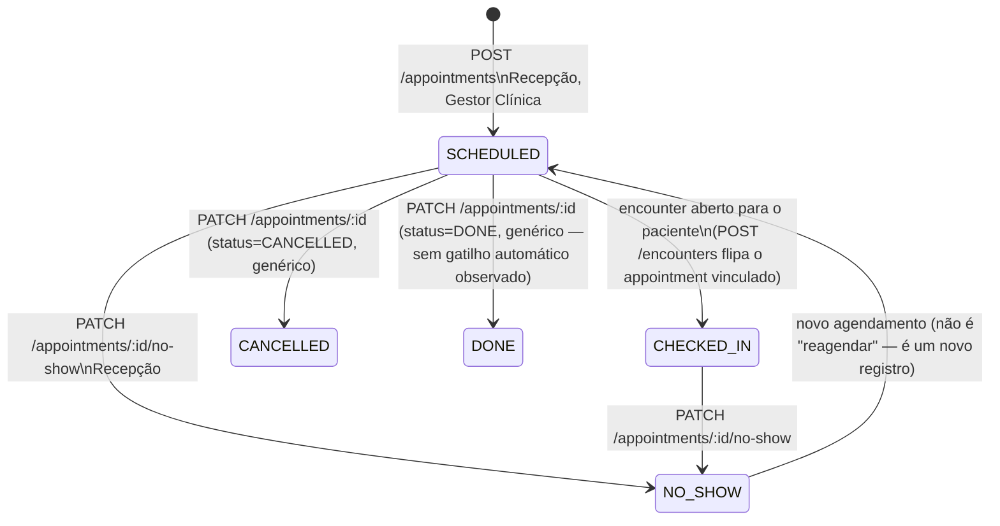

## Revisão BPO (2026-08-25)

A rodada CRAWLER (`_intake/research-dossier.md`) confirmou, com base estadual explícita, o item
que este workflow registrava como "(fonte pendente) — referência não aprofundada à Portaria
DETRAN-AM 005/2021": a janela de atendimento das clínicas credenciadas. Ver "Prazos e timers"
abaixo. Ressalva de vigência herdada da fonte: a Portaria 005/2021 é uma emenda pontual à
001/2019 (não localizada isoladamente), e uma possível Portaria 008/2021 mais recente (404 na
captura) pode tê-la substituído por inteiro — tratar a janela abaixo como "melhor evidência
disponível", não como vigência fechada.

## Estados

`SCHEDULED, CHECKED_IN, DONE, NO_SHOW, CANCELLED` — `pec.appointment_status`
[pec:database/ddl/02-pec.sql]. É uma máquina de estados **mais fraca** que a do encounter
([WF-PEC-001]): o serviço permite `status` livre em `create`/`update` (qualquer valor da
enumeração, sem grafo de transição validado no código) exceto para o ato dedicado de
no-show, que é a única transição com rota própria e semântica fechada
[pec:domain/appointments-scheduling/api/src/appointments/appointments.service.ts].

## Transições e gatilhos

| De                     | Para             | Gatilho                                                                                                                     | Ator                                     | Condição/guarda                                                                                                                                                     |
| ---------------------- | ---------------- | --------------------------------------------------------------------------------------------------------------------------- | ---------------------------------------- | ------------------------------------------------------------------------------------------------------------------------------------------------------------------- |
| _(criação)_            | SCHEDULED        | `POST /appointments`                                                                                                        | Recepção, Gestor Clínica                 | unicidade `(tenant_id, clinic_id, patient_id, scheduled_at)` — não permite dois agendamentos idênticos                                                              |
| SCHEDULED              | CHECKED_IN       | efeito colateral de `POST /encounters` (abertura do atendimento) quando o appointment vinculado ainda não está `CHECKED_IN` | Recepção (ao abrir o encounter)          | não é uma rota dedicada de check-in de agenda; é consequência da abertura do encounter — ver [WF-PEC-001]                                                           |
| SCHEDULED / CHECKED_IN | NO_SHOW          | `PATCH /appointments/:id/no-show` (rota canônica, sem alternativa)                                                          | Recepção                                 | nenhuma pré-condição além de o appointment existir; sobrescreve o status incondicionalmente                                                                         |
| qualquer               | CANCELLED / DONE | `PATCH /appointments/:id` genérico com `status` no payload                                                                  | quem tiver permissão de update de agenda | **sem validação de transição no código** — o update aceita qualquer valor de `AppointmentStatus`; não há grafo de estados enforced além do caso especial de no-show |

### Decisão de produto sobre "reagendamento" (ADR 0005)

O PEC **não expõe uma rota dedicada de reagendamento**. A UC-09 ("no-show/reagendamento")
foi interpretada permanentemente como: no-show é uma atualização de status sobre o
agendamento existente; se o operador precisa de nova data/hora, isso é resolvido pelo ciclo
de vida genérico de agendamento (criar um novo `POST /appointments`), não por uma rota
específica de reagendar
[pec:docs/meta/project/decisions/0005-uc-09-no-show-reschedule-semantics.md]. Uma futura UI
pode apresentar uma ação "reagendar" ao usuário, mas ela compõe operações já existentes.

## Prazos e timers (base legal por prazo)

Nenhum prazo/SLA numérico foi encontrado para a duração do agendamento em si (criação →
comparecimento). A janela de **funcionamento** da clínica, porém, agora tem base estadual
explícita:

| Regra                 | Conteúdo                                                                                                                                                                                                                                    | Base                                                                                                              |
| --------------------- | ------------------------------------------------------------------------------------------------------------------------------------------------------------------------------------------------------------------------------------------- | ----------------------------------------------------------------------------------------------------------------- |
| Janela de atendimento | Clínicas credenciadas funcionam **08h00-13h00, dias úteis**, exclusivamente no local/horário indicado no requerimento de credenciamento; podem atender em dias não úteis mediante aviso prévio à Gerência Médica e Psicológica do DETRAN-AM | Portaria DETRAN-AM 005/2021 arts. 6º e 40 [REF-DETRANAM-PORTARIA-005-2021] — ressalva de vigência, ver nota acima |

**Implicação de capacidade (handoff a BPO/dimensionamento — ver `_intake/bpo-notes.md`).** Uma
janela de 5 horas úteis por dia, com dois exames possíveis por candidato (médico + psicológico),
é um dado direto para o dimensionamento de agenda por clínica — mesma classe de pergunta que a
rodada RAIT fez sobre throughput real do colegiado (`_meta/steering.md` item B). Nenhum dado de
capacidade real (nº de clínicas ativas, slots/dia, taxa de ocupação) foi levantado nesta rodada.

## Atores por transição

| Transição                                 | Ator                     |
| ----------------------------------------- | ------------------------ |
| Criar agendamento                         | Recepção, Gestor Clínica |
| Registrar no-show                         | Recepção                 |
| Check-in (via abertura de encounter)      | Recepção                 |
| Atualizar/cancelar agendamento (genérico) | Recepção, Gestor Clínica |

## Decisões de modelagem pendentes

- (fonte pendente) Não há evidência de que `DONE` seja setado automaticamente ao fim de um
  encounter fechado — parece um campo mantido manualmente ou não utilizado; confirmar com o
  time PEC antes de tratar isso como regra de negócio.
- A ausência de validação de transição no `update()` genérico é uma lacuna técnica (qualquer
  status pode ser sobrescrito por qualquer valor permitido pela RBAC de update), reportada
  aqui só para contexto — não é objeto deste workflow de negócio.

## Decisões

- **2026-08-25** — BPO (rodada CRAWLER→BPO, `_intake/research-dossier.md`): incorporada a janela
  de atendimento 08h-13h (Portaria DETRAN-AM 005/2021 arts. 6º/40) como regra de capacidade;
  nenhuma transição de estado alterada.
