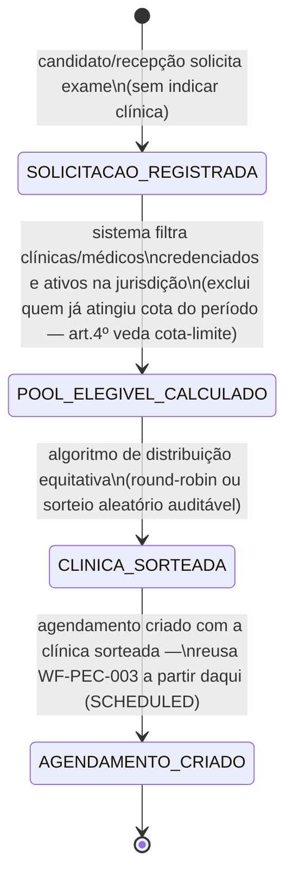
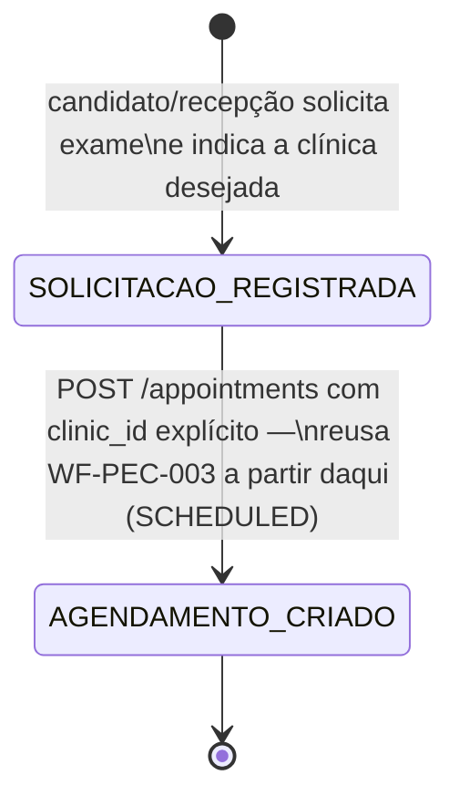

## Reconciliação com a rodada LEGAL paralela (mesma data)

[RN-PEC-113] chegou, por análise jurídica independente, à mesma tensão modelada abaixo — e foi
além: confirma que o conflito é **real, não apenas de leitura** ("a norma existe, o PEC agenda
por escolha, e o conflito é real"), qualifica a força normativa do art. 3º (resolução de
conselho profissional, vinculante em regime ético-disciplinar sobre o diretor médico do DETRAN e
os diretores técnico/clínico das clínicas — art. 5º), e propõe **quatro posições de
conformidade** mais granulares que o Regime A/B binário deste workflow:

| Posição (RN-PEC-113)                                                                           | Equivalente aproximado neste workflow                                                                                                                |
| ---------------------------------------------------------------------------------------------- | ---------------------------------------------------------------------------------------------------------------------------------------------------- |
| P1 — conformidade plena (sorteio puro, sem escolha)                                            | ≈ Regime A                                                                                                                                           |
| P2 — candidato escolhe região/data, sistema sorteia clínica/perito dentro do conjunto elegível | **não modelado como estado próprio abaixo** — é a "terceira via" que este workflow apenas menciona en passant; [RN-PEC-113] a recomenda tecnicamente |
| P3 — status quo com risco documentado                                                          | ≈ Regime B                                                                                                                                           |
| P4 — tese de superação tácita pela Res. 927/2022                                               | não modelado — [RN-PEC-113] a descarta como alto risco                                                                                               |

**Recomendação técnica de LEGAL é P2**, não P1 nem P3 — argumento adicional (não presente na
análise original deste workflow): a escolha livre de clínica é exatamente o vetor de "shopping
por laudo favorável" que a arquitetura antifraude do PEC (biometria de presença, assinatura
qualificada, imutabilidade) existe para combater — o objetivo antifraude do produto e a norma do
CFM apontam para o mesmo lado. Ver [RN-PEC-113] para a tabela completa de posições, a análise de
força normativa e as quatro incertezas não resolvidas (prática real do DETRAN-AM; fiscalização
pelo CRM-AM; se a norma alcança também a avaliação psicológica — a CFP 01/2019 não tem
dispositivo equivalente; impossibilidade de saneamento por consentimento do candidato). [RN-PEC-114]
acrescenta as vedações de local/forma (nunca em CFC, nunca em grupo, sem cota-limite) relevantes
ao algoritmo de pool do Regime A. [RN-PEC-115] detalha o ciclo de credenciamento (1 ano, renovável,
comprovação bienal) que alimenta esse mesmo pool.

## Por que este workflow existe

A rodada CRAWLER (`_intake/research-dossier.md`) localizou uma exigência normativa federal que
nenhum artefato PEC modelava: a Resolução CFM nº 1.636/2002, art. 3º, exige que **todos os
exames de aptidão física e mental sejam distribuídos de forma aleatória e impessoal pelo DETRAN
entre as entidades e médicos credenciados da jurisdição — nunca por escolha do periciado**. O
modelo de agendamento hoje implementado no PEC ([WF-PEC-003], `POST /appointments`) não impõe
esse mecanismo: a operação aceita `clinic_id` no payload, compatível com escolha livre de
clínica pela recepção ou pelo próprio candidato. Isso é um **potencial conflito de conformidade
real**, não apenas uma lacuna de modelagem — item de validação jurídica prioritária no dossiê
(`_intake/research-dossier.md` §5, item 2).

Este workflow não resolve a questão — modela **os dois regimes possíveis, lado a lado, com as
consequências de processo de cada um**, para que o Owner e LEGAL decidam com o desenho completo
à vista, não apenas o texto do artigo.

## Regime A — distribuição aleatória e impessoal (conforme CFM 1.636/2002 art. 3º)

### Transições e gatilhos — Regime A

| Transição               | Ator                                           | Base legal / nota                                                                                                                                                                                                                                                                                     |
| ----------------------- | ---------------------------------------------- | ----------------------------------------------------------------------------------------------------------------------------------------------------------------------------------------------------------------------------------------------------------------------------------------------------- |
| Solicitação registrada  | Candidato ou Recepção (sem selecionar clínica) | mudança de UX frente ao regime atual: a etapa de "escolher clínica" deixa de existir na jornada do candidato                                                                                                                                                                                          |
| Pool elegível calculado | Sistema                                        | filtra por jurisdição/área do órgão executivo (art. 3º, _caput_); exclui clínicas com credenciamento vencido/suspenso ([REF-CONTRAN-927-2022] arts. 16-24, ciclo de credenciamento — sem UC/WF dedicado hoje)                                                                                         |
| Clínica sorteada        | Sistema                                        | mecanismo concreto (round-robin vs. sorteio aleatório) — **decisão de produto em aberto**, análoga à decisão já tomada para o sorteio de relator em RAIT (`_meta/steering.md` A.3: "usar o round-robin já existente na plataforma de worklist") — pode ser reaproveitado o mesmo padrão de engenharia |
| Agendamento criado      | Sistema                                        | a partir daqui, segue [WF-PEC-003] normalmente (`SCHEDULED → CHECKED_IN → ...`)                                                                                                                                                                                                                       |

### Consequências de processo — Regime A

- **Conformidade**: atende literalmente o art. 3º e o parágrafo único ("nunca por escolha do
  periciado") — elimina o risco de conformidade identificado no dossiê.
- **Escopo técnico**: exige um algoritmo de distribuição cross-tenant — hoje o PEC é
  particionado por `tenant_id`/clínica, e o único ator com alcance cross-tenant é o Gestor
  DETRAN ([APP-PEC] §Atores). Um sorteio verdadeiramente imparcial precisa operar **acima** do
  tenant de qualquer clínica individual — implica um serviço/orquestrador novo, não uma extensão
  do módulo `appointments-scheduling` atual.
- **Equidade de volume**: o algoritmo precisa observar a vedação de cota-limite do art. 4º —
  não pode excluir uma clínica elegível apenas por volume acumulado no período, apenas
  distribuir de forma equitativa entre as disponíveis.
- **Acesso geográfico**: distribuição puramente aleatória pode designar uma clínica distante do
  domicílio do candidato — a norma não trata de peso geográfico; decisão de produto se o
  algoritmo deve restringir o pool a uma área/município antes de sortear (equilíbrio entre
  imparcialidade e acesso).
- **Auditoria**: o sorteio precisa ser reconstituível (qual pool existia, qual foi o resultado, quando)
  para responder a qualquer questionamento de parcialidade — requisito de trilha de auditoria
  novo, não coberto pelo `audit.events` genérico hoje documentado.

## Regime B — agendamento por escolha (como implementado hoje)

### Consequências de processo — Regime B

- **Conformidade**: mantém o risco identificado pelo dossiê frente ao art. 3º da CFM 1.636/2002
  — sem mudança de desenho, o PEC continua operando em um regime que a norma federal parece
  vedar explicitamente ("nunca por escolha do periciado").
- **Escopo técnico**: nenhuma mudança — é o comportamento já implementado em
  `domain/appointments-scheduling`.
- **Experiência do candidato**: preserva a escolha (proximidade, preferência, continuidade de
  atendimento) — ponto a favor do ponto de vista de acesso/conveniência, mesmo que em conflito
  com a norma.
- **Risco institucional**: exposição a auto de infração/questionamento do CFM ou de candidato
  que alegue favorecimento, caso a prática real do DETRAN-AM já opere por escolha livre — ver
  handoff de UX (`_intake/research-dossier.md` §7) sobre a mudança de tela que o Regime A
  exigiria.

## Decisão do Owner necessária

Este workflow, por si, não recomendava um regime — apresentava a alternativa legalmente
conforme (Regime A) e a alternativa hoje implementada (Regime B) para decisão explícita. A
reconciliação com [RN-PEC-113] acima muda isso: **existe agora uma recomendação técnica
formal, a posição P2** — candidato escolhe região/data, sistema sorteia clínica/perito dentro do
conjunto elegível. É a mesma "terceira via" que este workflow já apontava como tecnicamente
possível e não desenhada em estados próprios; permanece não desenhada em estados nesta revisão,
mas deixa de ser uma nota lateral e passa a ser a opção com maior peso técnico entre as
disponíveis. **Decisão do Owner ainda necessária** — mas agora com uma recomendação e uma análise
de força normativa completas em [RN-PEC-113], não apenas um trade-off A-vs-B.

## Prazos e timers (base legal por prazo)

Nenhum prazo numérico associado à distribuição em si. A vedação de "cota-limite por período de
tempo" (CFM 1.636/2002 art. 4º) é uma restrição de volume, não um timer — relevante ao algoritmo
do Regime A (não pode excluir uma clínica elegível por já ter atingido um teto de exames no
período).

## Atores por transição

| Transição                          | Ator                                             |
| ---------------------------------- | ------------------------------------------------ |
| Solicitar exame (ambos regimes)    | Candidato, Recepção                              |
| Calcular pool / sortear (Regime A) | Sistema (orquestrador cross-tenant, a construir) |
| Indicar clínica (Regime B)         | Candidato, Recepção                              |
| Decidir regime a adotar            | Owner, com validação de LEGAL                    |

## Decisões de modelagem pendentes

- **Qual regime adotar** — decisão do Owner, com validação jurídica formal do risco de
  conformidade do Regime B antes de decidir mantê-lo.
- Mecanismo concreto de sorteio (round-robin vs. aleatório puro) — se o Regime A for adotado.
- Peso geográfico no pool elegível — se o Regime A for adotado, decidir se hierarquiza por
  proximidade antes de sortear, ou sorteia sobre toda a jurisdição do DETRAN-AM.
- Como o ciclo de credenciamento (Res. 927/2022 arts. 16-24 — vigência de 1 ano, comprovação
  bienal) alimenta o pool elegível em tempo real — nenhum WF-PEC atual modela esse ciclo (ver
  nota em [REF-CONTRAN-927-2022]).
