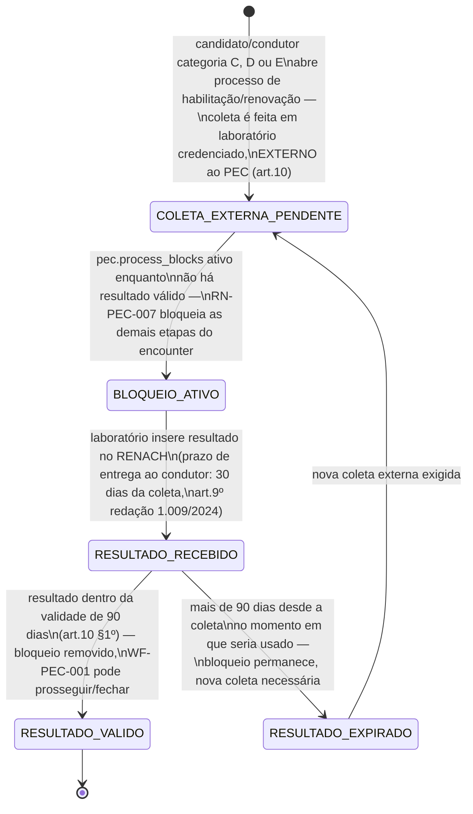
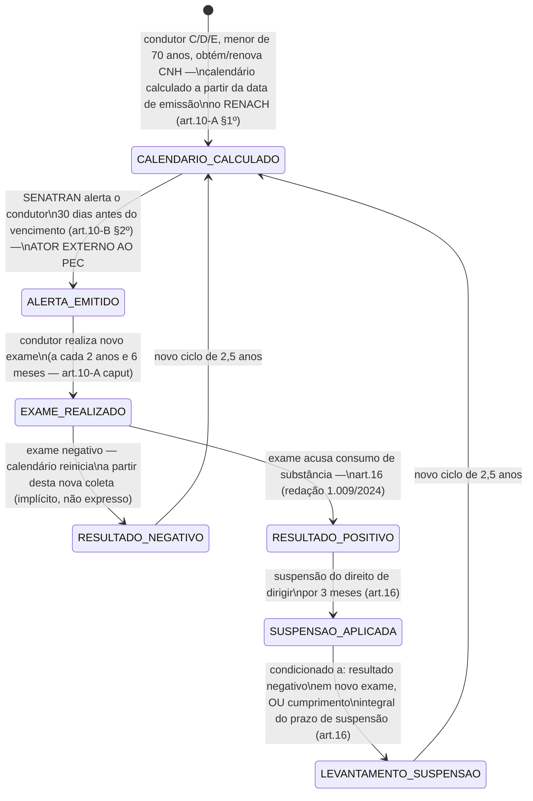

## Por que este workflow existe

O dossiê CRAWLER (`_intake/research-dossier.md`) corrigiu uma citação incorreta ([RN-PEC-007] e
[APP-PEC] apontavam a Res. CONTRAN 1.009/2024 como norma-base do exame toxicológico; a norma-base
é a **923/2022**, e a 1.009/2024 é apenas uma das três resoluções que ela altera) e revelou um
processo inteiro ausente de qualquer artefato PEC: um **exame toxicológico periódico
pós-habilitação** (art. 10-A, introduzido pela 1.009/2024), distinto do exame pré-etapa que
[RN-PEC-007] já modela como bloqueio de processo. Este workflow modela os dois processos como
duas submáquinas — o gate pré-etapa (detalhando o que [RN-PEC-007] já descreve em prosa) e o
ciclo periódico (inteiramente novo), seguindo o padrão de duas submáquinas já usado em
[WF-BOAT-003].

## Submáquina 1 — gate pré-etapa (candidatos/condutores C/D/E, antes da habilitação/renovação)

### Transições e gatilhos — submáquina 1

| Transição                               | Ator                                                     | Base legal                                                                                                                                                                               |
| --------------------------------------- | -------------------------------------------------------- | ---------------------------------------------------------------------------------------------------------------------------------------------------------------------------------------- |
| Abertura do processo aciona a exigência | Sistema (regra de categoria C/D/E)                       | art. 10, _caput_ — "deverá ser realizado em etapa anterior aos exames [do art. 147 do CTB]"                                                                                              |
| Coleta e laudo                          | Laboratório credenciado (**externo ao PEC e à clínica**) | art. 3º (cadeia de custódia forense); art. 9º (entrega ao condutor e inserção no RENACH em até 30 dias da coleta, redação dada pela Res. 1.009/2024 — originalmente 15 dias na 923/2022) |
| Verificação de validade                 | Sistema (`pec.process_blocks`)                           | art. 10 §1º — validade de 90 dias contados da coleta; §2º estende a mesma validade ao exame do art. 148-A §2º do CTB                                                                     |
| Bloqueio → desbloqueio                  | Sistema                                                  | RN-PEC-007 já modela o bloqueio; este workflow apenas detalha os estados internos ao "resultado pendente" que a regra trata como uma condição binária                                    |

**Nuance preservada de [WF-PEC-001]**: 90 dias é a validade do **resultado já emitido**, não um
prazo que o PEC controla para _obter_ o exame — a obtenção é inteiramente externa (laboratório
credenciado pelo órgão federal), o PEC só reflete o bloqueio.

**Base legal reforçada e princípio de minimização de dados ([RN-PEC-120], [RN-PEC-122]).**
[RN-PEC-120] identifica uma segunda base legal, além da Res. 923/2022 art. 10: o próprio CTB
art. 148-A. Mais importante para o desenho de dados: **CTB art. 148-A §6º impõe sigilo reforçado
sobre o resultado toxicológico** — _"o resultado do exame somente será divulgado para o
interessado e não poderá ser utilizado para fins estranhos"_ ao dispositivo. [RN-PEC-122]
extrai a consequência direta para este gate: **o PEC deve conhecer apenas o fato do resultado
(negativo/válido, com data de coleta), nunca o laudo laboratorial em si** — substâncias
detectadas, concentrações e metodologia não têm finalidade legal dentro do PEC. `pec.
process_blocks` deve armazenar um booleano de validade + data de coleta, não um espelho do laudo;
nem o dashboard regulatório nem o papel Auditor têm base legal para ver conteúdo toxicológico,
apenas o cumprimento do gate. **Item de verificação antes de implementar**: confirmar que a
integração RENACH→PEC não devolve o laudo detalhado — a mera recepção já seria tratamento de
dado que a lei reserva ao interessado.

## Submáquina 2 — exame toxicológico periódico pós-CNH (art. 10-A/10-B, achado novo)

### Transições e gatilhos — submáquina 2

| Transição                      | Ator                                                     | Base legal                                                                                                                                                                 |
| ------------------------------ | -------------------------------------------------------- | -------------------------------------------------------------------------------------------------------------------------------------------------------------------------- |
| Cálculo do calendário          | SENATRAN/RENACH (ator externo)                           | art. 10-A §1º — "com base na data da emissão da CNH registrada no RENACH"; §2º: segunda via não altera o calendário; §3º: dispensa se a CNH tem validade residual < 3 anos |
| Alerta de vencimento           | SENATRAN ("órgão máximo executivo de trânsito da União") | art. 10-B §§1º-2º — alerta com 30 dias de antecedência; disponibiliza última coleta, orientações e data de vencimento                                                      |
| Realização do exame            | Condutor + laboratório credenciado                       | art. 10-A, _caput_ — a cada 2 anos e 6 meses, para <70 anos                                                                                                                |
| Resultado positivo → suspensão | Órgão executivo de trânsito                              | art. 16 (redação 1.009/2024) — suspensão de 3 meses                                                                                                                        |
| Levantamento da suspensão      | Condutor (novo exame negativo) ou decurso do prazo       | art. 16                                                                                                                                                                    |

## Pergunta de escopo de produto — o PEC participa da submáquina 2?

**Não resolvido nesta rodada — recomendação explícita de investigação de produto**
(`_intake/research-dossier.md` §6). O alerta de vencimento é emitido diretamente pela SENATRAN ao
condutor (art. 10-B §1º), e a norma não menciona o órgão executivo estadual como intermediário
nesse fluxo específico — é plausível que o ciclo periódico seja **100% externo ao PEC**
(SENATRAN ↔ condutor ↔ laboratório, sem passar pela clínica credenciada nem pelo DETRAN-AM como
sistema). Também é plausível que o resultado (positivo/negativo) chegue ao DETRAN-AM via RENACH e
precise ser processado por algum sistema estadual — se esse sistema for o PEC, é um fluxo de
negócio inteiro ausente de todo UC-PEC existente (nenhum encounter, nenhum papel do PEC hoje
recebe ou processa esse evento). **Decisão do Owner necessária**: (a) tratar como inteiramente
fora do escopo do PEC, apenas documentado aqui por completude legal; ou (b) abrir investigação de
integração para confirmar se o RENACH publica esse evento a sistemas estaduais e, se sim,
desenhar o UC de recepção (ver [UC-PEC-012], nova, com status `stub` até esta decisão).

## Prazos e timers (base legal por prazo)

| Timer                                               | Prazo                                                                      | Gatilho                               | Consequência                                                                            | Base                            |
| --------------------------------------------------- | -------------------------------------------------------------------------- | ------------------------------------- | --------------------------------------------------------------------------------------- | ------------------------------- |
| Validade do resultado (ambas submáquinas)           | 90 dias, da coleta                                                         | resultado emitido                     | fora da janela, deixa de valer como pré-condição/comprovação                            | art. 10 §1º; art. 10-B, _caput_ |
| Prazo de entrega do laudo ao condutor               | 30 dias, da coleta (redação 1.009/2024; originalmente 15 dias na 923/2022) | coleta da amostra                     | atraso do laboratório — sem consequência numérica descrita para o PEC                   | art. 9º                         |
| Retenção de dados/material biológico no laboratório | 5 anos                                                                     | emissão do resultado                  | fora do escopo de retenção do PEC — ator é o laboratório, não a clínica nem o DETRAN-AM | art. 9º §§1º-2º                 |
| Periodicidade do exame pós-CNH                      | 2 anos e 6 meses                                                           | emissão/renovação da CNH (<70 anos)   | condutor sujeito a alerta e, se não realizado/positivo, a suspensão                     | art. 10-A                       |
| Antecedência do alerta de vencimento                | 30 dias antes do vencimento                                                | cálculo do calendário                 | —                                                                                       | art. 10-B §2º                   |
| Suspensão por resultado positivo (periódico)        | 3 meses                                                                    | resultado positivo no exame periódico | suspensão do direito de dirigir, levantável por novo exame negativo ou decurso do prazo | art. 16                         |

## Atores por transição

| Ator                                    | Papel                                                                                                |
| --------------------------------------- | ---------------------------------------------------------------------------------------------------- |
| Candidato/condutor                      | realiza a coleta (ambas submáquinas); sujeito a suspensão (submáquina 2)                             |
| Laboratório credenciado (externo)       | coleta, cadeia de custódia, emissão do laudo, inserção no RENACH                                     |
| SENATRAN/RENACH (externo)               | cálculo de calendário e emissão de alerta (submáquina 2 apenas)                                      |
| Sistema PEC (`pec.process_blocks`)      | reflete o bloqueio da submáquina 1 sobre o encounter — nenhum papel ativo descoberto na submáquina 2 |
| Órgão executivo de trânsito (DETRAN-AM) | aplica a suspensão em caso de resultado positivo periódico — papel do PEC nesta etapa não confirmado |

## Decisões de modelagem pendentes

- **Escopo do PEC na submáquina 2** — decisão do Owner, ver seção dedicada acima.
- Se a submáquina 2 entrar em escopo, falta desenhar: quem no PEC recebe o evento de alerta/
  resultado, se abre um encounter novo ou um objeto de domínio distinto (o exame periódico não é
  um "atendimento clínico" no sentido usado por [WF-PEC-001] — é um exame laboratorial avulso).
- O timer "prazo de entrega do laudo" (30 dias) e a retenção de 5 anos no laboratório não geram
  nenhuma obrigação direta ao PEC hoje identificada — mantidos aqui só por completude da cadeia
  normativa; revisitar se o PEC vier a integrar diretamente com o laboratório.
