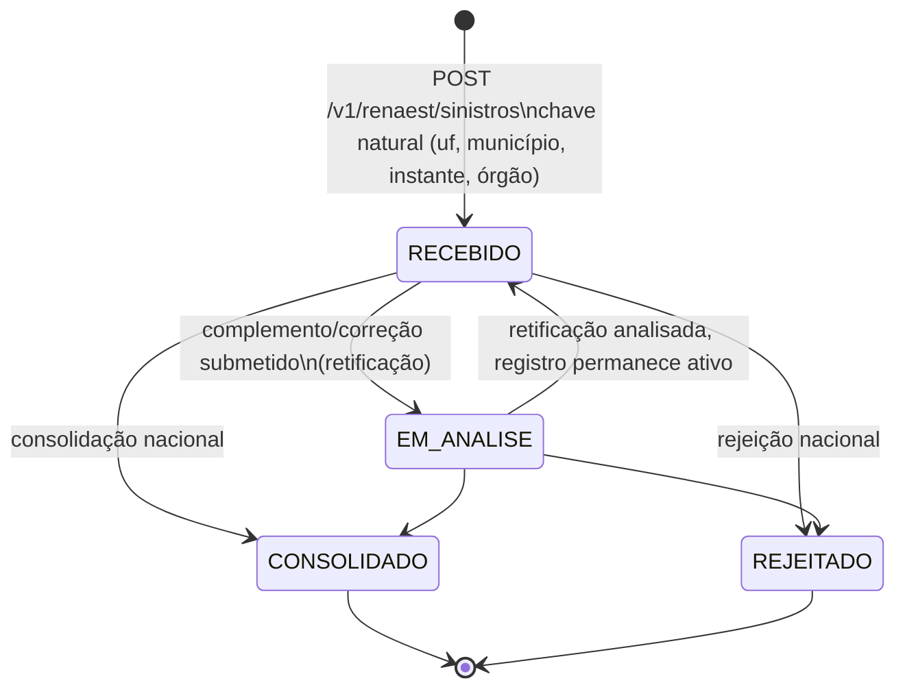

## Missão

Registrar sinistros de trânsito e lesões relacionadas — capturados em campo pelo agente de
trânsito do TEAT e, em ondas futuras, por parceiros **facultativos** (saúde, SAMU, corpos de
bombeiros, polícias civis, DPVAT) — alimentando o registro estadual e a base nacional **RENAEST**
(Registro Nacional de Sinistros e Estatísticas de Trânsito, nomenclatura vigente pós-Lei
14.599/2023; a Res. CONTRAN 808/2020 que a regulamenta ainda nomeia "Registro Nacional de
**Acidentes**" — dissonância terminológica documentada, sem ato de atualização localizado, ver
[REF-CONTRAN-808-2020] §Anotação de risco). No estado atual do corpus-fonte (repositório `teat`),
BOAT existe como o módulo `CrashRecords` do TEAT (`namespace: crash`), não como aplicativo
separado ainda implementado — este app charter descreve o que esse corpus estabelece como base
para o domínio.

## Atores

- **field-agent** (agente de trânsito) — inicia o atendimento, captura veículos, pessoas,
  vítimas, croqui e evidências do sinistro em campo.
- **field-supervisor** (supervisor de campo) — revisa registros incompletos/excepcionais,
  encerra o registro (junto com traffic-authority).
- **processing-operator** (operador de processamento) — valida/complementa o registro após a
  captura de campo; concilia e incorpora submissões de parceiro facultativo ([WF-BOAT-002]).
- **traffic-authority** (autoridade de trânsito) — valida e encerra o registro legal; formaliza
  credenciamento de parceiro; mapeamento provisório para "Coordenador de RENAEST" no nível
  estadual ([WF-BOAT-003] — Res. CONTRAN 808/2020 art. 7º).
- **auditor** — consulta somente leitura.
- **parceiro facultativo** (saúde estadual/municipal, SAMU, corpo de bombeiros, polícia civil) —
  ator **externo** ao sistema BOAT, com base legal explícita de existência (Res. CONTRAN 808/2020
  art. 6º §1º) mas **sem RBAC de sistema definido pela norma** — a integração, quando exercida
  pelo parceiro, ocorre através do próprio DETRAN-AM (art. 6º §5º), não por acesso direto do
  parceiro ao BOAT. Ver §Modelo operacional — nível de parceiro, [WF-BOAT-002].
- **Vítimas/envolvidos** — sujeitos de dados pessoais/sensíveis coletados (não atores do
  sistema; dados protegidos por controle de acesso reforçado — ver [RN-BOAT-003]).

Fonte: `auth.rbac` de `BP-CRASH-RECORDS-001.json` — mesmos 5 papéis do núcleo TEAT AIT
(field-agent, field-supervisor, processing-operator, traffic-authority, auditor). O ator
"parceiro facultativo" tem agora base legal explícita de existência ([REF-CONTRAN-808-2020] art.
6º), mas a norma não cria nem exige RBAC de sistema próprio — decisão de produto sobre modelar um
perfil dedicado permanece com o Owner (ver `_intake/proposals.md`, `_intake/bpo-notes.md`).

## Escopo (dentro / fora)

**Dentro:** coleta estruturada do sinistro (classificação, local, condições de via/clima/
iluminação/sinalização, dinâmica), veículos envolvidos, pessoas envolvidas (condutores,
passageiros, pedestres, ciclistas), vítimas (gravidade, óbito, atendimento médico), croqui
(sketch), evidências vinculadas, associação a AITs e medidas administrativas relacionadas,
complemento/correção de registro, transmissão à base nacional RENAEST.

**Fora:** apuração de responsabilidade civil/criminal pelo sinistro (CTB arts. 301, 304, 305 —
tipos penais autônomos que podem derivar do mesmo fato de omissão de socorro dos arts. 176/177,
mas cuja persecução é de competência de outro sistema, não do BOAT); cálculo/pagamento de seguro
(inclui o DPVAT, mesmo quando sua administradora integra o RENAEST como parceiro facultativo —
[REF-CONTRAN-808-2020] art. 6º §1º, V — a integração é de **dado de registro**, não de
processamento de sinistro de seguro); perícia criminal; julgamento de eventual defesa/recurso
associado a AIT vinculado (rait). **Trilho estatístico-epidemiológico de saúde** (SIM/DATASUS,
usado pelo Pnatrans para o índice de mortalidade do CTB art. 326-A, e o sistema VIVA/SINAN de
notificação de violências/acidentes do Ministério da Saúde) é **sistema de saúde separado**, sem
integração normativa direta confirmada com o RENAEST nesta rodada — BOAT alimenta o RENAEST via
registro individual de sinistro (trilho registral), não o SIM/VIVA diretamente.

## Ciclo de vida — visão geral

`draft → in_attendance → recorded → validated → closed → archived`, com estados de exceção
`pending_complement`, `cancelled`, `integrated`. Ver detalhamento completo, transições e
transmissão à RENAEST em [WF-BOAT-001].

## Modelo de dados — conceitos centrais

- **CrashRecord** (`crash_record`): sinistro em si — tipo, data/hora, local (`location_json`,
  pendente upgrade PostGIS), condições de via/clima/iluminação/sinalização, dinâmica,
  `current_status`.
- **CrashVehicle** (`crash_vehicle`): veículo envolvido, papel no sinistro, dano aparente.
  Campo único `evaded` (booleano) **substituído** nesta rodada pela captura estruturada das três
  condutas de cena do CTB (arts. 176-178: socorro/preservação/remoção em sinistro com vítima;
  recusa de socorro mediante solicitação da autoridade; remoção por fluidez em sinistro sem
  vítima) — refinamento de produto mais consequente da rodada BPO, ver [UC-BOAT-007] e
  `_intake/bpo-notes.md`.
- **CrashPerson** (`crash_person`): pessoa envolvida (condutor, passageiro, pedestre, ciclista),
  vínculo opcional a um `CrashVehicle`.
- **CrashVictim** (`crash_victim`): dado de vítima — **`severity`** (gravidade, campo
  obrigatório), `death_at_scene`, `medical_care`, `hospital_destination` (PII alta,
  retenção "forever"), `death_at`, `health_notes` (PII alta, retenção "forever"). Ver
  [RN-BOAT-001], [RN-BOAT-003].
- **CrashSketch** (`crash_sketch`): croqui — pode referenciar evidência TEAT ou armazenar
  `drawing_json` estruturado.

## RENAEST — integração com a base nacional

TEAT (e BOAT como seu módulo de sinistro) integra a base nacional RENAEST através de adaptador
auditado ([INV-INTEGRATION-001]); o TEAT **não** implementa localmente a máquina de estados
RENAEST — ela é definida e mantida no mock de desenvolvimento sibling `senatran`
(`teat:docs/adopters/integrations/adapters/renaest.md`: "Do not add TEAT-local RENAEST fake
payloads, protocols or state machines"). A máquina de estados do registro nacional
(fonte: senatran-mock contracts) é:

`CONSOLIDADO` e `REJEITADO` são estados **terminais**: não aceitam novo complemento/correção
(erro `RENAEST.CRASH.CORRECTION_NOT_ALLOWED`, fonte: senatran-mock contracts,
`senatran:domain/renaest/api/src/renaest.service.ts`). Gravidade (`gravidade`) usa o enum
`SEM_VITIMA | COM_VITIMA_FERIDA | COM_VITIMA_FATAL` (fonte: senatran-mock contracts,
`senatran:docs/framework/contracts/openapi-transactional.yaml`) — ver gate de dados de vítima em
[RN-BOAT-002].

## Âncoras legais

**Base tríplice confirmada (rodada CRAWLER/BPO 2026-08-24)** — gap mais citado de todo o corpus
BOAT, agora fechado:

- **CTB, base legal máxima**: art. 19, XI (competência da SENATRAN para o "modelo padrão de
  coleta") e XXXII (organizar e manter o RENAEST); art. 22, IX (competência **direta e
  específica** do DETRAN-AM de coletar dados de sinistro); art. 24, IV (paralelo municipal);
  art. 326-A (elo histórico com o Pnatrans). Todos com redação/inclusão pela **Lei 14.599/2023**
  — ver [REF-CTB-sinistro-cena-renaest].
- **Origem histórica**: Lei 13.614/2018 (Pnatrans), que criou o art. 326-A e, na redação
  original, um prazo fixo de consolidação (1º de março) hoje suprimido do texto legal e delegado
  a "regulamentação do Contran" — ver [WF-BOAT-001] §Prazos para a explicação completa do gap
  residual de prazo por-registro.
- **Regulamentação infralegal vigente**: **Resolução CONTRAN 808/2020** ([REF-CONTRAN-808-2020])
  — institui o RENAEST, o BAT (Boletim de Ocorrência de Acidente de Trânsito), a validação em
  três níveis (municipal/estadual/federal), a integração obrigatória do SNT e a integração
  **facultativa** de parceiros de saúde/emergência/seguro (art. 6º), e o prazo de integração
  institucional (4 de janeiro de 2022, já vencido).
- **Governança de acesso/LGPD**: Portaria SENATRAN 139/2025 ([REF-SENATRAN-PORTARIA-139-2025])
  — SENATRAN como controladora LGPD do RENAEST; princípio de minimização reforçada para dado
  sensível (art. 18) — ver [RN-BOAT-003].

**Anotação de risco herdada**: a Res. 808/2020 usa terminologia "acidente" (anterior à
renomeação de 2023 no CTB para "sinistro"); nenhuma resolução de atualização terminológica
posterior foi localizada — correspondência de altíssima probabilidade, não formalmente amarrada
em um único instrumento. Ver `_intake/research-dossier.md` §1 e handoff LEGAL.

**Gap residual, confirmado como lacuna normativa real (não de pesquisa)**: prazo de transmissão
por sinistro individual (ver [WF-BOAT-001] §Prazos, SLA operacional proposto); mecanismo de
correção de registro nacional já `CONSOLIDADO`/`REJEITADO` (ver [WF-BOAT-003] §Gap); conteúdo dos
dois Manuais RENAEST e do "normativo específico" de campos mínimos do BAT (existência confirmada
em três normas — 2020/2022/2025 —, conteúdo não público).

## Interfaces com outros apps/domínios

Sinistro pode referenciar AIT(s) e medida(s) administrativa(s) lavrados no mesmo atendimento
(`crash_record_id` sem FK rígida até estabilização da integração — nota de
`teat:docs/framework/product/workflows/crash-records.md`). Evidências e croqui usam o mesmo
módulo de custódia do TEAT ([APP-TEAT] evidência). Consolidação nacional alimenta estatística
RENAEST (fora do escopo direto do agente de campo).

## Modelo operacional (rodada BPO 2026-08-24)

Três camadas concêntricas de operação, cada uma com base normativa/operacional distinta:

1. **Campo** (field-agent/field-supervisor) — atendimento presencial ao sinistro, captura
   estruturada de veículos/pessoas/vítimas/condutas de cena ([UC-BOAT-001] a [UC-BOAT-007]),
   evidências e bodycam ([UC-BOAT-010]). Encerra em `closed` ([WF-BOAT-001]).
2. **Retaguarda estadual DETRAN-AM** (processing-operator/traffic-authority como Coordenador de
   RENAEST) — validação municipal/estadual, retificação, envio à União ([WF-BOAT-003]); ponto de
   conciliação de dados vindos de parceiro facultativo ([WF-BOAT-002]).
3. **Nível nacional** (SENATRAN, fora do sistema BOAT) — homologação federal, consolidação
   estatística ([WF-BOAT-001] submáquina nacional).

Nenhuma camada é pulada por norma, salvo a exceção explícita de município não integrado ao SNT
(art. 5º §2º, pula direto à validação estadual).

## Nível de parceiro (partner tier)

A Res. CONTRAN 808/2020 art. 6º confirma, com base legal, um **nível de parceiro facultativo**
distinto do fluxo obrigatório de campo — mas não o RBAC próprio:

| Categoria                                                                            | Via de integração                                                           | Obrigatoriedade                                                                                    |
| ------------------------------------------------------------------------------------ | --------------------------------------------------------------------------- | -------------------------------------------------------------------------------------------------- |
| Ministério da Saúde; administradora do Seguro DPVAT                                  | direta à União (art. 6º §3º)                                                | facultativa — fora do escopo operacional do DETRAN-AM                                              |
| Secretarias de saúde estaduais/municipais; SAMU; corpos de bombeiros; polícias civis | através do DETRAN-AM (art. 6º §5º)                                          | facultativa — único nível de parceiro com papel operacional direto do DETRAN-AM; ver [WF-BOAT-002] |
| Órgãos do SNT (municípios, PRF, DNIT, ANTT)                                          | através do DETRAN-AM ou direto à União, conforme o caso (art. 6º §§2º e 4º) | **obrigatória** — não é "parceiro", é integrante do SNT                                            |

O nível de parceiro **nunca é caminho obrigatório** de um sinistro individual — é fonte adicional
opcional, condicionada a adesão institucional externa. Priorização desta camada é decisão do
Owner, não apenas trabalho de engenharia (ver `_intake/bpo-notes.md`).

**Decisão do Owner (2026-08-24, steering.md F.31):** manter o nível de parceiro facultativo como
**visão de produto futura** — permanece na missão/escopo do domínio, sem remoção da narrativa,
mas **sem alocação de capacidade de engenharia no curto prazo**; ativação segue condicionada à
adesão institucional externa (Secretaria de Saúde/SAMU/bombeiros/polícia civil), como já descrito
acima.

## KPIs operacionais propostos

Nenhum destes KPIs tem base normativa — são propostas do BPO para dar ao produto alvos
mensuráveis onde a norma é silente (mesmo padrão de "SLA operacional proposto" de
[WF-BOAT-001] §Prazos). Rotulados **PROPOSTA**, não meta contratual:

| KPI                                                          | O que mede                                                                                           | Por quê                                                                                        |
| ------------------------------------------------------------ | ---------------------------------------------------------------------------------------------------- | ---------------------------------------------------------------------------------------------- |
| Tempo cena→registro                                          | intervalo entre `occurred_at` e `RASCUNHO`/`in_attendance` iniciado                                  | qualidade e tempestividade da captura de campo                                                 |
| % registros com vítima completos                             | `CrashVictim` com todos os campos mínimos antes do encerramento                                      | previne rejeição nacional por dados incompletos ([RN-BOAT-002])                                |
| % validados em 1º nível (municipal/estadual) sem retificação | registros que passam [WF-BOAT-003] sem pedido de correção                                            | proxy de qualidade de captura de campo                                                         |
| Pendências RENAEST em aberto                                 | registros em `EM_ANALISE`/retificação além do SLA proposto `T-BOAT-TRANSM`                           | acompanhamento operacional ([UC-BOAT-011]) — sem consequência normativa, apenas gestão interna |
| Compliance de bodycam em atendimento a sinistro              | % de `CrashRecord` com trecho de gravação vinculado, quando aplicável (Portaria 003/2026 art. 4º, I) | achado boat-adjacente da rodada TEAT, agora explícito no domínio de sinistro ([UC-BOAT-010])   |

## Capacidade — pedidos ao Owner

1. **Priorização do refinamento `evaded` → condutas estruturadas 176-178** ([UC-BOAT-007]) —
   maior impacto de schema/UI desta rodada; recomenda-se tratar como item de sprint dedicado, não
   como ajuste incidental.
2. **Decisão sobre onda de parceiro facultativo** ([WF-BOAT-002]) — depende de adesão
   institucional externa (Secretaria de Saúde/SAMU/bombeiros/polícia civil optando por integrar);
   sem essa adesão, o trabalho de engenharia fica ocioso. Recomenda-se confirmar apetite
   institucional antes de alocar capacidade de produto.
   **Decisão do Owner (2026-08-24, steering.md F.31):** mantida como visão futura — sem
   priorização de capacidade agora; aguardar sinal de adesão institucional externa antes de
   alocar engenharia.
3. **Solicitação institucional dos Manuais RENAEST** (Manual do Sistema RENAEST; Manual de Gestão
   de Estatísticas de Acidente de Trânsito; normativo específico de campos mínimos do BAT) via
   canal DETRAN-AM↔SENATRAN — pré-requisito para fechar o mapeamento campo-a-campo
   `CrashRecord`/`CrashVehicle`/`CrashPerson`/`CrashVictim` ↔ payload RENAEST. Não é tarefa de
   pesquisa pública adicional (já tentada e esgotada nesta rodada).
4. **Ação sobre [RN-BOAT-122]** (publicada pela rodada LEGAL paralela ainda durante esta sessão):
   confirma que a LGPD incide **integralmente** sobre dado de vítima do BOAT — a exclusão de
   segurança pública do art. 4º, III da LGPD **não alcança** o registro de sinistro (finalidade
   registral-administrativa/estatística, não persecutória). A marcação de PII alta hoje restrita a
   `hospital_destination`/`health_notes` ([RN-BOAT-003]) **deveria se estender** a `severity`,
   `medical_care`, `death_at_scene` e `death_at` — todos dado referente à saúde. Pré-requisito de
   produto antes de qualquer expansão do uso desses campos (ex. exposição a parceiro de saúde em
   [UC-BOAT-008]); ver também as regras encadeadas por [RN-BOAT-122] (hipótese legal de
   tratamento, minimização, término/eliminação, direitos do titular) para o desenho completo.

## Residual aberto após a rodada de endurecimento (2026-08-26)

**As 36 regras deste app seguem em `draft`.** Como no TEAT e diferente do RAIT, a lista de
validação jurídica do BOAT não foi respondida pelo Owner — e aqui a assimetria pesa mais, porque
o núcleo aberto é justamente a base do tratamento de **dado sensível de saúde**. Casos de uso
`approved` carregam comportamento acordado; a regra legal sob eles ainda depende de parecer.

**Nenhum dos itens abaixo é de pesquisa** — a pesquisa foi feita e a lacuna é da norma ou da
decisão institucional.

| Item                                                            | Onde                              | Consequência de não decidir                                                                                                                                                                                  |
| --------------------------------------------------------------- | --------------------------------- | ------------------------------------------------------------------------------------------------------------------------------------------------------------------------------------------------------------ |
| **Hipótese legal do dado de saúde da vítima, e sua publicação** | [RN-BOAT-123], [UC-BOAT-003]      | item nº1 do advogado; hoje o dever de publicidade está descumprido (DT-047) — **fechado em 2026-09-13 (steering H.44)**: hipóteses art. 11, II, a/b e art. 13 a publicar via inventário da PN 002/2026       |
| **Prazos de retenção** — BAT identificado e bodycam             | [RN-BOAT-125], [UC-BOAT-003]      | `retention: forever` é violação de LGPD e **não deve ir a produção** (DT-049) — **fechado em 2026-09-13 (H.45)**: 5 anos BAT e saúde (anonimização ao fim); bodycam pendente na CSAD                         |
| **Papel LGPD do DETRAN-AM** — controlador do registro estadual? | [RN-BOAT-127], [UC-BOAT-008]      | divergência interna da Portaria 139/2025 art.7º §3º (DT-048)                                                                                                                                                 |
| **Periodicidade de transmissão ao RENAEST**                     | [RN-BOAT-106], [UC-BOAT-011]      | prazo legal suprimido em 2023 e regulamentação nunca editada; SLA mensal é proposta (DT-017)                                                                                                                 |
| **Correção de registro nacional terminal**                      | [WF-BOAT-003] §Gap, [UC-BOAT-011] | vazio normativo; hoje só resta novo registro formal (DT-020)                                                                                                                                                 |
| **Derivação severity(vítima) ↔ gravidade(sinistro)**            | [UC-BOAT-003]                     | sem fonte normativa; regra própria a documentar (DT-018)                                                                                                                                                     |
| **Veículo removido com proprietário hospitalizado**             | [UC-BOAT-006]                     | prazo de 60d do art.328 sem suspensão prevista (DT-019)                                                                                                                                                      |
| **Manuais RENAEST e campos mínimos do BAT**                     | mapeamento campo-a-campo          | conteúdo não público; exige ofício DETRAN-AM→SENATRAN (DT-061)                                                                                                                                               |
| **Limiar de célula para publicação agregada**                   | [RN-DASH-161], [UC-BOAT-011]      | risco ALTO de reidentificação em municípios pequenos; parecer antes da 1ª publicação (DT-029) — **respondido (DT-029, 2026-08-28)**: supressão abaixo de 10, com supressão secundária; parecer valida depois |

**Gap de superfície identificado nesta rodada:** o dever de responder ao titular
([RN-BOAT-126] — acesso, correção, eliminação) não tinha caso de uso nem tela. A tela W-05 de
[IU-BOAT-001] o registra, mas **nenhum UC o cobre** — candidato natural a UC-BOAT-013, a decidir
junto com a fronteira BOAT × PORTAL para consulta do BAT pelo cidadão.
