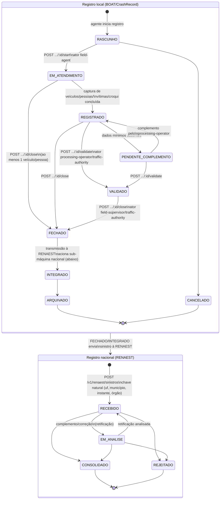

## Revisão (2026-08-24, BPO)

Esta revisão incorpora o achado central da rodada de pesquisa CRAWLER ([REF-CONTRAN-808-2020],
[REF-CTB-sinistro-cena-renaest]) sobre `_intake/research-dossier.md`, que fecha o gap mais citado
de todo o corpus BOAT (base normativa do RENAEST) e reduz três outras decisões antes marcadas
"fonte pendente":

1. **A submáquina nacional (RECEBIDO→EM_ANALISE→CONSOLIDADO\|REJEITADO) ganha base normativa
   explícita** — art. 5º da Res. CONTRAN 808/2020 ("serão homologados e, então, consolidados") —
   e sua fase de homologação é, na prática, uma cascata de validação em **três níveis**
   (municipal→estadual→federal, art. 5º §1º). Essa cascata é detalhada como sub-workflow dedicado
   em **[WF-BOAT-003]**, não remodelada aqui — este diagrama mantém a visão de alto nível
   (RECEBIDO/EM_ANALISE/CONSOLIDADO/REJEITADO) como o contrato técnico `senatran`-mock já a expõe.
2. **Intake de parceiro facultativo** (saúde/SAMU/bombeiros/polícias civis/DPVAT — art. 6º) é
   modelado como fluxo próprio em **[WF-BOAT-002]**, que entra na máquina local em um ponto de
   conciliação por chave natural, não como um caminho alternativo dentro deste diagrama.
3. **`evaded` (booleano único em `CrashVehicle`) é substituído pela captura estruturada das três
   condutas de cena dos arts. 176-178 do CTB** — sinistro com vítima (art. 176: socorro,
   prevenção, preservação, remoção quando determinada, identificação), recusa de socorro mediante
   solicitação da autoridade (art. 177, hipótese autônoma), e sinistro sem vítima com dever apenas
   de remoção por fluidez (art. 178). Ver [UC-BOAT-007] — os três regimes formalizados pela rodada
   LEGAL paralela como [RN-BOAT-114] (art. 176), [RN-BOAT-115] (art. 177) e [RN-BOAT-116]
   (art. 178); a própria insuficiência do booleano `evaded` é formalizada em [RN-BOAT-117].
   Nenhum estado desta máquina muda; o campo estruturado substitui apenas o atributo `evaded` no
   payload de `CrashVehicle`.
4. **Prazo de transmissão por sinistro**: confirmado como lacuna normativa real, não de pesquisa
   (ver §Prazos abaixo) — modelado com SLA operacional proposto, explicitamente rotulado
   `PROPOSTA-PENDENTE-DE-NORMA`.

Nenhum estado ou transição pré-existente foi removido.

## Estados

Dois níveis compõem o ciclo: o **registro local TEAT/BOAT** (captura de campo até fechamento
administrativo) e o **registro nacional RENAEST** (consolidação estatística, mantido pelo mock
`senatran` — fonte: senatran-mock contracts).

## Transições e gatilhos

| Transição (local)                   | Comando/rota                                                                                         | Ator                                   | Efeito                                                                                                                          |
| ----------------------------------- | ---------------------------------------------------------------------------------------------------- | -------------------------------------- | ------------------------------------------------------------------------------------------------------------------------------- |
| Iniciar atendimento                 | `POST .../:id/start` (de `draft`)                                                                    | field-agent                            | move a `in_attendance`                                                                                                          |
| Adicionar veículo/pessoa/vítima     | comandos de captura (de `draft`,`in_attendance`,`pending_complement`)                                | field-agent                            | popula `CrashVehicle`/`CrashPerson`/`CrashVictim`                                                                               |
| Registrar conduta de cena (176-178) | comando de captura estruturada, substitui `evaded` (de `draft`,`in_attendance`,`pending_complement`) | field-agent                            | popula o regime de dever observado por veículo/condutor — ver [UC-BOAT-007], [RN-BOAT-114] (art. 176), [RN-BOAT-115] (art. 177) |
| Anexar croqui                       | comando de anexação (de `draft`,`in_attendance`,`pending_complement`,`recorded`)                     | field-agent, processing-operator       | `CrashSketch` vinculado; pode referenciar evidência TEAT                                                                        |
| Validar registro                    | `POST .../:id/validate` (de `recorded`,`pending_complement`)                                         | processing-operator, traffic-authority | checa dados mínimos de veículo/pessoa; move a `validated`                                                                       |
| Encerrar registro                   | `POST .../:id/close` (de `in_attendance`,`recorded`,`validated`)                                     | field-supervisor, traffic-authority    | registra dinâmica final; move a `closed`; exige ao menos 1 veículo ou pessoa envolvida                                          |

| Transição (nacional RENAEST) | Regra                                                                                                                                       | Efeito                                                                          |
| ---------------------------- | ------------------------------------------------------------------------------------------------------------------------------------------- | ------------------------------------------------------------------------------- |
| Submissão inicial            | chave natural `(uf, codigoMunicipio, dataHoraSinistro, orgaoResponsavel)`; reenvio sem `Idempotency-Key` → `RENAEST.CRASH.DUPLICATED` (402) | cria registro em `RECEBIDO`                                                     |
| Complemento/correção         | `POST .../{idSinistro}/complementos` ou `.../correcoes`                                                                                     | cria retificação em `EM_ANALISE`; registro original permanece ativo até decisão |
| Correção sobre terminal      | tentativa de complementar/corrigir `CONSOLIDADO`/`REJEITADO`                                                                                | bloqueada — `RENAEST.CRASH.CORRECTION_NOT_ALLOWED` (402)                        |
| Layout inválido              | `versaoLeiaute` não suportada                                                                                                               | `RENAEST.CRASH.INVALID_LAYOUT` (400)                                            |
| Dados incompletos            | `local` ausente, ou `gravidade` em `COM_VITIMA_FERIDA`/`COM_VITIMA_FATAL` sem `vitimas`                                                     | `RENAEST.CRASH.INCOMPLETE_DATA` (402) — ver [RN-BOAT-002]                       |

Fonte das transições nacionais: senatran-mock contracts
(`senatran:domain/renaest/api/src/renaest.service.ts`,
`senatran:docs/framework/contracts/openapi-transactional.yaml`).

## Prazos e timers (base legal por prazo)

| Timer                                               | Prazo                                       | Gatilho                                                                            | Consequência                                                                                   | Base                                                                                                                                                 |
| --------------------------------------------------- | ------------------------------------------- | ---------------------------------------------------------------------------------- | ---------------------------------------------------------------------------------------------- | ---------------------------------------------------------------------------------------------------------------------------------------------------- |
| Integração institucional ao RENAEST                 | até 4 de janeiro de 2022 (marco já vencido) | vigência da Res. 808/2020                                                          | órgão do SNT deveria estar integrado ao sistema nacional                                       | [REF-CONTRAN-808-2020] art. 16 — único prazo legal encontrado na cadeia RENAEST; é prazo de **integração do órgão**, não de transmissão por sinistro |
| T-BOAT-TRANSM (parâmetro do órgão, não prazo legal) | periodicidade **mensal** (proposta)         | `CrashRecord` move a `closed` (encerramento local); ciclo de consolidação estadual | transmissão/consolidação à RENAEST — sem consequência jurídica identificável em caso de atraso | [RN-BOAT-106] — posição prudencial, rotulada como interpretação, não como norma                                                                      |

**Por que não há prazo legal por sinistro.** O CTB art. 326-A §9º, na redação original de 2018
([REF-LEI-13614-2018]), fixava prazo explícito ("até 1º de março") para consolidação/repasse
estadual à base nacional. A Lei 14.599/2023 **substituiu esse prazo por uma remissão genérica**
("conforme regulamentação do Contran") — remissão que, até onde localizado nesta rodada, **não
foi cumprida** por nenhum ato CONTRAN posterior à reforma. A Res. 808/2020 (que já regulamenta o
RENAEST) só fixa o prazo de integração institucional acima (art. 16), não um prazo de transmissão
por registro. **[RN-BOAT-106]**, produzida em paralelo pela rodada LEGAL, fecha esse gap com mais
precisão do que a primeira proposta desta revisão (um SLA arbitrário de dias úteis, descartado):
na ausência de prazo próprio, adota **periodicidade mensal** como parâmetro de trabalho — leitura
sustentada pela combinação do art. 19 §3º do CTB (fornecimento mensal obrigatório de dado
estatístico) com o art. 8º, V da Res. 808/2020 (atualização mensal da base nacional). Três
condições tornam essa adoção defensável (ver [RN-BOAT-106] para o texto completo): o parâmetro é
**configuração versionada do órgão**, nunca constante de código; a interface **não** o apresenta
como "prazo legal"; o atraso não bloqueia operação, apenas gera alerta/indicador de conformidade.
Referência externa **descartada** por esta revisão: o modelo estadual BATEU-PR (até 180 dias para
registro sem vítima) não é adotado — contexto de outro Estado, sem vítima, patrimonial, distinto
do caso BOAT/DETRAN-AM.

## Validação nacional em 3 níveis e parceiro facultativo (ver sub-workflows dedicados)

- **[WF-BOAT-003]** detalha a cascata de validação municipal→estadual→federal que precede
  `RECEBIDO` na submáquina nacional acima (Res. 808/2020 art. 5º §§1º-2º, arts. 7º-10º —
  coordenadores por órgão) e trata explicitamente o mecanismo (ausente na norma) de correção de
  um registro já `CONSOLIDADO`/`REJEITADO`.
- **[WF-BOAT-002]** detalha o intake de parceiro facultativo (saúde/SAMU/bombeiros/polícias
  civis/DPVAT — Res. 808/2020 art. 6º) como fluxo de conciliação que alimenta o registro local
  BOAT antes ou depois do fechamento, por chave natural (uf/município/instante/órgão) — a mesma
  chave já usada na submissão RENAEST acima.

## Atores por transição

field-agent (captura de campo); field-supervisor (encerramento em conjunto com autoridade);
processing-operator (validação e complementação); traffic-authority (validação e encerramento
final, decisões sensíveis). A transmissão à RENAEST é automática/sistêmica após fechamento
local — nenhuma fonte lida atribui esse passo a um ator humano específico.

## Decisões de modelagem pendentes

- (fonte pendente) condições e ator autorizado para `CANCELADO` no registro local — não
  documentado nas fontes lidas. Diferente do TEAT ([WF-TEAT-001], resolvido via achado local
  DETRAN-AM), nenhuma fonte equivalente foi localizada para o registro de sinistro nesta rodada.
- (fonte pendente) mapeamento exato de campo-a-campo entre `CrashRecord`/`CrashVehicle`/
  `CrashPerson`/`CrashVictim` (TEAT) e `SinistroRequest`/`vitimas`/`veiculos`/`pessoas`
  (RENAEST) — **reduzido, não fechado**: a estrutura de 4 categorias (pessoa/vítima/condutor;
  veículo; via; sinistro) tem base legal confirmada ([REF-CONTRAN-808-2020] art. 4º), mas os
  campos exatos dependem do Manual do Sistema RENAEST/Manual de Gestão de Estatísticas/normativo
  específico do BAT — três instrumentos referenciados por norma, não localizados publicamente
  (recomendação: solicitação institucional DETRAN-AM→SENATRAN, não nova busca pública).
- `crash_record_id` em medidas administrativas é referência **sem FK rígida** até estabilização
  da integração (nota explícita em `teat:docs/framework/product/workflows/crash-records.md`) —
  risco de integridade referencial a monitorar.
- ~~(fonte pendente) base normativa do RENAEST~~ — **RESOLVIDO nesta revisão**: cadeia tríplice
  CTB arts. 19/22/24/326-A + Lei 13.614/2018 + Res. CONTRAN 808/2020, ver revisão acima.
- (novo) Correção de registro nacional já `CONSOLIDADO`/`REJEITADO` — confirmado como **lacuna
  normativa real** (Res. 808/2020 não prevê esse fluxo), não apenas de pesquisa. Tratado
  explicitamente como gap em [WF-BOAT-003], com proposta operacional rotulada
  `PROPOSTA-PENDENTE-DE-NORMA`.
- (novo) RBAC de "parceiro conveniado": a Res. 808/2020 art. 6º confirma a existência legal do
  papel mas não cria RBAC de sistema — decisão de produto sobre modelar (ou não) um ator/perfil
  próprio permanece com o Owner; ver [WF-BOAT-002] §Atores e `_intake/bpo-notes.md`.
