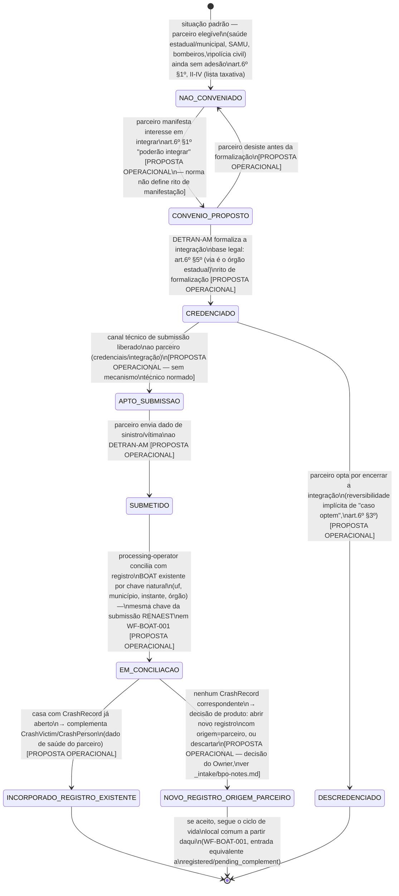

## Escopo e fronteira (leia primeiro)

Este workflow modela a **via de entrada de dados de parceiros facultativos** ao RENAEST — Res.
CONTRAN 808/2020 art. 6º nomeia, taxativamente, cinco categorias: Ministério da Saúde,
secretarias de saúde estaduais/distritais/municipais, SAMU, corpos de bombeiros militares,
polícias civis e a administradora do Seguro DPVAT. Dois traços legais definem a fronteira deste
workflow:

1. **Integração é facultativa** ("Poderão integrar", art. 6º §1º; "Caso optem", §3º) — não há
   dever legal de que hospital, SAMU ou seguradora alimentem o RENAEST. Este workflow nunca é
   caminho obrigatório do ciclo de vida de um sinistro; é uma **fonte adicional opcional**, que
   pode ou não existir para um dado sinistro, dependendo de adesão institucional externa ao
   DETRAN-AM.
2. **Duas vias de integração distintas** (art. 6º §§3º-5º): Ministério da Saúde e a administradora
   do DPVAT, se optarem, integram-se **através do órgão máximo executivo de trânsito da União**
   (§3º) — fora do escopo operacional do DETRAN-AM. Já secretarias de saúde estaduais/municipais,
   SAMU, corpos de bombeiros e polícias civis, se optarem, integram-se **através do órgão
   executivo de trânsito do Estado ou do Distrito Federal** (§5º) — ou seja, **através do próprio
   DETRAN-AM**. Este workflow modela apenas a segunda via (§5º), que é a única em que o DETRAN-AM
   tem papel operacional direto.

**Nenhuma norma lida especifica o rito técnico de convênio, credenciamento, submissão ou
incorporação** — a Res. 808/2020 confirma a existência legal do conceito e a via de entrada
institucional (através do DETRAN estadual), mas não desce a nível de processo. Todo estado deste
workflow, salvo indicação contrária, é **PROPOSTA OPERACIONAL** do BPO, não texto normativo — ver
anotação de base legal em cada transição.

## Estados

## Transições e gatilhos

| Transição                               | Ator                                                                            | Base legal / natureza                                                                                                                                                                                                 |
| --------------------------------------- | ------------------------------------------------------------------------------- | --------------------------------------------------------------------------------------------------------------------------------------------------------------------------------------------------------------------- |
| Manifestar interesse                    | parceiro (saúde estadual/municipal, SAMU, bombeiros, polícia civil)             | art. 6º §1º confirma a categoria elegível; rito de manifestação **PROPOSTA OPERACIONAL**                                                                                                                              |
| Formalizar convênio/credenciamento      | DETRAN-AM (traffic-authority, nível institucional)                              | art. 6º §5º confirma que a via de integração é o órgão estadual; ato de formalização em si **PROPOSTA OPERACIONAL** — nenhuma norma lida descreve instrumento (convênio, termo de cooperação, portaria)               |
| Liberar canal técnico                   | integration-operator (papel técnico, análogo ao já usado na integração RENAEST) | **PROPOSTA OPERACIONAL** — nenhum mecanismo técnico normado localizado                                                                                                                                                |
| Submeter dado de sinistro/vítima        | parceiro                                                                        | **PROPOSTA OPERACIONAL** — formato de payload não definido; provável reaproveitamento das 4 categorias do BAT (art. 4º)                                                                                               |
| Conciliar por chave natural             | processing-operator                                                             | **PROPOSTA OPERACIONAL** — reaplica o padrão de chave natural (uf, município, instante, órgão) já usado na submissão RENAEST em [WF-BOAT-001], por analogia; não confirmado por norma para este fluxo especificamente |
| Incorporar a registro existente         | processing-operator                                                             | **PROPOSTA OPERACIONAL** — complementa `CrashVictim`/`CrashPerson`; dado de saúde recebido de parceiro está sujeito ao mesmo controle de acesso reforçado de [RN-BOAT-003]                                            |
| Abrir novo registro com origem=parceiro | processing-operator, decisão do Owner                                           | **PROPOSTA OPERACIONAL** — decisão de produto ainda não tomada; alternativa é descartar submissão sem registro BOAT correspondente                                                                                    |
| Descredenciar                           | DETRAN-AM                                                                       | reversibilidade implícita de "caso optem" (art. 6º §3º); rito **PROPOSTA OPERACIONAL**                                                                                                                                |

Ver **[RN-BOAT-112]** (rodada LEGAL paralela) — natureza facultativa da integração e via de
entrada exclusiva pelo DETRAN estadual (art. 6º §§1º, 3º, 5º), formalizando o desenho deste
workflow.

## Prazos e timers (base legal por prazo)

Nenhum prazo legal localizado para qualquer etapa deste workflow — a Res. 808/2020 não normatiza
o rito de convênio/credenciamento de parceiro facultativo. Nenhum timer proposto nesta rodada;
calibração fica com o Owner se e quando este fluxo for priorizado.

## Atores por transição

- **parceiro** (Ministério da Saúde/secretaria de saúde/SAMU/corpo de bombeiros/polícia civil) —
  ator **externo ao sistema BOAT**, sem RBAC próprio confirmado pela norma (art. 6º é governança
  interinstitucional, não modelagem de sistema — ver `_intake/proposals.md` "Atores — a
  reconciliar"). Modelado aqui como origem de dado, não como usuário autenticado do TEAT/BOAT.
- **processing-operator** — concilia e incorpora a submissão do parceiro; mesmo papel que já
  consolida dados de campo em [WF-BOAT-001].
- **traffic-authority** — formaliza credenciamento em nível institucional (decisão de adesão).
- **integration-operator** — papel técnico de liberação de canal (proposto, por analogia ao
  mesmo papel citado na transmissão RENAEST de [WF-BOAT-001]/[WF-TEAT-001]).

## Reuso por referência (não remodelado aqui)

- Controle de acesso reforçado a dado de saúde de vítima recebido do parceiro: [RN-BOAT-003],
  reforçado pelo princípio de minimização do art. 18 da Portaria SENATRAN 139/2025 — **não
  remodelado**, apenas herdado.
- Custódia/evidência eventualmente anexada pelo parceiro (ex. laudo de atendimento): mesma
  doutrina de evidência/offline do núcleo TEAT ([WF-TEAT-001] §Anexar evidência) — **reuso por
  referência**, não remodelagem.

## Decisões de modelagem pendentes

- Rito de convênio/credenciamento: 100% proposta operacional, sem base normativa de processo —
  prioridade de escrita **apenas se** o Owner priorizar esta onda (o próprio dossiê de pesquisa
  recomenda tratar como dependente de adesão institucional externa, não de trabalho de engenharia
  isolado).
- Se/quando abrir `NOVO_REGISTRO_ORIGEM_PARCEIRO`: decisão de produto sobre tratar submissão de
  parceiro sem registro BOAT correspondente como sinistro pleno (mesmo ciclo de vida de
  [WF-BOAT-001]) ou como anexo/complemento de natureza distinta — não resolvida nesta rodada.
- RBAC de "parceiro": permanece decisão do Owner se um perfil de sistema deve existir para
  submissão direta (ex. portal de parceiro) ou se todo intake passa por operador humano do
  DETRAN-AM digitando/importando em nome do parceiro.
