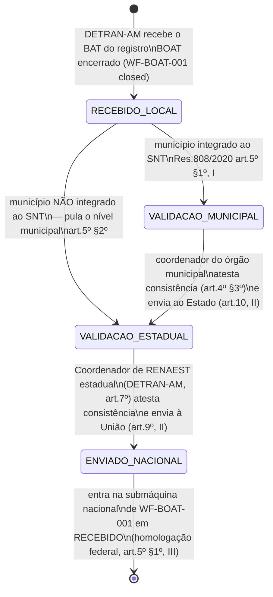
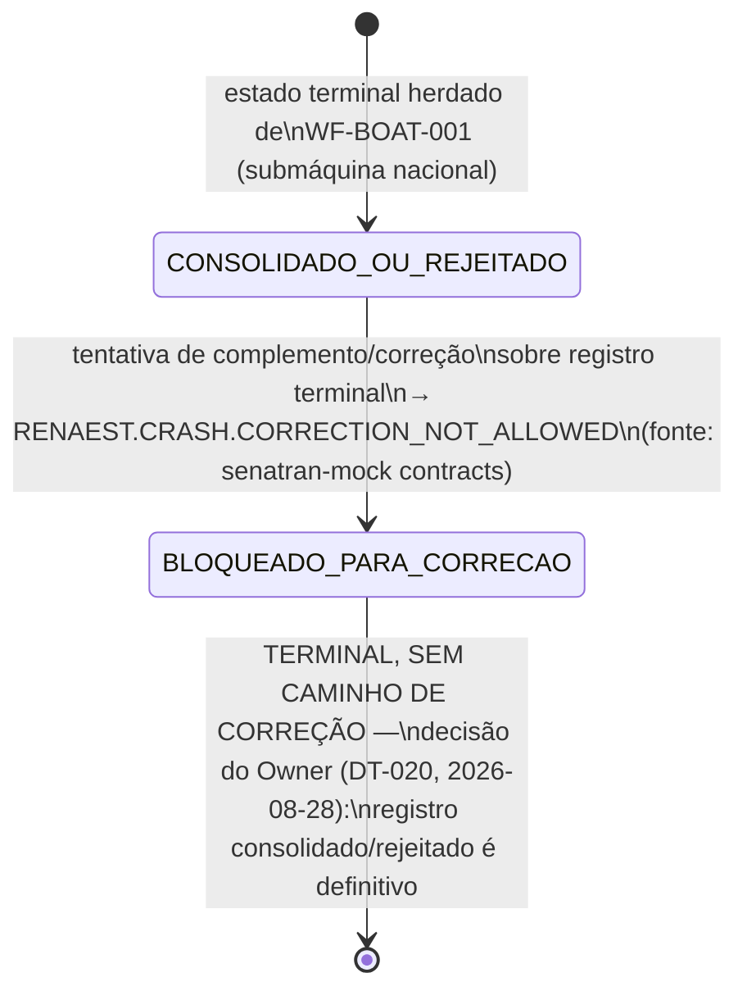

## Escopo (leia primeiro)

Este workflow detalha, com base legal explícita, a cascata de validação **municipal→estadual→
federal** que a Res. CONTRAN 808/2020 art. 5º §§1º-2º impõe entre o encerramento do registro
local BOAT ([WF-BOAT-001] `closed`) e a entrada na submáquina nacional RENAEST (`RECEBIDO`, já
modelada em alto nível em [WF-BOAT-001]). Não redefine essa submáquina — **detalha o que acontece
antes de `RECEBIDO`** e trata explicitamente o mecanismo de correção de registro já terminal, que
[WF-BOAT-001] já apontava como lacuna normativa confirmada. Regras de negócio produzidas em
paralelo pela rodada LEGAL formalizam boa parte deste desenho: [RN-BOAT-102] (existência do
RENAEST e cadeia normativa em 3 níveis), [RN-BOAT-103] (o BAT como documento-fonte e o dever de
atestar consistência), [RN-BOAT-104] (o DETRAN-AM como validador do nível estadual e do municipal
não integrado ao SNT) e [RN-BOAT-105] (Coordenador de RENAEST).

## Estados

_(A alternativa `NOVO_REGISTRO_RETIFICADOR` — novo registro vinculado ao original por
referência explícita — foi **avaliada e rejeitada** pelo Owner em 2026-08-28; ver nota abaixo.)_

## Transições e gatilhos

| Transição                          | Ator                                                                                         | Base legal                                                                                                                                                                                                                      |
| ---------------------------------- | -------------------------------------------------------------------------------------------- | ------------------------------------------------------------------------------------------------------------------------------------------------------------------------------------------------------------------------------- |
| Validação municipal                | Coordenador de RENAEST do órgão executivo municipal (onde houver município integrado ao SNT) | art. 5º §1º, I; art. 4º §3º ("atestarão a consistência dos dados") — [RN-BOAT-103]; art. 10, II                                                                                                                                 |
| Pular nível municipal              | —                                                                                            | art. 5º §2º — em municípios não integrados ao SNT, a validação é feita diretamente pelo órgão estadual                                                                                                                          |
| Validação estadual                 | Coordenador de RENAEST do DETRAN-AM (art. 7º)                                                | art. 5º §1º, II; art. 9º, II (envio à União "em conformidade com os Manuais previstos no parágrafo único do art. 3º")                                                                                                           |
| Homologação federal / consolidação | órgão máximo executivo de trânsito da União (SENATRAN)                                       | art. 5º caput e §1º, III — corresponde à entrada em `RECEBIDO` na submáquina de [WF-BOAT-001]                                                                                                                                   |
| Bloqueio de correção pós-terminal  | sistema (regra de integração)                                                                | fonte: senatran-mock contracts, `RENAEST.CRASH.CORRECTION_NOT_ALLOWED` — sem base normativa que discipline o caso, Res. 808/2020 silente; **decisão do Owner (DT-020) confirma o bloqueio como definitivo**, não apenas técnico |
| ~~Novo registro retificador~~      | —                                                                                            | **REJEITADA (DT-020, 2026-08-28)** — o Owner optou por não permitir correção; ver nota de gap abaixo                                                                                                                            |

## Coordenadores de RENAEST (art. 7º)

Os órgãos executivos de trânsito dos Estados e do DF, a PRF, o DNIT e a ANTT designam um
**Coordenador de RENAEST**, "responsável pelo controle, tratamento e fornecimento dos dados" (art.
7º). Para o DETRAN-AM, este é o ator que atesta consistência e autoriza o envio à União no nível
estadual — mapeamento proposto ao papel `traffic-authority` de [APP-BOAT] em nível hierárquico
superior/coordenação, análogo ao mapeamento já proposto para "Diretoria de Fiscalização" em
[WF-TEAT-001]. Nenhuma fonte confirma RBAC dedicado "Coordenador RENAEST" distinto de
`traffic-authority` — decisão de escopo do Owner. Ver [RN-BOAT-105] para o texto normativo
completo da designação obrigatória e das atribuições do coordenador (art. 9º), que vão além do
envio: organizar e manter os dados, validar, seguir os Manuais, cooperar, incentivar a integração
de parceiros facultativos (ver [WF-BOAT-002]) e organizar reuniões periódicas com os órgãos
integrados em nível estadual.

## Gap confirmado — correção de registro CONSOLIDADO/REJEITADO (resolvido por decisão do Owner)

A Res. CONTRAN 808/2020 disciplina em detalhe a **entrada** de dados no RENAEST (arts. 4º-10) mas
**não disciplina a correção de um registro já homologado/consolidado ou rejeitado**. O contrato
técnico `senatran`-mock e a norma **concordam** em não prever esse fluxo — não é lacuna de
pesquisa (nenhuma busca adicional razoavelmente resolveria isso), é ausência normativa real.

**Decisão do Owner (2026-08-28, `_meta/open-issues.md` DT-020).** Das três opções colocadas
(aceitar a proposta de novo registro vinculado; aguardar posicionamento do CONTRAN/SENATRAN;
tratar como risco operacional aceito), o Owner escolheu **não permitir correção** — um registro
`CONSOLIDADO`/`REJEITADO` é **definitivo**. Isso não resolve a lacuna normativa em si (a Res.
808/2020 continua silente sobre o tema), mas fixa a posição de produto: o BOAT não oferece, nem
propõe, mecanismo de retificação pós-terminal. Um sinistro mal classificado nacionalmente hoje
**não tem e não terá** caminho de correção formal no desenho atual — risco operacional aceito
explicitamente, não pendência em aberto.

## Prazos e timers (base legal por prazo)

Nenhum prazo específico por nível de validação foi localizado (distinto do prazo de integração
institucional do art. 16, já documentado em [WF-BOAT-001]). Este workflow herda o SLA operacional
proposto `T-BOAT-TRANSM` de [WF-BOAT-001] apenas até `ENVIADO_NACIONAL`; a duração de cada etapa
de validação (municipal/estadual/federal) não tem prazo legal nem proposta operacional nesta
rodada — candidato a calibração futura do Owner.

## Atores por transição

Coordenador de RENAEST municipal (validação municipal, onde aplicável); Coordenador de RENAEST
estadual/DETRAN-AM, mapeado a `traffic-authority` (validação estadual, envio à União);
SENATRAN/órgão máximo executivo da União (homologação federal — fora do sistema BOAT,
correspondente à submáquina nacional de [WF-BOAT-001]).

## Decisões de modelagem pendentes

- RBAC "Coordenador de RENAEST" vs. reaproveitamento de `traffic-authority` — decisão do Owner.
- ~~Mecanismo de correção pós-terminal~~ — **RESOLVIDO (2026-08-28, DT-020):** não permitir
  correção; registro `CONSOLIDADO`/`REJEITADO` é definitivo. Ver §Gap confirmado acima.
- Prazo de cada nível de validação: não normado, sem proposta operacional nesta rodada.
