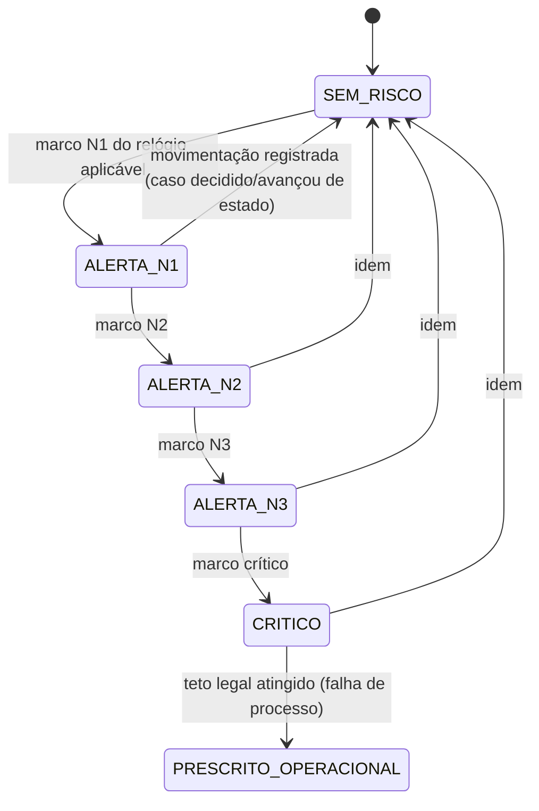

## Estados

Este workflow não substitui [WF-RAIT-001] — ele governa dois sub-mecanismos que o
atravessam: (a) como um caso `ADMITIDO` chega a um responsável (`DISTRIBUIDO`); (b) o nível de
alerta de risco de prescrição que o caso carrega em qualquer estado pré-decisão. Estados do
sub-mecanismo (b) — a "bandeira" de risco do caso:

`SEM_RISCO` → `ALERTA_N1` → `ALERTA_N2` → `ALERTA_N3` → `CRITICO` → (nunca deveria alcançar)
`PRESCRITO_OPERACIONAL`.

## 1. Pools por tipo/instância

| Pool           | `instancia`     | `circuito` | Quem entra                       | Estratégia default proposta |
| -------------- | --------------- | ---------- | -------------------------------- | --------------------------- |
| Defesa prévia  | `defesa_previa` | 1º         | Analistas/revisores únicos       | `pull` (claim-next)         |
| Recurso JARI   | `jari`          | 2º         | Relatores (membros da JARI)      | `sorteio` (ver §3)          |
| Recurso CETRAN | `cetran`        | 2º         | Relatores (membros do CETRAN-AM) | `sorteio` (ver §3)          |

Segmentação adicional proposta dentro de cada pool: por **enquadramento** (infrações de
maior complexidade/volume — ex. excesso de velocidade — podem justificar sub-pool dedicado)
e por **risco de prescrição** (§4) — fila prioritária separada da fila FIFO comum. Ambas são
decisões de calibração do Owner, não normativas.

**Decisão do Owner (steering.md A.2, 2026-08-24):** manter os 3 pools base, sem segmentação
adicional por enquadramento ou risco nesta fase.

## 2. Estratégias de distribuição

A plataforma de worklist do RAIT suporta nativamente três estratégias de fila, configuráveis
por pool — a escolha por pool é decisão do Owner, não uma imposição normativa:

| Estratégia                | Como funciona                                                                                     | Uso recomendado                                                                                      |
| ------------------------- | ------------------------------------------------------------------------------------------------- | ---------------------------------------------------------------------------------------------------- |
| `pull` (claim-next)       | analista disponível puxa o próximo caso elegível da fila (FIFO, ou FIFO dentro da faixa de risco) | pool de 1º circuito (defesa prévia) — alto volume, decisão individual                                |
| `round-robin`             | sistema atribui em rodízio fixo entre os membros ativos do pool                                   | pools pequenos e estáveis (poucos analistas), quando se quer garantir carga igual sem escolha manual |
| `balanceamento por carga` | sistema atribui ao membro com menor carga aberta (contagem ponderada por complexidade/risco)      | pools heterogêneos em capacidade (analistas em regimes de trabalho distintos)                        |

## 3. Sorteio de relator (2º circuito — JARI/CETRAN)

Modelo de referência: **CETRAN-ES art.25** — "distribuição registrada, obedecido o critério de
sorteio entre os Conselheiros" ([REF-CETRAN-PROCESSO-INTERNO]). Proposta: implementar como uma
variante da estratégia `round-robin` da plataforma com ordem inicial aleatorizada e registro
auditável do sorteio (ata de distribuição) — preserva a garantia de imparcialidade sem exigir
um mecanismo de sorteio dedicado fora do worklist.

**Decisão do Owner (steering.md A.3, 2026-08-24):** usar o round-robin já existente na
plataforma de worklist — não é necessário um mecanismo de sorteio dedicado fora dela.

Alternativa de referência **CETRAN-RS art.13 §1º** (distribuição direta ao relator, sem
sorteio explícito) e **art.17** (triagem de admissibilidade unipessoal pelo presidente antes
da distribuição) — não adotada como default (ES é mais transparente/auditável), mas registrada
como variante possível caso o regimento local da JARI-AM/CETRAN-AM (quando localizado) prescreva
outro critério.

## 4. Escada de SLA anti-prescrição (núcleo deste workflow)

A arquitetura de SLA existe para tornar a prescrição **operacionalmente impossível** — cada
relógio de [WF-RAIT-001] §Relógios de extinção recebe marcos de alerta muito antes do teto
legal. Todos os limiares abaixo eram **propostas de calibração**, não normas.

**Decisão do Owner (steering.md A.1, 2026-08-24):** limiares dos §4.1-4.3 aprovados como
propostos abaixo, sem ajuste. ⚠️ Nota de capacidade (steering.md, nota sob B.9-B.12): volume
mensal alto (>500/mês) com apenas uma JARI-AM, quorum CETRAN de referência ~8 e 6-15
analistas é uma combinação que merece checagem de throughput real do colegiado antes de
tratar esta escada como definitiva em produção — ver `_intake/bpo-notes.md` §3.

### 4.1 Relógio B — prescrição por inércia do julgador (24 meses, CTB art.289-A)

| Nível                   | Marco                  | Ação                                                                                                                |
| ----------------------- | ---------------------- | ------------------------------------------------------------------------------------------------------------------- |
| `SEM_RISCO`             | 0–11 meses             | fila normal                                                                                                         |
| `ALERTA_N1`             | 12 meses (50% do teto) | notificação ao relator/analista responsável; caso sinalizado no dashboard                                           |
| `ALERTA_N2`             | 18 meses (75%)         | notificação ao coordenador do pool; caso priorizado na fila/pauta                                                   |
| `ALERTA_N3`             | 21 meses (87,5%)       | escalonamento ao gestor RAIT; entra em pauta prioritária obrigatória ([WF-RAIT-003])                                |
| `CRITICO`               | 23 meses (95,8%)       | escalonamento ao presidente JARI/CETRAN; reunião extraordinária cabível; acompanhamento diário                      |
| `PRESCRITO_OPERACIONAL` | 24 meses atingidos     | falha de processo — registro de incidente, apuração de causa, comunicação ao LEGAL/auditoria; nunca deveria ocorrer |

### 4.2 Relógio C — prescrição por paralisação (3 anos = 36 meses **sem movimentação**, Lei 9.873 art.1º §1º)

Este relógio conta **desde o último ato registrado no caso**, não desde a abertura — reinicia
a cada movimentação (diligência respondida, decisão parcial, distribuição, etc.), em
QUALQUER estado pré-decisão. É independente do relógio B e pode disparar mesmo dentro do teto
de 24 meses se o caso ficar parado.

| Nível                   | Marco (meses sem movimentação) | Ação                                                                                                                               |
| ----------------------- | ------------------------------ | ---------------------------------------------------------------------------------------------------------------------------------- |
| `ALERTA_N2`             | 24 meses parado                | notificação ao coordenador do pool — caso "esquecido"                                                                              |
| `ALERTA_N3`             | 30 meses parado                | escalonamento ao gestor RAIT; reatribuição obrigatória ([UC-RAIT-011])                                                             |
| `CRITICO`               | 33 meses parado                | escalonamento ao presidente; qualquer movimentação de ofício (mesmo administrativa) interrompe o relógio — priorizar ação imediata |
| `PRESCRITO_OPERACIONAL` | 36 meses parado                | falha de processo — mesmo protocolo de incidente do §4.1                                                                           |

### 4.3 Relógio A — decadência do direito de aplicar a penalidade (180d/360d, CTB art.282 §§6º-7º)

Aplica-se ao 1º circuito (`defesa_previa`) — delimita o teto para `DECIDIDO_AUTORIDADE` e
emissão da NP. Herdado de [WF-INF-001] T3/T3'; ladder proposta (para a trilha de 180 dias —
sem defesa prévia tempestiva — a trilha de 360 dias com defesa escala proporcionalmente):

| Nível       | Marco (trilha 180d / trilha 360d) | Ação                                                       |
| ----------- | --------------------------------- | ---------------------------------------------------------- |
| `ALERTA_N1` | 90d / 180d (50%)                  | notificação ao analista                                    |
| `ALERTA_N2` | 135d / 270d (75%)                 | notificação ao coordenador                                 |
| `CRITICO`   | 162d / 324d (90%)                 | escalonamento à autoridade — decisão obrigatória na semana |

### 4.4 SLA operacional local (meta, não teto legal)

O DETRAN-AM anuncia publicamente "parecer em 30 dias" (defesa) e "processamento em 30 dias
úteis" (JARI) — [REF-DETRANAM-SERVICOS]. Isso é uma **meta operacional interna**, muito abaixo
dos tetos legais (180/360 dias; 24 meses) — ambos coexistem no desenho: a escada de alerta dos
§4.1-4.3 protege o teto legal (nunca prescrever); esta meta de 30 dias é o padrão de qualidade
de atendimento ao cidadão, monitorado separadamente no dashboard (indicador "% dentro da meta
de 30 dias", distinto de "% em risco de prescrição").

## 5. Reatribuição, afastamento e impedimento

| Estado do responsável        | Gatilho                                                                                                                        | Efeito no caso                                                                                                                     |
| ---------------------------- | ------------------------------------------------------------------------------------------------------------------------------ | ---------------------------------------------------------------------------------------------------------------------------------- |
| `ATIVO`                      | padrão                                                                                                                         | elegível a receber distribuição                                                                                                    |
| `IMPEDIDO` (caso específico) | conflito de interesse — ex. lavrou o próprio AIT (CONTRAN-357 item 5.1.c)                                                      | caso é redistribuído a outro membro do pool antes da distribuição original ser efetivada; impedimento declarado no ato de assunção |
| `ADVERTIDO`                  | atraso reincidente na relatoria (modelo CETRAN-ES art.9) — proposta                                                            | registrado no perfil; não bloqueia distribuição futura, mas alimenta indicador de produtividade                                    |
| `AFASTADO_TEMP`              | reincidência em atraso (modelo CETRAN-ES art.10) OU 3 faltas injustificadas em 3 sessões consecutivas (CONTRAN-357 item 7.3.a) | pool remove o membro das novas distribuições; casos já distribuídos a ele são redistribuídos ([UC-RAIT-011])                       |
| `MANDATO_ENCERRADO`          | fim do mandato (1-2 anos, CONTRAN-357 item 7.1) sem recondução                                                                 | remoção definitiva do pool                                                                                                         |

Mecanismo de accountability (`ADVERTIDO`→`AFASTADO_TEMP`) é uma **proposta** inspirada no
modelo CETRAN-ES — não há confirmação de que o regimento local da JARI-AM/CETRAN-AM adota o
mesmo mecanismo (regimento não localizado — ver `refs/INDEX.md` §Gaps). Marcar como
`(pendente regimento JARI-AM/CETRAN-AM)`.

**Decisão do Owner (steering.md A.5, A.4, 2026-08-24):** adotar o modelo CETRAN-ES como
desenho de fato, sujeito a validação jurídica antes de `approved` — mesma decisão que
formaliza o regimento proposto em [WF-RAIT-003].

## 6. Escalonamento — cadeia

Cadeia de notificação por nível: `ALERTA_N1` → responsável direto (analista/relator);
`ALERTA_N2` → + coordenador do pool; `ALERTA_N3` → + gestor RAIT (força priorização de
pauta/fila); `CRITICO` → + presidente JARI/CETRAN (pode convocar sessão extraordinária);
`PRESCRITO_OPERACIONAL` → + LEGAL/auditoria (apuração, nunca deveria disparar). Ver
[UC-RAIT-010] para o papel do gestor no monitoramento.

## 7. Suspensão de prazos e calendário de feriados

- **Prazos legais** (relógios A, B, C) não se suspendem, salvo força maior regulamentada pelo
  CONTRAN (CTB art.290-A) — regulamentação não localizada (handoff LEGAL, `refs/INDEX.md`
  §Gaps). Até confirmação, tratar como **não suspensíveis** por padrão do sistema.
- **Contagem de vencimentos** (quando um prazo cai em dia não útil, prorroga-se ao 1º dia
  útil seguinte — [RN-RAIT-005], CONTRAN-918 art.29) usa uma **porta de calendário de
  feriados** injetável. **Decisão do Owner (steering.md A.6, 2026-08-24):** combinar calendário
  **nacional + estadual (AM)**. Esta prorrogação é uma regra de arredondamento de vencimento,
  distinta de "suspensão" (parar o relógio) — não deve ser confundida com o ponto anterior.

## Atores por transição

| Ator                   | Papel neste workflow                                                                             |
| ---------------------- | ------------------------------------------------------------------------------------------------ |
| Analista/Relator       | recebe distribuição; gera movimentação que reseta o relógio C                                    |
| Coordenador do pool    | recebe `ALERTA_N2`; aciona reatribuição                                                          |
| Gestor RAIT            | recebe `ALERTA_N3`; monitora dashboard cross-pool ([UC-RAIT-010])                                |
| Presidente JARI/CETRAN | recebe `CRITICO`; prioriza pauta; decide afastamento/impedimento                                 |
| Plataforma (worklist)  | executa a estratégia de distribuição configurada por pool; calcula os relógios e dispara alertas |

## Decisões de modelagem pendentes

Todos os itens abaixo foram resolvidos em steering com o Owner (2026-08-24) — ver
`_meta/steering.md` §A. Mantidos aqui como registro histórico:

- ~~Limiares exatos dos §4.1-4.3~~ — **RESOLVIDO:** aprovados como propostos (A.1).
- ~~Mecanismo de sorteio de relator~~ — **RESOLVIDO:** round-robin da plataforma existente (A.3).
- ~~Modelo de accountability~~ — **RESOLVIDO:** adotar modelo CETRAN-ES, como desenho de fato
  sujeito a validação jurídica (A.5, A.4); regimento local segue não localizado.
- ~~Fonte do calendário de feriados~~ — **RESOLVIDO:** nacional + estadual (A.6).

## Decisões

- **2026-08-24** — Owner, em conversa de steering (`_meta/steering.md` §A): aprovou os 4
  itens de calibração operacional acima (limiares de SLA, pools, sorteio, accountability,
  calendário). Promovido a `reviewed`.
