## Fundamento e gap declarado

O **regimento interno próprio da JARI-AM e do CETRAN-AM não foi localizado publicamente**
(duas rodadas de pesquisa — ver `refs/INDEX.md` §Gaps; pista não confirmada: Decreto Estadual
34.398/2014). Este workflow é desenhado a partir de: (a) a diretriz nacional CONTRAN 357/2010
(composição, quorum mínimo, mandato — vinculante); (b) o combo de benchmark recomendado no
dossiê de pesquisa — CETRAN-ES (sorteio de relator, prazo interno de voto, accountability,
quorum) + CETRAN-SP (digitalização é dever do órgão). Todo ponto que depende de uma escolha
regimental local e não tem fonte AM está marcado **(pendente regimento JARI-AM/CETRAN-AM)** —
não é lacuna deste documento, é lacuna de fonte a resolver com o DETRAN-AM/CETRAN-AM
diretamente.

Aplica-se tanto à sessão da JARI (recurso 1ª instância) quanto do CETRAN-AM (recurso 2ª
instância) — mesma máquina, `orgao_julgador` ∈ {`jari`, `cetran`} como parâmetro.

**Decisão do Owner (steering.md A.4, 2026-08-24):** enquanto o regimento local não é obtido
por canal direto com o DETRAN-AM, as propostas deste documento (combo CETRAN-ES + CETRAN-SP)
são formalizadas como o desenho de fato — sujeitas a validação jurídica antes de `approved`.
Os pontos `(pendente regimento JARI-AM/CETRAN-AM)` abaixo passam de lacuna de fonte a
proposta adotada provisoriamente.

## Estados

```mermaid
stateDiagram-v2
    [*] --> FORMANDO_PAUTA : casos em PRONTO_P_DECISAO (2º circuito)\naguardando inclusão [WF-RAIT-001]
    FORMANDO_PAUTA --> PAUTA_FECHADA : presidente fecha a pauta —\nprioriza casos em ALERTA_N3/CRITICO [WF-RAIT-002] §4
    PAUTA_FECHADA --> CONVOCACAO_ENVIADA : secretaria convoca membros\n(antecedência mínima — pendente regimento)
    CONVOCACAO_ENVIADA --> SESSAO_ABERTA : data/hora da sessão

    SESSAO_ABERTA --> SESSAO_ADIADA : sem quorum — CONTRAN-357 item 8.2\n(maioria simples + presidente/suplente obrigatório)
    SESSAO_ADIADA --> FORMANDO_PAUTA : casos retornam para nova pauta\n(prazo do relógio B/C continua correndo)

    SESSAO_ABERTA --> RELATORIA_LIDA : com quorum — relator apresenta parecer/voto\nCETRAN-ES art.26
    RELATORIA_LIDA --> VOTACAO : caminho padrão — sustentação oral\nomitida por decisão do Owner (2026-08-28)
    RELATORIA_LIDA --> SUSTENTACAO_ORAL : só se regimento local do\nJARI-AM/CETRAN-AM vier a admiti-la\n(estado mantido, não removido)
    SUSTENTACAO_ORAL --> VOTACAO

    VOTACAO --> DESEMPATE_PRESIDENTE : votos empatados\nvoto de qualidade do presidente\nconfirmado p/ CETRAN (Res.901/2022 12.3);\nproposta por analogia p/ JARI
    DESEMPATE_PRESIDENTE --> DECISAO_PROCLAMADA
    VOTACAO --> DECISAO_PROCLAMADA : maioria simples alcançada —\nCONTRAN-357 item 8.3

    DECISAO_PROCLAMADA --> ATA_LAVRADA : secretaria registra ata da sessão
    ATA_LAVRADA --> ATA_ASSINADA : presidente (+ relator) assina
    ATA_ASSINADA --> [*] : retorna a [WF-RAIT-001] JULGADO_SESSAO → COMUNICADO
```

## Transições e gatilhos — detalhamento

### Formação de pauta

Presidente (ou coordenador, quando houver mais de uma JARI — CONTRAN-357 item 2.3) monta a
pauta a partir da fila `PRONTO_P_DECISAO` do pool 2º circuito. Critério de priorização
proposto: casos com bandeira `ALERTA_N3`/`CRITICO` ([WF-RAIT-002] §4) entram em pauta
prioritária obrigatória, à frente da ordem FIFO comum — a escada de SLA só funciona se a
pauta a respeitar.

### Convocação

Antecedência mínima e forma de convocação (edital interno, e-mail, sistema) —
**(pendente regimento JARI-AM/CETRAN-AM)**. Proposta de piso operacional: convocação com no
mínimo 5 dias úteis de antecedência da sessão, a confirmar.

### Quorum

| Órgão     | Quorum mínimo                                                                                                                                                                                                                                                                                                                                                                                                                                                        | Base                                                                                                             |
| --------- | -------------------------------------------------------------------------------------------------------------------------------------------------------------------------------------------------------------------------------------------------------------------------------------------------------------------------------------------------------------------------------------------------------------------------------------------------------------------- | ---------------------------------------------------------------------------------------------------------------- |
| JARI      | maioria simples dos integrantes, com presença obrigatória do presidente ou suplente; composição mínima de 3 integrantes                                                                                                                                                                                                                                                                                                                                              | CONTRAN-357 item 8.2, item 4.1                                                                                   |
| CETRAN-AM | **Quorum de deliberação = maioria simples dos integrantes** (Res. CONTRAN 901/2022, Anexo item 12.2 — piso nacional, resolve a lacuna). Composição: piso nacional de presidente + 14 membros = 15 (Anexo item 5.1); **19 conselheiros** segundo resposta institucional da Sub Gerência de Infração (2026-08-27/28), que diverge tanto do piso nacional quanto do levantamento nominal público (15-16, [REF-DECRETO-34398-2014] §Composição atual) — não reconciliado | [REF-CONTRAN-901-2022] Anexo 12.2 (quorum, resolvido); `_meta/open-issues.md` DT-071 (composição, ainda ambígua) |

Sem quorum → `SESSAO_ADIADA`, pauta retorna para reformação; os relógios de SLA do
[WF-RAIT-002] **continuam correndo** durante o adiamento — sessões adiadas repetidamente são,
por si, um sinal de risco a monitorar no dashboard.

### Sustentação oral

**Decisão do Owner (2026-08-28, `_meta/open-issues.md` DT-011):** sustentação oral é **omitida
por padrão** — não é etapa configurável do fluxo. Coerente com o benchmark CETRAN-ES, que **veda**
expressamente (art.29 §4º); outros modelos capturados não mencionam o instituto. O estado
`SUSTENTACAO_ORAL` é **mantido no diagrama**, não removido, para o caso de o regimento local do
JARI-AM/CETRAN-AM vir a admiti-la formalmente no futuro — mas o caminho padrão do sistema não a
oferece. [UC-RAIT-006] e a tela T-12 de [IU-RAIT-001] devem refletir esta decisão: a etapa não é
apresentada como parte do fluxo normal, e não é um toggle exposto a configuração.

### Votação e empate

Decisão fundamentada, aprovada por maioria simples (CONTRAN-357 item 8.3 para JARI; Res.
CONTRAN 901/2022 Anexo item 12.3 para CETRAN — _"maioria de votos"_). **Regra de desempate para
o CETRAN-AM: confirmada em norma nacional** — voto de qualidade do presidente (Res. 901/2022,
Anexo item 12.3), não mais proposta de benchmark. Resta apenas um ponto genuinamente local (Anexo
item 12.4): se o presidente **também** vota nominalmente nas deliberações comuns, ou só
desempata — `(pendente regimento CETRAN-AM)` apenas para esse ponto específico. Para a JARI, a
regra de desempate segue sem fonte nacional equivalente (Res. 357/2010 não a disciplina) —
`(pendente regimento JARI-AM)`, proposta de trabalho não confirmada: mesmo mecanismo de voto de
qualidade, por analogia.

### Ata e assinatura

Ata da sessão registra: pauta, presentes, quorum, relatoria, votos individuais, resultado,
fundamentação. Assinatura digital: padrão **PAdES+TSA** (já usado em outros domínios do
ecossistema, ex. laudos do PEC), em vez de assinatura física, alinhado ao modelo CETRAN-SP
(digitalização é dever do órgão, não do cidadão — Deliberação 02/2025 art.3º). **Decisão do
Owner (steering.md A.8, 2026-08-24):** adotar PAdES+TSA — confirmado, fora do escopo
normativo deste documento a implementação técnica.

### Publicação/comunicação

Decisão proclamada retorna ao caso em [WF-RAIT-001] como `JULGADO_SESSAO`, que transiciona a
`COMUNICADO` (CONTRAN-918 art.17): notifica o recorrente do resultado e, em caso de
provimento, informa se a autoridade vai recorrer (art.17 §ú — ver [UC-RAIT-008]).

## Prazos e timers

| Timer  | Prazo                                                                  | Gatilho                 | Consequência                                                   | Base                                                                                                                            |
| ------ | ---------------------------------------------------------------------- | ----------------------- | -------------------------------------------------------------- | ------------------------------------------------------------------------------------------------------------------------------- |
| T-VOTO | proposta: 20 dias (modelo CETRAN-ES art.8º VII)                        | distribuição ao relator | atraso gera advertência (modelo, [WF-RAIT-002] §5)             | **(pendente regimento JARI-AM/CETRAN-AM)** — benchmark CETRAN-ES                                                                |
| T-CONV | proposta: 5 dias úteis mínimos                                         | fechamento da pauta     | convocação insuficiente pode invalidar a sessão                | **(pendente regimento)**                                                                                                        |
| —      | sem teto interno de "prazo de julgamento em N dias" confirmado para AM | —                       | o teto que vale é sempre o relógio B (24 meses, [WF-RAIT-001]) | benchmark CETRAN-RS usa 30 dias internos com efeito suspensivo automático em caso de atraso — não confirmado como prática local |

## Atores por transição

| Ator                                      | Transições onde atua                                                                   |
| ----------------------------------------- | -------------------------------------------------------------------------------------- |
| Presidente JARI/CETRAN                    | `FORMANDO_PAUTA→PAUTA_FECHADA`, preside `SESSAO_ABERTA`, conduz `DESEMPATE_PRESIDENTE` |
| Secretaria da sessão                      | `PAUTA_FECHADA→CONVOCACAO_ENVIADA`, `DECISAO_PROCLAMADA→ATA_LAVRADA`                   |
| Relator                                   | apresenta em `RELATORIA_LIDA`, vota em `VOTACAO`                                       |
| Membros do colegiado                      | compõem quorum em `SESSAO_ABERTA`, votam em `VOTACAO`                                  |
| Recorrente (se sustentação oral admitida) | `SUSTENTACAO_ORAL`                                                                     |

## Decisões de modelagem pendentes

Todos os itens abaixo foram resolvidos em steering com o Owner (2026-08-24) — ver
`_meta/steering.md` §A/§B. Mantidos aqui como registro histórico:

- ~~Quorum, convocação, sustentação oral, prazo interno de voto e regra de desempate~~ —
  **RESOLVIDO (A.4):** formalizar as propostas deste documento como o regimento de fato,
  sujeitas a validação jurídica antes de `approved`. Regimento local segue não localizado —
  Owner buscará por canal direto/não-público com o DETRAN-AM em paralelo.
- ~~Assinatura digital da ata/decisão~~ — **RESOLVIDO (A.8):** PAdES+TSA.
- ~~Mais de uma JARI junto ao DETRAN-AM?~~ — **RESOLVIDO (B.9):** uma única JARI-AM, confirmado.

## Decisões

- **2026-08-24** — Owner, em conversa de steering (`_meta/steering.md` §A e B.9): formalizou
  as propostas deste documento (combo CETRAN-ES+SP) como desenho de fato sujeito a validação
  jurídica; confirmou PAdES+TSA para assinatura; confirmou uma única JARI-AM. Promovido a
  `reviewed`.
- **2026-08-28** — Owner (`_meta/open-issues.md` DT-011): sustentação oral omitida por padrão,
  não configurável. Estado `SUSTENTACAO_ORAL` mantido no diagrama para uso futuro condicionado a
  regimento local, mas fora do caminho padrão.
