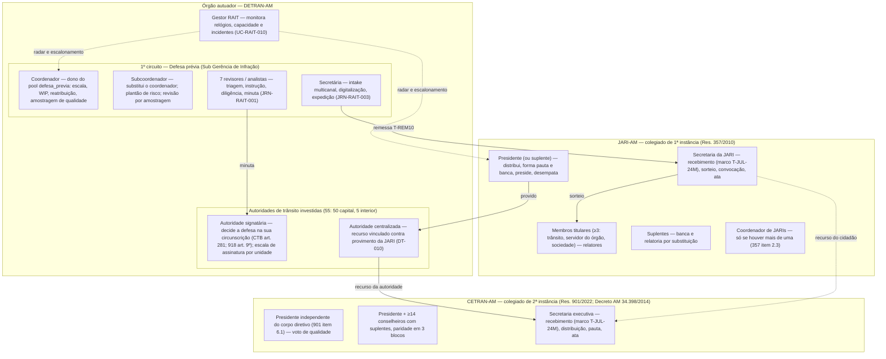
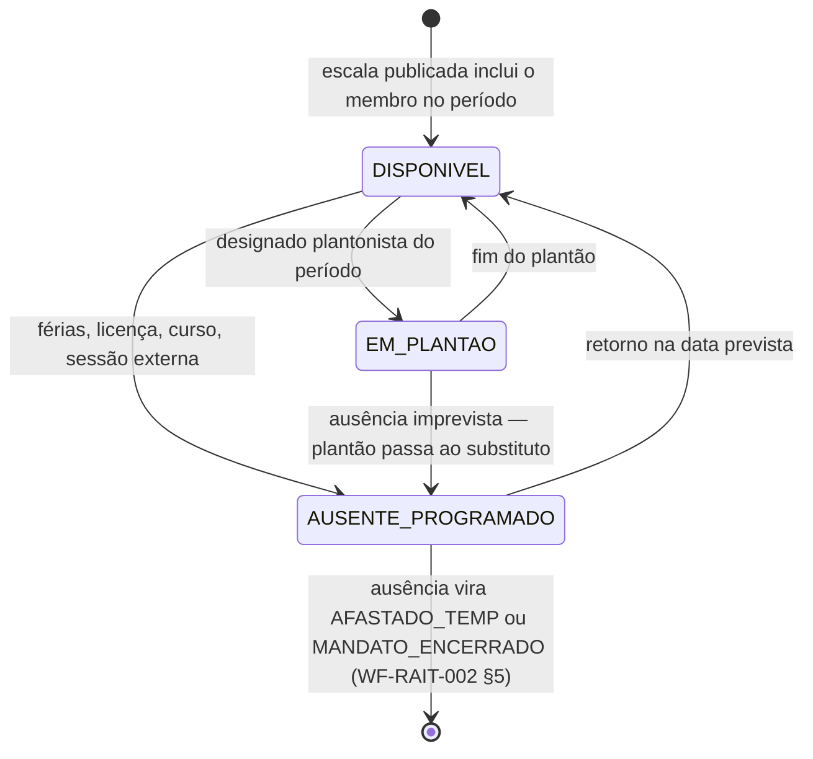
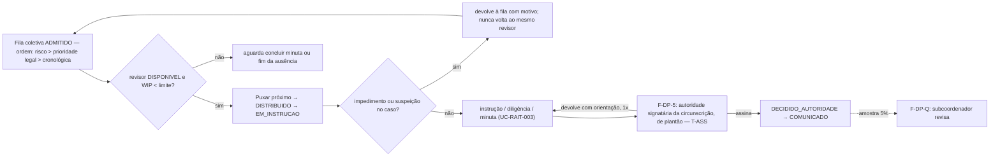

## Escopo e posição

[WF-RAIT-002] fixa **o que** distribui (três pools, uma estratégia por pool, escada de SLA
anti-prescrição, estados de accountability do responsável). Este workflow detalha **como a
organização se arranja para que isso funcione**: as unidades de julgamento e seus papéis; as filas
e backlogs que cada papel opera e a ordem em que são consumidas; as escalas e o plantão; o sorteio
e a distribuição de relatores; a formação da banca de cada sessão; e o dimensionamento da
capacidade contra o prazo legal. Nada aqui altera os estados do caso ([WF-RAIT-001]), da sessão
([WF-RAIT-003]) nem da infração ([WF-INF-003]) — este documento cria estados próprios apenas para
**membros**, **lotes de distribuição**, **bancas** e **unidades** (§9).

Decisões do Owner já vinculantes que este desenho respeita: três pools sem segmentação (steering
A.2); sorteio de relator pelo round-robin da plataforma (A.3); accountability por atraso no modelo
CETRAN-ES (A.5); limiares da escada de alertas (A.1); uma única JARI-AM (B.9); calendário
nacional + AM (A.6). Dados institucionais (Sub Gerência de Infração, 2026-08-27/28, [APP-RAIT]):
equipe da 1ª instância com **10 pessoas** (1 coordenador, 1 subcoordenador, 7 revisores, 1
secretária); **55 autoridades de trânsito** investidas (50 na capital, 5 no interior); **306
defesas decididas/mês** (julho); CETRAN-AM com 15 assentos providos por fonte pública
([REF-DECRETO-34398-2014] §Composição atual) e "19" por resposta institucional, não reconciliados.

Tudo o que depende do regimento interno da JARI-AM/CETRAN-AM (não localizado — DT-060) está
marcado **(pendente regimento)** e é tratado como desenho de fato sujeito a validação jurídica
(steering A.4).

## §1 — Unidades de julgamento e papéis

| Papel (código de membro no pool)         | Pool                        | Responsabilidade de organização do trabalho                                                             | Base                                                                            |
| ---------------------------------------- | --------------------------- | ------------------------------------------------------------------------------------------------------- | ------------------------------------------------------------------------------- |
| Gestor RAIT                              | transversal                 | radar de prescrição, incidentes de capacidade, decisão de abrir turma/JARI adicional                    | [UC-RAIT-010]; [REF-CONTRAN-357] item 2.2                                       |
| Coordenador (`coordenador`)              | `defesa_previa`             | publica a escala semanal, fixa limite de casos simultâneos por revisor, reatribui, responde `ALERTA_N2` | [WF-RAIT-002] §5-§6; [UC-RAIT-011]                                              |
| Subcoordenador (`coordenador`, suplente) | `defesa_previa`             | substitui o coordenador; plantão de risco da semana; amostragem de qualidade das minutas                | proposta operacional                                                            |
| Revisor / analista (`analista`)          | `defesa_previa`             | assume casos da fila (claim-next), tria, instrui, diligencia, redige minuta; não assina                 | [JRN-RAIT-001]; [UC-RAIT-002], [UC-RAIT-003]                                    |
| Secretaria (`secretaria`)                | todos                       | intake e protocolo, digitalização, remessa à JARI, convocação, ata, expedição                           | [UC-RAIT-001], [UC-RAIT-007]; [WF-RAIT-003]                                     |
| Autoridade signatária                    | fora do pool (fila própria) | decide a defesa **na sua circunscrição**; escala de assinatura por unidade; prazo interno de assinatura | CTB art. 281 _caput_; [REF-CONTRAN-918] arts. 2º IV e 9º; [RN-RAIT-143]         |
| Autoridade centralizada                  | fora do pool (fila própria) | recurso vinculado contra provimento da JARI, em 30 dias da publicação                                   | [RN-RAIT-130]; [UC-RAIT-008]                                                    |
| Presidente JARI / CETRAN (`presidente`)  | `jari` / `cetran`           | homologa o sorteio, forma pauta e banca, preside, desempata (CETRAN: voto de qualidade)                 | [REF-CONTRAN-357] itens 4.1.b.2, 8.2; [REF-CONTRAN-901-2022] Anexo 12.3         |
| Relator / conselheiro (`relator`)        | `jari` / `cetran`           | recebe lote sorteado, declara impedimento/suspeição, relata em `T-VOTO`, vota na sessão                 | [UC-RAIT-004]; [RN-RAIT-140]                                                    |
| Suplente (`relator`, `suplente=true`)    | `jari` / `cetran`           | entra na banca quando titular ausente/impedido; pode receber lote quando titular afastado               | [REF-CONTRAN-357] item 4.1.b.3; [REF-CONTRAN-901-2022] Anexo 5.1; [RN-RAIT-142] |
| Coordenador de JARIs (`coordenador`)     | `jari`                      | só quando houver mais de uma JARI: distribui entre turmas, uniformiza pautas                            | [REF-CONTRAN-357] item 2.3; [RN-RAIT-139]                                       |

## §2 — Catálogo de filas e backlogs

Uma **fila** é a lista de casos num estado de [WF-RAIT-001] à espera de um papel; um **backlog**
é a fila medida (tamanho, idade, risco). Cada fila tem dono, ordem de consumo e indicador. A ordem
de consumo é única em todo o RAIT ([RN-RAIT-141]): **(1) bandeira de risco** ([WF-RAIT-002] §4,
`CRITICO` > `ALERTA_N3` > `ALERTA_N2` > `ALERTA_N1`), depois **(2) prioridade legal de tramitação**
(pessoa com deficiência — [REF-LEI-13146-2015-acessibilidade] art. 9º VII; pessoa idosa —
Estatuto da Pessoa Idosa art. 71, **fonte pendente** no corpus), depois **(3) ordem cronológica do
marco de tempestividade** ([RN-RAIT-106]). Nenhum papel escolhe caso fora dessa ordem sem motivo
registrado.

### 2.1 — 1º circuito (pool `defesa_previa`)

| Fila   | Estado do caso ([WF-RAIT-001])                | Dono                             | Ordem / regra de consumo                                                       | Meta operacional (proposta)                       | Indicador de backlog                  |
| ------ | --------------------------------------------- | -------------------------------- | ------------------------------------------------------------------------------ | ------------------------------------------------- | ------------------------------------- |
| F-DP-0 | `PROTOCOLADO` (intake físico a digitalizar)   | Secretaria                       | cronológica por canal; postal usa a data da postagem                           | `T-REG`: registro e digitalização em 2 dias úteis | peças não registradas × idade         |
| F-DP-1 | `TRIAGEM_ADMISSIBILIDADE`                     | Revisor (claim-next)             | ordem única da §2; tempestividade calculada pelo motor                         | `T-TRI`: triagem em 5 dias úteis do protocolo     | casos sem triagem × idade             |
| F-DP-2 | `ADMITIDO` → `DISTRIBUIDO`                    | Revisor (claim-next)             | ordem única; limite de casos simultâneos por revisor (`WIP`, §4)               | assunção imediata ao puxar                        | fila coletiva × dias até `T-DEC`      |
| F-DP-3 | `EM_INSTRUCAO`                                | Revisor (dono do caso)           | painel do turno: vencendo em 5 dias, diligência expirando, parado há N dias    | minuta em 15 dias corridos do claim               | casos por revisor × idade × risco     |
| F-DP-4 | `DILIGENCIA` (bandeja "prontos para retomar") | Revisor (dono do caso)           | resposta recebida ou `T-DIL` vencido, o que ocorrer primeiro                   | retomada em 2 dias úteis                          | diligências vencidas sem retomada     |
| F-DP-5 | `PRONTO_P_DECISAO` com minuta                 | Autoridade signatária de plantão | por circunscrição; ordem única                                                 | `T-ASS`: assinatura em 5 dias úteis               | minutas aguardando assinatura × idade |
| F-DP-6 | `DECIDIDO_AUTORIDADE` → `COMUNICADO`          | Secretaria / Processamento       | cronológica; NP dentro de `T-DEC`                                              | expedição no dia da assinatura                    | decisões não comunicadas              |
| F-DP-Q | amostra de `DECIDIDO_AUTORIDADE`              | Subcoordenador                   | amostragem aleatória (proposta: 5% ou mínimo 10/mês) para revisão de qualidade | mensal                                            | divergências apontadas / amostra      |

Meta global do circuito: **parecer em 30 dias** ([REF-DETRANAM-SERVICOS]) — soma das metas de
F-DP-1 a F-DP-6 é o orçamento interno dessa promessa; o teto legal continua sendo `T-DEC`
(180/360 dias, [WF-INF-003]).

### 2.2 — 2º circuito, 1ª instância (pool `jari`)

| Fila  | Estado do caso                        | Dono                    | Ordem / regra de consumo                                                                        | Meta operacional (proposta)                           | Indicador de backlog                             |
| ----- | ------------------------------------- | ----------------------- | ----------------------------------------------------------------------------------------------- | ----------------------------------------------------- | ------------------------------------------------ |
| F-J-0 | `AGUARDANDO_REMESSA_JARI`             | Secretaria (órgão)      | cronológica por interposição; anexa de ofício AIT, evidências e decisão da defesa               | `T-REM10` (legal, sem sanção — alerta)                | remessas vencidas                                |
| F-J-1 | `DISTRIBUIDO` (recebido, sem relator) | Secretaria da JARI      | **lote de sorteio** (§5): round-robin auditável entre membros `DISPONIVEL`, excluídos impedidos | lote semanal; assunção em `T-CLAIM` (2 dias úteis)    | recebidos sem relator × dias desde o recebimento |
| F-J-2 | `EM_INSTRUCAO` / `DILIGENCIA`         | Relator                 | `T-VOTO` 20 dias; diligência `T-DIL`                                                            | voto registrado em 20 dias                            | votos pendentes por relator × atraso             |
| F-J-3 | `PRONTO_P_DECISAO`                    | Presidente              | `ALERTA_N3`/`CRITICO` entram obrigatoriamente; depois ordem única                               | pauta fechada `T-CONV` (5 dias úteis) antes da sessão | prontos não pautados × idade                     |
| F-J-4 | `PAUTADO`                             | Banca da sessão         | quorum + paridade verificados na abertura (§6)                                                  | sessões ordinárias em calendário publicado            | itens por sessão; sessões adiadas                |
| F-J-5 | `JULGADO_SESSAO` → `COMUNICADO`       | Secretaria da JARI      | ata assinada no dia; publicação = marco de `T-R2` ([RN-RAIT-103])                               | publicação no dia útil seguinte                       | julgados não publicados                          |
| F-A-1 | `COMUNICADO` (provido)                | Autoridade centralizada | por dias restantes de `T-R2`; silêncio = renúncia                                               | decisão em 10 dias úteis                              | provimentos sem decisão × dias restantes         |

### 2.3 — 2º circuito, 2ª instância (pool `cetran`)

Mesmas filas F-J-1 a F-J-5 com `orgao_julgador=cetran`, mais **F-C-0** (recebimento pelo
CETRAN-AM, que fixa `data_recebimento_cetran` e arma o segundo `T-JUL-24M`, [RN-RAIT-111]) e a
triagem completa quando o recorrente é o cidadão ([WF-RAIT-001] §Reentrância). A distribuição entre
conselheiros segue o modelo de sorteio da JARI; a existência de **câmaras/turmas** no CETRAN-AM é
**(pendente regimento)** — a Res. 901/2022 delega ao regimento local a "definição da pauta [...] o
processo de relatoria e pedido de vistas" (Anexo 11.1).

## §3 — Escalas e plantão

Escala é o instrumento que torna um membro **elegível** a receber trabalho num período; plantão é
a designação de quem responde ao que não pode esperar a fila normal. Ambos são publicados com
antecedência e auditáveis (quem estava escalado quando cada caso foi distribuído).

| Escala / plantão                       | Quem                                              | Periodicidade e conteúdo                                                                                                                     | Efeito na distribuição                                                                                                        |
| -------------------------------------- | ------------------------------------------------- | -------------------------------------------------------------------------------------------------------------------------------------------- | ----------------------------------------------------------------------------------------------------------------------------- |
| Escala semanal do pool `defesa_previa` | Coordenador                                       | por revisor: dias/turnos, ausências programadas (férias, licenças, cursos), meta de casos/dia, limite `WIP`                                  | só membros `DISPONIVEL` puxam casos; ausência programada rebaixa `WIP` a zero e dispara reatribuição do que vencer no período |
| Plantão de risco                       | Subcoordenador (rodízio com o coordenador)        | semanal; recebe `ALERTA_N2`+ do pool, diligências vencidas e casos parados; fecha o dia sem caso em risco sem ação registrada (JRN-RAIT-004) | pode reatribuir e forçar ordem                                                                                                |
| Escala de assinatura                   | Autoridades investidas, por unidade/circunscrição | semanal; quem assina as minutas de cada unidade; substituto em ausência                                                                      | fila F-DP-5 roteia por circunscrição e, dentro dela, ao signatário de plantão ([RN-RAIT-143])                                 |
| Escala de balcão / protocolo           | Secretaria                                        | horário de atendimento presencial (8h-14h, [REF-DETRANAM-SERVICOS]); quem registra o físico                                                  | intake físico só entra em F-DP-0 registrado por quem está de plantão                                                          |
| Calendário de sessões                  | Presidente JARI / CETRAN + secretaria             | anual/semestral, publicado; sessões ordinárias e janelas de extraordinária                                                                   | pauta fecha `T-CONV` antes; convocação automática                                                                             |
| Plantão de suplência                   | Suplentes da JARI / CETRAN                        | por sessão: suplente designado por antecipação para cobrir ausência/impedimento de titular                                                   | banca `BANCA_INSUFICIENTE` convoca o suplente de plantão primeiro                                                             |
| Plantão de secretaria de sessão        | Secretaria da JARI / CETRAN                       | por sessão: registro ao vivo, ata, publicação                                                                                                | `T-R2` só começa com a publicação                                                                                             |

Estados de disponibilidade do membro (ortogonais aos estados de accountability de [WF-RAIT-002]
§5, que continuam valendo):

Regra de elegibilidade (§5 e [RN-RAIT-141]): recebe distribuição apenas quem está `ATIVO` em
[WF-RAIT-002] §5 **e** `DISPONIVEL`/`EM_PLANTAO` aqui **e** sem impedimento no caso.

## §4 — Distribuição no 1º circuito (defesa prévia)

Estratégia do pool: `pull` (claim-next), decisão A.2/A.3. Detalhamento:

1. **Fila coletiva, ordem única.** O revisor não escolhe o caso; "puxar próximo" entrega o primeiro
   elegível da ordem da §2. Um caso puxado sai da fila coletiva no mesmo ato (evita dois revisores
   no mesmo processo — [JRN-RAIT-001]).
2. **Limite de casos simultâneos (`WIP`).** Proposta de calibração: **45 casos** em
   `EM_INSTRUCAO`/`DILIGENCIA` por revisor, derivado da lei de Little sobre os números de julho
   (306 decididas/mês ÷ 7 revisores ≈ 44 por revisor no ciclo de 30 dias). Atingido o limite, o
   revisor só puxa ao concluir uma minuta; acima de 60 o coordenador é alertado. Ausência
   programada rebaixa o `WIP` a zero.
3. **Devolução à fila.** Só por impedimento/suspeição ([RN-RAIT-140]) ou por ato do coordenador
   (rebalanceamento) — nunca por escolha do revisor; a devolução registra motivo ([UC-RAIT-011]).
4. **Prevenção.** Requerimentos sucessivos do mesmo requerente sobre AITs do mesmo evento (mesma
   data/local) vão ao mesmo revisor, se `DISPONIVEL` e dentro do `WIP` — proposta, para
   coerência de minutas.
5. **Assinatura.** A minuta vai à fila F-DP-5 da **circunscrição** do AIT; a autoridade signatária
   de plantão decide em `T-ASS`; vencido `T-ASS`, alerta ao coordenador e ao gestor. A autoridade
   pode devolver a minuta ao revisor com orientação (uma vez), sem sair de `PRONTO_P_DECISAO`.
6. **Qualidade.** O subcoordenador revisa por amostragem (F-DP-Q) e devolve achados ao revisor;
   a taxa de provimento por enquadramento ([APP-RAIT] §KPIs) retroalimenta o TEAT.

## §5 — Sorteio e distribuição de relatores (JARI e CETRAN-AM)

Estratégia: round-robin da plataforma (A.3), executado em **lotes** com **ata de distribuição**, o
que preserva a garantia de imparcialidade do sorteio registrado (modelo CETRAN-ES art. 25,
[REF-CETRAN-PROCESSO-INTERNO]).

| Passo | Ação                                                                                                                                                                                              | Regra                                                                        |
| ----- | ------------------------------------------------------------------------------------------------------------------------------------------------------------------------------------------------- | ---------------------------------------------------------------------------- |
| 1     | Secretaria abre o lote com os casos recebidos desde o lote anterior (F-J-1), na ordem única da §2                                                                                                 | lote semanal (proposta); `LOTE_ABERTO`                                       |
| 2     | Sistema lista os membros elegíveis: `ATIVO` ([WF-RAIT-002] §5) e `DISPONIVEL`/`EM_PLANTAO` (§3), titulares primeiro; suplentes só se o titular estiver `AUSENTE_PROGRAMADO` além do prazo do lote | [RN-RAIT-142]                                                                |
| 3     | Sistema exclui, caso a caso, quem lavrou o AIT ou tem impedimento/suspeição registrado                                                                                                            | [REF-CONTRAN-357] item 5.1.c; [REF-LEI-9784-1999] arts. 18-20; [RN-RAIT-140] |
| 4     | Round-robin com **ordem inicial aleatorizada por lote** e carga ponderada (casos abertos por membro), gerando a ata do sorteio (lote, semente, ordem, membro por caso)                            | `LOTE_SORTEADO`; ata assinada pelo presidente (PAdES+TSA, A.8)               |
| 5     | Relator aceita ou declara impedimento em `T-CLAIM` (2 dias úteis); impedimento redistribui **dentro do mesmo lote** ao próximo da ordem                                                           | `LOTE_ACEITO`; [UC-RAIT-004] AC-1/AC-2                                       |
| 6     | Prevenção: recurso ao CETRAN-AM nunca vai a quem julgou na JARI (vedação de dupla composição); recursos do mesmo requerente no mesmo lote vão ao mesmo relator, se elegível                       | [REF-CONTRAN-357] item 4.1.c; [REF-CONTRAN-901-2022] Anexo 5.4               |
| 7     | Casos com bandeira `ALERTA_N3`/`CRITICO` recebidos fora do ciclo entram em **lote extraordinário imediato**, ao membro elegível com menor carga                                                   | [WF-RAIT-002] §4-§6                                                          |

```mermaid
stateDiagram-v2
    [*] --> LOTE_ABERTO : secretaria abre o lote (semanal ou extraordinário)
    LOTE_ABERTO --> LOTE_SORTEADO : round-robin aleatorizado + carga; ata gerada e assinada
    LOTE_SORTEADO --> LOTE_ACEITO : todos os relatores aceitaram ou impedimentos redistribuídos no lote
    LOTE_SORTEADO --> LOTE_SORTEADO : ⏱ T-CLAIM vence sem aceite → redistribui ao próximo da ordem
    LOTE_ACEITO --> [*] : casos em EM_INSTRUCAO com relator — T-VOTO armado
```

Papel de **revisor** (segundo membro que revisa o voto antes da sessão): não previsto na Res.
357/2010 nem na 901/2022; **(pendente regimento)** — o desenho não o adota por padrão e o mantém
como opção configurável por pool.

## §6 — Formação de bancas (sessões)

A banca de uma sessão é o subconjunto do colegiado que efetivamente delibera. Regras nacionais:

| Órgão     | Quorum de abertura e deliberação                                                                                                       | Composição obrigatória da banca                                                                        | Base                                              |
| --------- | -------------------------------------------------------------------------------------------------------------------------------------- | ------------------------------------------------------------------------------------------------------ | ------------------------------------------------- |
| JARI-AM   | maioria simples dos integrantes, **com o presidente ou seu suplente**                                                                  | membros titulares ou suplentes; membro impedido no item não vota nem conta para a maioria daquele item | [REF-CONTRAN-357] itens 8.2, 5.1.c; [UC-RAIT-006] |
| CETRAN-AM | maioria simples dos integrantes, **observada a paridade de representação** (executivo estadual, municipal/rodoviário, sociedade civil) | presidente (voto de qualidade; voto nominal **(pendente regimento)**, Anexo 12.4)                      | [REF-CONTRAN-901-2022] Anexo 12.2-12.4            |

Formação, por sessão:

```mermaid
stateDiagram-v2
    [*] --> BANCA_PREVISTA : pauta fechada — banca = titulares escalados + suplentes de plantão
    BANCA_PREVISTA --> BANCA_CONFIRMADA : presenças confirmadas ≥ quorum, presidente/suplente presente, paridade (CETRAN) e sem impedimento pendente
    BANCA_PREVISTA --> BANCA_INSUFICIENTE : confirmações abaixo do quorum até T-CONV
    BANCA_INSUFICIENTE --> BANCA_PREVISTA : convoca suplentes de plantão / remarca dentro do calendário
    BANCA_INSUFICIENTE --> [*] : sem quorum na abertura → SESSAO_ADIADA (WF-RAIT-003) — relógios seguem correndo
    BANCA_CONFIRMADA --> [*] : SESSAO_ABERTA (WF-RAIT-003); quorum reverificado item a item
```

Regras de formação ([RN-RAIT-142]): (a) o **suplente de plantão** é convocado antes de qualquer
outro; (b) um membro **impedido num item** permanece na sessão, mas o quorum daquele item é
recontado sem ele — se cair abaixo da maioria, o item é retirado de pauta, não a sessão;
(c) **faltas** injustificadas alimentam o contador de perda de mandato ([REF-CONTRAN-357] item
7.3; [WF-RAIT-002] §5); (d) sessão por videoconferência é admitida (benchmark CETRAN-ES art. 19,
**pendente regimento**); (e) sessões extraordinárias são convocadas pelo presidente quando a fila
F-J-3 em `CRITICO` excede a capacidade de uma sessão ordinária ([UC-RAIT-005] 2a).

## §7 — Múltiplas JARI, turmas e coordenador

A Res. 357/2010 obriga a haver "a quantidade de JARI necessária para julgar, dentro do prazo
legal, os recursos interpostos" (item 2.2) e, havendo mais de uma, um **coordenador** (item 2.3).
O Owner confirmou **uma única JARI-AM** hoje (B.9). O desenho prevê, portanto, uma **unidade**
(`TURMA_ATIVA`) e o gatilho para constituir outra:

```mermaid
stateDiagram-v2
    [*] --> TURMA_ATIVA : JARI-AM única (steering B.9)
    TURMA_ATIVA --> TURMA_EM_CONSTITUICAO : projeção do §8 indica fila > capacidade por 3 meses seguidos → gestor propõe nova JARI/turma; nomeação pelo chefe do Executivo (357 item 6.2)
    TURMA_EM_CONSTITUICAO --> TURMA_ATIVA : membros nomeados, regimento cadastrado no CETRAN-AM (357 item 9.1.b), coordenador designado (357 item 2.3)
    TURMA_ATIVA --> TURMA_SUSPENSA : perda de quorum estrutural (mandatos vencidos sem recondução)
    TURMA_SUSPENSA --> TURMA_ATIVA : recomposição
```

Com mais de uma turma, a distribuição ganha um nível: o coordenador distribui **entre turmas**
(round-robin por lote, mesma ata) e cada presidente distribui **entre relatores**. O modelo de
dados atual tem um pool por instância (índice único `tenant_id, instance`) — ver §10.

## §8 — Dimensionamento e capacidade

Fórmulas de referência, alimentadas pelo dashboard (todos os valores abaixo são hipóteses de
trabalho, exceto os marcados como confirmados):

| Grandeza                                | Fórmula / valor                                                                                        | Situação                                 |
| --------------------------------------- | ------------------------------------------------------------------------------------------------------ | ---------------------------------------- |
| Chegada de defesas (λ₁)                 | ≈ 306/mês (decididas em julho; chegada assumida igual)                                                 | confirmado (decididas), chegada inferida |
| Capacidade da 1ª instância              | 7 revisores × 2,1 minutas/dia útil × 21 du ≈ 309/mês                                                   | derivado — folga ≈ 1%                    |
| `WIP` de regime do 1º circuito (Little) | λ₁ × 30 dias ≈ 306 casos em curso ≈ 44 por revisor                                                     | derivado                                 |
| Recursos à JARI (λ₂)                    | 244 indeferidas/mês × taxa de recurso **(desconhecida)**; hipótese 20% ≈ 49/mês                        | DT-064                                   |
| Capacidade da JARI                      | sessões/mês × itens/sessão; hipótese 4 × 15 = 60/mês                                                   | DT-064 (throughput real não informado)   |
| Recursos ao CETRAN-AM (λ₃)              | negados × taxa de recurso + providos × recurso vinculado da autoridade                                 | DT-064                                   |
| Gatilho de nova turma (§7)              | fila F-J-1+F-J-2+F-J-3 crescendo por 3 meses **ou** mediana de idade em `EM_JULGAMENTO_JARI` > 6 meses | proposta                                 |
| Teto absoluto                           | `T-JUL-24M` por instância; a escada de [WF-RAIT-002] §4 dispara muito antes                            | legal                                    |

Leitura: o 1º circuito opera **sem folga** com 7 revisores no volume de julho — qualquer ausência
não coberta pela escala vira atraso na meta de 30 dias; a JARI não pode ser dimensionada sem a taxa
de recurso e o throughput de sessão (DT-064).

## Benchmark externo — o que outros órgãos fazem e o que este desenho adota

Levantamento de 2026-09-12 em 14 regimentos oficiais ([REF-JARI-ORGANIZACAO-BENCHMARK]; RS, CET-SP,
DNIT, SEMOB-DF, ES, MS, PB, CETRAN-SP, MG, Porto Velho, EPTC, PR). Nada foi localizado para a
JARI-AM nem para o CETRAN-AM. Padrões e a posição deste workflow:

| Padrão observado                                                                                                     | Onde                                                      | Posição de [WF-RAIT-004]                                                                                                               |
| -------------------------------------------------------------------------------------------------------------------- | --------------------------------------------------------- | -------------------------------------------------------------------------------------------------------------------------------------- |
| Distribuição impessoal registrada (alternada, rodízio, sorteio, sequencial equitativa), por secretaria ou presidente | todos                                                     | adotado: round-robin aleatorizado por lote com ata (§5)                                                                                |
| Ordem cronológica de interposição/recebimento, com quebra motivada e preferências                                    | CET-SP, DNIT, DF, MS, CETRAN-SP, MG, PVH                  | adotado como 3º critério da ordem única, após risco e prioridade legal (§2)                                                            |
| Prazo interno de relatoria curto: 10 d (MS, PVH), 20 d (ES), 30 d (DNIT), "2ª sessão" (PB), "48h antes" (DF)         | vários                                                    | mantido `T-VOTO` 20 d (A.5)                                                                                                            |
| Perda de mandato por retenção de processos (ES: 80 em 30 d; CETRAN-SP: >30 d; DF: retorno para redistribuição)       | ES, SP, DF, DNIT, RS                                      | reforça `ADVERTIDO`→`AFASTADO_TEMP` ([WF-RAIT-002] §5); propõe limiar explícito de retenção **(pendente regimento)**                   |
| Teto mensal de sessões remuneradas (8 a 15) — jeton limita a capacidade                                              | RS, ES, PB, PVH, PR                                       | entra no §8 como restrição de capacidade: sessões/mês é parâmetro orçamentário, a confirmar para o AM                                  |
| Turmas/câmaras simultâneas com coordenador e plenário para divergência                                               | CET-SP (2 turmas), DF, CETRAN-SP, MS, Curitiba (4 juntas) | §7 (`TURMA_*`) e [RN-RAIT-139]                                                                                                         |
| Câmara de admissibilidade (PB) e câmara/assessoria de preparação de relatórios (MG, PB)                              | PB, MG                                                    | equivalente ao 1º circuito instruir e anexar de ofício antes da remessa (F-J-0); assessoria de minuta é opção **(pendente regimento)** |
| Prevenção: mesmo recorrente/matéria → mesmo relator; vedação ao relator do órgão autuador/recorrente                 | PB, ES                                                    | adotado no §5 (prevenção) e em [RN-RAIT-140]                                                                                           |
| Distribuição com antecedência mínima da sessão (DF: 14 d) e voto disponibilizado antes (DF: 48h)                     | DF, PB                                                    | `T-CONV` 5 dias úteis cobre a convocação; propõe voto registrado até o fechamento da pauta ([UC-RAIT-005] AC-2)                        |
| Sessão virtual regimental (assíncrona no RS; preferencial no DF; ES, CETRAN-SP, MG)                                  | RS, DF, ES, SP, MG                                        | admitida no §6 **(pendente regimento)**                                                                                                |
| Reforço de composição quando o volume excede a capacidade (+2 membros)                                               | Porto Velho                                               | alternativa ao §7 para o CETRAN-AM; registrada, não adotada                                                                            |

## §9 — Estados

Estados criados por este workflow (vocabulário canônico para membros, lotes, bancas e unidades):

- Disponibilidade do membro: `DISPONIVEL` · `EM_PLANTAO` · `AUSENTE_PROGRAMADO`.
- Lote de distribuição: `LOTE_ABERTO` · `LOTE_SORTEADO` · `LOTE_ACEITO`.
- Banca da sessão: `BANCA_PREVISTA` · `BANCA_CONFIRMADA` · `BANCA_INSUFICIENTE`.
- Unidade de julgamento: `TURMA_ATIVA` · `TURMA_EM_CONSTITUICAO` · `TURMA_SUSPENSA`.

Estados reutilizados sem alteração: caso ([WF-RAIT-001]); accountability do membro `ATIVO`,
`IMPEDIDO`, `ADVERTIDO`, `AFASTADO_TEMP`, `MANDATO_ENCERRADO` e bandeiras `SEM_RISCO` …
`PRESCRITO_OPERACIONAL` ([WF-RAIT-002]); sessão ([WF-RAIT-003]).

## Prazos e timers (base legal por prazo)

| Timer                            | Prazo                                        | Gatilho                      | Consequência                                                                         | Base / natureza                                                         |
| -------------------------------- | -------------------------------------------- | ---------------------------- | ------------------------------------------------------------------------------------ | ----------------------------------------------------------------------- |
| `T-REG`                          | 2 dias úteis (proposta)                      | recebimento físico/postal    | alerta à secretaria; a data de tempestividade é a do canal, nunca a do registro      | operacional; [RN-RAIT-106]                                              |
| `T-TRI`                          | 5 dias úteis (proposta)                      | `PROTOCOLADO`                | alerta ao coordenador                                                                | operacional                                                             |
| `WIP`                            | 45 casos por revisor (proposta; alerta > 60) | claim                        | bloqueia novo claim; alerta ao coordenador                                           | operacional (lei de Little sobre 306/mês)                               |
| `T-ASS`                          | 5 dias úteis (proposta)                      | minuta em `PRONTO_P_DECISAO` | alerta ao coordenador e ao gestor; escala de assinatura                              | operacional; teto legal é `T-DEC`                                       |
| `T-CLAIM`                        | 2 dias úteis (proposta)                      | lote sorteado                | redistribui ao próximo da ordem, no mesmo lote                                       | operacional                                                             |
| `T-VOTO`                         | 20 dias (proposta)                           | aceite do lote               | `ADVERTIDO` → `AFASTADO_TEMP` por reincidência (A.5)                                 | [WF-RAIT-003]; benchmark CETRAN-ES art. 8º VII **(pendente regimento)** |
| `T-CONV`                         | 5 dias úteis mínimos (proposta)              | pauta fechada                | banca `BANCA_INSUFICIENTE` convoca suplentes; convocação curta exige registro em ata | [WF-RAIT-003] **(pendente regimento)**                                  |
| `T-REM10`                        | 10 dias                                      | interposição                 | alerta (sem sanção legal)                                                            | CTB art. 285 §2º; [RN-RAIT-107]                                         |
| `T-JUL-24M`, `T-PAR-3A`, `T-DEC` | legais                                       | ver [WF-INF-003] §3          | extinção; a escada de [WF-RAIT-002] §4 é o mecanismo de prevenção                    | CTB arts. 282 §7º, 289-A; Lei 9.873 art. 1º §1º                         |

Nenhum timer operacional suspende, altera ou substitui um prazo legal; todos são metas cuja
violação gera alerta ou redistribuição, nunca efeito sobre o processo ([RN-RAIT-105]).

## Atores por transição

| Ator                            | Atua em                                                                                                                       |
| ------------------------------- | ----------------------------------------------------------------------------------------------------------------------------- |
| Coordenador do pool             | publica escala (`DISPONIVEL`/`AUSENTE_PROGRAMADO`), designa plantão (`EM_PLANTAO`), fixa `WIP`, reatribui, recebe `ALERTA_N2` |
| Subcoordenador                  | plantão de risco; amostragem F-DP-Q; substitui o coordenador                                                                  |
| Revisor / analista              | claim-next; devolve por impedimento; minuta                                                                                   |
| Autoridade signatária           | decide na circunscrição em `T-ASS`; escala de assinatura                                                                      |
| Secretaria (órgão e colegiados) | F-DP-0, F-J-0, abre lotes (`LOTE_ABERTO`), convoca, registra presenças (`BANCA_*`), publica                                   |
| Presidente JARI / CETRAN        | homologa ata do sorteio, fecha pauta, confirma banca, convoca extraordinária, propõe nova turma                               |
| Relator / conselheiro           | aceita lote ou declara impedimento/suspeição em `T-CLAIM`; vota                                                               |
| Suplente                        | plantão de suplência; entra na banca e, quando titular afastado, no sorteio                                                   |
| Gestor RAIT                     | radar; incidente de capacidade; gatilho de `TURMA_EM_CONSTITUICAO`                                                            |
| Plataforma (worklist)           | ordem única das filas, elegibilidade, round-robin aleatorizado, atas, timers operacionais, indicadores de backlog             |

## §10 — Impacto no modelo de dados (proposta para o blueprint BP-INF-RAIT-WORKLIST-001)

O módulo gerado hoje (`docs/framework/blueprints/BP-INF-RAIT-WORKLIST-001.json`)
tem `rait_pool` (um por instância), `rait_pool_member` (papéis `analista`, `relator`, `presidente`,
`coordenador`, `secretaria`; estados de accountability), `rait_assignment`, `rait_impediment` e
os relógios; a sessão tem `rait_attendance` (presença, presidente, suplente do presidente). O que
este workflow exige a mais, para decisão do Architect em mudança própria (ADR-0007):

| Entidade / campo proposto                                              | Motivo                                                                                               |
| ---------------------------------------------------------------------- | ---------------------------------------------------------------------------------------------------- |
| `rait_unit` (turma/JARI) e `rait_pool.unit_id`                         | mais de uma JARI (357 item 2.2-2.3); hoje o índice único por instância admite só uma                 |
| `rait_pool_member.is_substitute`, `.jurisdiction`                      | suplência (357 item 4.1.b.3) e circunscrição da autoridade signatária (CTB art. 281)                 |
| `rait_schedule` (membro, período, tipo, wip_limit)                     | escala, plantão e ausências programadas (§3); estados `DISPONIVEL`/`EM_PLANTAO`/`AUSENTE_PROGRAMADO` |
| `rait_distribution_batch` + itens (semente, ordem, ata_ref)            | sorteio auditável por lote (§5); estados `LOTE_*`                                                    |
| `rait_assignment.claim_due_at`, `.batch_id`                            | `T-CLAIM` e vínculo ao lote                                                                          |
| `rait_impediment.kind` (`impedimento` \| `suspeicao`) + `.legal_basis` | Lei 9.784 arts. 18-20 além do item 5.1.c da 357                                                      |
| `rait_session.bench_state`, `rait_attendance.on_call_substitute`       | banca (§6); estados `BANCA_*`; paridade do CETRAN                                                    |
| `rait_pool.priority_policy`                                            | ordem única de consumo (§2) com prioridades legais registradas por caso (`priority_basis`)           |

## Diagramas renderizados (SVG)

Renderizados a partir dos blocos Mermaid deste documento (Mermaid 11.4.1, tema neutro), na pasta
compartilhada `docs/framework/product/shared/workflows/diagrams/`; regenerar quando um bloco mudar.

| Seção | Arquivo                                                                                                              |
| ----- | -------------------------------------------------------------------------------------------------------------------- |
| §1    | [unidades e papéis](../../../../shared/workflows/diagrams/WF-RAIT-004-s1-unidades-e-papeis.svg)                      |
| §3    | [disponibilidade do membro](../../../../shared/workflows/diagrams/WF-RAIT-004-s3-disponibilidade-membro.svg)         |
| §4    | [distribuição na defesa prévia](../../../../shared/workflows/diagrams/WF-RAIT-004-s4-distribuicao-defesa-previa.svg) |
| §5    | [lote de sorteio](../../../../shared/workflows/diagrams/WF-RAIT-004-s5-lote-de-sorteio.svg)                          |
| §6    | [formação de banca](../../../../shared/workflows/diagrams/WF-RAIT-004-s6-formacao-de-banca.svg)                      |
| §7    | [turmas](../../../../shared/workflows/diagrams/WF-RAIT-004-s7-turmas.svg)                                            |

## Decisões de modelagem pendentes

- **Regimento interno da JARI-AM e do CETRAN-AM (DT-060):** periodicidade das sessões, forma de
  convocação, prazo interno de voto, pedido de vistas, câmaras/turmas, voto nominal do presidente,
  papel de revisor, videoconferência. Tudo acima é desenho de fato (A.4).
- **Taxa de recurso e throughput de sessão (DT-064):** sem eles o §8 não fecha para a JARI nem para
  o CETRAN-AM; pedir junto com a composição da JARI (DT-071).
- **Escala de assinatura das 55 autoridades:** confirmar quem detém delegação por unidade/circunscrição
  e se já existe rodízio formal; hoje a fila F-DP-5 assume uma escala por unidade.
- **Prioridade de tramitação da pessoa idosa:** Estatuto da Pessoa Idosa (Lei 10.741/2003, art. 71) **não está no corpus** — capturar antes de ativar a regra; a da pessoa com deficiência já tem
  fonte ([REF-LEI-13146-2015-acessibilidade] art. 9º VII).
- **Calibrações operacionais** (`T-REG`, `T-TRI`, `WIP`, `T-ASS`, `T-CLAIM`, tamanho e cadência do
  lote, amostragem de qualidade): valores propostos; decisão do Owner.
- **Limiar de retenção** para `AFASTADO_TEMP` (número de processos não relatados em N dias, a
  exemplo de ES e CETRAN-SP) e **teto de sessões remuneradas** do AM — ambos **(pendente regimento)**.

## Decisões

- **2026-09-12** — redação inicial (rodada de organização do trabalho, Owner). Proposta não
  vinculante; incorpora as decisões de steering A.1-A.8 e B.9-B.12 e os dados institucionais de
  2026-08-27/28.
