## Revisão (2026-08-24, BPO)

Esta revisão incorpora o achado central da rodada de pesquisa ([REF-SENATRAN-997]), que fecha ou
reduz três decisões de modelagem antes marcadas "fonte pendente":

1. **Sessão exclusiva por dispositivo** vira gate normativo explícito, não apenas boa prática —
   modelada aqui como um novo estado `SUSPEITO_CONCORRENCIA` no lado servidor (Anexo II, h) e como
   nota de bootstrap no lado dispositivo. Regra normativa: [RN-TEAT-111].
2. **Cancelamento** deixa de ser um único estado `CANCELADO` de causa desconhecida e vira **dois
   caminhos distintos**: cancelamento de rascunho (norma federal, ator = agente + aprovação da
   autoridade, no próprio app) e cancelamento pós-finalização (prática local do DETRAN-AM,
   confiança moderada — fonte secundária —, ator = Diretoria de Fiscalização). O segundo caminho é
   marcado explicitamente **prática-pendente-de-norma**.
3. **Captura de bodycam** entra como passo de evidência sempre que a Portaria Normativa DETRAN-AM
   003/2026 exigir (toda interação agente↔condutor) — self-loop em `RASCUNHO_OFFLINE`, análogo ao
   já existente para evidência pontual, mas alimentado por um fluxo de gravação contínua ([UC-TEAT-010]).

Nenhum estado ou transição pré-existente foi removido; a numeração dos estados centrais
(`RASCUNHO_OFFLINE` → `FINALIZADO_LOCAL` → … → `ARQUIVADO`) é preservada.

## Estados

```mermaid
stateDiagram-v2
    [*] --> RASCUNHO_OFFLINE : agente cria rascunho no dispositivo\ncom faixa reservada (WF-TEAT-002)\n[guard] sessão STYNX exclusiva do agente\nno dispositivo — 997 Anexo II, h)\n[guard] se lavratura por medidor acoplado:\ncadeia metrológica vigente — 798/2020\n[RN-TEAT-138] · UC-TEAT-013

    RASCUNHO_OFFLINE --> RASCUNHO_OFFLINE : anexa evidência (hash sha256)\nINV-EVIDENCE-001 · UC-TEAT-003
    RASCUNHO_OFFLINE --> RASCUNHO_OFFLINE : vincula gravação de bodycam\nquando exigida — DETRANAM-003/2026 art.4º\nUC-TEAT-010
    RASCUNHO_OFFLINE --> RASCUNHO_OFFLINE : registra ciência/assinatura\nou recusa do condutor
    RASCUNHO_OFFLINE --> CANCELADO_RASCUNHO : agente solicita cancelamento do\npreenchimento em curso, com justificativa;\naprovação da autoridade, no próprio app\n997 Anexo II, k)

    RASCUNHO_OFFLINE --> FINALIZADO_LOCAL : finaliza localmente — indicação EXPLÍCITA\ndo agente (nunca automático, 997 Anexo II, g))\ncontent_hash + idempotency key\nINV-OFFLINE-001

    FINALIZADO_LOCAL --> ENFILEIRADO : grava em fila local cifrada\n(MobileEncryptedStorePort)
    ENFILEIRADO --> TRANSMITIDO : POST /v1/offline-sync/sync-batches
    TRANSMITIDO --> RECEBIDO : backend emite receipt_protocol\n(único por tenant+sistema)

    RECEBIDO --> SUSPEITO_CONCORRENCIA : detecção de registros do MESMO agente\nem dispositivos DIFERENTES, mesmo intervalo\n997 Anexo II, h) — NÃO processado
    SUSPEITO_CONCORRENCIA --> RECEBIDO : apuração da autoridade conclui\nregistro legítimo — libera processamento
    SUSPEITO_CONCORRENCIA --> REJEITADO : apuração conclui erro/fraude —\nbloqueio definitivo, evento de auditoria

    RECEBIDO --> VALIDANDO : validação de conteúdo/normativo
    VALIDANDO --> ACEITO : traffic-authority aceita
    VALIDANDO --> REJEITADO : traffic-authority rejeita\n(ato legal, bloqueia integração)
    VALIDANDO --> PENDENTE_CORRECAO : processing-operator/traffic-authority\nsolicita correção
    PENDENTE_CORRECAO --> CORRIGIDO : traffic-authority aprova\nAitCorrection (justificativa obrigatória)
    CORRIGIDO --> ACEITO : traffic-authority aceita
    REJEITADO --> PENDENTE_CORRECAO : solicitação de correção sobre rejeitado
    ACEITO --> INTEGRADO : autoriza integração downstream\n(alimenta WF-INF-001 AIT_LAVRADO)
    INTEGRADO --> PROCESSADO : processamento concluído
    PROCESSADO --> ARQUIVADO
    ARQUIVADO --> [*]
    CANCELADO_RASCUNHO --> [*]

    %% cancelamento pós-finalização — prática local DETRAN-AM, PENDENTE DE NORMA
    FINALIZADO_LOCAL --> SOLICITADO_CANCEL_POSFINAL : agente/autoridade submete\npedido de cancelamento à\nDiretoria de Fiscalização\n(fonte: notícia institucional DETRAN-AM —\nPRÁTICA-PENDENTE-DE-NORMA) · UC-TEAT-011
    RECEBIDO --> SOLICITADO_CANCEL_POSFINAL
    VALIDANDO --> SOLICITADO_CANCEL_POSFINAL
    ACEITO --> SOLICITADO_CANCEL_POSFINAL
    INTEGRADO --> SOLICITADO_CANCEL_POSFINAL
    SOLICITADO_CANCEL_POSFINAL --> CANCELADO_POSFINAL : Diretoria de Fiscalização defere\n(conteúdo legal permanece imutável — RN-TEAT-004;\ncancelamento é ato NOVO apenso, não reescrita)
    SOLICITADO_CANCEL_POSFINAL --> [estado_origem] : Diretoria de Fiscalização indefere —\nAIT retorna ao estado anterior ao pedido
    CANCELADO_POSFINAL --> [*]
```

**Nota de leitura do estado `[estado_origem]`**: notação abreviada para "o AIT retorna ao estado em
que estava antes de `SOLICITADO_CANCEL_POSFINAL`" (`FINALIZADO_LOCAL`, `RECEBIDO`, `VALIDANDO`,
`ACEITO` ou `INTEGRADO`, conforme a origem) — não é um estado novo do domínio, apenas a semântica de
"indeferimento não muda o AIT". Mesma convenção usada em máquinas com múltiplas origens para o
mesmo destino (ver [WF-RAIT-001] `ENCERRADO_DESISTENCIA`).

## Transições e gatilhos

| Transição                              | Comando/rota                                                                                                             | Ator                                                                        | Efeito                                                                                                                                                                            |
| -------------------------------------- | ------------------------------------------------------------------------------------------------------------------------ | --------------------------------------------------------------------------- | --------------------------------------------------------------------------------------------------------------------------------------------------------------------------------- |
| Vincular medidor acoplado              | vínculo do equipamento à sessão do turno                                                                                 | field-agent                                                                 | verifica modelo aprovado + verificação inicial + verificação periódica vigente ([RN-TEAT-138]); falha bloqueia a operação de medição ([UC-TEAT-013])                              |
| Criar rascunho                         | criação local offline (mobile-runtime)                                                                                   | field-agent                                                                 | reserva de numeração consumida ([WF-TEAT-002]); rascunho `draft`; gate de sessão exclusiva verificado no bootstrap (ver [UC-TEAT-012])                                            |
| Anexar evidência                       | captura local + `EvidenceLink`                                                                                           | field-agent                                                                 | evidência com hash local vinculada ao rascunho ([RN-TEAT-002])                                                                                                                    |
| Vincular bodycam                       | captura contínua + `EvidenceLink` (role=bodycam)                                                                         | field-agent (automático pelo dispositivo)                                   | trecho de gravação correlato ao ato vinculado; ver [UC-TEAT-010]                                                                                                                  |
| Ciência/assinatura/recusa              | `AitScienceCommandDto`                                                                                                   | field-agent                                                                 | cria `AitSignature` (signed/refused/impossibility) + `AitStatusHistory`                                                                                                           |
| Cancelar rascunho                      | solicitação no próprio app + justificativa                                                                               | field-agent (solicita), traffic-authority (aprova)                          | move a `CANCELADO_RASCUNHO`; base: [REF-SENATRAN-997] Anexo II, k)                                                                                                                |
| Finalizar AIT por medição              | mesma rota de finalização, com gate adicional                                                                            | field-agent                                                                 | bloqueia sem imagem com placa vinculada ([RN-TEAT-139]); congela `speed_measured`, `speed_considered` e a referência do certificado vigente no momento da medição ([UC-TEAT-013]) |
| Finalizar                              | `POST /v1/ait-lifecycle/aits/:id/finalize` (a partir de `draft`) — **sempre ação explícita do agente, nunca automática** | field-agent                                                                 | congela conteúdo legal, computa `content_hash`, evento `ait.finalized`; base: [REF-SENATRAN-997] Anexo II, g)                                                                     |
| Enfileirar                             | fila local cifrada                                                                                                       | mobile-runtime                                                              | ato protegido por `MobileEncryptedStorePort`; nenhuma finalização sem invariante offline completo                                                                                 |
| Enviar lote                            | `POST /v1/offline-sync/sync-batches`                                                                                     | field-agent/integration-operator                                            | payload carrega idempotência, reserva, hash, dispositivo, agente, localização e pacote normativo (INV-OFFLINE-001)                                                                |
| Receber protocolo                      | `.../:id/protocol`                                                                                                       | integration-operator                                                        | grava `receipt_protocol` único; evento `ait.protocol-received`                                                                                                                    |
| Detectar concorrência                  | verificação automática no recebimento do lote                                                                            | sistema                                                                     | compara agente+intervalo de tempo entre dispositivos distintos; achado bloqueia processamento até apuração — [REF-SENATRAN-997] Anexo II, h)                                      |
| Apurar concorrência                    | análise manual                                                                                                           | traffic-authority/auditor                                                   | libera (`RECEBIDO`) ou confirma irregularidade (`REJEITADO`)                                                                                                                      |
| Solicitar correção                     | `.../:id/correction-request` (de `validating`/`rejected`)                                                                | processing-operator, traffic-authority                                      | move a `pending_correction`; evento `ait.correction-requested`                                                                                                                    |
| Aprovar correção                       | `.../:id/corrections/:id/approve`                                                                                        | traffic-authority                                                           | `AitCorrection` com valor anterior/novo e justificativa; move a `corrected`                                                                                                       |
| Aceitar                                | `.../:id/accept` (de `received`/`validating`/`corrected`)                                                                | traffic-authority                                                           | autoriza integração; evento `ait.accepted`                                                                                                                                        |
| Rejeitar                               | `.../:id/reject`                                                                                                         | traffic-authority                                                           | rejeição legal; bloqueia integração; evento `ait.rejected`                                                                                                                        |
| Solicitar cancelamento pós-finalização | submissão formal à Diretoria de Fiscalização                                                                             | field-agent/traffic-authority (submete), Diretoria de Fiscalização (decide) | move a `SOLICITADO_CANCEL_POSFINAL`; base: achado local DETRAN-AM, **prática-pendente-de-norma**; ver [UC-TEAT-011]                                                               |
| Deferir cancelamento pós-finalização   | decisão da Diretoria                                                                                                     | Diretoria de Fiscalização                                                   | move a `CANCELADO_POSFINAL`; conteúdo legal do AIT permanece imutável ([RN-TEAT-004]) — o cancelamento é um ato apenso, não uma reescrita                                         |
| Indeferir cancelamento pós-finalização | decisão da Diretoria                                                                                                     | Diretoria de Fiscalização                                                   | AIT retorna ao estado de origem, sem alteração                                                                                                                                    |

## Prazos e timers (base legal por prazo)

| Timer                                           | Prazo                                                                  | Gatilho                                                                | Consequência                           | Base                             |
| ----------------------------------------------- | ---------------------------------------------------------------------- | ---------------------------------------------------------------------- | -------------------------------------- | -------------------------------- |
| Vigência da reserva de numeração                | `valid_until` da `OfflineNumberingReservation`                         | (fonte pendente — parâmetro operacional, não legal; ver [WF-TEAT-002]) |
| Retenção do AIT no equipamento para reimpressão | mínimo o dia da lavratura                                              | finalização                                                            | permite reimpressão sem duplicar o ato | [REF-SENATRAN-997] Anexo III, b) |
| Emissão da NA a partir do cometimento           | 30 dias (fora do escopo TEAT — inicia em [WF-INF-001] após integração) | [REF-CONTRAN-918] art. 4º §1º                                          |

TEAT não possui prazos legais próprios de lavratura — a contagem normativa (defesa, notificação,
recurso) começa após o AIT sair de TEAT e entrar em [WF-INF-001]. As obrigações temporais internas
são técnicas: validade da reserva de numeração, validade da fila offline e o piso de retenção do
AIT no equipamento para reimpressão (Anexo III, b) de [REF-SENATRAN-997]).

## Atores por transição

field-agent (rascunho, evidência, bodycam, assinatura/recusa, finalização, envio, solicita
cancelamento em ambos os caminhos); integration-operator (protocolo, retransmissão de falhas);
processing-operator (solicitação de correção); traffic-authority (aceite, rejeição, aprovação de
correção, aprova cancelamento de rascunho, apura suspeita de concorrência, submete pedido de
cancelamento pós-finalização); Diretoria de Fiscalização (decide cancelamento pós-finalização —
ator novo neste domínio, ver `_intake/bpo-notes.md` §Atores); auditor (apura suspeita de
concorrência, junto com traffic-authority).

## Ponte com [WF-INF-001]

`ACEITO → INTEGRADO` alimenta `WF-INF-001`/`AIT_LAVRADO`. Dois pontos de encaixe adicionais desta
revisão, propostos para o owner (fora do escopo de escrita direta do BPO — ver
`_intake/bpo-notes.md` §1):

| Este workflow                                                                         | Equivalente proposto em [WF-INF-001]                                                                                   |
| ------------------------------------------------------------------------------------- | ---------------------------------------------------------------------------------------------------------------------- |
| `CANCELADO_POSFINAL` (AIT já integrado quando cancelado)                              | novo estado terminal `CANCELADO_POS_INTEGRACAO`, distinto de `AIT_CANCELADO` (que hoje só cobre acolhimento de defesa) |
| AIT gerado por violação de guarda monitorada ([WF-TEAT-004] `VIOLACAO_MONITORAMENTO`) | entra como um novo `[*] --> AIT_LAVRADO` comum — é um AIT como outro qualquer (art. 239 CTB), sem estado especial      |

## Decisões de modelagem pendentes

- ~~(fonte pendente) condições e ator autorizado para `CANCELADO`~~ — **RESOLVIDO nesta revisão**:
  dois caminhos distintos, ver acima. O caminho pós-finalização permanece
  **prática-pendente-de-norma** (fonte secundária, confiança moderada) — recomenda-se busca
  dirigida por portaria/regimento interno do DETRAN-AM que formalize a competência da Diretoria de
  Fiscalização.
- ~~(fonte pendente) requisitos legais específicos do talão eletrônico~~ — **RESOLVIDO**: ver
  [REF-SENATRAN-997].
- (novo) Modelagem de `SUSPEITO_CONCORRENCIA`: o texto normativo não define prazo de apuração nem
  o destino exato quando a apuração não conclui em tempo hábil — proposta operacional a calibrar
  pelo Owner (ver `_intake/bpo-notes.md` §2).
- (novo) `Diretoria de Fiscalização` não tem papel de RBAC hoje em [APP-TEAT] (9 papéis
  existentes); mapeamento provisório para `traffic-authority` em nível hierárquico superior —
  decisão de escopo do Owner, ver `_intake/bpo-notes.md` §Atores.
