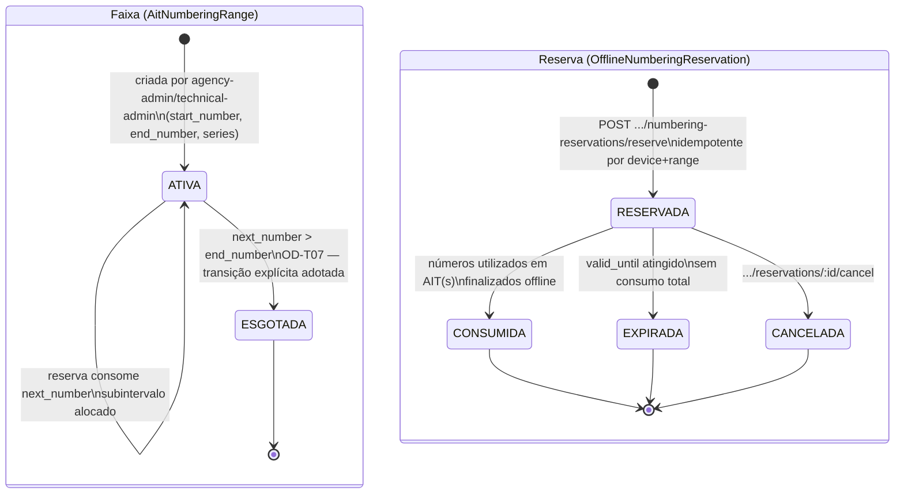

## Revisão (2026-08-24, BPO)

[REF-SENATRAN-997] confirma, com **upgrade de fonte** (de prática TEAT para mandato normativo),
o desenho já existente deste workflow: numeração sequencial automática, pré-estabelecida pela
autoridade de trânsito e pré-carregável no dispositivo para uso offline é requisito legal
explícito (art. 3º, I; Anexo II, c) — não apenas escolha técnica. OD-T07 adota a transição
`ATIVA→ESGOTADA` quando `next_number > end_number` e devolve números não consumidos de reserva
expirada a `disponivel` na reconciliação. O risco técnico de constraint de banco de
dados **também permanece aberto**, sem alteração — ver última linha da seção correspondente.

## Estados

Duas entidades compõem o ciclo: a **faixa** (`AitNumberingRange` / DD-ENT-074
`FAIXA_NUMERACAO_AIT`), o intervalo global do órgão/série, e a **reserva** (
`OfflineNumberingReservation` / DD-ENT-075 `RESERVA_NUMERACAO_OFFLINE`), o subintervalo alocado
a um agente+dispositivo para operar offline.

## Transições e gatilhos

| Transição             | Comando/rota                                           | Ator                          | Efeito                                                                                                                                                                                                                                                                                                           |
| --------------------- | ------------------------------------------------------ | ----------------------------- | ---------------------------------------------------------------------------------------------------------------------------------------------------------------------------------------------------------------------------------------------------------------------------------------------------------------- |
| Criar faixa           | administração de numeração (backoffice)                | agency-admin, technical-admin | cria `AitNumberingRange` com `series`, `start_number`, `end_number`, `next_number`, `status: active`                                                                                                                                                                                                             |
| Reservar subintervalo | `POST /v1/offline-sync/numbering-reservations/reserve` | field-agent, field-supervisor | aloca **atomicamente** `[start_number, end_number]` da faixa ativa para `device_id`+`agent_id`; idempotente por device+faixa; reservas não se sobrepõem no mesmo tenant/órgão/série; numeração sequencial automática pré-carregável offline é requisito normativo — [REF-SENATRAN-997] art. 3º, I e Anexo II, c) |
| Consumir números      | uso local ao finalizar AIT(s) offline                  | field-agent (implícito)       | cada `ait_number` emitido deve pertencer a uma reserva ativa do dispositivo — base do `content_hash`/idempotência exigidos por [INV-OFFLINE-001]                                                                                                                                                                 |
| Cancelar reserva      | `POST .../reservations/:id/cancel`                     | field-agent, field-supervisor | libera o subintervalo não utilizado                                                                                                                                                                                                                                                                              |
| Expirar reserva       | processo automático ao atingir `valid_until`           | sistema                       | reserva sai de circulação; durante a reconciliação, o subintervalo não utilizado retorna à faixa como `disponivel` (OD-T07 adotada)                                                                                                                                                                              |

## Prazos e timers (base legal por prazo)

| Timer               | Prazo                                                  | Gatilho        | Consequência                                                                  | Base   |
| ------------------- | ------------------------------------------------------ | -------------- | ----------------------------------------------------------------------------- | ------ |
| Validade da reserva | `valid_until` (parâmetro operacional, não normatizado) | reserva criada | reserva expira; números não consumidos voltam a `disponivel` na reconciliação | OD-T07 |

Não há prazo legal aplicável à reserva de numeração em si — é controle técnico interno de TEAT
para permitir emissão de números de AIT válidos e sem colisão durante operação offline. A
integridade da numeração é, porém, pressuposto do [WF-INF-003] (o AIT precisa de `ait_number`
válido e não duplicado antes de alimentar o ciclo de infração).

## Atores por transição

agency-admin/technical-admin (criação e administração de faixas); field-agent/field-supervisor
(reserva e cancelamento); sistema (expiração automática, consumo ao finalizar AIT).

## Decisões de modelagem pendentes

- **RISCO TÉCNICO — implementação a acompanhar:** as constraints de exclusão de intervalo em nível
  de banco de dados ainda não estão implementadas; a validação atual é em nível de aplicação. Esse
  risco não reabre os resultados adotados por OD-T07.
