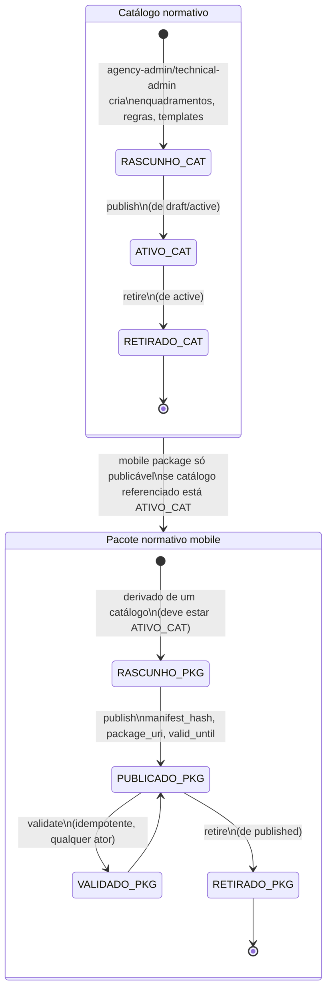
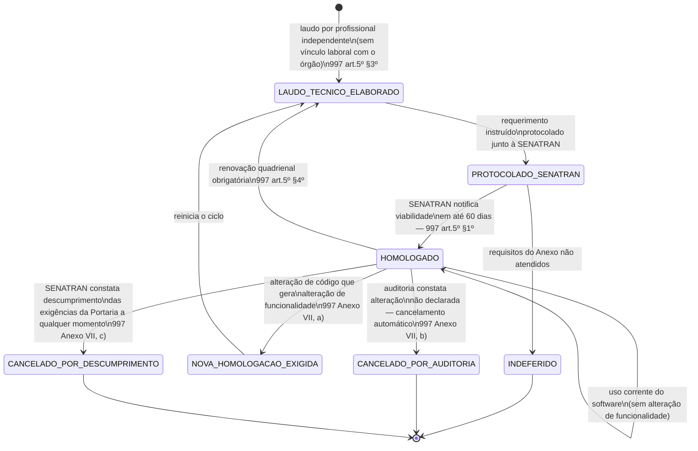

## Revisão (2026-08-24, BPO)

Achado novo desta rodada, sem alteração dos estados/transições existentes: [REF-SENATRAN-997]
art. 5º revela um **segundo ciclo de homologação**, do software do Talão Eletrônico perante a
SENATRAN, inteiramente distinto do ciclo de publicação de catálogo/pacote normativo modelado
abaixo — ver nova seção "Ciclo de homologação SENATRAN do software" ao final. É risco de roadmap
não registrado em nenhum artefato TEAT até esta revisão.

## Estados

## Transições e gatilhos

| Transição               | Comando/rota                                                              | Ator                                                         | Efeito                                                                                                                                              |
| ----------------------- | ------------------------------------------------------------------------- | ------------------------------------------------------------ | --------------------------------------------------------------------------------------------------------------------------------------------------- |
| Publicar catálogo       | `POST .../normative-catalogs/:id/publish` (de `draft`/`active`)           | agency-admin, technical-admin                                | evento `normative.catalog-published`; catálogo passa a valer para novos atos                                                                        |
| Retirar catálogo        | `POST .../normative-catalogs/:id/retire` (de `active`)                    | agency-admin, technical-admin                                | evento `normative.catalog-retired`; catálogo deixa de ser referenciável em novos atos                                                               |
| Publicar pacote mobile  | `POST .../mobile-normative-packages/:id/publish` (de `draft`/`published`) | agency-admin, technical-admin                                | evento `normative.mobile-package-published`; exige catálogo referenciado **ativo**                                                                  |
| Retirar pacote mobile   | `POST .../mobile-normative-packages/:id/retire` (de `published`)          | agency-admin, technical-admin                                | evento `normative.mobile-package-retired`                                                                                                           |
| Validar pacote mobile   | `POST .../mobile-normative-packages/:id/validate`                         | agency-admin, technical-admin, field-agent, field-supervisor | retorna `valid:false` com motivo em caso de divergência de hash/versão/status/validade — nunca expõe detalhes internos de armazenamento             |
| Instalar no dispositivo | `GET /v1/normative-catalog/mobile-normative-packages/sync-metadata`       | mobile-runtime (automático no bootstrap do turno)            | retorna apenas pacotes **publicados e não expirados**: `package_uri`, `manifest_hash`, `package_version`, timestamp de publicação, data de validade |

## Prazos e timers (base legal por prazo)

| Timer                     | Prazo                             | Gatilho    | Consequência                                                                                                               | Base                                                                                                                         |
| ------------------------- | --------------------------------- | ---------- | -------------------------------------------------------------------------------------------------------------------------- | ---------------------------------------------------------------------------------------------------------------------------- |
| Validade do pacote mobile | `valid_until` do pacote publicado | publicação | pacote expirado deixa de ser retornado por `sync-metadata`; dispositivo deve buscar pacote vigente antes de novo ato legal | "teat:docs/framework/product/workflows/phase-e-mobile.md" (passo 3: "Fetch and install the active mobile normative package") |

Não há prazo legal aplicável à publicação do catálogo em si; o requisito normativo é de
**rastreabilidade de versão**: todo ato legal deve registrar qual pacote normativo o gerou
([INV-NORMATIVE-001]), preservando a defensabilidade jurídica caso o enquadramento mude no tempo.

**Decisão do Owner (2026-08-24, steering.md E.29):** quando o pacote normativo instalado expira
em campo e o dispositivo está sem conectividade para buscar um pacote atualizado, o TEAT
**continua permitindo a lavratura**, exibindo **aviso visível ao agente** de que o pacote está
expirado — não há bloqueio de nova lavratura. O ato legal segue registrando o pacote normativo
(agora expirado) que o gerou, preservando a rastreabilidade exigida por [INV-NORMATIVE-001].

## Atores por transição

agency-admin e technical-admin publicam/retiram catálogo e pacote; field-agent e field-supervisor
apenas validam (leitura) o pacote instalado; o mobile-runtime consome `sync-metadata` de forma
automática ao iniciar o turno ou ao detectar pacote desatualizado.

## Ciclo de homologação SENATRAN do software (cross-cutting, distinto da publicação de catálogo)

Este ciclo **não substitui** a máquina de estados acima — é uma segunda engrenagem regulatória,
externa ao órgão, que condiciona se o software do Talão Eletrônico como um todo pode operar.
Enquanto `Catalogo`/`Pacote` (acima) governam o conteúdo normativo (enquadramentos, regras,
templates) publicado internamente pelo órgão, este ciclo governa a **homologação do próprio
sistema** perante a SENATRAN — nível federal, não organizacional.

| Marco                                            | Prazo/gatilho                                                                 | Base                             |
| ------------------------------------------------ | ----------------------------------------------------------------------------- | -------------------------------- |
| Decisão de viabilidade da SENATRAN               | até 60 dias do protocolo                                                      | [REF-SENATRAN-997] art. 5º §1º   |
| Renovação do laudo técnico                       | a cada 4 anos                                                                 | [REF-SENATRAN-997] art. 5º §4º   |
| Nova homologação por alteração de funcionalidade | a cada alteração de código que gere alteração de funcionalidade               | [REF-SENATRAN-997] Anexo VII, a) |
| Cancelamento por auditoria                       | a qualquer momento, se detectada alteração não declarada no sistema instalado | [REF-SENATRAN-997] Anexo VII, b) |

**Efeito de roadmap.** Qualquer release do TEAT que altere funcionalidade (não apenas conteúdo do
catálogo normativo, que segue a máquina acima sem impacto neste ciclo) é candidato a exigir nova
homologação SENATRAN, com até 60 dias de espera regulatória. **Recomenda-se ao Owner** tratar
"alteração de funcionalidade" como gate de release management, com checklist prévio — ver
`_intake/bpo-notes.md` §3 (item de roadmap). Se o software for desenvolvido pelo próprio órgão
(hipótese aplicável ao DETRAN-AM/PRODAM — ver [REF-DETRANAM-TALAO-BODYCAM] §1), a documentação
societária é dispensada, mas **não** a entrega de código-fonte e scripts de banco de dados (Anexo
VI, i-j) — implicação de compliance de produto, não de negócio de campo, registrada aqui apenas
como ponte.

Distinção operacional com [RN-TEAT-003]: `Homologation`/`ApplicationVersion.homologation_id`
modelam hoje o controle **interno** do órgão sobre qual par dispositivo+versão está autorizado a
operar — nível (b). O ciclo acima é o nível (a), federal, do **software como um todo**. Os dois
são complementares e não substituem um ao outro; RN-TEAT-003 deveria referenciar este ciclo
explicitamente.

## Homologação — duas cadeias distintas

[RN-TEAT-117] separa duas coisas que o vocabulário corrente confunde: a **homologação SENATRAN do
software** do talão eletrônico, que é do produto e se renova a cada quatro anos ou **a cada
alteração de funcionalidade**, e a **homologação interna de dispositivo e versão** pelo órgão, que é
de cada aparelho em campo e governa o gate de [RN-TEAT-003].

A consequência operacional é direta e cai sobre este workflow: publicar um pacote normativo é
rotina, mas **alterar funcionalidade do aplicativo re-dispara a homologação SENATRAN**. A distinção
tem de estar explícita no processo de release, sob pena de o órgão operar em campo com software cuja
homologação caducou sem que ninguém tenha percebido — o vício atinge, retroativamente, todos os
autos do período ([RN-DASH-134] família 1 vigia exatamente isso).

A cadeia de competência e de homologação, incluindo convênios e delegação a outros órgãos, deve ser
auditável ponta a ponta ([RN-TEAT-143]): quem delegou, a quem, para qual circunscrição, sob qual
homologação vigente. Sem essa cadeia, a presunção de veracidade do ato ([RN-TEAT-104]) não se
sustenta em contencioso.

## Decisões de modelagem pendentes

- (fonte pendente) política de retenção/expurgo de catálogos e pacotes retirados (histórico
  permanece consultável para atos já emitidos, mas o mecanismo de arquivamento não está descrito
  nas fontes lidas).
- **Resolvido — Decisão do Owner (2026-08-24, steering.md E.29):** comportamento do dispositivo
  quando o pacote instalado expira em campo, sem conectividade para buscar um novo: **continuar
  lavrando, com aviso visível ao agente** — não bloquear nova lavratura. Ver parágrafo de decisão
  em `## Prazos e timers` acima.
- (novo) Nenhuma fonte descreve o que ocorre operacionalmente entre `INDEFERIDO`/
  `CANCELADO_POR_AUDITORIA`/`CANCELADO_POR_DESCUMPRIMENTO` e a continuidade de operação do TEAT em
  campo — presume-se que o sistema não pode mais lavrar AIT válido sem homologação vigente, mas a
  fonte não descreve o mecanismo de bloqueio; decisão de arquitetura/produto a confirmar com o
  time técnico.

### Decisão 2026-09-13 (steering.md H.55) — homologação SENATRAN caducada

Mecanismo confirmado como **aviso e registro**, não bloqueio: ver [RN-TEAT-003] §Decisão. O
pacote normativo expirado já seguia a mesma disciplina (DT-110).
