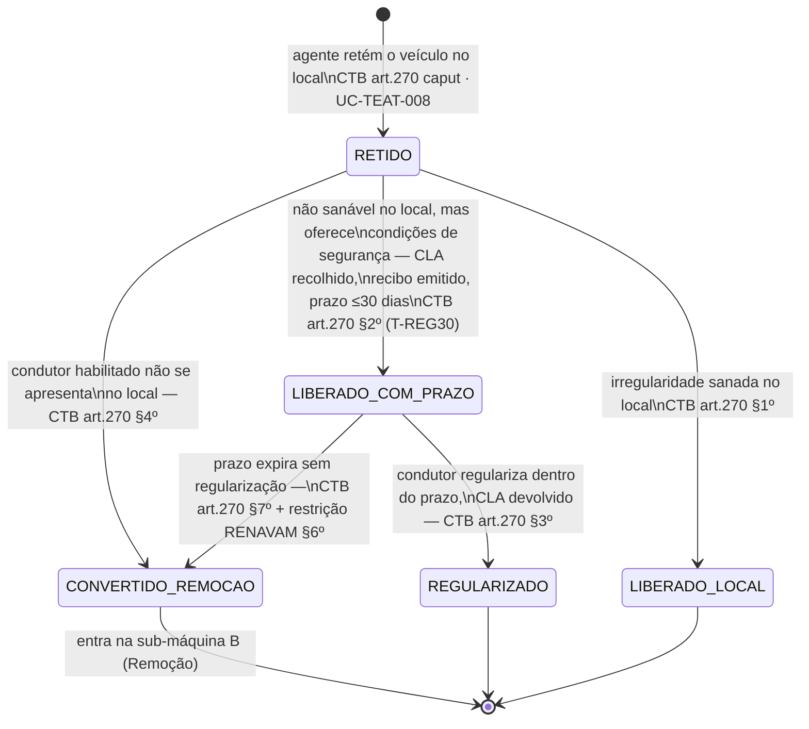

## Escopo e fronteira de campo (leia primeiro)

Este workflow modela **duas medidas administrativas encadeáveis** — retenção (CTB art. 270) e
remoção (CTB art. 271, regulamentada por [REF-CONTRAN-1025-2026]) — mais o **catálogo fechado**
de medidas administrativas do CTB art. 269, que o `AdministrativeTerm` do TEAT deve tratar como
enum, não texto livre:

| Tipo (CTB art. 269)                                                              | Natureza                                                                 |
| -------------------------------------------------------------------------------- | ------------------------------------------------------------------------ |
| I — retenção do veículo                                                          | física, no local                                                         |
| II — remoção do veículo                                                          | física, a depósito, ou guarda monitorada (novo, art. 17 Res. 1.025/2026) |
| III-VI — recolhimento de CNH/PPD/CRV/CLA                                         | físico OU digital (registro Renach/Renavam, art. 269 §5º)                |
| VIII — transbordo de excesso de carga                                            | física, no local                                                         |
| IX — teste de dosagem de alcoolemia/perícia                                      | procedimento — ver [WF-TEAT-005]                                         |
| X — recolhimento de animais soltos na via                                        | física, aplica-se arts. 271/328 no que couber                            |
| XI — exames de aptidão (física, mental, legislação, primeiros socorros, direção) | fora do escopo de campo do TEAT — ver [APP-PEC]                          |

**Corte de escopo de campo explícito**: o ato de campo do TEAT termina na **emissão do Termo de
Recolhimento do Veículo** (remoção) ou no **registro local de retenção com recibo** (retenção) —
a jornada de notificação formal (10/15 dias), o prazo de reclamação e o **leilão (CTB art. 328)**
são backoffice/patrimônio, fora do MVP de campo do TEAT, ainda que o ato de campo alimente o
marco inicial dessas contagens. O estado `LEILAO` abaixo é modelado apenas como destino de
referência, não como tela/fluxo do agente em campo.

## Estados — sub-máquina A: Retenção (CTB art. 270)



## Estados — sub-máquina B: Remoção → depósito/guarda monitorada → restituição/leilão

```mermaid
stateDiagram-v2
    [*] --> REMOVIDO : agente aciona remoção — CTB art.271;\nemite Termo de Recolhimento do Veículo\n(conteúdo mínimo, Res.1025/2026 art.14)\nUC-TEAT-009
    REMOVIDO --> EM_DEPOSITO : veículo levado a depósito físico\n(órgão público ou particular contratado —\nart.271 §4º)
    REMOVIDO --> GUARDA_MONITORADA : FORA DO MVP (decisão Owner DT-015)\nalternativa autorizada — elegibilidade\nverificada (9 requisitos, Res.1025/2026\nart.17 §1º) · UC-TEAT-009

    GUARDA_MONITORADA --> VIOLACAO_MONITORAMENTO : descumprimento/remoção/inutilização\ndo dispositivo de monitoramento\nRes.1025/2026 art.17 §3º
    VIOLACAO_MONITORAMENTO --> EM_DEPOSITO : remoção compulsória; guarda monitorada\nVEDADA para o mesmo fato gerador
    VIOLACAO_MONITORAMENTO --> [nova_infracao] : gera AIT autônomo — CTB art.239\n(entra em WF-TEAT-001 como novo ato)
    GUARDA_MONITORADA --> RESTITUIDO : cumpridas as condições, sem violação

    EM_DEPOSITO --> NOTIFICADO : proprietário/condutor ausente no ato —\nnotificação em até 10 dias\nCTB art.271 §6º; Res.1025/2026 art.15\n(marco 2027: exclusiva via SNE — art.15 §3º)
    REMOVIDO --> NOTIFICADO : proprietário/condutor presente é\nconsiderado notificado no próprio ato\n(mesmo recusando assinar) — Res.1025/2026\nart.14 §2º · [RN-TEAT-005]

    NOTIFICADO --> RESTITUIDO : pagamento de multas/taxas/despesas +\nreparo de condições de segurança\nCTB art.271 §§1º-2º
    NOTIFICADO --> LEILAO : não reclamado no prazo legal —\nCTB art.328 · FORA DO ESCOPO DE CAMPO TEAT\n(backoffice/patrimônio)

    RESTITUIDO --> [*]
    LEILAO --> [*]
```

**Nota de leitura `[nova_infracao]`**: não é um estado do domínio de medidas administrativas — é o
ponto de acoplamento em que este workflow **produz** um evento de entrada em [WF-TEAT-001]
(`[*] --> RASCUNHO_OFFLINE`, um AIT como outro qualquer por art. 239 do CTB). É o único caso, no
corpus TEAT, em que uma medida administrativa **gera** um AIT, em vez de ser gerada por um.

## Guarda monitorada — requisitos de elegibilidade (Res. 1.025/2026 art. 17 §1º)

⚠️ **Fora do MVP — decisão do Owner (2026-08-28, DT-015).** Mantido aqui como registro do
desenho; não é escopo de construção atual.

| #    | Requisito                                                                                  |
| ---- | ------------------------------------------------------------------------------------------ |
| I    | veículo oferece condições de segurança para circulação                                     |
| II   | sem indícios de adulteração de placa/chassi/motor/sinais identificadores                   |
| III  | retirado por condutor regularmente habilitado                                              |
| IV   | sem registro ativo de furto/roubo/apropriação indébita/ocorrência criminal                 |
| V    | sem restrições judiciais                                                                   |
| VI   | alienação fiduciária, se houver, não está sob execução extrajudicial                       |
| VII  | licenciado em ao menos um dos três últimos exercícios                                      |
| VIII | proprietário/possuidor não descumpriu prazo de regularização anterior (art. 271 §9º-A)     |
| IX   | inexistem circunstâncias que comprometam acompanhamento/fiscalização/efetividade da guarda |

Violação (art. 17 §3º) é dupla consequência simultânea: (a) restrição administrativa de
circulação + remoção compulsória ao depósito, com **vedação de nova guarda monitorada para o
mesmo fato gerador**; (b) autuação autônoma por CTB art. 239, de competência do próprio órgão que
aplicou a remoção.

## Documento digital — fluxo distinto do recolhimento físico (CTB art. 269 §5º)

Para CNH/PPD/CRV/CLA em meio digital (CNH-e, CRLV-e), a medida administrativa **não é apreensão
física** — é executada por **registro eletrônico** no Renach ou Renavam, conforme o caso, na
forma estabelecida pelo CONTRAN. O TEAT precisa de dois fluxos de UI/dados distintos para a mesma
medida nominal (ex. "recolhimento de CNH"): apreensão física (documento físico entregue ao
agente, custódia local) vs. registro digital (chamada de integração RENACH/RENAVAM, sem posse
física de nada). Ver `_intake/bpo-notes.md` §1.

## Prazos e timers (base legal por prazo)

| Timer        | Prazo                 | Gatilho                                                           | Consequência                                                           | Base                                              |
| ------------ | --------------------- | ----------------------------------------------------------------- | ---------------------------------------------------------------------- | ------------------------------------------------- |
| T-REG30      | 30 dias               | recibo entregue (retenção, CLA recolhido)                         | regularização não realizada → conversão em remoção + restrição RENAVAM | CTB art. 270 §§2º,6º,7º                           |
| T-REG15      | 15 dias               | recibo entregue (retenção convertida diretamente, art. 271 §9º-A) | idem, restrição RENAVAM                                                | CTB art. 271 §§9º-A,9º-C,9º-D                     |
| T-NOTIF10    | 10 dias               | remoção efetivada, proprietário/condutor ausente                  | notificação expedida (postal/edital/SNE)                               | CTB art. 271 §6º; [REF-CONTRAN-1025-2026] art. 15 |
| T-DEPOSITO6M | 6 meses               | tempo em depósito                                                 | teto de cobrança de despesas de remoção/estada                         | CTB art. 271 §10                                  |
| T-SNE2027    | marco fixo 01/01/2027 | —                                                                 | notificações de remoção passam a ser **exclusivamente** via SNE        | [REF-CONTRAN-1025-2026] art. 15 §3º               |
| T-CNH5D      | 5 dias                | recolhimento de CNH por alcoolemia (art. 165) — ver [WF-TEAT-005] | não comparecimento → documento encaminhado ao órgão de registro        | [REF-CONTRAN-432] art. 10 §1º                     |

## Atores por transição

field-agent (retenção, remoção, emissão do Termo de Recolhimento, avaliação preliminar de
elegibilidade para guarda monitorada); traffic-authority (autorização de guarda monitorada —
"prerrogativa do órgão", Res. 1.025/2026 art. 17 §1º; decisão sobre violação de monitoramento);
field-supervisor (libera retenção — já citado em [APP-TEAT] §Atores); sistema (registro
automático de restrição RENAVAM ao expirar prazo; futura integração Sivec — ver
`_intake/bpo-notes.md` §1).

## Independência AIT × medida administrativa (reafirmação, [RN-TEAT-004])

Ausência de registro da medida ou impossibilidade de sua aplicação/conclusão **não invalida** a
autuação; e a invalidação/anulação/arquivamento do AIT **não prejudica necessariamente** a medida
já aplicada — fonte doutrinária direta e simétrica em [REF-CONTRAN-985-1003-MBFT] Seção 8,
reafirmando [RN-TEAT-004].

## Decisões de modelagem pendentes

- **Sivec** ([REF-CONTRAN-1025-2026] art. 1º §§1º-2º): plataforma nacional de integração para
  remoção/guarda/liberação/leilão — candidata a nova integração auditada em [APP-TEAT], hoje não
  listada junto a RENAVAM/RENACH/RENAINF/RENAEST/SNE. Ver `_intake/bpo-notes.md` §1.
  proposta de nova RN — ver `_intake/bpo-notes.md` §RN propostas.
- ~~Guarda monitorada — MVP ou onda futura~~ — **RESOLVIDO (2026-08-28, `_meta/open-issues.md`
  DT-015):** onda futura. A submáquina B abaixo (`GUARDA_MONITORADA`, `VIOLACAO_MONITORAMENTO`) e
  a seção §Guarda monitorada continuam documentadas aqui como registro do desenho, mas **fora do
  escopo do MVP** — não ativar nem construir até nova decisão, mesmo que a tecnologia venha a ser
  homologada (o Owner rejeitou "modelar agora, ativar quando homologada").
- **Res. CONTRAN 1.025/2026** publicada há ~2 meses da pesquisa original — recomenda-se validação
  jurídica humana antes de tratar como base normativa definitiva de produto (herdado do handoff
  LEGAL do dossiê de pesquisa).
- O prazo de retirada do §1º do art. 14 (Res. 1.025/2026 — "prazo para retirada do veículo, sob
  pena de leilão") e o prazo aplicável pelo CTB são campos distintos e **ambos são impressos** no
  Termo. Têm finalidades distintas e não são valores intercambiáveis (OD-T05); `T-DEPOSITO6M`
  continua sendo o teto de despesas.
