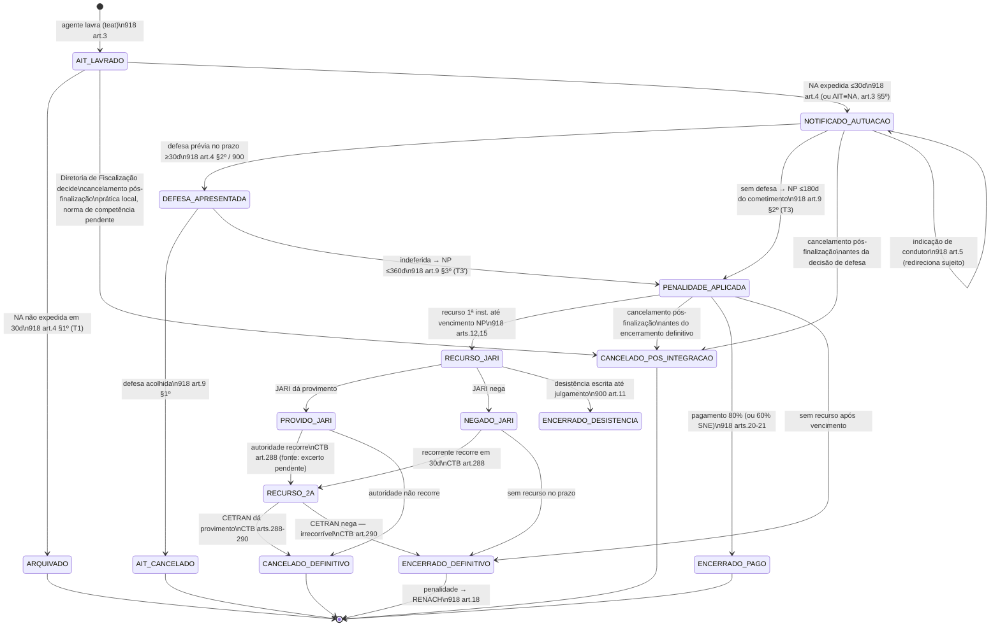

## Estados

`CANCELADO_POS_INTEGRACAO` é terminal e **não se confunde** com `AIT_CANCELADO`, que decorre do
acolhimento de defesa. Ele recebe o cancelamento administrativo de um AIT já finalizado no TEAT e
integrado a este ciclo ([WF-TEAT-001], [RN-TEAT-121]). A competência da Diretoria de Fiscalização
vem de prática local documentada por [REF-DETRANAM-TALAO-BODYCAM] e permanece sujeita à validação
jurídica DT-046. AITs oriundos de violação de guarda monitorada ou de alcoolemia entram pelo estado
comum `AIT_LAVRADO`; a origem não cria estado processual especial.

## Prazos e timers (base legal por prazo)

| Timer               | Prazo                                                                             | Gatilho           | Consequência                                                                          | Base                             |
| ------------------- | --------------------------------------------------------------------------------- | ----------------- | ------------------------------------------------------------------------------------- | -------------------------------- |
| T1 expedição NA     | 30 dias do cometimento                                                            | lavratura         | não expedida → arquivamento do AIT                                                    | 918 art.4 §1º                    |
| T2 defesa/indicação | ≥30 dias da expedição da NA                                                       | NA                | fim do prazo → segue p/ penalidade                                                    | 918 art.4 §2º                    |
| T3 NP sem defesa    | 180 dias do cometimento                                                           | sem defesa        | NP fora do prazo → (consequência a confirmar: prescrição intercorrente? Lei 9.873/99) | 918 art.9 §2º                    |
| T3' NP com defesa   | 360 dias do cometimento                                                           | defesa tempestiva | idem                                                                                  | 918 art.9 §3º                    |
| T4 recurso JARI     | até o vencimento da NP                                                            | NP                | intempestivo → não conhecimento + juros desde vencimento                              | 918 arts.12, 23 §5º; 900 art.4 I |
| T5 recurso 2ª inst. | 30 dias da ciência da decisão                                                     | decisão JARI      | (excerto CTB art.288 pendente)                                                        | CTB art.288                      |
| Contagem            | dias consecutivos; exclui dia inicial; inclui vencimento; prorroga p/ 1º dia útil | —                 | —                                                                                     | 918 art.29                       |

## Decisões de modelagem pendentes

- RESOLVIDO (2026-08-24): prazos de julgamento pelas instâncias = 24 meses por instância — CTB art. 285 §6º (JARI) e art. 289 _caput_ (CETRAN); não julgamento → prescrição da pretensão punitiva (art. 289-A, Lei 14.229/2021). O antigo art. 285 §3º está REVOGADO. Ver [REF-CTB-280-290] e [RN-RAIT-110..112]; detalhamento operacional em [WF-RAIT-001/002].
- Efeito suspensivo do recurso: 918 art.13 garante ausência de restrição até vencimento/efeito suspensivo — confirmar alcance no CTB arts. 285-288.
- Restituição de multa paga em caso de provimento (CTB art. 286 §2º) — excerto pendente.
