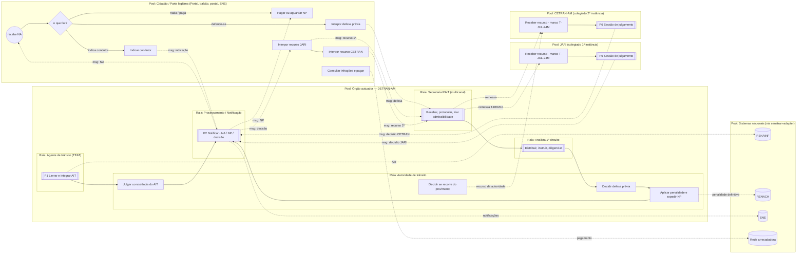
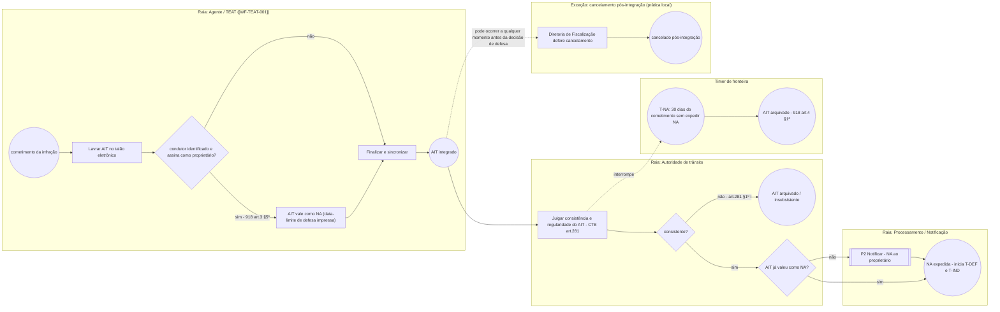
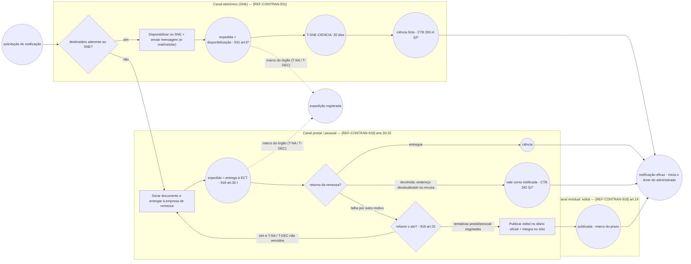
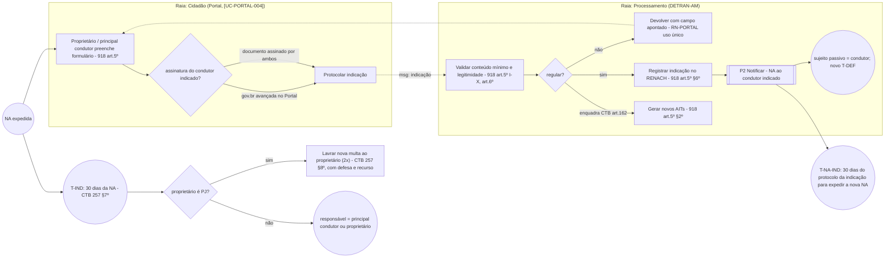
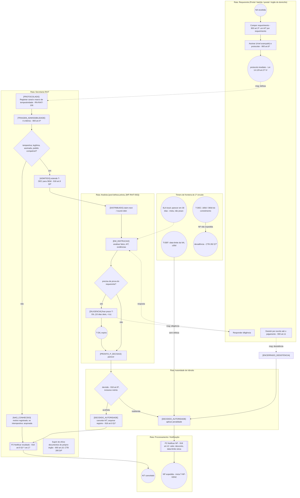
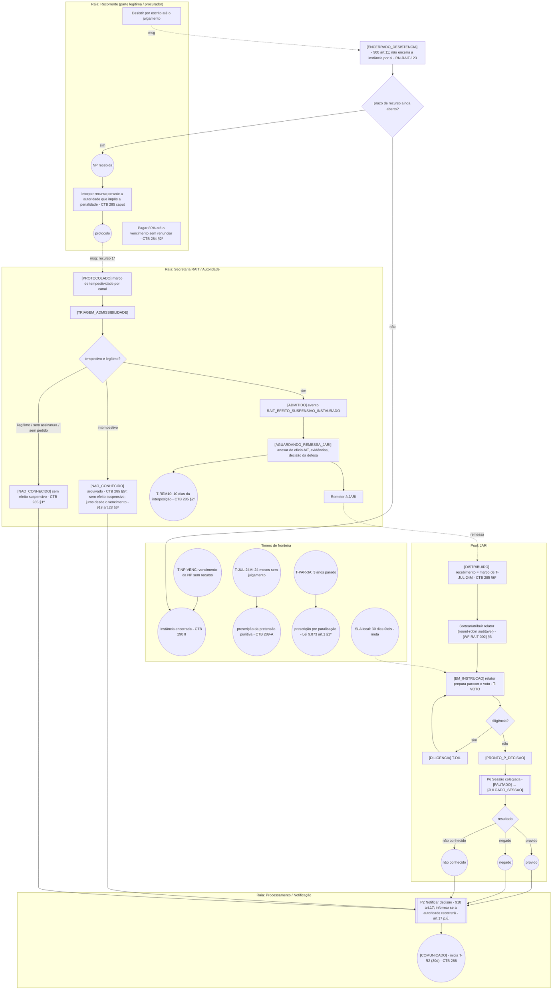
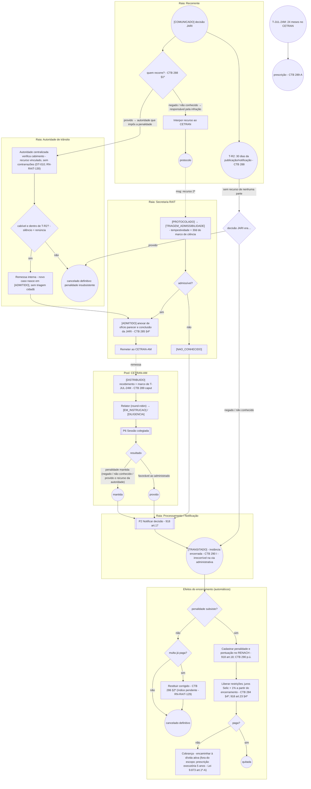
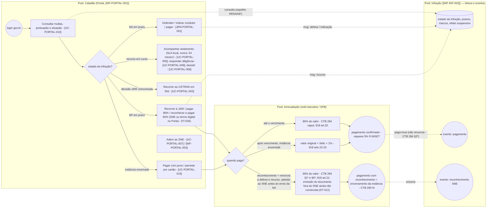
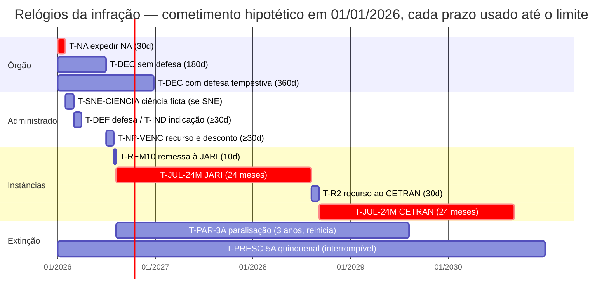

## O que este documento é

Modelo de Processo de Negócio (notação BPMN, desenhada em Mermaid) de **todos os fluxos
pertinentes à infração de trânsito** no ecossistema DETRAN: lavratura do AIT pelo agente
([WF-TEAT-001]), notificação da autuação, indicação de condutor, defesa prévia, notificação da
penalidade, recurso à JARI, recurso ao CETRAN-AM, encerramento da instância e consulta/pagamento pelo
Portal Público. O foco é o **processo interno** de recebimento, admissibilidade, distribuição e
decisão em cada nível, e a **modelagem dos prazos e timers automáticos**.

Ele não substitui as máquinas de estado existentes — ele as **costura**:

| Máquina existente | O que possui                                             | Onde entra aqui                                  |
| ----------------- | -------------------------------------------------------- | ------------------------------------------------ |
| [WF-TEAT-001]     | ciclo técnico do AIT no talão eletrônico até `INTEGRADO` | processo P1 (pool TEAT)                          |
| [WF-INF-001]      | estados legais da infração (antigo, ponteiro)            | substituído por [WF-INF-003] (Owner, 2026-09-12) |
| [WF-RAIT-001]     | ciclo operacional do caso (defesa, JARI, CETRAN)         | processos P4, P5, P7                             |
| [WF-RAIT-002]     | distribuição, pools e escada de SLA anti-prescrição      | sub-processo "Distribuir"                        |
| [WF-RAIT-003]     | sessão colegiada (pauta, quorum, votação, ata)           | processo P6                                      |
| [WF-PORTAL-001]   | ciclo genérico de solicitação do cidadão                 | pool Cidadão (P8)                                |
| [WF-PORTAL-003]   | adesão/notificação eletrônica do Portal                  | pool Cidadão (P2, P8)                            |

A **máquina de estados consolidada da infração**, derivada destes processos, está em
[WF-INF-003] — que, por decisão do Owner (2026-09-12), substitui [WF-INF-001]. Este documento
segue `draft` até revisão própria do Owner.

## Convenções de notação (BPMN em Mermaid)

| Elemento BPMN                         | Forma neste documento                              | Exemplo                        |
| ------------------------------------- | -------------------------------------------------- | ------------------------------ |
| Evento de início / fim                | círculo `((…))`                                    | `((AIT integrado))`            |
| Evento intermediário de tempo (timer) | círculo com código `T-…`                           | `((T-NA 30d))`                 |
| Evento de mensagem                    | círculo com prefixo `msg`                          | `((msg: NA))`                  |
| Tarefa (humana ou de sistema)         | retângulo `[…]`                                    | `[Triagem de admissibilidade]` |
| Sub-processo                          | retângulo duplo `[[…]]`                            | `[[Notificar]]`                |
| Gateway exclusivo (XOR)               | losango `{…}`                                      | `{tempestivo?}`                |
| Gateway baseado em evento             | losango com prefixo `⧖`                            | `{⧖ o que ocorre primeiro?}`   |
| Fluxo de sequência                    | seta cheia `-->`                                   |                                |
| Fluxo de mensagem entre pools         | seta tracejada `-.->`                              |                                |
| Pool / raia                           | `subgraph` (pool) com `subgraph` aninhados (raias) |                                |

Códigos de timer são os do catálogo da §9 — os que já existem em [WF-RAIT-001] (`T-REM10`, `T-DIL`,
`T-R2`, `T-JUL-24M`, `T-PAR-3A`, `T-DEC`, `T-VOTO`, `T-CONV`) e em [WF-PORTAL-003]
(`T-SNE-CIENCIA`) foram **preservados** com o mesmo significado; os novos (`T-NA`, `T-DEF`,
`T-IND`, `T-NA-IND`, `T-NP-VENC`, `T-PRESC-5A`) cobrem o trecho do ciclo que o antigo [WF-INF-001] desenhava (com os nomes T1…T5).

## §0 — Mapa de colaboração (pools e mensagens)

Leitura: a infração é o **objeto de negócio que atravessa os cinco pools**; cada pool tem seu próprio
processo e sua própria máquina, e a coordenação se faz por **mensagens** (NA, NP, defesa, recurso,
remessa, decisão) e por **timers**. Os pools de JARI e CETRAN são desenhados separados do DETRAN-AM
porque são órgãos colegiados com competência própria (CTB arts. 285 e 289; [REF-CONTRAN-357] item
4.1.c veda a dupla composição), ainda que o apoio administrativo seja do DETRAN-AM.

## §1 — P1: Lavratura, consistência e expedição da NA

Cobre o trecho entre o cometimento e a notificação da autuação. O timer `T-NA` corre **desde o
cometimento** — parte dele já foi consumida enquanto o AIT tramitava no talão eletrônico.

Regras que o desenho aplica:

- **Consistência antes de notificar** — a autoridade "julgará a consistência do auto de infração"
  ([REF-CTB-280-290] art. 281). A fila produz **três** desfechos: aceito; corrigido (erro material em
  elemento não essencial, com aprovação da autoridade); arquivado e julgado **insubsistente**
  (art. 281 §1º, I) — este último é decisão vinculada, distinta do arquivamento por decurso do prazo
  da NA (§1º, II), embora ambos sejam terminais sem penalidade ([RN-TEAT-119]).
- **`T-NA` é fatal e automático** — a não expedição da NA em 30 dias do cometimento arquiva o AIT
  ([REF-CONTRAN-918] art. 4º §1º; CTB art. 281 §1º, II). O sistema deve produzir esse arquivamento
  **sem provocação do interessado**. Para autuações **não flagrantes**, o termo inicial é a data do
  conhecimento pelo órgão (CTB art. 282 §6º-A), critério de flagrante conforme
  [REF-CONTRAN-985-1003-MBFT] Seção 7 — o procedimento de contagem fora do flagrante segue
  **(fonte pendente)**, ver [RN-TEAT-108].
- **AIT que vale como NA** — quando o condutor autuado é o proprietário (ou principal condutor
  previamente identificado) e assina o AIT com a data-limite de defesa, dispensa-se a NA
  ([REF-CONTRAN-918] art. 3º §5º; CTB art. 281-A). O marco de ciência é a assinatura
  ([RN-RAIT-104]).
- **Cancelamento pós-integração** — competência da Diretoria de Fiscalização é prática local
  documentada em [REF-DETRANAM-TALAO-BODYCAM], pendente de norma de competência ([RN-TEAT-121]);
  o conteúdo legal do AIT é imutável, o cancelamento é ato apenso.

## §2 — P2: Notificar (sub-processo reutilizável: NA, NP e decisões)

Um único sub-processo serve às três notificações do ciclo (NA, NP, comunicação de decisão). O que
muda é **qual timer o evento de saída inicia**. O ponto crítico é que **cada canal fixa um marco
diferente** ([RN-RAIT-104]).

Regras:

- **Dois marcos, sempre persistidos separadamente**: a **expedição** (relevante para os prazos do
  órgão — `T-NA`, `T-DEC`) e a **ciência** (relevante para os prazos do administrado — `T-DEF`,
  `T-NP-VENC`). No SNE eles distam 30 dias ([REF-CONTRAN-931] arts. 4º §6º e 5º) — confundi-los
  encurta o prazo do cidadão ([RN-RAIT-104]).
- **Leitura pelo cidadão é irrelevante** para a contagem ([REF-CONTRAN-931] art. 4º §7º).
- **Edital é residual e dispensado pelo SNE** ([REF-CONTRAN-918] art. 14 §4º; [RN-RAIT-126]).
- **Refazimento** de notificação falha só dentro dos prazos ([REF-CONTRAN-918] art. 31) — e o sistema
  **bloqueia** refazer a NP depois de vencida a decadência ([RN-RAIT-126], interpretação a validar).

## §3 — P3: Indicação do condutor infrator

Regras:

- O prazo de indicação é de **30 dias contados da notificação da autuação** (CTB art. 257 §7º); o
  formulário acompanha a NA ([REF-CONTRAN-918] art. 5º). Na prática, `T-IND` e `T-DEF` vencem juntos.
- A **nova NA ao condutor indicado** tem prazo próprio de expedição de 30 dias contados do protocolo
  da indicação — inclusive quando feita por canal digital (modelo CETRAN-PR,
  [REF-CETRAN-PROCESSO-INTERNO]; [REF-CONTRAN-918] art. 5º §3º).
- **Pessoa jurídica** que não indica sofre **multa dobrada em novo AIT**, com direito a defesa e
  recurso — o RAIT deve aceitar processos com esse objeto ([REF-CTB-280-290] art. 257 §8º).
- O possuidor por arrendamento/comodato/aluguel (contrato ≥180 dias) e o principal condutor
  **equiparam-se ao proprietário** ([REF-CONTRAN-918] arts. 5º §8º e 8º; [RN-RAIT-120]).

## §4 — P4: Defesa prévia (1º circuito) — do recebimento à NP

Este é o processo interno central da 1ª fase. Os estados entre colchetes são os do caso RAIT
([WF-RAIT-001]); o evento de saída alimenta a máquina da infração ([WF-INF-003]).

Regras que o desenho aplica:

- **Admissibilidade é rol fechado** — intempestividade, ilegitimidade, falta de assinatura, pedido
  ausente/incompatível ([REF-CONTRAN-900] art. 4º; [RN-RAIT-001], [RN-RAIT-122]). A tempestividade
  usa o **marco do canal** (postagem na ECT, protocolo no órgão do domicílio, protocolo eletrônico) —
  nunca a data em que a peça chega ao julgador ([RN-RAIT-106]).
- **Nunca exigir documento do próprio órgão**; o órgão supre de ofício ([REF-CTB-280-290] art. 285
  §4º; [REF-CONTRAN-900] arts. 5º p.ú. e 10; [RN-RAIT-003]).
- **Diligência não arquiva**: expirado `T-DIL`, julga-se no estado em que se encontra
  ([REF-CONTRAN-900] art. 9º p.ú.; [RN-RAIT-004]).
- **Defesa tempestiva estende a decadência** de 180 para 360 dias ([REF-CONTRAN-918] art. 9º §3º;
  [RN-RAIT-114]). Defesa **não conhecida por intempestividade** não estende — não foi "apresentada em
  tempo hábil".
- **Defesa não conhecida segue o rito de "sem defesa"**: aplica-se a penalidade e o direito recursal
  nasce da NP (caminho adotado em [WF-RAIT-001] §Decisões pendentes, a confirmar com LEGAL).
- **A NP carrega uma única data** que vale, ao mesmo tempo, para recorrer e para pagar com desconto
  ([REF-CONTRAN-918] art. 12 IV; CTB art. 282 §§4º-5º; [RN-RAIT-102]).
- **Pagamento antecipado** em qualquer fase não interrompe o processo; a NP sai "sem código de
  barras", com o prazo de recurso ([REF-CONTRAN-918] art. 33).

## §5 — P5: Recurso à JARI (2º circuito, 1ª instância)

Regras:

- **Interposição perante a autoridade** que impôs a penalidade, não perante a JARI; efeito suspensivo
  **automático, _ope legis_** ([REF-CTB-280-290] art. 285 _caput_; [RN-RAIT-108]). Enquanto vigente,
  **nenhuma restrição** (licenciamento, transferência) e **nenhum encargo moratório**
  ([REF-CONTRAN-918] art. 13; CTB art. 284 §3º).
- **Duas datas obrigatórias**: interposição (marco de `T-REM10`) e **recebimento pela JARI** (marco de
  `T-JUL-24M`). Só a segunda inicia o relógio do art. 289-A ([REF-CTB-280-290] art. 285 §§2º e 6º;
  [RN-RAIT-107], [RN-RAIT-110]). O descumprimento dos 10 dias **não tem sanção legal expressa** — é
  alerta, não transição.
- **Intempestivo é arquivado** (lei) e **ilegítimo é não conhecido** (resolução) — motivos distintos,
  nunca uniformizados ([RN-RAIT-109]). Se o vencimento já passou, a instância já se encerrou pela
  não interposição (art. 290 II); o não conhecimento não a reabre.
- **Advertência por escrito**: não cabe recurso à JARI da decisão que aplica advertência solicitada
  pelo infrator, salvo se concomitante à defesa ([REF-CONTRAN-918] art. 11 §2º) — guarda de entrada do
  processo, não estado.
- **Pagar não é desistir** ([REF-CTB-280-290] art. 284 §2º; art. 286 _caput_ veda _solve et repete_);
  a única hipótese em que pagar equivale a reconhecer é o desconto de 40% pelo SNE (art. 284 §1º).

## §6 — P6: Sessão de julgamento colegiado (JARI e CETRAN-AM)

Sub-processo comum aos dois colegiados, parametrizado por `orgao_julgador`. Detalhamento completo
(pauta, convocação, quorum, votação, empate, ata) em [WF-RAIT-003]; aqui, o esqueleto com os timers.

```mermaid
flowchart LR
    S0((casos PRONTO_P_DECISAO)) --> P1["[FORMANDO_PAUTA] presidente prioriza ALERTA_N3 / CRITICO"]
    P1 --> P2["[PAUTA_FECHADA]"] --> tmc((T-CONV: 5 dias úteis mín. - pendente regimento))
    tmc --> P3["[CONVOCACAO_ENVIADA]"] --> P4["[SESSAO_ABERTA]"]
    P4 --> G1{"quorum? - 357 item 8.2 / 901 item 12.2"}
    G1 -->|não| P5["[SESSAO_ADIADA] - relógios continuam correndo"] --> P1
    G1 -->|sim| P6["[RELATORIA_LIDA] parecer + voto do relator"]
    P6 --> P7["[VOTACAO] maioria simples"]
    P7 --> G2{empate?}
    G2 -->|sim| P8["[DESEMPATE_PRESIDENTE] voto de qualidade - 901 item 12.3"] --> P9
    G2 -->|não| P9["[DECISAO_PROCLAMADA] fundamentada - 357 item 8.3"]
    P9 --> P10["[ATA_LAVRADA]"] --> P11["[ATA_ASSINADA] PAdES+TSA"]
    P11 --> S1(("retorna ao caso: [JULGADO_SESSAO]"))
    P6 -. "vedada por padrão (decisão Owner DT-011)" .-> P12["[SUSTENTACAO_ORAL]"]
```

- **Impedimento**: membro que lavrou o AIT não julga o próprio recurso ([REF-CONTRAN-357] item
  5.1.c) — tratado na distribuição ([WF-RAIT-002] §5).
- **Sessão adiada não suspende nenhum relógio** — adiamentos repetidos são sinal de risco a
  monitorar no dashboard.

## §7 — P7: Recurso ao CETRAN-AM (2ª instância), encerramento da instância e efeitos

Regras:

- **Legitimidade bilateral** ([REF-CTB-280-290] art. 288 §1º): não provimento → recorre o
  responsável; provimento → recorre a autoridade. O regime do recurso da autoridade não tem
  disciplina normativa ([RN-RAIT-130]); **decisão do Owner (DT-010)**: recurso **vinculado**,
  exercido por **autoridade centralizada** (não pelas 55 autoridades investidas), **sem
  contrarrazões** do cidadão; o cargo/setor competente e o prazo próprio seguem sem resposta — os
  casos de uso operam com a janela de 30 dias do art. 288 e **silêncio = renúncia** ([UC-RAIT-008]).
- **Recurso do cidadão** ao CETRAN passa por triagem completa (nova petição); **recurso da autoridade**
  nasce admitido (legitimidade presumida pelo cargo) — [WF-RAIT-001] §Reentrância.
- **O CETRAN encerra a instância** ([REF-CTB-280-290] art. 290 I); não há 3ª instância ordinária.
  A revisão pós-encerramento por fato novo ([REF-LEI-9784-1999] art. 65, subsidiário) fica
  registrada como possibilidade jurídica, mas **o Owner decidiu não oferecer canal de revisão
  pós-encerramento** (steering C.22; [RN-RAIT-119]) — não há transição para isso em [WF-INF-003].
- **Um relógio de 24 meses por instância**, cada um contado do recebimento naquela instância; o
  intervalo entre instâncias **não é computado** ([RN-RAIT-111], [RN-RAIT-112]).
- **RENACH só depois de esgotados os recursos** ([REF-CONTRAN-918] art. 18; [RN-RAIT-131]).
- **Restituição corrigida** é consequência automática do provimento com pagamento prévio, não
  requerimento do cidadão ([REF-CTB-280-290] art. 286 §2º; [RN-RAIT-129]).

## §8 — P8: Portal Público — consulta de infrações, adesão ao SNE e pagamento

Regras:

- **Consultar não exige elevação de nível**; defender, indicar condutor e recorrer exigem assinatura
  **avançada** ([REF-DECRETO-10543-2020] art. 4º II; [RN-PORTAL-101]).
- O Portal **nunca decide mérito** ([WF-PORTAL-001]); ele exibe o estado da infração, os prazos do
  cidadão (data-limite impressa) e os efeitos (efeito suspensivo, "sem restrição enquanto tramita").
- **Pagar não renuncia** ao questionamento (CTB art. 284 §2º) — exceto no reconhecimento pelo SNE, que
  **encerra a instância** (CTB art. 290 III) e por isso é evento de transição em [WF-INF-003].
- **Parcelamento é operação de cartão**, à vista para o órgão; não altera data de quitação nem é
  moratória ([REF-CONTRAN-918] arts. 24 §3º e 27; [RN-PORTAL-126]).

## §9 — Catálogo de timers automáticos

Todos os timers são **eventos de tempo do sistema**: o motor de prazos os cria ao entrar no estado
que os ativa, cancela-os ao sair e dispara a transição ou o alerta indicado quando vencem. Nenhum
depende de ação humana para vencer.

### 9.1 Regras gerais de contagem

| Regra                      | Conteúdo                                                                                                            | Base                                                    |
| -------------------------- | ------------------------------------------------------------------------------------------------------------------- | ------------------------------------------------------- |
| Unidade                    | dias **consecutivos** (corridos); exclui o dia da notificação/publicação, inclui o do vencimento                    | [REF-CONTRAN-918] art. 29; [RN-RAIT-005]                |
| Vencimento em dia não útil | prorroga ao 1º dia útil (calendário **nacional + AM**, porta injetável)                                             | [REF-CONTRAN-918] art. 29 p.ú.; [WF-RAIT-002] §7        |
| `T-DIL`                    | única exceção em **dias úteis** (parâmetro operacional do Owner)                                                    | [WF-RAIT-001]; steering A.7                             |
| Suspensão                  | **nunca automática**; só força maior por ato motivado e auditado, enquanto o regulamento CONTRAN não é localizado   | [REF-CTB-280-290] art. 290-A; [RN-RAIT-105]             |
| Data impressa              | `T-DEF` e `T-NP-VENC` usam a **data impressa** na NA/NP como valor autoritativo; o piso legal (30 dias) é validação | CTB arts. 281-A e 282 §4º; [RN-RAIT-101], [RN-RAIT-102] |
| Marco por canal            | expedição (postal/SNE) × ciência ficta (SNE +30d) × publicação (edital) × assinatura (AIT≡NA)                       | [RN-RAIT-104]                                           |
| Tempestividade de peça     | postagem na ECT / protocolo no órgão do domicílio / protocolo eletrônico / balcão                                   | [REF-CONTRAN-900] art. 6º; [RN-RAIT-106]                |

### 9.2 Timers do ciclo da infração

| Código          | Antigo ([WF-INF-001]) | Prazo                                          | Termo inicial                                                                                                                                                                              | Ativo no estado ([WF-INF-003])                 | Ao vencer                                                                          | Base                                                                           |
| --------------- | --------------------- | ---------------------------------------------- | ------------------------------------------------------------------------------------------------------------------------------------------------------------------------------------------ | ---------------------------------------------- | ---------------------------------------------------------------------------------- | ------------------------------------------------------------------------------ |
| `T-NA`          | T1                    | 30 dias                                        | cometimento (não flagrante: conhecimento pelo órgão — contagem pendente)                                                                                                                   | `AIT_LAVRADO`                                  | **transição** → `ARQUIVADO` (motivo `na_nao_expedida`)                             | [REF-CONTRAN-918] art. 4º §1º; CTB art. 281 §1º II                             |
| `T-SNE-CIENCIA` | —                     | 30 dias                                        | disponibilização no SNE + envio da mensagem                                                                                                                                                | qualquer notificação por SNE                   | **marco**: fixa a ciência do administrado                                          | CTB art. 282-A §2º; [REF-CONTRAN-931] art. 4º §6º                              |
| `T-DEF`         | T2                    | data impressa na NA (≥30 dias da expedição)    | expedição da NA / ciência conforme canal                                                                                                                                                   | `NOTIFICADO_AUTUACAO`                          | **transição** → `PENALIDADE_A_APLICAR` (sem defesa)                                | [REF-CONTRAN-918] art. 4º §2º; CTB art. 281-A; [RN-RAIT-101]                   |
| `T-IND`         | —                     | 30 dias                                        | notificação da autuação                                                                                                                                                                    | `NOTIFICADO_AUTUACAO`                          | **regra**: responsável = principal condutor/proprietário; PJ → novo AIT dobrado    | CTB art. 257 §§7º-8º                                                           |
| `T-NA-IND`      | —                     | 30 dias                                        | protocolo da indicação de condutor                                                                                                                                                         | `INDICACAO_EM_PROCESSAMENTO`                   | **transição** → `ARQUIVADO` quanto ao condutor indicado (a validar)                | [REF-CONTRAN-918] art. 5º §3º; [REF-CETRAN-PROCESSO-INTERNO] (PR)              |
| `T-DEC`         | T3 / T3'              | 180 dias; 360 dias se defesa tempestiva        | cometimento (não flagrante: §6º-A)                                                                                                                                                         | `AIT_LAVRADO` → `PENALIDADE_A_APLICAR`         | **transição** → `EXTINTO_DECADENCIA` se NP não expedida                            | CTB art. 282 §§6º-7º; [REF-CONTRAN-918] art. 9º §§2º-3º; [RN-RAIT-114]         |
| `T-NP-VENC`     | T4                    | data impressa na NP (≥30 dias da notificação)  | notificação da penalidade (ciência conforme canal)                                                                                                                                         | `NOTIFICADO_PENALIDADE`                        | **transição** → `INSTANCIA_ENCERRADA` (não interposição); fim do desconto          | CTB art. 282 §§4º-5º e 290 II; [REF-CONTRAN-918] art. 12 IV                    |
| `T-REM10`       | —                     | 10 dias                                        | interposição do recurso à JARI                                                                                                                                                             | `RECURSO_1A_INSTANCIA` (sub `remessa`)         | **alerta** (SLA legal do órgão, sem sanção expressa)                               | CTB art. 285 §2º; [RN-RAIT-107]                                                |
| `T-JUL-24M`     | —                     | 24 meses (um por instância)                    | recebimento do recurso pelo órgão julgador (JARI; depois CETRAN)                                                                                                                           | `RECURSO_1A_INSTANCIA`, `RECURSO_2A_INSTANCIA` | **transição** → `EXTINTO_PRESCRICAO`; escada de alertas 12/18/21/23 meses          | CTB arts. 285 §6º, 289, 289-A; [RN-RAIT-110]…[RN-RAIT-112]; [WF-RAIT-002] §4.1 |
| `T-DIL`         | —                     | 15 dias úteis, prorrogável 1x                  | abertura da diligência                                                                                                                                                                     | caso RAIT em `DILIGENCIA`                      | **transição** do caso → `PRONTO_P_DECISAO` (julga no estado)                       | [REF-CONTRAN-900] art. 9º p.ú.; [RN-RAIT-004]                                  |
| `T-R2`          | T5                    | 30 dias fixos                                  | **publicação** da decisão da JARI (decisão Owner C.24; para a autoridade, o mesmo marco)                                                                                                   | `AGUARDANDO_RECURSO_2A`                        | **transição** → `INSTANCIA_ENCERRADA` (negado) ou `CANCELADO_DEFINITIVO` (provido) | CTB art. 288; [RN-RAIT-103], [RN-RAIT-130]                                     |
| `T-PAR-3A`      | —                     | 3 anos sem movimentação                        | último ato registrado (reinicia a cada movimentação)                                                                                                                                       | qualquer estado pendente de julgamento         | **transição** → `EXTINTO_PRESCRICAO` (validade para órgão estadual a validar)      | [REF-LEI-9873-1999] art. 1º §1º; [RN-RAIT-113]                                 |
| `T-PRESC-5A`    | —                     | 5 anos                                         | prática do ato; **interrompido** só pelas hipóteses do art. 2º (notificação, inclusive edital; ato inequívoco de apuração); se a NP interrompe é questão aberta — **sem auto-reset na NP** | todo o ciclo até o encerramento                | **transição** → `EXTINTO_PRESCRICAO` (idem); escada 30/45/54/60 meses              | [REF-LEI-9873-1999] arts. 1º e 2º; [REF-CONTRAN-918] art. 36; [RN-RAIT-113]    |
| `T-VOTO`        | —                     | 20 dias (proposta)                             | distribuição ao relator                                                                                                                                                                    | caso RAIT em `EM_INSTRUCAO` (2º circuito)      | **alerta** → advertência do relator (modelo CETRAN-ES)                             | [WF-RAIT-003] (pendente regimento)                                             |
| `T-CONV`        | —                     | 5 dias úteis (proposta)                        | fechamento da pauta                                                                                                                                                                        | sessão em `PAUTA_FECHADA`                      | **guarda**: convocação insuficiente invalida a sessão                              | [WF-RAIT-003] (pendente regimento)                                             |
| SLA-30          | —                     | 30 dias (defesa) / 30 dias úteis (JARI) — meta | protocolo / entrada na JARI                                                                                                                                                                | 1º e 2º circuitos                              | **indicador** de qualidade; nunca transição                                        | [REF-DETRANAM-SERVICOS]; [WF-RAIT-002] §4.4                                    |

### 9.3 Linha do tempo de referência (dia 0 = cometimento, caso sem atrasos)

A linha do tempo é **ilustrativa**: mostra que o teto legal somado (24 + 24 meses) ultrapassa em
muito os prazos do cidadão, e por que a escada de alertas de [WF-RAIT-002] existe. O SLA local
(30 dias) não aparece porque não é prazo.

## §10 — Eventos de mensagem entre pools (contrato)

| Evento                              | De → Para               | Conteúdo mínimo                                                     | Efeito em [WF-INF-003]                                 |
| ----------------------------------- | ----------------------- | ------------------------------------------------------------------- | ------------------------------------------------------ |
| `AIT_INTEGRADO`                     | TEAT → INF              | ait_id, cometimento, flagrante?, sujeito, AIT≡NA?                   | cria a infração em `AIT_LAVRADO`; arma `T-NA`, `T-DEC` |
| `NOTIFICACAO_EXPEDIDA`              | P2 → INF                | tipo (NA/NP/decisão), canal, data_expedicao, data_limite impressa   | marco do órgão                                         |
| `NOTIFICACAO_CIENCIA`               | P2 → INF                | data_ciencia (efetiva/ficta/publicação/assinatura)                  | arma `T-DEF` ou `T-NP-VENC`                            |
| `CONDUTOR_INDICADO`                 | Portal → INF            | condutor, protocolo, assinaturas                                    | `INDICACAO_EM_PROCESSAMENTO`                           |
| `RAIT_CASO_PROTOCOLADO`             | RAIT → INF, Portal      | caso_id, instancia, canal, marco de tempestividade                  | `DEFESA_EM_JULGAMENTO` / `RECURSO_*`                   |
| `RAIT_EFEITO_SUSPENSIVO_INSTAURADO` | RAIT → INF              | caso_id                                                             | `efeito_suspensivo=true`; bloqueia restrições          |
| `RAIT_RECURSO_RECEBIDO_JULGADOR`    | RAIT → INF, Dashboard   | caso_id, órgão, data_recebimento                                    | arma `T-JUL-24M` da instância                          |
| `RAIT_DECISAO_PUBLICADA`            | RAIT → INF, Portal, SNE | caso_id, decisão (acolhida/indeferida/provido/negado/não conhecido) | transição de fase                                      |
| `RAIT_CASO_TRANSITADO`              | RAIT → INF              | caso_id                                                             | `INSTANCIA_ENCERRADA` / `CANCELADO_DEFINITIVO`         |
| `PAGAMENTO_CONFIRMADO`              | Arrecadação → INF       | valor, faixa (80/60/100+juros), reconhecimento?                     | `pago=true`; se reconhecimento SNE → encerra instância |
| `PENALIDADE_DEFINITIVA`             | INF → RENACH (adapter)  | ait_id, pontuação, sujeito                                          | efeito de `INSTANCIA_ENCERRADA`                        |
| `RESTITUICAO_DEVIDA`                | INF → Arrecadação       | valor pago, índice                                                  | efeito de `CANCELADO_DEFINITIVO` com `pago=true`       |

## Diagramas renderizados (SVG)

Renderizados a partir dos blocos Mermaid deste documento (Mermaid 11.4.1, tema neutro); regenerar
sempre que um bloco mudar.

| Seção | Arquivo                                                                   |
| ----- | ------------------------------------------------------------------------- |
| §0    | [mapa de colaboração](./diagrams/WF-INF-002-s0-mapa-colaboracao.svg)      |
| §1    | [lavratura e NA](./diagrams/WF-INF-002-s1-lavratura-na.svg)               |
| §2    | [notificar](./diagrams/WF-INF-002-s2-notificar.svg)                       |
| §3    | [indicação de condutor](./diagrams/WF-INF-002-s3-indicacao-condutor.svg)  |
| §4    | [defesa prévia](./diagrams/WF-INF-002-s4-defesa-previa.svg)               |
| §5    | [recurso à JARI](./diagrams/WF-INF-002-s5-recurso-jari.svg)               |
| §6    | [sessão colegiada](./diagrams/WF-INF-002-s6-sessao-colegiada.svg)         |
| §7    | [CETRAN e encerramento](./diagrams/WF-INF-002-s7-cetran-encerramento.svg) |
| §8    | [portal público](./diagrams/WF-INF-002-s8-portal.svg)                     |
| §9.3  | [linha do tempo](./diagrams/WF-INF-002-s9-linha-do-tempo.svg)             |

Página consolidada com todos os diagramas embutidos (este documento e [WF-INF-003]):
[Trilha da Infração de Trânsito](./diagrams/trilha-infracao.html).

## Decisões de modelagem pendentes

- **Contagem de `T-NA`/`T-DEC` fora do flagrante** (CTB art. 282 §6º-A) — procedimento CONTRAN não
  localizado; até lá, o motor usa o cometimento e registra a data de conhecimento pelo órgão para
  auditoria ([RN-TEAT-108]).
- **Desfecho de `T-NA-IND` vencido** (NA ao condutor indicado não expedida em 30 dias) — a norma dá o
  termo inicial, não a consequência; proposta: a indicação perde efeito quanto ao condutor e a
  responsabilidade retorna ao proprietário, **sem** reabrir `T-NA` do AIT original. Validar com LEGAL.
- **Prazo e cargo do recurso vinculado da autoridade** ([RN-RAIT-130], DT-010; prazo de 30 dias decidido em 2026-09-13, steering H.47) — natureza e
  ausência de contrarrazões já decididas pelo Owner; prazo próprio e setor competente seguem
  abertos; o desenho usa a janela de 30 dias do art. 288 contada da publicação.
- **Escada do relógio B**: [RN-RAIT-112] fixa quatro degraus (crítico em 21 meses) e [WF-RAIT-002]
  §4.1 cinco (crítico em 23 meses) — este documento segue [WF-RAIT-002] (aprovado em steering A.1);
  reconciliar a RN.
- **Efeito da desistência da defesa prévia sobre a extensão a 360 dias** — em aberto
  (legal-assessment, item 17); o desenho mantém 360 dias porque a defesa foi apresentada em tempo
  hábil.
- **Efeito de `T-JUL-24M` vencido** — prescrição automática declarável de ofício (leitura de
  [RN-RAIT-112]); se o julgamento tardio é nulo ou ineficaz segue em aberto.
- **Validade de `T-PAR-3A` e `T-PRESC-5A`** para órgão estadual via [REF-CONTRAN-918] art. 36 —
  questão jurídica aberta ([RN-RAIT-113]); modelados como relógios com alerta, transição a confirmar.
- **Desconto de 40% sem adesão do órgão ao SNE** (Lei 14.599/2023) — conflito com [REF-CONTRAN-918]
  art. 21 ([RN-RAIT-127]); o gateway de pagamento do P8 expõe a condição como parâmetro.
- **Prazo institucional de "120 dias"** citado pela Sub Gerência de Infração ([APP-RAIT]) — não
  reconciliado; não adotado.

## Decisões

- **2026-09-12** — redação inicial (rodada de modelagem BPM, Owner). Sem decisões vinculantes; o
  documento propõe a costura dos workflows existentes e o catálogo unificado de timers, e serve de
  base à máquina de estados consolidada em [WF-INF-003].
- **2026-09-12** — Owner: [WF-INF-003] substitui [WF-INF-001] (ADR-0014). Referências deste
  documento ao antigo artefato passam a ser históricas.
