## Posição deste documento

**Máquina de estados legais da infração** — vocabulário canônico do ciclo de vida da infração
para teat, rait, portal e dashboard, derivada do modelo de processos [WF-INF-002]. **Substitui
[WF-INF-001]** por decisão do Owner (2026-09-12; ADR-0012); o artefato antigo permanece apenas como
ponteiro, e a tabela de equivalência da §7 é o mapa de leitura para qualquer documento que ainda
cite os nomes anteriores. Nada aqui altera [WF-RAIT-001] (máquina do **caso**) nem [WF-TEAT-001]
(máquina técnica do **AIT no talão**): a infração é o agregado que **observa** essas duas máquinas
por eventos e reage a **timers próprios**.

Consumo por engenharia: o backend ainda não implementa este agregado (os módulos gerados de
`docs/framework/blueprints/` cobrem o AIT no talão e o caso RAIT). A implementação exige um
blueprint próprio (ADR-0007) — ver ADR-0012 §Consequências.

Princípios de desenho:

1. **Um estado por fase jurídica**, não por tarefa: cada estado corresponde a um regime legal
   distinto (quem pode agir, qual prazo corre, qual efeito patrimonial vigora).
2. **Timers são eventos de tempo do próprio agregado** — a infração arma e cancela seus relógios ao
   entrar e sair de cada estado; os relógios do caso RAIT (`T-DIL`, `T-VOTO`, `T-CONV`) ficam no
   caso.
3. **Atributos ortogonais não viram estado**: sujeito passivo, canal de ciência, pagamento, efeito
   suspensivo e bandeira de risco são atributos com regras próprias (§4).
4. **Terminais distintos por causa jurídica distinta**, porque cada causa tem consequência própria
   (RENACH, restituição, juros, arquivamento).

## §1 — Estados

`AIT_LAVRADO` · `NOTIFICADO_AUTUACAO` (com sub-estado `INDICACAO_EM_PROCESSAMENTO`) ·
`DEFESA_EM_JULGAMENTO` · `PENALIDADE_A_APLICAR` · `NOTIFICADO_PENALIDADE` ·
`RECURSO_1A_INSTANCIA` (sub-estados `EM_ADMISSIBILIDADE_1A`, `EM_REMESSA_JARI`,
`EM_JULGAMENTO_JARI`) · `AGUARDANDO_RECURSO_2A` (sub-estados `PROVIDO_1A`, `NEGADO_1A`) ·
`RECURSO_2A_INSTANCIA` (sub-estados `EM_ADMISSIBILIDADE_2A`, `EM_JULGAMENTO_CETRAN`) ·
`INSTANCIA_ENCERRADA` (sub-estados `PENDENTE_PAGAMENTO`, `QUITADA`, `EM_COBRANCA`).

Terminais sem penalidade: `ARQUIVADO` · `CANCELADO_POS_INTEGRACAO` · `AIT_CANCELADO` ·
`EXTINTO_DECADENCIA` · `EXTINTO_PRESCRICAO` · `CANCELADO_DEFINITIVO`. Terminal com penalidade
definitiva: `INSTANCIA_ENCERRADA`.

| Estado                         | Fase                  | Regime jurídico vigente                                                                        | Timers armados                               | Quem pode agir                                                         | Base                                                         |
| ------------------------------ | --------------------- | ---------------------------------------------------------------------------------------------- | -------------------------------------------- | ---------------------------------------------------------------------- | ------------------------------------------------------------ |
| `AIT_LAVRADO`                  | autuação              | AIT integrado; consistência sob exame; NA ainda não expedida                                   | `T-NA`, `T-DEC` (180), `T-PRESC-5A`          | autoridade de trânsito; Diretoria de Fiscalização                      | CTB art. 281; [REF-CONTRAN-918] art. 4º                      |
| `NOTIFICADO_AUTUACAO`          | ciência da autuação   | prazo de defesa e de indicação de condutor correndo; sem penalidade                            | `T-DEF`, `T-IND`, `T-DEC`, (`T-SNE-CIENCIA`) | proprietário, principal condutor, condutor identificado, procurador    | [REF-CONTRAN-918] arts. 4º §2º, 5º; CTB arts. 257 §7º, 281-A |
| ↳ `INDICACAO_EM_PROCESSAMENTO` | ciência da autuação   | indicação protocolada; validação e nova NA ao condutor                                         | `T-NA-IND`, `T-DEC`                          | processamento; condutor indicado                                       | [REF-CONTRAN-918] art. 5º; [UC-PORTAL-004]                   |
| `DEFESA_EM_JULGAMENTO`         | 1º circuito           | caso RAIT `defesa_previa` aberto; decadência estendida a 360 dias se tempestiva                | `T-DEC` (360 se tempestiva)                  | secretaria, analista, autoridade; requerente (diligência, desistência) | [REF-CONTRAN-918] art. 9º; [WF-RAIT-001]                     |
| `PENALIDADE_A_APLICAR`         | aplicação             | defesa indeferida/não conhecida/ausente; autoridade deve aplicar a penalidade e expedir a NP   | `T-DEC`                                      | autoridade de trânsito; processamento                                  | CTB art. 282 _caput_ e §6º; [REF-CONTRAN-918] art. 9º §2º    |
| `NOTIFICADO_PENALIDADE`        | ciência da penalidade | prazo de recurso = vencimento; desconto de 80%; sem restrição até o vencimento                 | `T-NP-VENC`, (`T-SNE-CIENCIA`), `T-PRESC-5A` | parte legítima, procurador                                             | CTB arts. 282 §§4º-5º, 284; [REF-CONTRAN-918] arts. 12-13    |
| `RECURSO_1A_INSTANCIA`         | 2º circuito, 1ª inst. | caso RAIT `jari`; efeito suspensivo desde a admissão; sem restrição nem mora                   | `T-REM10`, `T-JUL-24M`, `T-PAR-3A`           | autoridade (remessa), JARI, recorrente (desistência)                   | CTB arts. 285-287; [RN-RAIT-108]                             |
| `AGUARDANDO_RECURSO_2A`        | intervalo recursal    | decisão da JARI comunicada; prazo de 30 dias para recurso ao CETRAN (recorrente ou autoridade) | `T-R2`                                       | recorrente ou autoridade, conforme o resultado                         | CTB art. 288; [REF-CONTRAN-918] art. 17                      |
| `RECURSO_2A_INSTANCIA`         | 2º circuito, 2ª inst. | caso RAIT `cetran`; efeito suspensivo mantido; decisão encerra a instância                     | `T-JUL-24M`, `T-PAR-3A`                      | CETRAN-AM; recorrente (desistência)                                    | CTB arts. 289-290; [RN-RAIT-111], [RN-RAIT-117]              |
| `INSTANCIA_ENCERRADA`          | pós-processo          | penalidade definitiva; pontuação no RENACH; juros; restrições admitidas                        | (cobrança — fora do escopo)                  | arrecadação; cidadão (pagamento)                                       | CTB arts. 284 §4º, 290; [REF-CONTRAN-918] arts. 18, 22-23    |

## §2 — Transições e gatilhos

```mermaid
stateDiagram-v2
    [*] --> AIT_LAVRADO : AIT_INTEGRADO (TEAT ACEITO→INTEGRADO)\narma T-NA, T-DEC(180), T-PRESC-5A

    AIT_LAVRADO --> ARQUIVADO : autoridade julga inconsistente/irregular\nCTB 281 §1º I (motivo=insubsistente)
    AIT_LAVRADO --> ARQUIVADO : ⏱ T-NA vence sem NA expedida\n918 art.4 §1º (motivo=na_nao_expedida)
    AIT_LAVRADO --> NOTIFICADO_AUTUACAO : NA expedida ≤ T-NA\nou AIT vale como NA (918 art.3 §5º)\narma T-DEF, T-IND
    AIT_LAVRADO --> CANCELADO_POS_INTEGRACAO : Diretoria de Fiscalização defere\n(prática local, RN-TEAT-121)

    state NOTIFICADO_AUTUACAO {
        [*] --> PRAZO_DEFESA_ABERTO
        PRAZO_DEFESA_ABERTO --> INDICACAO_EM_PROCESSAMENTO : CONDUTOR_INDICADO ≤ T-IND\narma T-NA-IND
        INDICACAO_EM_PROCESSAMENTO --> PRAZO_DEFESA_ABERTO : indicação válida → sujeito=condutor\nNA ao condutor, novo T-DEF
        INDICACAO_EM_PROCESSAMENTO --> PRAZO_DEFESA_ABERTO : indicação irregular → sujeito mantido\n918 art.6º
    }
    NOTIFICADO_AUTUACAO --> DEFESA_EM_JULGAMENTO : RAIT_CASO_PROTOCOLADO(defesa_previa)\ntempestiva pelo marco do canal
    NOTIFICADO_AUTUACAO --> PENALIDADE_A_APLICAR : ⏱ T-DEF vence sem defesa\n918 art.9 §2º
    NOTIFICADO_AUTUACAO --> CANCELADO_POS_INTEGRACAO : cancelamento pós-integração

    DEFESA_EM_JULGAMENTO --> AIT_CANCELADO : RAIT_DECISAO_PUBLICADA(acolhida)\n918 art.9 §1º
    DEFESA_EM_JULGAMENTO --> PENALIDADE_A_APLICAR : indeferida | não conhecida | desistência\n918 art.9 §2º; 900 art.11
    DEFESA_EM_JULGAMENTO --> EXTINTO_DECADENCIA : ⏱ T-DEC vence (360d)\nCTB 282 §7º
    DEFESA_EM_JULGAMENTO --> CANCELADO_POS_INTEGRACAO : cancelamento pós-integração\n(antes da decisão)

    PENALIDADE_A_APLICAR --> NOTIFICADO_PENALIDADE : NP expedida ≤ T-DEC\narma T-NP-VENC
    PENALIDADE_A_APLICAR --> INSTANCIA_ENCERRADA : NP expedida já paga com\nreconhecimento (SNE 60%)\nCTB 284 §1º, 290 III
    PENALIDADE_A_APLICAR --> EXTINTO_DECADENCIA : ⏱ T-DEC vence sem NP\nCTB 282 §7º
    PENALIDADE_A_APLICAR --> CANCELADO_POS_INTEGRACAO : cancelamento pós-integração

    NOTIFICADO_PENALIDADE --> NOTIFICADO_PENALIDADE : PAGAMENTO_CONFIRMADO (80%)\nsem reconhecimento → pago=true\nCTB 284 §2º
    NOTIFICADO_PENALIDADE --> RECURSO_1A_INSTANCIA : RAIT_CASO_PROTOCOLADO(jari)\ntempestivo ≤ T-NP-VENC
    NOTIFICADO_PENALIDADE --> INSTANCIA_ENCERRADA : ⏱ T-NP-VENC vence sem recurso\nCTB 290 II
    NOTIFICADO_PENALIDADE --> INSTANCIA_ENCERRADA : pagamento com reconhecimento\n+ requerimento de encerramento\nCTB 290 III
    NOTIFICADO_PENALIDADE --> CANCELADO_POS_INTEGRACAO : cancelamento pós-integração

    state RECURSO_1A_INSTANCIA {
        [*] --> EM_ADMISSIBILIDADE_1A
        EM_ADMISSIBILIDADE_1A --> EM_REMESSA_JARI : ADMITIDO → efeito_suspensivo=true\narma T-REM10
        EM_REMESSA_JARI --> EM_JULGAMENTO_JARI : RAIT_RECURSO_RECEBIDO_JULGADOR\narma T-JUL-24M, T-PAR-3A
    }
    RECURSO_1A_INSTANCIA --> NOTIFICADO_PENALIDADE : NAO_CONHECIDO | desistência,\ncom T-NP-VENC ainda aberto (pode-se recorrer de novo)
    RECURSO_1A_INSTANCIA --> INSTANCIA_ENCERRADA : NAO_CONHECIDO | desistência,\ncom T-NP-VENC vencido — CTB 290 II; 285 §5º\n(intempestivo — juros desde o vencimento)
    RECURSO_1A_INSTANCIA --> AGUARDANDO_RECURSO_2A : RAIT_DECISAO_PUBLICADA\n(provido | negado | não conhecido)\narma T-R2
    RECURSO_1A_INSTANCIA --> EXTINTO_PRESCRICAO : ⏱ T-JUL-24M | ⏱ T-PAR-3A\nCTB 289-A; Lei 9.873 art.1 §1º

    state AGUARDANDO_RECURSO_2A {
        [*] --> PROVIDO_1A : provido
        [*] --> NEGADO_1A : negado | não conhecido
    }
    AGUARDANDO_RECURSO_2A --> RECURSO_2A_INSTANCIA : PROVIDO_1A e autoridade recorre ≤ T-R2\nCTB 288 §1º (nasce ADMITIDO)
    AGUARDANDO_RECURSO_2A --> CANCELADO_DEFINITIVO : PROVIDO_1A e ⏱ T-R2 vence\nou autoridade declara que não recorre
    AGUARDANDO_RECURSO_2A --> RECURSO_2A_INSTANCIA : NEGADO_1A e recorrente recorre ≤ T-R2\nCTB 288 caput
    AGUARDANDO_RECURSO_2A --> INSTANCIA_ENCERRADA : NEGADO_1A e ⏱ T-R2 vence\nCTB 290 II

    state RECURSO_2A_INSTANCIA {
        [*] --> EM_ADMISSIBILIDADE_2A : recurso do cidadão
        [*] --> EM_JULGAMENTO_CETRAN : recurso da autoridade
        EM_ADMISSIBILIDADE_2A --> EM_JULGAMENTO_CETRAN : ADMITIDO + RAIT_RECURSO_RECEBIDO_JULGADOR\narma T-JUL-24M, T-PAR-3A
    }
    RECURSO_2A_INSTANCIA --> AGUARDANDO_RECURSO_2A : NAO_CONHECIDO | desistência,\ncom T-R2 ainda aberto
    RECURSO_2A_INSTANCIA --> INSTANCIA_ENCERRADA : NAO_CONHECIDO | desistência (T-R2 vencido)\n| penalidade mantida (negado o do cidadão,\nprovido o da autoridade) — CTB 290 I
    RECURSO_2A_INSTANCIA --> CANCELADO_DEFINITIVO : decisão final favorável ao administrado\n(provido o do cidadão, negado o da autoridade)
    RECURSO_2A_INSTANCIA --> EXTINTO_PRESCRICAO : ⏱ T-JUL-24M | ⏱ T-PAR-3A

    state INSTANCIA_ENCERRADA {
        [*] --> PENDENTE_PAGAMENTO : na entrada — RENACH, juros, restrições liberadas
        [*] --> QUITADA : entrada com pago=true
        PENDENTE_PAGAMENTO --> QUITADA : PAGAMENTO_CONFIRMADO
        PENDENTE_PAGAMENTO --> EM_COBRANCA : handoff dívida ativa (fora do escopo)
    }

    ARQUIVADO --> [*]
    CANCELADO_POS_INTEGRACAO --> [*]
    AIT_CANCELADO --> [*]
    EXTINTO_DECADENCIA --> [*]
    EXTINTO_PRESCRICAO --> [*]
    CANCELADO_DEFINITIVO --> [*] : se pago=true → RESTITUICAO_DEVIDA\nCTB 286 §2º
    INSTANCIA_ENCERRADA --> [*]
```

`⏱` marca transições disparadas por **timer automático**; as demais são disparadas por eventos de
domínio (do TEAT, do RAIT, do Portal ou da arrecadação) ou por ato da autoridade.

### Tabela de transições (guardas e efeitos)

| #   | De → Para                                                                | Gatilho                                                                     | Guarda                                                                                                                                   | Efeitos na entrada / saída                                                                                                                                        | Base                                                                                              |
| --- | ------------------------------------------------------------------------ | --------------------------------------------------------------------------- | ---------------------------------------------------------------------------------------------------------------------------------------- | ----------------------------------------------------------------------------------------------------------------------------------------------------------------- | ------------------------------------------------------------------------------------------------- |
| 1   | `[*]` → `AIT_LAVRADO`                                                    | `AIT_INTEGRADO`                                                             | AIT em `INTEGRADO` no TEAT                                                                                                               | arma `T-NA`, `T-DEC`(180), `T-PRESC-5A`; registra flagrante e data de conhecimento                                                                                | [WF-TEAT-001]; CTB art. 282 §6º-A                                                                 |
| 2   | `AIT_LAVRADO` → `ARQUIVADO`                                              | ato da autoridade                                                           | inconsistência/irregularidade motivada                                                                                                   | `motivo=insubsistente`; cancela timers                                                                                                                            | CTB art. 281 §1º I                                                                                |
| 3   | `AIT_LAVRADO` → `ARQUIVADO`                                              | ⏱ `T-NA`                                                                    | nenhuma NA expedida                                                                                                                      | `motivo=na_nao_expedida`; automático, sem provocação                                                                                                              | [REF-CONTRAN-918] art. 4º §1º; CTB art. 281 §1º II                                                |
| 4   | `AIT_LAVRADO` → `NOTIFICADO_AUTUACAO`                                    | `NOTIFICACAO_EXPEDIDA(NA)` ou AIT≡NA                                        | dentro de `T-NA`; data-limite impressa presente e ≥ 30 dias (AIT≡NA sem data-limite não faz correr prazo)                                | cancela `T-NA`; arma `T-DEF` (data impressa), `T-IND`; SNE: `T-SNE-CIENCIA`                                                                                       | [REF-CONTRAN-918] arts. 3º §5º, 4º §2º; [RN-RAIT-101]                                             |
| 5   | `NOTIFICADO_AUTUACAO` ↻ (`INDICACAO_EM_PROCESSAMENTO`)                   | `CONDUTOR_INDICADO`                                                         | dentro de `T-IND`; assinaturas de ambos                                                                                                  | valida; registra no RENACH; nova NA ao condutor com `T-NA-IND`; novo `T-DEF`                                                                                      | [REF-CONTRAN-918] art. 5º; CTB art. 257 §7º                                                       |
| 6   | `NOTIFICADO_AUTUACAO` → `DEFESA_EM_JULGAMENTO`                           | `RAIT_CASO_PROTOCOLADO(defesa_previa)`                                      | marco de tempestividade ≤ `T-DEF`                                                                                                        | se admitida como tempestiva: `T-DEC` → 360 dias                                                                                                                   | [REF-CONTRAN-918] art. 9º §3º; [RN-RAIT-106], [RN-RAIT-114]                                       |
| 7   | `NOTIFICADO_AUTUACAO` → `PENALIDADE_A_APLICAR`                           | ⏱ `T-DEF`                                                                   | nenhuma defesa tempestiva protocolada                                                                                                    | PJ sem indicação: gera novo AIT dobrado (evento)                                                                                                                  | [REF-CONTRAN-918] art. 9º §2º; CTB art. 257 §8º                                                   |
| 8   | `DEFESA_EM_JULGAMENTO` → `AIT_CANCELADO`                                 | `RAIT_DECISAO_PUBLICADA(acolhida)`                                          | —                                                                                                                                        | arquiva registro; comunica proprietário; cancela `T-DEC`                                                                                                          | [REF-CONTRAN-918] art. 9º §1º; [RN-RAIT-132]                                                      |
| 9   | `DEFESA_EM_JULGAMENTO` → `PENALIDADE_A_APLICAR`                          | `RAIT_DECISAO_PUBLICADA(indeferida                                          | nao_conhecido)`ou`ENCERRADO_DESISTENCIA`                                                                                                 | —                                                                                                                                                                 | `T-DEC` permanece 180 se a defesa foi não conhecida por intempestividade                          | [REF-CONTRAN-918] art. 9º §§2º-3º; [RN-RAIT-109] |
| 10  | `DEFESA_EM_JULGAMENTO` / `PENALIDADE_A_APLICAR` → `EXTINTO_DECADENCIA`   | ⏱ `T-DEC`                                                                   | NP não expedida                                                                                                                          | extingue o direito de aplicar a penalidade; bloqueia refazimento de NP                                                                                            | CTB art. 282 §7º; [RN-RAIT-114], [RN-RAIT-126]                                                    |
| 11  | `PENALIDADE_A_APLICAR` → `NOTIFICADO_PENALIDADE`                         | `NOTIFICACAO_EXPEDIDA(NP)`                                                  | dentro de `T-DEC`; NP com conteúdo do art. 12                                                                                            | cancela `T-DEC`; arma `T-NP-VENC` (data impressa ≥ 30 dias da ciência)                                                                                            | [REF-CONTRAN-918] art. 12; CTB art. 282 §4º; [RN-RAIT-102]                                        |
| 12  | `PENALIDADE_A_APLICAR` → `INSTANCIA_ENCERRADA`                           | NP expedida com `reconhecimento=true`                                       | pagamento de 60% pelo SNE já confirmado                                                                                                  | `motivo=reconhecimento`; NP sem código de barras                                                                                                                  | CTB arts. 284 §1º, 290 III; [REF-CONTRAN-918] art. 33 p.ú.                                        |
| 13  | `NOTIFICADO_PENALIDADE` ↻                                                | `PAGAMENTO_CONFIRMADO`                                                      | sem reconhecimento                                                                                                                       | `pago=true`; **não** encerra; restituição garantida se provido depois                                                                                             | CTB arts. 284 §2º, 286 §2º                                                                        |
| 14  | `NOTIFICADO_PENALIDADE` → `RECURSO_1A_INSTANCIA`                         | `RAIT_CASO_PROTOCOLADO(jari)`                                               | marco de tempestividade ≤ `T-NP-VENC`; não é advertência do art. 11 §2º                                                                  | pausa consequência de `T-NP-VENC` (vencimento continua marcando o fim do desconto)                                                                                | CTB art. 285; [REF-CONTRAN-918] arts. 11 §2º, 15                                                  |
| 15  | `NOTIFICADO_PENALIDADE` → `INSTANCIA_ENCERRADA`                          | ⏱ `T-NP-VENC`                                                               | nenhum recurso tempestivo                                                                                                                | `motivo=nao_interposicao_1a`                                                                                                                                      | CTB art. 290 II                                                                                   |
| 16  | `NOTIFICADO_PENALIDADE` → `INSTANCIA_ENCERRADA`                          | pagamento + reconhecimento + requerimento                                   | —                                                                                                                                        | `motivo=reconhecimento`                                                                                                                                           | CTB art. 290 III                                                                                  |
| 17  | `EM_ADMISSIBILIDADE_1A` → `EM_REMESSA_JARI`                              | `RAIT_EFEITO_SUSPENSIVO_INSTAURADO`                                         | caso `ADMITIDO`                                                                                                                          | `efeito_suspensivo=true`; arma `T-REM10`; bloqueia restrições e mora                                                                                              | CTB arts. 284 §3º, 285 _caput_; [RN-RAIT-108]                                                     |
| 18  | `EM_REMESSA_JARI` → `EM_JULGAMENTO_JARI`                                 | `RAIT_RECURSO_RECEBIDO_JULGADOR`                                            | —                                                                                                                                        | cancela `T-REM10`; arma `T-JUL-24M`(JARI), `T-PAR-3A`                                                                                                             | CTB art. 285 §§2º, 6º; [RN-RAIT-107], [RN-RAIT-110]                                               |
| 19  | `RECURSO_1A_INSTANCIA` → `NOTIFICADO_PENALIDADE` / `INSTANCIA_ENCERRADA` | `RAIT_DECISAO_PUBLICADA(nao_conhecido)` na triagem                          | conforme `T-NP-VENC` aberto/vencido                                                                                                      | sem efeito suspensivo; intempestivo: `arquivado=true`, juros desde o vencimento; vencido o prazo, `motivo=nao_conhecimento_intempestivo` ou `nao_interposicao_1a` | CTB arts. 285 §§1º, 5º, 290 II; [REF-CONTRAN-918] art. 23 §5º; [RN-RAIT-109]                      |
| 20  | `RECURSO_1A_INSTANCIA` → `NOTIFICADO_PENALIDADE` / `INSTANCIA_ENCERRADA` | `ENCERRADO_DESISTENCIA`                                                     | antes do julgamento; destino conforme `T-NP-VENC` aberto/vencido                                                                         | `efeito_suspensivo=false`; a desistência **não encerra por si** — encerra o decurso do prazo (`motivo=desistencia`)                                               | [REF-CONTRAN-900] art. 11; CTB art. 290 II; [RN-RAIT-123]                                         |
| 21  | `RECURSO_1A_INSTANCIA` → `AGUARDANDO_RECURSO_2A`                         | `RAIT_DECISAO_PUBLICADA` (JARI)                                             | caso em `COMUNICADO`                                                                                                                     | cancela `T-JUL-24M`; arma `T-R2`; sub-estado conforme resultado                                                                                                   | CTB art. 288; [REF-CONTRAN-918] art. 17                                                           |
| 22  | `RECURSO_*` → `EXTINTO_PRESCRICAO`                                       | ⏱ `T-JUL-24M` ou ⏱ `T-PAR-3A`                                               | recurso não julgado                                                                                                                      | extingue a pretensão punitiva; incidente de processo ([WF-RAIT-002] `PRESCRITO_OPERACIONAL`)                                                                      | CTB art. 289-A; [REF-LEI-9873-1999] art. 1º §1º; [RN-RAIT-112], [RN-RAIT-113]                     |
| 23  | `PROVIDO_1A` → `RECURSO_2A_INSTANCIA`                                    | recurso da autoridade (vinculado, centralizado)                             | ≤ `T-R2` contado da publicação; sem contrarrazões (DT-010)                                                                               | novo caso `cetran` nasce `ADMITIDO`, sem triagem cidadã                                                                                                           | CTB art. 288 §1º; [RN-RAIT-130]; [UC-RAIT-008]                                                    |
| 24  | `PROVIDO_1A` → `CANCELADO_DEFINITIVO`                                    | ⏱ `T-R2` ou declaração da autoridade                                        | sem recurso da autoridade                                                                                                                | `efeito_suspensivo=false`; se `pago=true` → `RESTITUICAO_DEVIDA`                                                                                                  | CTB arts. 288 §1º, 286 §2º; [RN-RAIT-129]                                                         |
| 25  | `NEGADO_1A` → `RECURSO_2A_INSTANCIA`                                     | `RAIT_CASO_PROTOCOLADO(cetran)`                                             | marco de tempestividade ≤ `T-R2`                                                                                                         | triagem completa; parecer da JARI anexado de ofício                                                                                                               | CTB arts. 285 §4º, 288; [RN-RAIT-103]                                                             |
| 26  | `NEGADO_1A` → `INSTANCIA_ENCERRADA`                                      | ⏱ `T-R2`                                                                    | sem recurso                                                                                                                              | `motivo=nao_interposicao_2a`                                                                                                                                      | CTB art. 290 II                                                                                   |
| 27  | `RECURSO_2A_INSTANCIA` → `INSTANCIA_ENCERRADA` / `AGUARDANDO_RECURSO_2A` | `RAIT_CASO_TRANSITADO` (penalidade mantida), `NAO_CONHECIDO` ou desistência | mantida: negado/não conhecido o do cidadão, ou provido o da autoridade; não conhecido/desistência com `T-R2` aberto voltam a `NEGADO_1A` | `motivo=julgamento_2a` (ou `nao_interposicao_2a`/`desistencia` após vencer `T-R2`)                                                                                | CTB art. 290 I-II; [RN-RAIT-119], [RN-RAIT-123]                                                   |
| 28  | `RECURSO_2A_INSTANCIA` → `CANCELADO_DEFINITIVO`                          | `RAIT_CASO_TRANSITADO` (favorável)                                          | provido o do cidadão, ou negado o da autoridade                                                                                          | restituição se pago                                                                                                                                               | CTB arts. 286 §2º, 290 I                                                                          |
| 29  | `INSTANCIA_ENCERRADA` (entrada)                                          | —                                                                           | —                                                                                                                                        | `PENALIDADE_DEFINITIVA` → RENACH; juros a partir do encerramento (tempestivo) ou do vencimento (intempestivo); restrições liberadas                               | [REF-CONTRAN-918] arts. 18, 23 §§4º-5º; CTB arts. 284 §4º, 290 p.ú.; [RN-RAIT-128], [RN-RAIT-131] |
| 30  | _(não modelada)_ `INSTANCIA_ENCERRADA` → revisão                         | —                                                                           | **Decisão do Owner (C.22)**: não há canal de revisão pós-encerramento; a hipótese do art. 65 da Lei 9.784/1999 fica só registrada        | —                                                                                                                                                                 | [REF-LEI-9784-1999] art. 65; [RN-RAIT-119]                                                        |
| 31  | `AIT_LAVRADO` … `NOTIFICADO_PENALIDADE` → `CANCELADO_POS_INTEGRACAO`     | decisão da Diretoria de Fiscalização                                        | antes do encerramento definitivo e da decisão de defesa                                                                                  | cancela todos os timers; conteúdo do AIT imutável                                                                                                                 | [REF-DETRANAM-TALAO-BODYCAM]; [RN-TEAT-121]                                                       |

## §3 — Timers por estado (o que arma, o que cancela, o que dispara)

| Timer           | Armado em                                                                                         | Cancelado em                                    | Ao vencer                                                               | Natureza                     |
| --------------- | ------------------------------------------------------------------------------------------------- | ----------------------------------------------- | ----------------------------------------------------------------------- | ---------------------------- |
| `T-NA`          | `AIT_LAVRADO` (entrada)                                                                           | NA expedida                                     | → `ARQUIVADO`                                                           | transição automática         |
| `T-DEC`         | `AIT_LAVRADO`; prorrogado a 360d em #6                                                            | NP expedida; `AIT_CANCELADO`; cancelamentos     | → `EXTINTO_DECADENCIA`                                                  | transição automática         |
| `T-SNE-CIENCIA` | cada notificação por SNE                                                                          | —                                               | fixa a ciência; a partir dela vale a data impressa                      | marco                        |
| `T-DEF`         | `NOTIFICADO_AUTUACAO`; rearmado após indicação válida                                             | defesa tempestiva protocolada                   | → `PENALIDADE_A_APLICAR`                                                | transição automática         |
| `T-IND`         | `NOTIFICADO_AUTUACAO`                                                                             | indicação protocolada                           | responsável = principal condutor/proprietário; PJ: novo AIT             | regra + evento               |
| `T-NA-IND`      | `INDICACAO_EM_PROCESSAMENTO`                                                                      | NA ao condutor expedida                         | indicação perde efeito (proposta a validar)                             | transição (a confirmar)      |
| `T-NP-VENC`     | `NOTIFICADO_PENALIDADE`                                                                           | recurso tempestivo admitido (só a consequência) | → `INSTANCIA_ENCERRADA`; fim do desconto                                | transição automática         |
| `T-REM10`       | `EM_REMESSA_JARI`                                                                                 | recebimento pela JARI                           | alerta ao gestor RAIT                                                   | alerta                       |
| `T-JUL-24M`     | `EM_JULGAMENTO_JARI`; de novo em `EM_JULGAMENTO_CETRAN`                                           | decisão publicada                               | → `EXTINTO_PRESCRICAO`; escada 12/18/21/23 meses                        | transição + escada de alerta |
| `T-PAR-3A`      | cada movimentação do caso (reinicia)                                                              | decisão publicada                               | → `EXTINTO_PRESCRICAO` (validade a confirmar)                           | transição (a confirmar)      |
| `T-R2`          | `AGUARDANDO_RECURSO_2A` (marco: publicação da decisão — C.24)                                     | recurso interposto                              | → `CANCELADO_DEFINITIVO` ou `INSTANCIA_ENCERRADA`                       | transição automática         |
| `T-PRESC-5A`    | `AIT_LAVRADO`; **interrompido** só pelas hipóteses do art. 2º da Lei 9.873 (sem auto-reset na NP) | `INSTANCIA_ENCERRADA` e terminais               | → `EXTINTO_PRESCRICAO` (validade a confirmar); escada 30/45/54/60 meses | transição (a confirmar)      |

Nenhum timer se suspende automaticamente ([RN-RAIT-105]); uma suspensão por força maior é ato
administrativo motivado que **reprograma** o vencimento com trilha de auditoria.

## §4 — Atributos ortogonais (não são estados)

| Atributo               | Domínio                                                                                                                  | Regra                                                                                   | Base                                                            |
| ---------------------- | ------------------------------------------------------------------------------------------------------------------------ | --------------------------------------------------------------------------------------- | --------------------------------------------------------------- |
| `sujeito_passivo`      | proprietário · principal condutor · condutor identificado · possuidor equiparado · embarcador · transportador            | muda por indicação válida (#5); PJ sem indicação gera AIT autônomo                      | CTB art. 257; [REF-CONTRAN-918] arts. 5º-8º; [RN-RAIT-120]      |
| `ciencia[NA            | NP                                                                                                                       | decisão]`                                                                               | canal, `data_expedicao`, `data_ciencia`, `data_limite_impressa` | dois marcos sempre persistidos; leitura pelo cidadão é irrelevante | [RN-RAIT-104] |
| `efeito_suspensivo`    | booleano derivado                                                                                                        | `true` ⇔ existe caso `jari`/`cetran` admitido tempestivo e não transitado               | CTB art. 285 _caput_ e §1º; [RN-RAIT-108]                       |
| `restricao_permitida`  | booleano derivado                                                                                                        | `true` ⇔ estado = `INSTANCIA_ENCERRADA` e `pago=false`                                  | CTB art. 284 §3º; [REF-CONTRAN-918] art. 13                     |
| `pago` / `faixa`       | nenhum · 80% · 60% (reconhecimento) · integral+juros · restituído                                                        | pagar nunca renuncia, salvo reconhecimento SNE                                          | CTB art. 284 §§1º-2º; [RN-RAIT-127]                             |
| `pontuacao_registrada` | booleano                                                                                                                 | só na entrada de `INSTANCIA_ENCERRADA`; estornada em `CANCELADO_DEFINITIVO` por revisão | [REF-CONTRAN-918] art. 18; [RN-RAIT-131]                        |
| `motivo_encerramento`  | nao_interposicao_1a · nao_interposicao_2a · julgamento_2a · reconhecimento · desistencia · nao_conhecimento_intempestivo | determina o marco dos juros                                                             | [REF-CONTRAN-918] art. 23 §§4º-5º; [RN-RAIT-128]                |
| `bandeira_risco`       | `SEM_RISCO` … `PRESCRITO_OPERACIONAL`                                                                                    | calculada pelos relógios A/B/C de [WF-RAIT-002]; consumida pelo dashboard               | [WF-RAIT-002] §4                                                |
| `casos_rait[]`         | até 3, na ordem defesa → jari → cetran                                                                                   | ligados por `ait_id` e `caso_origem_id`                                                 | [WF-RAIT-001] §Parametrização                                   |

## §5 — Invariantes

1. **Sem penalidade antes de `PENALIDADE_A_APLICAR`**; sem restrição nem mora antes de
   `INSTANCIA_ENCERRADA` (CTB art. 284 §§3º-4º).
2. **RENACH só na entrada de `INSTANCIA_ENCERRADA`** ([REF-CONTRAN-918] art. 18).
3. **`T-DEC` de 360 dias exige defesa tempestiva** (admitida no critério `tempestividade`);
   defesa não conhecida por intempestividade mantém 180 dias.
4. **`T-JUL-24M` conta do recebimento pelo órgão julgador**, nunca da interposição; há um relógio
   por instância e o intervalo entre elas não é computado.
5. **Nenhum estado reabre instância encerrada** (decisão do Owner C.22); recurso intempestivo
   protocolado depois do encerramento gera caso `NAO_CONHECIDO` sem alterar o estado da infração.
6. **Cancelamento pós-integração só até `NOTIFICADO_PENALIDADE`** e antes da decisão de defesa;
   depois disso, o caminho é o recurso ou a revisão de ofício.
7. **Toda transição por timer é idempotente e auditada** (data de vencimento calculada, calendário
   aplicado, ato de prorrogação se houver).
8. **`CANCELADO_DEFINITIVO` com `pago=true` emite `RESTITUICAO_DEVIDA`** (CTB art. 286 §2º).
9. **Um requerimento por AIT, por instância** ([REF-CONTRAN-900] art. 3º p.ú.; [RN-RAIT-002]).

## §6 — Eventos consumidos e publicados

Consumidos: `AIT_INTEGRADO`, `AIT_CANCELADO_POSFINAL` (TEAT); `NOTIFICACAO_EXPEDIDA`,
`NOTIFICACAO_CIENCIA` (P2); `CONDUTOR_INDICADO` (Portal); `RAIT_CASO_PROTOCOLADO`,
`RAIT_EFEITO_SUSPENSIVO_INSTAURADO`, `RAIT_RECURSO_RECEBIDO_JULGADOR`, `RAIT_DECISAO_PUBLICADA`,
`RAIT_CASO_TRANSITADO`, `ENCERRADO_DESISTENCIA` (RAIT, [WF-RAIT-001] §Eventos);
`PAGAMENTO_CONFIRMADO` (arrecadação).

Publicados: `INFRACAO_ESTADO_ALTERADO` (Portal, Dashboard — sempre), `PENALIDADE_DEFINITIVA`
(RENACH via adapter), `RESTITUICAO_DEVIDA` (arrecadação), `TIMER_VENCIDO` (auditoria),
`RISCO_PRESCRICAO_ALTERADO` (dashboard, espelha `RAIT_ALERTA_PRESCRICAO`).

## §7 — Equivalência com o antigo [WF-INF-001] e com o caso RAIT

| [WF-INF-001] (substituído)                       | Este documento                                                                                                                                         | Caso RAIT ([WF-RAIT-001])                          |
| ------------------------------------------------ | ------------------------------------------------------------------------------------------------------------------------------------------------------ | -------------------------------------------------- |
| `AIT_LAVRADO`                                    | `AIT_LAVRADO`                                                                                                                                          | —                                                  |
| `ARQUIVADO`                                      | `ARQUIVADO` (motivo `na_nao_expedida` **ou** `insubsistente`)                                                                                          | —                                                  |
| `CANCELADO_POS_INTEGRACAO`                       | `CANCELADO_POS_INTEGRACAO`                                                                                                                             | —                                                  |
| `NOTIFICADO_AUTUACAO` (+ self-loop de indicação) | `NOTIFICADO_AUTUACAO` com sub-estado `INDICACAO_EM_PROCESSAMENTO`                                                                                      | —                                                  |
| `DEFESA_APRESENTADA`                             | `DEFESA_EM_JULGAMENTO`                                                                                                                                 | `PROTOCOLADO` … `COMUNICADO` (`defesa_previa`)     |
| `AIT_CANCELADO`                                  | `AIT_CANCELADO`                                                                                                                                        | `DECIDIDO_AUTORIDADE` (acolhida)                   |
| (implícito)                                      | `PENALIDADE_A_APLICAR` — **novo**, porta o teto `T-DEC`                                                                                                | —                                                  |
| `PENALIDADE_APLICADA`                            | `NOTIFICADO_PENALIDADE`                                                                                                                                | —                                                  |
| `ENCERRADO_PAGO`                                 | `INSTANCIA_ENCERRADA.QUITADA` (só com reconhecimento encerra antes do vencimento)                                                                      | —                                                  |
| `RECURSO_JARI`                                   | `RECURSO_1A_INSTANCIA` (3 sub-estados)                                                                                                                 | `PROTOCOLADO` … `COMUNICADO` (`jari`)              |
| `PROVIDO_JARI` / `NEGADO_JARI`                   | `AGUARDANDO_RECURSO_2A.PROVIDO_1A` / `.NEGADO_1A`                                                                                                      | `COMUNICADO`                                       |
| `ENCERRADO_DESISTENCIA`                          | volta ao estado anterior se o prazo ainda corre; senão `INSTANCIA_ENCERRADA` (motivo `desistencia`) — a desistência não encerra por si ([RN-RAIT-123]) | `ENCERRADO_DESISTENCIA`                            |
| `RECURSO_2A`                                     | `RECURSO_2A_INSTANCIA` (2 sub-estados)                                                                                                                 | `PROTOCOLADO`/`ADMITIDO` … `TRANSITADO` (`cetran`) |
| `CANCELADO_DEFINITIVO`                           | `CANCELADO_DEFINITIVO`                                                                                                                                 | `TRANSITADO`                                       |
| `ENCERRADO_DEFINITIVO`                           | `INSTANCIA_ENCERRADA` (motivos `nao_interposicao_*`, `julgamento_2a`)                                                                                  | `TRANSITADO`                                       |
| —                                                | `EXTINTO_DECADENCIA` — **novo** (T3/T3' tinham consequência "a confirmar")                                                                             | —                                                  |
| —                                                | `EXTINTO_PRESCRICAO` — **novo** (art. 289-A; Lei 9.873)                                                                                                | `PRESCRITO_OPERACIONAL` (bandeira)                 |

O que mudou de substância em relação ao antigo [WF-INF-001]: (a) a consequência dos timers T3/T3' é
resolvida como **decadência** (CTB art. 282 §7º) e ganha estado terminal próprio; (b) a prescrição
por inércia (24 meses por instância) e por paralisação (3 anos) entram na máquina da infração, e não
só na do caso; (c) o intervalo recursal de 30 dias após a JARI vira estado (`AGUARDANDO_RECURSO_2A`)
porque tem prazo próprio e dois legitimados; (d) `ENCERRADO_PAGO` deixa de ser terminal autônomo —
pagar não encerra, salvo com reconhecimento (CTB art. 290 III); (e) `ARQUIVADO` ganha o motivo
`insubsistente` (art. 281 §1º I), antes ausente.

## Diagrama renderizado (SVG)

[Máquina de estados](./diagrams/WF-INF-003-maquina-de-estados.svg) — renderizado a partir do bloco
Mermaid da §2 (Mermaid 11.4.1, tema neutro); regenerar sempre que o bloco mudar.

## Decisões de modelagem pendentes

- Herdadas de [WF-INF-002] §Decisões pendentes (contagem fora do flagrante, `T-NA-IND`, recurso da
  autoridade, efeito do julgamento tardio, validade de `T-PAR-3A`/`T-PRESC-5A` para órgão estadual).
- **Advertência por escrito** (CTB art. 267; [REF-CONTRAN-918] arts. 10-11): mesma máquina com
  `penalidade=advertencia`, sem pontuação e sem pagamento, e com o recurso à JARI condicionado ao
  art. 11 §2º — proposta; confirmar se merece ramo próprio.
- **Penalidades de suspensão/cassação** (CTB art. 282 §6º II — contagem da conclusão do processo da
  penalidade que lhe der causa): fora deste ciclo; tratar em processo próprio do domínio `ch`.
- **Efeito da desistência da defesa prévia sobre os 360 dias** (legal-assessment, item 17) —
  mantido 360 dias no desenho; a confirmar.

## §8 — Espelho no registro nacional (RENAINF)

O adaptador nacional (ADR-0003) expõe, no contrato transacional do mock, o enumerado
`SituacaoRenainf`. O mapeamento abaixo é o que o agregado publica ao RENAINF a cada transição;
os valores do lado nacional vêm do **mock** (`senatran-mock`) e devem ser validados contra o
contrato real antes de `approved`.

| Estado ([WF-INF-003])                                                               | `SituacaoRenainf` (mock)                              |
| ----------------------------------------------------------------------------------- | ----------------------------------------------------- |
| `AIT_LAVRADO`                                                                       | `AUTUACAO_ABERTA`                                     |
| `NOTIFICADO_AUTUACAO`                                                               | `NOTIFICADO_AUTUACAO` → `AGUARDANDO_DEFESA_PREVIA`    |
| ↳ `INDICACAO_EM_PROCESSAMENTO`                                                      | `AGUARDANDO_INDICACAO_CONDUTOR` → `CONDUTOR_INDICADO` |
| `DEFESA_EM_JULGAMENTO`                                                              | `DEFESA_APRESENTADA`                                  |
| `AIT_CANCELADO`                                                                     | `DEFESA_ACEITA` → `ARQUIVADO`                         |
| `PENALIDADE_A_APLICAR`                                                              | `DEFESA_REJEITADA` → `PENALIDADE_IMPOSTA`             |
| `NOTIFICADO_PENALIDADE`                                                             | `NOTIFICADO_PENALIDADE`                               |
| `RECURSO_1A_INSTANCIA`                                                              | `RECURSO_JARI_APRESENTADO`                            |
| `AGUARDANDO_RECURSO_2A` (`PROVIDO_1A` / `NEGADO_1A`)                                | `JARI_PROVIDO` / `JARI_NEGADO`                        |
| `RECURSO_2A_INSTANCIA`                                                              | `SEGUNDA_INSTANCIA_APRESENTADA`                       |
| `INSTANCIA_ENCERRADA`, `CANCELADO_DEFINITIVO`                                       | `DECISAO_FINAL`                                       |
| `ARQUIVADO`, `EXTINTO_DECADENCIA`, `EXTINTO_PRESCRICAO`, `CANCELADO_POS_INTEGRACAO` | `ARQUIVADO`                                           |

Lacunas do vocabulário nacional (mock) em relação a esta máquina, a levar ao contrato real: não
distingue decadência de prescrição nem de arquivamento por insubsistência; não representa o
intervalo recursal (`AGUARDANDO_RECURSO_2A`) nem o recurso da autoridade.

## Decisões

- **2026-09-12** — redação inicial (rodada de modelagem BPM, Owner), como proposta.
- **2026-09-12** — **Owner: este artefato substitui [WF-INF-001]** como máquina de estados do ciclo
  de vida da infração. Promovido a `reviewed`; [WF-INF-001] reduzido a ponteiro; charter do domínio
  INF, [WF-RAIT-001] §Ponte, [WF-TEAT-001] §Ponte e demais referências atualizados; registro em
  ADR-0012.
