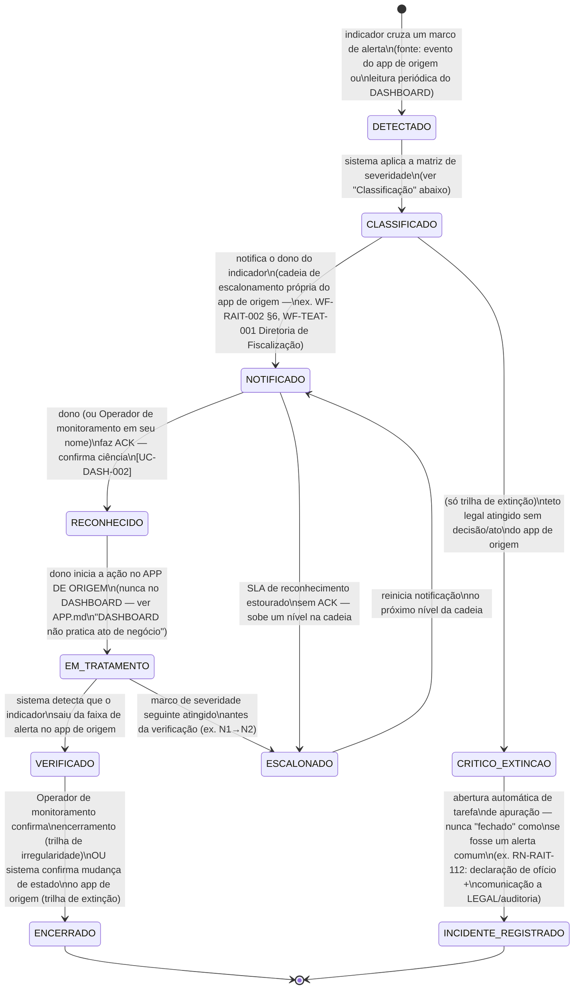

## Por que duas trilhas, não uma

O catálogo de indicadores ([APP-DASHBOARD] §Catálogo) tem quatro tipos, mas para efeito do ciclo
de alerta eles se reduzem a **duas naturezas de consequência**, e a diferença não é de grau — é de
espécie:

- **Trilha de extinção** (indicadores tipo `legal-ceiling`, bloco A do catálogo): o vencimento do
  prazo produz, por si só, um efeito jurídico automático sobre o caso — a punibilidade prescreve
  ([RN-RAIT-112]), o direito de aplicar a penalidade decai ([RN-RAIT-114]), o direito do candidato
  de requerer/recorrer preclui ([RN-PEC-112]), a retenção se converte em remoção ([WF-TEAT-004]).
  Um alerta desta trilha que chega ao teto **não pode simplesmente ser fechado** — o sistema de
  origem já mudou de estado (ou deveria ter mudado), e o que resta ao DASHBOARD é registrar a
  falha de processo, nunca "resolver" o alerta como se nada tivesse ocorrido.
- **Trilha de irregularidade** (indicadores tipo `dever periódico`, `SLA operacional` e `saúde
técnica`, blocos B/C/D): o vencimento do prazo gera exposição, responsabilização administrativa
  ou degradação de indicador — mas **não extingue nada por si só**. O caso pode ser tratado a
  qualquer momento após o vencimento sem perda irreversível de direito (exceto onde a norma prevê
  sanção específica, como IND-DASH-202 — suspensão de autorização — que é ela própria um efeito
  automático, mas administrativo/reversível, não uma extinção de direito de terceiro).

As duas trilhas compartilham a mesma armação de sete passos (detecção → classificação →
notificação → reconhecimento → ação → verificação → encerramento/escalonamento), mas divergem em
**quem pode fechar o alerta** e **o que significa "fechado"**.

## Estados

## Classificação — a matriz de severidade

Cada indicador chega a [WF-DASH-001] já com seu **tipo** (fixo, do catálogo) e seu **nível**
(dinâmico, calculado a partir da distância até o marco/teto). A classificação combina os dois
eixos:

|                                                                      | Nível N1 (≈50% do prazo)      | Nível N2 (≈75%)                       | Nível N3 (≈90%)                                   | CRÍTICO (teto atingido)                                                                                                                           |
| -------------------------------------------------------------------- | ----------------------------- | ------------------------------------- | ------------------------------------------------- | ------------------------------------------------------------------------------------------------------------------------------------------------- |
| **Trilha de extinção** (legal-ceiling)                               | notifica o responsável direto | notifica o coordenador/gestor de área | escalona ao dirigente do órgão julgador/colegiado | `CRITICO_EXTINCAO` — nunca "alerta simples"; abre `INCIDENTE_REGISTRADO`                                                                          |
| **Trilha de irregularidade** (dever periódico / SLA / saúde técnica) | sinaliza no painel do dono    | notifica o dono                       | escalona ao gestor de área                        | alerta máximo da trilha — registra descumprimento, **não** gera efeito automático (exceto onde a norma prevê sanção específica, ex. IND-DASH-202) |

Os marcos percentuais e os destinatários exatos de cada nível **não são inventados pelo
DASHBOARD** — são herdados do workflow de origem quando ele já os calibrou (ex. [WF-RAIT-002] §4
para RAIT, [RN-PEC-112] item 4 para PEC). Onde o app de origem ainda não calibrou uma escada
(ex. IND-DASH-105, prescrição quinquenal — ver [APP-DASHBOARD] §Catálogo, nota do indicador), o
DASHBOARD expõe o indicador sem escada própria até que o app de origem a defina — **não é papel
do DASHBOARD inventar um SLA legal**.

## Transições e gatilhos

| Transição                                 | Gatilho                                                                                                                    | Ator                                                                                                                           | Nota                                                                                                                                                                                                    |
| ----------------------------------------- | -------------------------------------------------------------------------------------------------------------------------- | ------------------------------------------------------------------------------------------------------------------------------ | ------------------------------------------------------------------------------------------------------------------------------------------------------------------------------------------------------- |
| `[*] → DETECTADO`                         | evento do app de origem (preferencial) ou leitura periódica do DASHBOARD (fallback, quando o app ainda não publica evento) | sistema                                                                                                                        | fallback é uma degradação declarada, não silenciosa — ver [WF-DASH-003]                                                                                                                                 |
| `DETECTADO → CLASSIFICADO`                | aplicação da matriz de severidade                                                                                          | sistema                                                                                                                        | determinístico a partir do tipo + nível do indicador                                                                                                                                                    |
| `CLASSIFICADO → NOTIFICADO`               | notificação ao dono conforme a cadeia de escalonamento do app de origem                                                    | sistema                                                                                                                        | a cadeia é **a mesma** já definida em cada workflow de domínio; DASHBOARD não cria uma cadeia paralela                                                                                                  |
| `CLASSIFICADO → CRITICO_EXTINCAO`         | teto legal atingido, indicador tipo `legal-ceiling`, sem decisão/ato do app de origem antes do marco                       | sistema                                                                                                                        | só existe na trilha de extinção                                                                                                                                                                         |
| `NOTIFICADO → RECONHECIDO`                | ACK do dono (ou do Operador de monitoramento, registrando em nome do dono quando o app de origem não expõe ACK próprio)    | dono / Operador de monitoramento                                                                                               | ver [UC-DASH-002]                                                                                                                                                                                       |
| `NOTIFICADO → ESCALONADO`                 | SLA de reconhecimento vencido sem ACK                                                                                      | sistema                                                                                                                        | SLA de ACK é parâmetro do próprio DASHBOARD (proposta de calibração — ver `_intake/bpo-notes.md`), distinto do prazo legal do indicador                                                                 |
| `RECONHECIDO → EM_TRATAMENTO`             | dono confirma início de ação **no app de origem**                                                                          | dono                                                                                                                           | DASHBOARD registra o início, não o executa                                                                                                                                                              |
| `EM_TRATAMENTO → VERIFICADO`              | sistema detecta, por evento ou leitura do app de origem, que o indicador voltou à faixa normal                             | sistema                                                                                                                        | verificação é sempre por evidência do app de origem, nunca por autodeclaração do dono                                                                                                                   |
| `EM_TRATAMENTO → ESCALONADO`              | indicador cruza o próximo marco de severidade antes da verificação                                                         | sistema                                                                                                                        | ex.: alerta em N1 não tratado a tempo vira N2                                                                                                                                                           |
| `VERIFICADO → ENCERRADO`                  | confirmação final                                                                                                          | Operador de monitoramento (trilha de irregularidade) / sistema (trilha de extinção, quando o app de origem já mudou de estado) | fecha o ciclo                                                                                                                                                                                           |
| `CRITICO_EXTINCAO → INCIDENTE_REGISTRADO` | abertura automática de tarefa de apuração                                                                                  | sistema                                                                                                                        | mesmo protocolo já descrito em [WF-RAIT-002] §4.1 (`PRESCRITO_OPERACIONAL`): registro de incidente, apuração de causa, comunicação ao LEGAL/auditoria — **nunca um alerta que simplesmente desaparece** |

## Distinção obrigatória de UI — extinção × irregularidade

A interface do radar de alertas ([UC-DASH-001], [UC-DASH-002]) precisa comunicar, sem
ambiguidade, que um alerta em trilha de extinção que chega a `CRITICO_EXTINCAO` não é "mais um
alerta vermelho" — é a materialização de uma perda de direito que já aconteceu ou está prestes a
acontecer. Recomendações de desenho (propostas de BPO, não normativas):

- cor/ícone distintos para `CRITICO_EXTINCAO`/`INCIDENTE_REGISTRADO`, nunca reaproveitando a
  mesma paleta do CRÍTICO de irregularidade;
- o botão de ação em `CRITICO_EXTINCAO` nunca é "encerrar" — é "ver apuração de incidente";
- todo indicador tipo `legal-ceiling` exibe, mesmo em `SEM_RISCO`, uma citação explícita da norma
  que extingue o direito (ex. "CTB art. 289-A") — nunca aparece como número solto sem base legal
  visível, princípio já adotado em [RN-RAIT-110] §Distinção obrigatória na comunicação.

## Atores por transição

| Ator                                                       | Papel neste workflow                                                                                                     |
| ---------------------------------------------------------- | ------------------------------------------------------------------------------------------------------------------------ |
| Operador de monitoramento                                  | acompanha o radar, garante ACK, confirma encerramento na trilha de irregularidade, mantém a cadeia de escalonamento viva |
| Dono do indicador (Gestor de área / Administração técnica) | reconhece, age no app de origem, é quem efetivamente resolve                                                             |
| Sistema (DASHBOARD)                                        | detecta, classifica, notifica, verifica, escala por SLA vencido                                                          |
| Auditor                                                    | consome o histórico de `INCIDENTE_REGISTRADO` e de ciclos encerrados fora do prazo — [UC-DASH-004]                       |

## Decisões de modelagem pendentes

- SLA de reconhecimento (ACK) por nível de severidade — proposta de calibração do Owner, ver
  `_intake/bpo-notes.md` §Owner decisions.
- Mecanismo de ACK quando o app de origem não expõe endpoint próprio de reconhecimento — hoje
  nenhum dos quatro apps de domínio publica um evento de "ciência registrada"; o Operador de
  monitoramento registraria isso manualmente no DASHBOARD como solução de transição — ver
  `_intake/bpo-notes.md` §Contratos de dado.
- Indicadores sem prazo numérico localizado (IND-DASH-309, IND-DASH-314) não têm marco de
  severidade calculável por percentual — usam **idade absoluta da pendência** como proxy; a
  calibração dos limiares de idade é proposta de BPO pendente de decisão do Owner.
