## Escopo

Este workflow governa os indicadores tipo `dever periódico` do bloco B do catálogo
([APP-DASHBOARD] §Catálogo, IND-DASH-201..209) — obrigações institucionais recorrentes do
DETRAN-AM perante a União ou o cidadão, amarradas a calendário (dia fixo, periodicidade mensal ou
anual). Diferente de [WF-DASH-001] (que trata um alerta pontual sobre um caso ou sistema), este
workflow trata **um ciclo recorrente** — a mesma obrigação se repete a cada período, e cada
repetição é uma instância própria do ciclo abaixo.

## Estados

```mermaid
stateDiagram-v2
    [*] --> JANELA_ABERTA : início do período de apuração\n(ex. 1º dia do mês, para deveres mensais)

    JANELA_ABERTA --> EM_APURACAO : dono do dever inicia coleta\ndos dados exigidos

    EM_APURACAO --> PREPARADO : minuta/relatório/dataset pronto\npara submissão ou publicação

    PREPARADO --> SUBMETIDO_PUBLICADO : envio ao órgão federal\n(ex. FUNSET, RENAEST)\nOU publicação no portal\n(ex. relatório de ouvidoria, dados abertos)

    SUBMETIDO_PUBLICADO --> COMPROVADO : evidência de envio/publicação\narquivada (protocolo, captura de tela,\nhash do arquivo publicado)

    COMPROVADO --> ARQUIVADO : ciclo encerrado; evidência retida\npara auditoria futura

    ARQUIVADO --> [*]

    JANELA_ABERTA --> ATRASADO : data-limite atingida sem\nchegar a PREPARADO
    EM_APURACAO --> ATRASADO : idem
    PREPARADO --> ATRASADO : data-limite atingida sem\nSUBMETIDO_PUBLICADO

    ATRASADO --> SUBMETIDO_PUBLICADO : dever cumprido fora do prazo\n(continua exigível — trilha de\nirregularidade, não de extinção,\nver WF-DASH-001)
    ATRASADO --> NAO_CUMPRIDO : período seguinte se abre sem que\no dever anterior tenha sido cumprido\n— registrado como falha, ciclo não\nse "perde", mas fica marcado

    NAO_CUMPRIDO --> [*]
```

**Nota de leitura.** `ATRASADO` não é um estado de extinção — ao contrário dos indicadores da
trilha de extinção de [WF-DASH-001], um dever periódico cumprido com atraso ainda produz o efeito
que a norma pretendia (o relatório chega, a publicação acontece), só que fora do prazo. A exceção
é IND-DASH-202 (relatório mensal de cartão), cujo atraso gera consequência automática (suspensão
da autorização, [REF-CONTRAN-918] art. 27 §7º) — nesse caso específico, `ATRASADO` dispara também
um alerta na trilha de extinção de [WF-DASH-001], porque o efeito administrativo automático já
ocorreu e não se desfaz com o cumprimento tardio.

## Prazos e timers (base legal por prazo)

| Dever                                               | Timer                             | Janela de apuração | Data-limite                                                                                                 | Base                                                    | Consequência do atraso                                                                                             |
| --------------------------------------------------- | --------------------------------- | ------------------ | ----------------------------------------------------------------------------------------------------------- | ------------------------------------------------------- | ------------------------------------------------------------------------------------------------------------------ |
| IND-DASH-201 Arrecadação/FUNSET                     | mensal                            | mês corrente       | dia 20 do mês subsequente                                                                                   | [REF-CONTRAN-918] art. 26 (excerto pendente em `refs/`) | não localizada expressamente                                                                                       |
| IND-DASH-202 Relatório de cartão (FUNSET)           | mensal                            | mês corrente       | fim do mês (data exata não localizada)                                                                      | [REF-CONTRAN-918] art. 27 §6º                           | **suspensão da autorização de pagamento por cartão** (§7º) — única com sanção expressa em todo o corpus de deveres |
| IND-DASH-204 Repasse estatístico anual              | anual                             | ano corrente       | **sem prazo vigente** — 1º de março (redação de 2018) revogado pela Lei 14.599/2023, sem substituto CONTRAN | CTB art. 326-A §9º / [REF-LEI-13614-2018]               | não localizada; lacuna normativa real, não apenas de pesquisa                                                      |
| IND-DASH-206 Relatório anual de gestão da ouvidoria | anual                             | ano anterior       | não fixada (recomendação: alinhar ao ciclo orçamentário/administrativo do órgão)                            | [REF-LEI-13460] art. 15                                 | não localizada; dever de publicação é auto-executável                                                              |
| IND-DASH-207 Pesquisa de satisfação anual           | mínimo anual                      | ano corrente       | não fixada                                                                                                  | [REF-LEI-13460] art. 23 §§1º-2º                         | não localizada; passível de fiscalização/controle social                                                           |
| IND-DASH-209 Transparência ativa / dados abertos    | contínuo, auditado periodicamente | —                  | —                                                                                                           | [REF-LEI-12527] art. 8º §3º                             | não localizada; risco reputacional/de auditoria TCE-AM                                                             |

Os deveres sem data-limite numérica fixa (IND-DASH-205, IND-DASH-208) seguem o mesmo ciclo de
estados, mas com `JANELA_ABERTA`/`ATRASADO` calculados por periodicidade declarada (proposta
operacional do DASHBOARD) em vez de citação legal direta — marcados como tal na UI.

## Transições e gatilhos

| Transição                          | Gatilho                                                              | Ator                                                                                   |
| ---------------------------------- | -------------------------------------------------------------------- | -------------------------------------------------------------------------------------- |
| `[*] → JANELA_ABERTA`              | virada de período (calendário do DASHBOARD, parametrizado por dever) | sistema                                                                                |
| `JANELA_ABERTA → EM_APURACAO`      | dono inicia coleta de dados                                          | Administração/Financeiro DETRAN-AM, Ouvidor, Coordenador de RENAEST (conforme o dever) |
| `EM_APURACAO → PREPARADO`          | minuta pronta                                                        | idem                                                                                   |
| `PREPARADO → SUBMETIDO_PUBLICADO`  | envio formal ou publicação                                           | idem                                                                                   |
| `SUBMETIDO_PUBLICADO → COMPROVADO` | evidência de envio/publicação arquivada                              | dono do dever / Operador de monitoramento                                              |
| `COMPROVADO → ARQUIVADO`           | fechamento do ciclo                                                  | sistema                                                                                |
| `* → ATRASADO`                     | data-limite (quando existente) atingida sem avanço                   | sistema                                                                                |
| `ATRASADO → SUBMETIDO_PUBLICADO`   | cumprimento tardio                                                   | dono do dever                                                                          |
| `ATRASADO → NAO_CUMPRIDO`          | próximo período se abre sem cumprimento do anterior                  | sistema                                                                                |

## Atores por transição

| Ator                                                                                             | Papel                                                                                                                                                                                     |
| ------------------------------------------------------------------------------------------------ | ----------------------------------------------------------------------------------------------------------------------------------------------------------------------------------------- |
| Dono do dever (Administração/Financeiro, Ouvidor, Coordenador de RENAEST, Administração técnica) | apura, prepara, submete/publica, comprova                                                                                                                                                 |
| Operador de monitoramento                                                                        | acompanha o calendário consolidado, garante que nenhum dever entra em `ATRASADO` sem notificação prévia (ver [WF-DASH-001] para o alerta específico gerado ao se aproximar a data-limite) |
| Auditor                                                                                          | consulta o histórico de `ARQUIVADO`/`NAO_CUMPRIDO` — [UC-DASH-004]                                                                                                                        |

## Relação com [WF-DASH-001]

A aproximação de uma data-limite (marcos 50/75/90% do período restante, mesma disciplina de
[WF-RAIT-002] §4) gera um alerta na trilha de irregularidade de [WF-DASH-001], cujo "dono do
indicador" é o mesmo dono do dever aqui. O ciclo de calendário e o ciclo de alerta são
complementares: este workflow modela **o que precisa acontecer e quando**; [WF-DASH-001] modela
**o que acontece quando isso não acontece a tempo**.

## Decisões de modelagem pendentes

- Data-limite exata de IND-DASH-202 (fim do mês? dia fixo análogo ao dia 20 do art. 26?) — não
  localizada no excerto disponível; item de captura pendente em `refs/contran/REF-CONTRAN-918.md`
  (arts. 26-27 ainda não excertados verbatim, apenas paráfrase em `_intake/research-dossier.md`).
- Data-limite operacional para IND-DASH-206/207 (relatório/pesquisa anuais sem data fixada em
  norma) — proposta de BPO: alinhar ao encerramento do exercício fiscal, mas é decisão do Owner.
- Periodicidade de auditoria do checklist de transparência ativa (IND-DASH-209) — proposta de BPO:
  mensal: decisão do Owner.
- IND-DASH-204 permanece com estado `JANELA_ABERTA`→`ATRASADO`→`NAO_CUMPRIDO` sem nunca alcançar
  `SUBMETIDO_PUBLICADO` enquanto a lacuna normativa não for suprida — a UI deve expor isso como
  "sem prazo definido — lacuna normativa", não como falha operacional do DETRAN-AM (ver handoff UX
  do dossiê de pesquisa).
