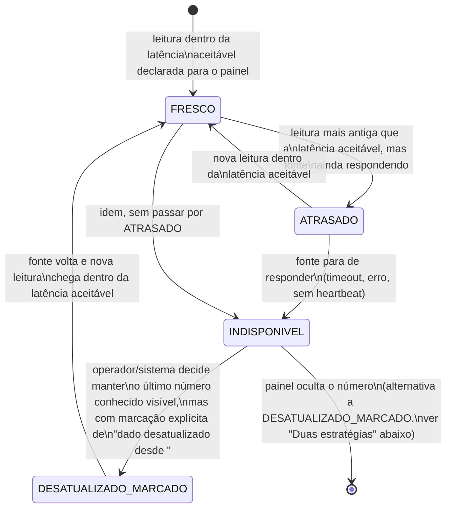

## Regra de honestidade do painel (princípio central)

**Nunca exibir um número velho como se fosse atual.** Todo painel do DASHBOARD é, antes de
qualquer outra coisa, uma leitura de um sistema alheio — RAIT, PEC, BOAT, TEAT ou PORTAL — e essa
leitura pode estar desatualizada por atraso de integração, indisponibilidade momentânea da fonte,
ou lote ainda não processado. Um painel que mostra "12 processos em risco N2" sem indicar que esse
número é de 6 horas atrás **engana por omissão**, mesmo que o número em si tenha sido correto no
momento da leitura. Este workflow é a disciplina que impede isso.

## Estados — o "selo de frescor" de cada painel

## Duas estratégias diante de `INDISPONIVEL` — e quando usar cada uma

Não existe uma resposta única para "o que mostrar quando a fonte cai" — depende do que o número
representa:

| Estratégia                                                   | Quando usar                                                                                                                                                                                                                          | Efeito                                                                                                                        |
| ------------------------------------------------------------ | ------------------------------------------------------------------------------------------------------------------------------------------------------------------------------------------------------------------------------------ | ----------------------------------------------------------------------------------------------------------------------------- |
| **Ocultar** (`INDISPONIVEL → [*]` na UI, painel unavailable) | indicadores tipo `legal-ceiling` (bloco A) — mostrar um número de risco de prescrição desatualizado é mais perigoso do que não mostrar nada, porque o operador pode achar que "está tudo sob controle" quando na verdade não se sabe | painel exibe estado explícito "sem leitura desde <timestamp> — fonte indisponível", nunca o último número como se fosse atual |
| **Marcar** (`DESATUALIZADO_MARCADO`)                         | indicadores tipo `dever periódico`, `SLA operacional`, `saúde técnica` (blocos B/C/D) — o último número conhecido ainda tem valor informativo, desde que rotulado                                                                    | painel exibe o último número com selo visual (ex. opacidade reduzida, ícone de relógio) + timestamp da última leitura válida  |

A escolha por indicador é parametrizável, mas o **default é ocultar para `legal-ceiling`** — a
regra de honestidade pesa mais que a disponibilidade aparente do painel nesse bloco.

## Latência aceitável — declarada por painel, não genérica

Cada painel do DASHBOARD declara, na sua própria definição (não neste workflow, que é o mecanismo
genérico), qual é a latência aceitável da sua fonte. Proposta de faixas por tipo de indicador
(calibração do Owner, ver `_intake/bpo-notes.md`):

| Tipo de indicador           | Proposta de latência aceitável | Justificativa                                                                                               |
| --------------------------- | ------------------------------ | ----------------------------------------------------------------------------------------------------------- |
| `legal-ceiling` (bloco A)   | minutos a poucas horas         | proximidade de um teto que extingue direito exige leitura quase em tempo real                               |
| `dever periódico` (bloco B) | até 1 dia                      | ciclos medidos em dias/meses toleram atraso de leitura menor que a granularidade do próprio ciclo           |
| `SLA operacional` (bloco C) | horas                          | equilíbrio entre custo de integração e utilidade da leitura                                                 |
| `saúde técnica` (bloco D)   | minutos                        | é, ela mesma, o sinal de que outras leituras podem estar comprometidas — precisa ser a mais fresca de todas |

## Transições e gatilhos

| Transição                                 | Gatilho                                                         | Ator                                       |
| ----------------------------------------- | --------------------------------------------------------------- | ------------------------------------------ |
| `[*] → FRESCO`                            | primeira leitura bem-sucedida dentro da latência aceitável      | sistema                                    |
| `FRESCO → ATRASADO`                       | leitura mais antiga que a latência aceitável, fonte ainda ativa | sistema                                    |
| `ATRASADO → FRESCO`                       | nova leitura dentro da latência                                 | sistema                                    |
| `FRESCO/ATRASADO → INDISPONIVEL`          | fonte para de responder                                         | sistema                                    |
| `INDISPONIVEL → DESATUALIZADO_MARCADO`    | decisão de exibir o último número com selo (blocos B/C/D)       | sistema, conforme parametrização do painel |
| `INDISPONIVEL → [oculto]`                 | decisão de ocultar (default para bloco A)                       | sistema                                    |
| `DESATUALIZADO_MARCADO/[oculto] → FRESCO` | fonte volta, nova leitura chega                                 | sistema                                    |

## Efeito sobre [WF-DASH-001] e [WF-DASH-002]

Um indicador em `INDISPONIVEL`/`DESATUALIZADO_MARCADO` **não pode gerar `DETECTADO`** em
[WF-DASH-001] a partir de uma leitura obsoleta — a ausência de dado fresco não é, por si só,
evidência de que o indicador está em risco, mas também não é evidência de que está seguro. A
indisponibilidade da própria fonte por tempo prolongado é, ela mesma, um indicador de saúde
técnica (IND-DASH-408) e deve gerar seu próprio alerta — "esta fonte está cega há N horas" é uma
informação acionável por si só, distinta de "o indicador que essa fonte alimenta está em risco".

## Atores por transição

| Ator                      | Papel                                                                                                                              |
| ------------------------- | ---------------------------------------------------------------------------------------------------------------------------------- |
| Sistema (DASHBOARD)       | calcula o estado de frescor por painel, aplica a estratégia (ocultar/marcar) conforme o tipo                                       |
| Administração técnica     | responde ao alerta de fonte indisponível (IND-DASH-408), restabelece a leitura                                                     |
| Operador de monitoramento | vê o selo de frescor em cada painel que consulta; nunca reporta um número sem checar o selo                                        |
| Auditor                   | pode consultar o histórico de janelas de indisponibilidade de cada fonte, como parte da trilha de confiabilidade do próprio painel |

## Decisões de modelagem pendentes

- Latências aceitáveis exatas por painel (a tabela acima é proposta de faixa, não valor fechado)
  — calibração do Owner, `_intake/bpo-notes.md` §Owner decisions.
- Estratégia padrão (ocultar vs. marcar) para os indicadores dos blocos B/C/D quando a
  indisponibilidade se prolonga além de um limiar (ex. dado marcado desatualizado há mais de X
  dias passa a ser ocultado também) — não definido nesta rodada.
- Mecanismo de heartbeat por fonte (como o DASHBOARD sabe que uma fonte "parou de responder" em
  vez de simplesmente "não ter novidade para publicar") — depende do contrato de dado de cada app,
  ver `_intake/bpo-notes.md` §Contratos de dado.
