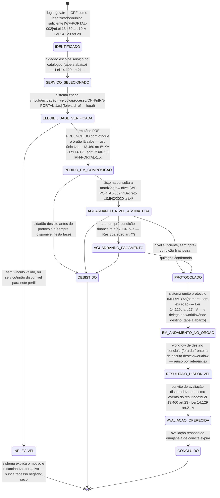

## Escopo e fronteira (leia primeiro)

Este workflow modela o **ciclo genérico de solicitação** que todo serviço do catálogo PORTAL
instancia — a "forma" comum por trás de "consultar multas", "indicar condutor", "pedir junta
médica" ou "abrir manifestação de ouvidoria". O PORTAL **nunca decide, julga ou processa o mérito**
de nenhum pedido — ele identifica, compõe, assina, protocola e acompanha; o mérito é sempre
delegado ao workflow de destino do domínio (RAIT, PEC, BOAT, TEAT, ou um serviço interno de
leitura). Ver `_intake/bpo-notes.md` §"O que o PORTAL não faz" para a lista explícita de fronteira.

O checklist funcional dos arts. 20-22 da Lei 14.129/2021 é a base normativa direta deste desenho:
identificação de serviço e etapas, solicitação digital, agendamento quando cabível, acompanhamento
por etapas, avaliação de satisfação, gestão de perfil, notificação, pagamento digital, nível de
segurança compatível com a criticidade do ato, acesso a informação de tratamento de dados (LGPD),
ouvidoria — nesta ordem, é praticamente o índice das seções abaixo. **Ressalva de aplicabilidade**:
a Lei 14.129/2021 só vincula o DETRAN-AM como dever estatutário direto se o Amazonas aderiu por ato
normativo próprio (art. 2º, III) — não confirmado nesta rodada (ver `research-dossier.md` gap 1).
Tratada aqui como **parâmetro de desenho fortemente recomendável**, não como norma cogente
automática, até validação de LEGAL.

## Estados

`IDENTIFICADO` · `SERVICO_SELECIONADO` · `ELEGIBILIDADE_VERIFICADA` · `INELEGIVEL` ·
`PEDIDO_EM_COMPOSICAO` · `AGUARDANDO_NIVEL_ASSINATURA` (ponte com [WF-PORTAL-002]) ·
`AGUARDANDO_PAGAMENTO` (só serviços com pré-condição financeira) · `PROTOCOLADO` ·
`EM_ANDAMENTO_NO_ORGAO` (delega ao workflow de destino) · `RESULTADO_DISPONIVEL` ·
`AVALIACAO_OFERECIDA` (ponte com [WF-PORTAL-004]) · `CONCLUIDO` · `DESISTIDO`.

## Transições e gatilhos

## Catálogo de serviços (o que este ciclo instancia hoje)

| Serviço                                                      | Domínio                                                | Nível de assinatura mínimo                                                                                      | Workflow de destino                                            | Prazo                                                                                                                 |
| ------------------------------------------------------------ | ------------------------------------------------------ | --------------------------------------------------------------------------------------------------------------- | -------------------------------------------------------------- | --------------------------------------------------------------------------------------------------------------------- |
| Consultar multas, pontuação e situação da CNH                | inf/ch                                                 | Simples (Decreto 10.543/2020 art.4º I, "b")                                                                     | leitura interna (espelho RENAINF/RENACH)                       | imediato                                                                                                              |
| Consultar e baixar CNH-e                                     | ch                                                     | Simples                                                                                                         | leitura interna (espelho RENACH); CTB art.159 III (fé pública) | imediato                                                                                                              |
| Emitir/baixar CRLV-e                                         | inf/est (RENAVAM — fora do escopo de app deste corpus) | Simples para consulta; **emissão condicionada a quitação** (Res. CONTRAN 809/2020 art.4º)                       | módulo de pagamento + leitura RENAVAM                          | imediato após quitação confirmada                                                                                     |
| Aderir ao Sistema de Notificação Eletrônica (SNE)            | inf                                                    | Simples a Avançada (autocadastro — Decreto 10.543/2020 art.4º II, "d")                                          | [WF-PORTAL-003]                                                | imediato — ver [UC-PORTAL-007]                                                                                        |
| Indicar o condutor infrator                                  | inf                                                    | **Avançada** (Decreto 10.543/2020 art.4º II, "f")                                                               | [WF-INF-003] (via RAIT/TEAT)                                   | ≥30 dias da expedição da NA (918 art.4º §2º) — ver [UC-PORTAL-004]                                                    |
| Apresentar defesa prévia                                     | inf                                                    | **Avançada** (Decreto 10.543/2020 art.4º II, "h")                                                               | [WF-RAIT-001]                                                  | ≥30 dias da NA — ver [UC-PORTAL-001]                                                                                  |
| Interpor recurso à JARI                                      | inf                                                    | **Avançada**                                                                                                    | [WF-RAIT-001]                                                  | até o vencimento da NP — ver [UC-PORTAL-002]                                                                          |
| Interpor recurso ao CETRAN                                   | inf                                                    | **Avançada**                                                                                                    | [WF-RAIT-001]                                                  | 30 dias da decisão JARI — ver [UC-PORTAL-003]                                                                         |
| Acessar/solicitar dados do próprio BAT de sinistro           | est                                                    | Simples (dado próprio); dado de saúde de terceiro sujeito a LGPD art.13                                         | [WF-BOAT-001] (leitura)                                        | imediato — ver [UC-PORTAL-013]                                                                                        |
| Consultar resultado de exame de aptidão (médico/psicológico) | ch                                                     | Simples                                                                                                         | [WF-PEC-001] (leitura)                                         | disponibilização em até 2 dias úteis (resultado psicológico — Res. CONTRAN 927/2022 art.9º §3º) — ver [UC-PORTAL-014] |
| Requerer junta médica/psicológica (discordar do resultado)   | ch                                                     | **Avançada**                                                                                                    | [WF-PEC-002]                                                   | 30 dias do conhecimento do resultado (Res. 927/2022 art.12)                                                           |
| Pagar multa (à vista/com desconto/parcelado)                 | inf                                                    | Simples para solicitar a guia; nível da transação em si é do meio de pagamento (SPB/cartão), fora deste Decreto | módulo de pagamento interno                                    | até o vencimento da NP (80% padrão / 60% SNE — 918 arts.20-21) — ver [UC-PORTAL-015]                                  |
| Registrar manifestação na ouvidoria                          | transversal                                            | Simples                                                                                                         | [WF-PORTAL-004]                                                | resposta em 30 dias, prorrogável 1x — Lei 13.460 art.16 — ver [UC-PORTAL-016]                                         |
| Avaliar o serviço recebido                                   | transversal                                            | Simples                                                                                                         | [WF-PORTAL-004]                                                | sem prazo próprio; pesquisa consolidada é anual (Lei 13.460 art.23 §1º) — ver [UC-PORTAL-017]                         |
| Solicitar acesso aos próprios dados (LGPD)                   | transversal                                            | Simples (confirmação/formato simplificado) a Avançada (declaração completa)                                     | interno (DPO) / [WF-PORTAL-004] como canal de entrada          | imediato (simplificado) / até 15 dias (completo) — [REF-LEI-13709-2018] art.19 — ver [UC-PORTAL-018]                  |

Esta tabela é o **artefato vivo** que fecha o gap encontrado em [REF-LEI-13460-2017] art.7º §2º,
IV — a Carta de Serviços do DETRAN-AM hoje não publica prazo máximo por serviço. A coluna "Prazo"
acima é a fonte de dados que o site institucional deveria espelhar (achado de conformidade de baixo
risco/alto impacto — ver `bpo-notes.md`).

## Prazos e timers (base legal por prazo — do próprio ciclo, não dos workflows de destino)

| Timer              | Prazo                                                                                 | Gatilho                                         | Consequência                                                  | Base                                              |
| ------------------ | ------------------------------------------------------------------------------------- | ----------------------------------------------- | ------------------------------------------------------------- | ------------------------------------------------- |
| T-PROTOCOLO        | imediato, sem exceção                                                                 | pedido sai de `AGUARDANDO_*` para `PROTOCOLADO` | direito do usuário a receber protocolo (físico ou digital)    | Lei 14.129/2021 art.27, IV                        |
| T-AVAL-CONVITE     | disparado no mesmo evento do resultado                                                | `RESULTADO_DISPONIVEL`                          | avaliação de satisfação oferecida                             | Lei 14.129/2021 art.21, V; Lei 13.460/2017 art.23 |
| T-PORTAL-ANDAMENTO | integralmente do workflow de destino ([WF-RAIT-001], [WF-PEC-001/002], [WF-BOAT-001]) | —                                               | **não modelado aqui** — reuso por referência, nunca duplicado | ver cada workflow de destino                      |

Nenhum prazo de mérito (julgamento, designação de junta, validação de sinistro) é modelado neste
workflow — cada um vive exclusivamente no workflow de destino, referenciado pela tabela do
catálogo. Duplicar esses prazos aqui criaria duas fontes de verdade divergentes.

## Atores por transição

| Ator                                                   | Transições onde atua                                                                                                                          |
| ------------------------------------------------------ | --------------------------------------------------------------------------------------------------------------------------------------------- |
| Cidadão / Condutor / Proprietário (PF/PJ) / Procurador | `[*]→IDENTIFICADO`, `SERVICO_SELECIONADO`, `PEDIDO_EM_COMPOSICAO`, confirma protocolo, responde avaliação, `*→DESISTIDO`                      |
| Sistema PORTAL (automático)                            | verifica elegibilidade, pré-preenche por uso único, consulta matriz de nível ([WF-PORTAL-002]), emite protocolo, dispara convite de avaliação |
| Workflow de destino (RAIT/PEC/BOAT/TEAT/interno)       | processa `EM_ANDAMENTO_NO_ORGAO` inteiramente — **fora da fronteira de escrita deste workflow**                                               |
| Módulo de pagamento (interno, não modelado aqui)       | confirma quitação em `AGUARDANDO_PAGAMENTO`                                                                                                   |

## Carta de Serviços — o conteúdo mínimo que todo serviço do catálogo carrega

Cada serviço instanciado por este workflow tem de publicar o conteúdo mínimo da **Carta de
Serviços ao Usuário** ([RN-PORTAL-108], Lei 13.460/2017 art. 7º): o que o serviço é, quem pode
solicitá-lo, os documentos exigidos, as etapas, o **prazo de entrega**, a forma de comunicação com
o solicitante e os compromissos de atendimento.

Duas consequências de desenho, que é o que torna isto um item de workflow e não de conteúdo:

1. **É medível item a item.** A Carta não é uma página de texto — cada item é campo do serviço no
   catálogo, e a ausência de qualquer um é uma lacuna detectável, não uma questão de redação. O
   DASHBOARD vigia exatamente isso.
2. **O prazo publicado obriga.** O prazo de entrega declarado na Carta é o mesmo que
   [UC-PORTAL-017] mede como "o prazo prometido foi cumprido?" e que alimenta o indicador público
   — publicar um prazo e medir outro é incoerência visível de fora.

A especificação incorpora a correção autorizada em steering D.28: nenhum serviço pode exigir
endosso cartorial de procuração de outra UF nem pedir ao cidadão o parecer/conclusão da JARI, que
seguem de ofício ([RN-PORTAL-104], [RN-PORTAL-106]). A retirada dessas exigências do CMS
institucional é ação editorial externa ao corpus e deve espelhar esta fonte de verdade.

## Decisões de modelagem pendentes

- **Adesão formal do Amazonas à Lei 14.129/2021** — condiciona se este checklist é obrigação
  estatutária ou apenas boa prática recomendada. Handoff LEGAL já registrado em
  `research-dossier.md`.
- **Matriz "ato → nível de conta gov.br" (bronze/prata/ouro)** — inferência razoável, não
  normativa (ver [WF-PORTAL-002]). A coluna "nível de assinatura" acima é a parte normativa sólida
  (Decreto 10.543/2020 art.4º); a equivalência a bronze/prata/ouro é apoio de UX, não trava de
  processo.
- **CRLV-e e RENAVAM** — o PORTAL consulta/emite, mas o registro autoritativo do veículo é
  sistema nacional (RENAVAM), fora deste corpus. Nenhum estado de propriedade de veículo é
  modelado aqui — apenas o ciclo de solicitação da emissão do documento.
- **Agendamento digital** (Lei 14.129/2021 art.21, III, "quando couber") — nenhum serviço do
  catálogo atual exige agendamento presencial obrigatório; item mantido no checklist para quando
  um serviço greenfield (ex. exame médico/psicológico do PEC) precisar dele — ver [WF-PEC-001].

## Decisões

- **2026-08-24** — BPO, rodada CRAWLER→BPO (`_intake/research-dossier.md`): desenho inicial do
  ciclo comum e do catálogo, a partir do checklist funcional dos arts. 20-22 da Lei 14.129/2021 e
  do mapa de escopo greenfield do dossiê de pesquisa.
