## Escopo e fronteira (leia primeiro)

Dois regimes de notificação coexistem na caixa do cidadão, e este workflow **não os funde** —
misturá-los seria o erro mais caro possível em um sistema onde um deles produz efeito jurídico
automático sobre prazo de decadência/prescrição e o outro não:

1. **Notificação de infração via SNE** (Sistema de Notificação Eletrônica, [REF-CONTRAN-931]) —
   único meio tecnológico hábil para dar ciência de NA/NP/resultado de julgamento quando o cidadão
   aderiu (art.2º § único); produz **ciência ficta em 30 dias** com efeito jurídico direto sobre a
   contagem de prazos do processo ([WF-INF-003], [WF-RAIT-001]).
2. **Notificação de andamento de processo** (RAIT, PEC, BOAT) — comunicação de resultado,
   diligência, pauta de sessão; é dever de comunicação do órgão (ex. 918 art.17), mas **não** tem
   regime de ciência ficta próprio identificado nesta rodada fora do SNE — é UX de acompanhamento,
   não um novo instituto jurídico. Ver "Decisões de modelagem pendentes" para a pergunta em aberto
   sobre se comunicações fora do SNE (ex. push/e-mail simples) têm algum efeito de ciência.

## Estados

`NAO_ADERIDO_SNE` · `ADERIDO_SNE` (macro-estado do vínculo do cidadão com o SNE — ver
[UC-PORTAL-007]) · por notificação individual: `GERADA` · `DISPONIBILIZADA` · `LIDA_EFETIVA` ·
`CIENCIA_FICTA` · `CIENCIA_COMPROVADA` · `PREFERENCIAS_NAO_CONFIGURADAS` ·
`PREFERENCIAS_CONFIGURADAS`.

## Transições e gatilhos

```mermaid
stateDiagram-v2
    [*] --> NAO_ADERIDO_SNE : estado padrão até adesão\n[UC-PORTAL-007]

    NAO_ADERIDO_SNE --> ADERIDO_SNE : adesão confirmada\n[REF-CONTRAN-931] art.4º/7º
    ADERIDO_SNE --> NAO_ADERIDO_SNE : cancelamento — por iniciativa\ndo usuário ou do órgão, justificado\nart.8º I-II

    [*] --> PREFERENCIAS_NAO_CONFIGURADAS
    PREFERENCIAS_NAO_CONFIGURADAS --> PREFERENCIAS_CONFIGURADAS : cidadão define canal\npreferencial (push/e-mail/SNE)\nLei 14.129/2021 art.27 V

    state "Notificação individual" as Notif {
        [*] --> GERADA : evento de origem dispara\n(RAIT/PEC/BOAT/TEAT — reuso por\nreferência, não remodelado aqui)
        GERADA --> DISPONIBILIZADA : publicada na caixa do cidadão;\nse via SNE, este é o marco de\n"expedida" — art.5º
        DISPONIBILIZADA --> LIDA_EFETIVA : cidadão abre antes de 30 dias
        DISPONIBILIZADA --> CIENCIA_FICTA : (SÓ SE via SNE) 30 dias sem\nleitura — art.4º §6º
        LIDA_EFETIVA --> CIENCIA_COMPROVADA
        CIENCIA_FICTA --> CIENCIA_COMPROVADA
        CIENCIA_COMPROVADA --> [*]
    }

    ADERIDO_SNE --> Notif : notificações de infração passam\na trafegar exclusivamente pelo SNE\n— art.4º §8º (substitui qualquer\noutro meio "para todos os efeitos")
```

## Prazos e timers (base legal por prazo)

| Timer                     | Prazo                           | Gatilho                                                  | Consequência                                                                              | Base                         |
| ------------------------- | ------------------------------- | -------------------------------------------------------- | ----------------------------------------------------------------------------------------- | ---------------------------- |
| T-SNE-CIENCIA             | 30 dias                         | disponibilização da notificação no SNE + envio do alerta | ciência ficta — conta como marco de conhecimento para todos os efeitos processuais        | [REF-CONTRAN-931] art.4º §6º |
| T-SNE-RETENCAO            | 5 anos (piso)                   | publicação eletrônica no SNE                             | dado/documento deve permanecer preservado e íntegro                                       | [REF-CONTRAN-931] art.12     |
| T-SNE-VALIDADE-POS-CANCEL | sem prazo — validade permanente | cancelamento da adesão                                   | notificações já disponibilizadas ANTES do cancelamento continuam válidas para comprovação | [REF-CONTRAN-931] art.8º §2º |

**Nuance que a UI nunca pode confundir**: o marco de **expedição** (art.5º — relevante ao prazo do
órgão) e o marco de **ciência ficta em 30 dias** (art.4º §6º — relevante ao prazo do cidadão) são
dois eventos distintos, separados por até 30 dias. A caixa do cidadão sempre mostra a data de
ciência ficta já calculada, nunca "expedida em DD/MM, você tem 30 dias" exigindo que o cidadão some
os dois marcos por conta própria — mesmo princípio de "nunca número cru" já fixado em
`_intake/ux-notes.md` §c.

## Atores por transição

| Ator                                       | Transições onde atua                                                                                                        |
| ------------------------------------------ | --------------------------------------------------------------------------------------------------------------------------- |
| Cidadão / Condutor / Proprietário          | adere/cancela SNE, configura preferências, lê notificação                                                                   |
| Sistema SNE (da União, integração externa) | publica notificação, computa ciência ficta, mantém retenção mínima                                                          |
| Órgão de origem (RAIT/PEC/BOAT/TEAT)       | dispara o evento que gera a notificação — conteúdo e timing são responsabilidade do workflow de origem, não deste           |
| Sistema PORTAL                             | agrega as notificações na caixa única, traduz estado interno em status cidadão (ver `_intake/ux-notes.md` mapa de tradução) |

## Decisões de modelagem pendentes

- **Notificações de processo fora do SNE têm algum regime de ciência ficta próprio, ou são
  puramente informativas?** Nenhuma fonte lida nesta rodada localizou um instituto equivalente para
  push/e-mail simples fora do SNE — leitura provisória: **não têm efeito jurídico próprio**, apenas
  UX de acompanhamento; o único marco com efeito processual é o do SNE. Confirmar com LEGAL antes de
  `approved`.
- **Dependência externa relevante**: o SNE é sistema **da União** — qualquer indisponibilidade ou
  atraso de integração propaga diretamente ao cômputo do prazo do cidadão. O PORTAL precisa de
  trilha de auditoria própria (data de recebimento local do evento) para poder provar a data de
  ciência de forma independente, no caso de contestação de indisponibilidade — mesmo ponto já
  registrado em [REF-CONTRAN-931] "Aplicação aos apps".
- **Notificação ao condutor indicado** ([UC-PORTAL-004]) — segue o mesmo regime SNE se o condutor
  indicado também aderiu; se não aderiu, cai no regime residual do CONTRAN-918 art.14 (postal/edital)
  — fora da fronteira operacional que o PORTAL controla diretamente.

## Decisões

- **2026-08-24** — BPO, rodada CRAWLER→BPO (`_intake/research-dossier.md`): desenho inicial a
  partir de [REF-CONTRAN-931], com separação explícita entre o regime SNE (efeito jurídico) e o
  regime de notificação de processo (UX de acompanhamento), para evitar que uma implementação
  futura funda os dois por engano.
